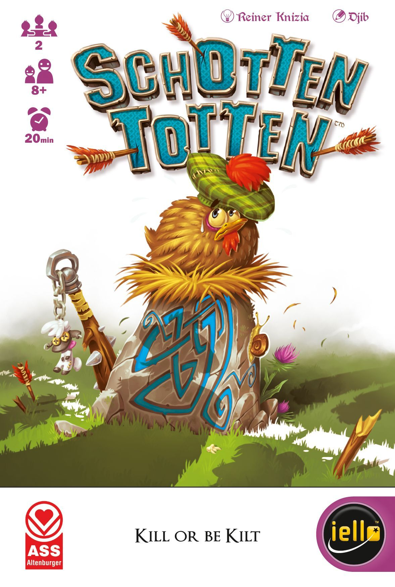
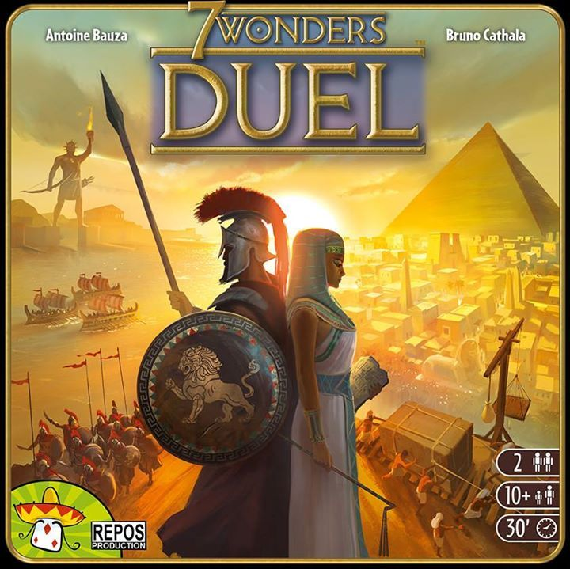
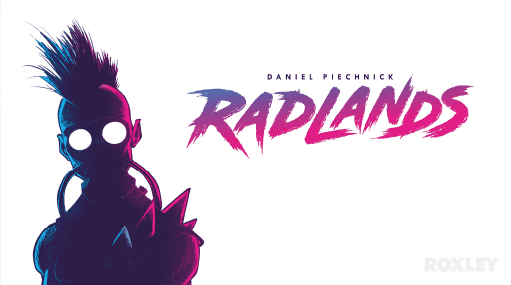
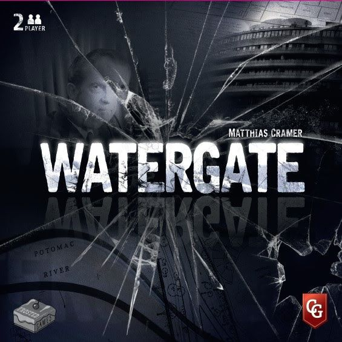
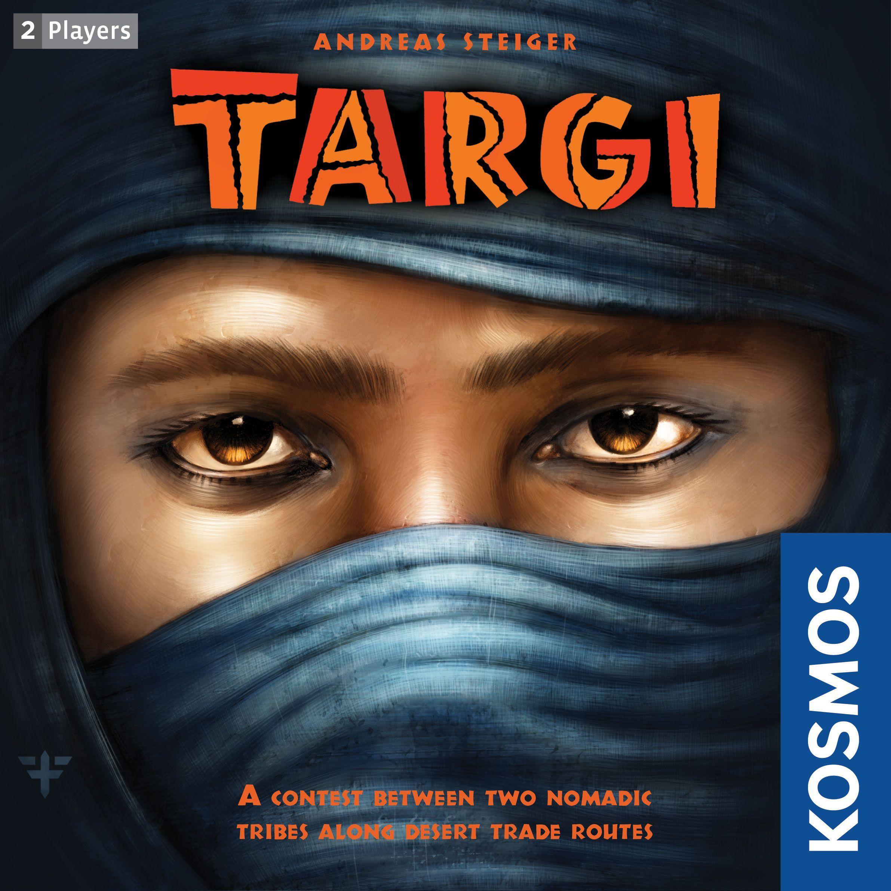

Two players. One table. No negotiation, no kingmaking, no waiting for someone to finish their phone call during a five-player game of Catan. Just you and your opponent, locked in a private war of wits.

The best 2-player board games strip away everything that slows multiplayer gaming down and leave pure, concentrated decision-making. They're the games that turn Tuesday evenings into grudge matches and long-distance relationships into competitive leagues.

Here are seven of the absolute best — ordered roughly from lightest to heaviest, so you can pick your entry point.

---

## 1. Jaipur

**BGG Rating:** 7.48 · **Weight:** 1.46 · **Time:** 30 min · **BGG Rank:** #201

The gateway drug. [Jaipur](https://boardgamegeek.com/boardgame/54043) is a set collection and trading game where two merchants compete to become the Maharaja's personal trader. You're collecting goods — leather, spices, gold, diamonds — and timing your sales for maximum profit.

The genius is in the push-your-luck tension. Sell early and you get bonus tokens for large sets. Wait too long and your opponent snaps up the premium goods first. The camel mechanic adds a lovely wrinkle: camels are worthless to sell but essential for trading, and the player with the most camels at the end gets a bonus.

Games take about 20 minutes, setup is instant, and the whole thing fits in a small box. If you've never played a modern board game with your partner, start here.

**Best for:** Couples, travel, people who think they don't like board games.

---

## 2. Patchwork

**BGG Rating:** 7.58 · **Weight:** 1.60 · **Time:** 15–30 min · **BGG Rank:** #146

Uwe Rosenberg — the man behind Agricola and Caverna — designed a game about quilting. And somehow made it one of the tensest spatial puzzles in the hobby.

In [Patchwork](https://boardgamegeek.com/boardgame/163412), you're buying fabric patches from a shared market and fitting them Tetris-style onto your personal 9×9 board. Each patch costs buttons (the currency) and time (your position on a shared time track). The player further behind on the time track gets to keep taking turns — meaning you can chain multiple small purchases while your opponent watches helplessly.

Empty spaces on your board cost you points at the end. So every gap is a wound, and every perfectly-fitted patch feels like a small miracle. The spatial puzzle scratches an itch that no other game quite reaches.

**Best for:** Puzzle lovers, anyone who enjoys Tetris, quiet competitive evenings.

---

## 3. Schotten Totten

**BGG Rating:** 7.35 · **Weight:** 1.67 · **Time:** 20 min · **BGG Rank:** #429

Also known as Battle Line in its GMT edition, [Schotten Totten](https://boardgamegeek.com/boardgame/372) is Reiner Knizia at his most elegant. Nine boundary stones sit between you and your opponent. On your turn, you play a card to one of those stones. Once both sides have three cards, the strongest poker-style combination claims the stone. Win five stones total or three adjacent, and you win.

That's it. That's the game. And it's magnificent.

The depth comes from reading your opponent's plays, bluffing commitment to one flank while building strength on another, and the agonising moment when you realise you've overcommitted to a stone you can't win. It's the board game equivalent of a fencing match — every move is a feint or a thrust.

**Best for:** Card game fans, people who love poker but want something with more structure, lunch break gaming.

---

## 4. 7 Wonders Duel

**BGG Rating:** 8.08 · **Weight:** 2.23 · **Time:** 30 min · **BGG Rank:** #24

The king of the hill. [7 Wonders Duel](https://boardgamegeek.com/boardgame/173346) adapts the card-drafting brilliance of 7 Wonders into a dedicated 2-player experience — and most people agree it surpasses the original.

Over three ages, you draft cards from a pyramid-like tableau of face-up and face-down cards. Resources fuel buildings. Buildings generate points, military pressure, or scientific progress. Build enough military advantage and you march into your opponent's capital for an instant win. Collect six unique science symbols and you achieve scientific supremacy. Neither of those? Most points wins.

The multiple victory conditions create a constant tension. You're never just optimising your own engine — you're watching your opponent's science collection, tracking the military marker, and sometimes hate-drafting a card purely to prevent their win condition. The Pantheon expansion adds divine intervention. The Agora expansion layers in politics. Both are excellent, but the base game alone is a masterclass.

**Best for:** Anyone. Seriously. This is the desert island 2-player game.

---

## 5. Radlands

**BGG Rating:** 7.74 · **Weight:** 2.26 · **Time:** 20–40 min · **BGG Rank:** #208

[Radlands](https://boardgamegeek.com/boardgame/329082) is a post-apocalyptic duelling card game where you're protecting three camps while trying to destroy your opponent's three. Water is your currency. Every card can be played for its ability or spent as water. Every decision hurts.

The resource system is brutal and elegant. You start with just three water per turn. Playing a powerful card means you can't afford to defend. Defending means you can't attack. The tempo swings are vicious — one well-timed raid can flip an entire game.

Games are fast and lethal. You'll often know you've lost two turns before it actually happens, watching the dominoes fall in slow motion. Then you'll immediately want to run it back. Radlands has the "one more game" energy of the best competitive card games.

**Best for:** Magic: The Gathering fans who want the duelling experience without the deckbuilding cost, aggressive players.

---

## 6. Watergate

**BGG Rating:** 7.72 · **Weight:** 2.29 · **Time:** 30–60 min · **BGG Rank:** #186

An asymmetric tug-of-war set during the most famous political scandal in American history. One player is Nixon, trying to build enough momentum to survive. The other is the Editor of the Washington Post, connecting informants to gather evidence.

[Watergate](https://boardgamegeek.com/boardgame/274364) uses a card-driven system where every card has dual use — play it for its event or for its value on the evidence/momentum tracks. The asymmetry is perfectly balanced: Nixon feels powerful but paranoid, the Editor feels righteous but stretched thin.

The board tells a visual story as evidence tokens connect informants to the central evidence display. When the Editor finally links enough evidence, there's a genuine narrative satisfaction. When Nixon stalls long enough to ride out the storm, there's a delicious sense of political survival.

It also happens to be one of the best-looking games on this list. The graphic design is outstanding.

**Best for:** History buffs, asymmetric game lovers, people who like their games with a story.

---

## 7. Targi

**BGG Rating:** 7.59 · **Weight:** 2.34 · **Time:** 60 min · **BGG Rank:** #173

The heaviest game on this list, and the one most likely to make you stare at the table in silence for an uncomfortable amount of time. [Targi](https://boardgamegeek.com/boardgame/118048) is a worker placement game where you place workers on the outer edge of a 5×5 card grid, and the intersections of your row and column placements determine which inner cards you can access.

It's a system that sounds abstract on paper and becomes knife-edge tense in practice. Your opponent's placements block yours — not just directly, but by shifting which intersections are available. A robber token marches around the perimeter each round, blocking one space for both players.

Underneath the clever placement mechanism is a satisfying engine-building game. You're collecting goods, building tribal cards for points and abilities, and trying to complete sets. But the worker placement puzzle is the star — and it's something you genuinely won't find in any other game.

**Best for:** Euro gamers who want something meatier, fans of tight worker placement, people who don't mind a think.

---

## The Quick Reference

| Game | Weight | Time | Rating | The Pitch |
|------|--------|------|--------|-----------|
| [Jaipur](https://boardgamegeek.com/boardgame/54043) | 1.46 | 30 min | 7.48 | Trading and timing |
| [Patchwork](https://boardgamegeek.com/boardgame/163412) | 1.60 | 15–30 min | 7.58 | Tetris meets quilting |
| [Schotten Totten](https://boardgamegeek.com/boardgame/372) | 1.67 | 20 min | 7.35 | Poker on a battlefield |
| [7 Wonders Duel](https://boardgamegeek.com/boardgame/173346) | 2.23 | 30 min | 8.08 | The GOAT |
| [Radlands](https://boardgamegeek.com/boardgame/329082) | 2.26 | 20–40 min | 7.74 | Post-apocalyptic duelling |
| [Watergate](https://boardgamegeek.com/boardgame/274364) | 2.29 | 30–60 min | 7.72 | Political tug-of-war |
| [Targi](https://boardgamegeek.com/boardgame/118048) | 2.34 | 60 min | 7.59 | Worker placement for two |

All ratings, weights, and ranks from BoardGameGeek as of April 2026.

---

*Looking for more 2-player recommendations? Check out our [games like Spirit Island](../games-like-spirit-island/) for co-op options, or dive into our [solo spotlight on Hadrian's Wall](../solo-spotlight-hadrians-wall/) if you need something for one.*
