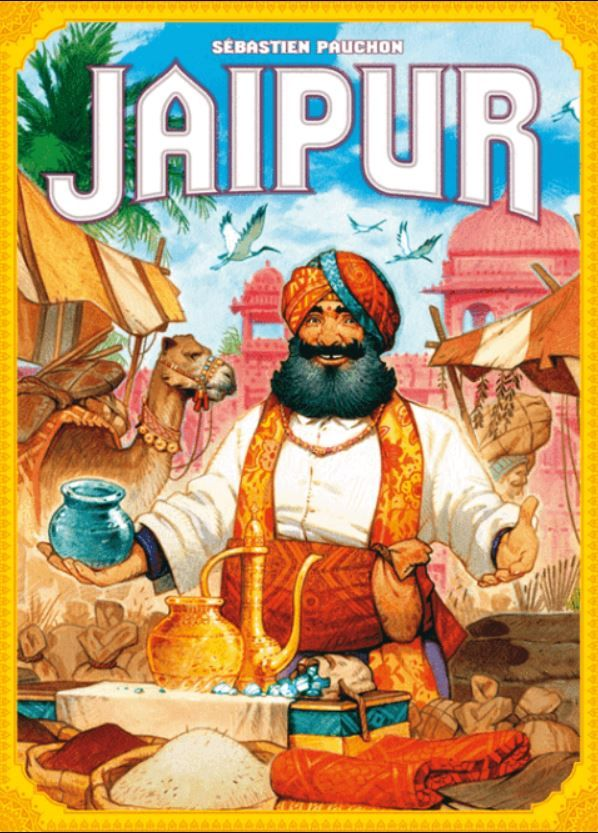
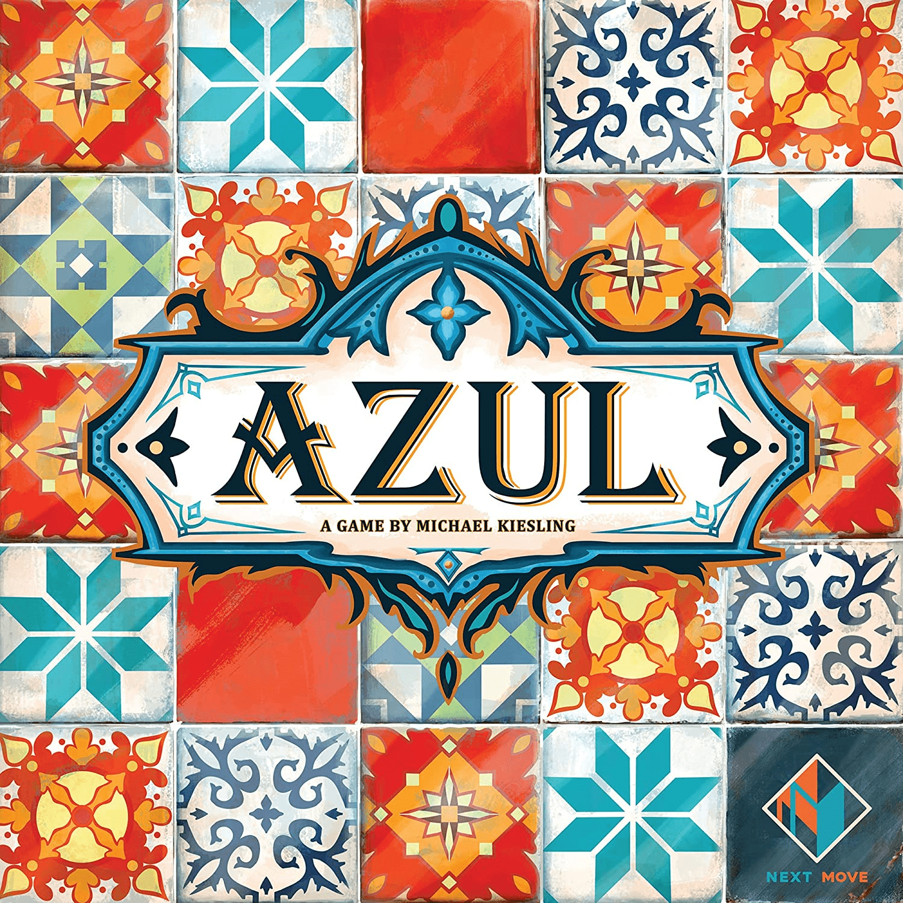
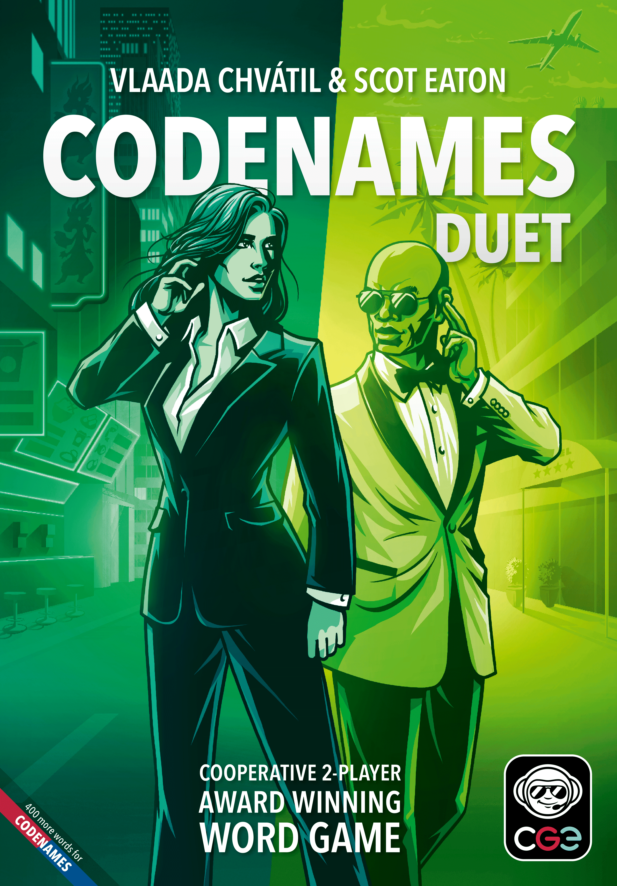
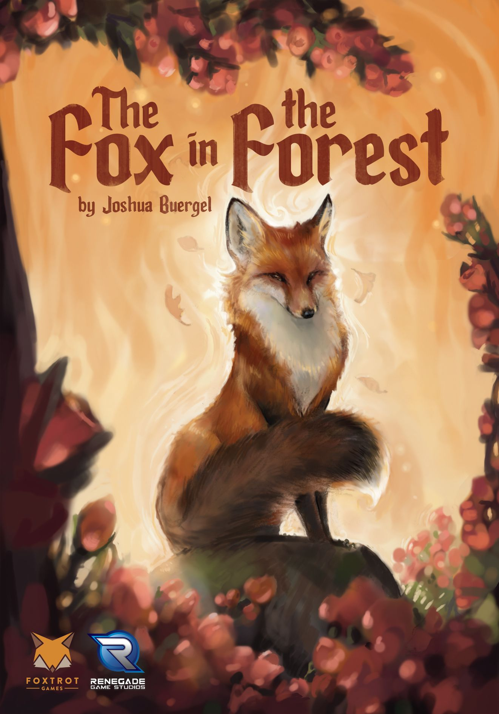

You've done the restaurant thing. You've done the Netflix thing. Now you want something that involves actual eye contact and maybe a little competitive tension. Board games are the answer — but not just any board games. Nobody's idea of a romantic evening involves reading a 40-page rulebook or staring at a spreadsheet in cardboard form.

The perfect date night game needs to be **easy to teach**, **quick to play**, and **engaging enough that neither of you reaches for your phone**. Bonus points if it sparks conversation, creates inside jokes, or ends with someone dramatically flipping the table (in a fun way).

Here are seven games that nail it.

---

## 1. Patchwork

| | |
|---|---|
| **Players** | 2 |
| **Play Time** | 15–30 minutes |
| **Complexity** | 1.60 / 5 |
| **BGG Rating** | 7.58 |
| **BGG Rank** | #146 |

[Patchwork](https://boardgamegeek.com/boardgame/163412/patchwork) is the quilting game that has no business being as good as it is. You and your partner take turns buying fabric patches from a shared market and fitting them onto your personal 9×9 grid, Tetris-style. Every piece costs buttons (the game's currency) and time, and the person further back on the time track gets to keep taking turns.

**Why it's perfect for date night:** It's tactile, satisfying, and gently competitive. You're mostly focused on your own board, which means you can chat while you play. But there's just enough interaction — snatching the patch your partner clearly wanted — to keep things interesting. Games wrap up in 20 minutes, so you'll inevitably say "one more round."

The component quality is lovely, too. There's something weirdly cosy about sitting across from someone and puzzling out a quilt together. Uwe Rosenberg designed this as a break from his heavier farming games, and it shows — it's warm, compact, and endlessly replayable.

---

## 2. 7 Wonders Duel

| | |
|---|---|
| **Players** | 2 |
| **Play Time** | 30 minutes |
| **Complexity** | 2.23 / 5 |
| **BGG Rating** | 8.08 |
| **BGG Rank** | #24 |

[7 Wonders Duel](https://boardgamegeek.com/boardgame/173346/7-wonders-duel) is one of the highest-rated 2-player games ever made, and for good reason. You're building ancient civilisations by drafting cards from a shared pyramid display, collecting resources, constructing wonders, and trying to outpace your opponent in science or military — or just plain victory points.

**Why it's perfect for date night:** Every turn is a meaningful choice, but you can explain the rules in five minutes. The card pyramid creates natural drama — do you take the card you want, or deny your partner one they clearly need? The military and science victory conditions add genuine tension. You might be cruising along and suddenly realise your partner is one symbol away from a science victory while you weren't paying attention.

It's the kind of game that makes you feel clever without requiring a PhD. The "just one more game" factor is enormous — our pick for couples who want something with real strategic depth that still fits in a weeknight.

---

## 3. Jaipur

| | |
|---|---|
| **Players** | 2 |
| **Play Time** | 30 minutes |
| **Complexity** | 1.46 / 5 |
| **BGG Rating** | 7.48 |
| **BGG Rank** | #202 |

[Jaipur](https://boardgamegeek.com/boardgame/54043/jaipur) drops you into an Indian marketplace where you're rival traders competing for the Maharaja's favour. On your turn, you either take goods from the market or sell sets of matching goods for points. Sell early and the tokens are worth more. Wait for bigger sets and you get bonus tiles. The push-your-luck tension is delicious.

**Why it's perfect for date night:** It's fast, portable, and generates an absurd amount of drama for a game with maybe twelve rules. The camel mechanic — camels are essentially wild cards but taking them means letting your partner see what's underneath — creates these brilliant moments of "do I grab the camels and give you the diamonds?" The best-of-three format means every round matters and comebacks are always possible.

At just 30 minutes for a full match, it's the kind of game you throw in a bag when heading to a pub or café. The small box, the gorgeous artwork, the speed — Jaipur is practically designed for two people who want to trash-talk over drinks.

---

## 4. Azul

| | |
|---|---|
| **Players** | 2–4 |
| **Play Time** | 30–45 minutes |
| **Complexity** | 1.77 / 5 |
| **BGG Rating** | 7.72 |
| **BGG Rank** | #96 |

[Azul](https://boardgamegeek.com/boardgame/230802/azul) has you decorating the walls of the Royal Palace of Evora with Portuguese tiles. You draft tiles from shared factory displays and place them on your player board in rows. Complete a row and a tile slides across to your wall, scoring points based on adjacency. Take too many of one colour and the overflow costs you points.

**Why it's perfect for date night:** The tiles are *gorgeous*. Seriously — they're chunky Starburst-coloured resin pieces that feel amazing to handle. Half the appeal of Azul is the pure sensory pleasure of clinking tiles around. The rules take two minutes to teach, but the strategy deepens fast. At two players, it becomes a tense dance of watching what your partner needs and hate-drafting just enough to be annoying.

The beauty of Azul for couples is that it scales perfectly to two. Many "works at 2-4 players" games feel hollow without a full table, but Azul is arguably at its *best* with two — more control, more mind games, more "I know you know I know" moments.

---

## 5. Codenames: Duet

| | |
|---|---|
| **Players** | 2 |
| **Play Time** | 15–30 minutes |
| **Complexity** | 1.36 / 5 |
| **BGG Rating** | 7.41 |
| **BGG Rank** | #274 |

[Codenames: Duet](https://boardgamegeek.com/boardgame/224037/codenames-duet) takes the party game phenomenon and rebuilds it as a cooperative two-player experience. A grid of 25 words sits between you. You each have a key card showing which words are agents (good), bystanders (neutral), and assassins (game over). You take turns giving one-word clues to guide your partner to the right words — but your key cards are different, so a word that's safe for you might be an assassin for them.

**Why it's perfect for date night:** It's the only co-op on this list, and that matters. Sometimes you don't want to compete — you want to team up. Codenames: Duet is a word association game that doubles as a relationship test (in the best way). "What do you *mean* 'ocean' connects to 'bed' and 'wave'? Oh — waterbed. Okay, that's brilliant." Those lightbulb moments when your partner gets your weird clue are genuinely delightful.

It also scales difficulty beautifully. The base game comes with a mission map if you want escalating challenges, but most couples just enjoy the standard mode over and over. Low-stress, high-laughter, and you'll learn things about how your partner's brain works.

---

## 6. The Fox in the Forest

| | |
|---|---|
| **Players** | 2 |
| **Play Time** | 30 minutes |
| **Complexity** | 1.61 / 5 |
| **BGG Rating** | 7.05 |
| **BGG Rank** | #684 |

[The Fox in the Forest](https://boardgamegeek.com/boardgame/221965/the-fox-in-the-forest) is a trick-taking card game for exactly two players, wrapped in fairy-tale artwork. If you've ever played Hearts or Spades, you know the basics — play a card, highest card wins the trick. The twist: special ability cards let you change the trump suit, force your opponent to lead, or peek at the draw pile. And winning *too many* tricks is punished — get greedy and you score nothing.

**Why it's perfect for date night:** Trick-taking games are the comfort food of card games, and Fox in the Forest is the best one for two. The "humble" scoring — where taking 0-3 tricks out of 13 scores you maximum points — is genius. It means you can't just steamroll your partner; you have to read the situation. Are they letting you win on purpose? Should you throw a round? It creates this wonderful cat-and-mouse dynamic.

A game of Fox takes about 15 minutes, so three rounds fills a lovely half-hour. The fairy-tale art is charming without being childish, and the box is small enough for a coat pocket. If either of you grew up playing card games with family, this will feel like home — but better.

---

## 7. Ticket to Ride

| | |
|---|---|
| **Players** | 2–5 |
| **Play Time** | 30–60 minutes |
| **Complexity** | 1.82 / 5 |
| **BGG Rating** | 7.39 |
| **BGG Rank** | #256 |

[Ticket to Ride](https://boardgamegeek.com/boardgame/9209/ticket-to-ride) is the gateway game that's introduced more people to the hobby than probably anything else. Collect coloured train cards, claim routes on a map of the US (or Europe, or dozens of other maps), and complete secret destination tickets for bonus points. Miss a connection and those tickets become penalties.

**Why it's perfect for date night:** It's the board game equivalent of a crowd-pleasing blockbuster — satisfying every single time, even if you've played it a hundred times. At two players, the map opens up and the game becomes a relaxed race rather than a cutthroat route war. You can plan your own network in peace, or you can start blocking key corridors once you figure out where your partner is headed.

Ticket to Ride also has a wonderful rhythm for conversation. Turns are quick (draw cards or claim a route), so there's plenty of space to chat between moves. It's the game we'd recommend to any couple where one person says "I don't really play board games" — this will change their mind.

---

## The Quick Comparison

| Game | Time | Complexity | Best For |
|---|---|---|---|
| **Patchwork** | 15–30 min | 1.60 | Cosy puzzle nights |
| **7 Wonders Duel** | 30 min | 2.23 | Strategic couples |
| **Jaipur** | 30 min | 1.46 | Pub / café gaming |
| **Azul** | 30–45 min | 1.77 | Beautiful component lovers |
| **Codenames: Duet** | 15–30 min | 1.36 | Co-op teams |
| **Fox in the Forest** | 30 min | 1.61 | Card game fans |
| **Ticket to Ride** | 30–60 min | 1.82 | Total newcomers |

---

## Tips for a Great Board Game Date Night

**Start with the easiest game first.** If your partner is new to modern board games, open with Jaipur or Patchwork before graduating to 7 Wonders Duel. First impressions matter.

**Keep snacks one-handed.** Nothing kills the vibe like greasy fingerprints on Portuguese tile pieces. Popcorn good, nachos bad.

**Play best-of-three.** Single games can feel abrupt. The best-of-three format lets the loser of round one come back swinging, and it builds narrative tension across the evening.

**Don't coach too hard.** Offering helpful strategy tips while winning 47-12 is not the romantic move you think it is. Let them discover things. Lose gracefully. Win gracefully. It's a date, not a tournament.

**Rotate.** Even the best game gets stale if it's the *only* game. Build a small collection of 3-4 of these and cycle through them. Variety is the spice of date night.

---

Every game on this list is under £25, teaches in five minutes or less, and plays in under an hour. That's a better value proposition than most restaurants. Grab one, light a candle, pour something nice, and discover that the best entertainment doesn't need a screen or a Wi-Fi connection.

*All game data sourced from [BoardGameGeek](https://boardgamegeek.com). Box art images used with attribution to their respective publishers.*
