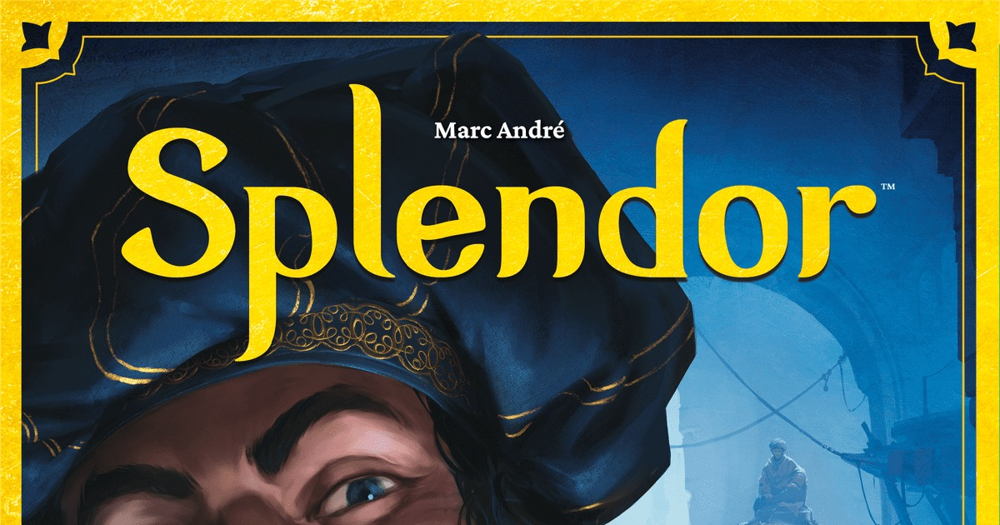
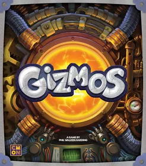
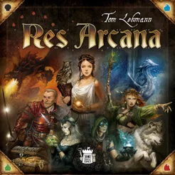

There's something deeply satisfying about watching a machine you built come to life. You start a game with nothing  -  maybe a few coins, a handful of cards  -  and by the end you've assembled an intricate contraption of combos and synergies that practically plays itself. That's engine building: the mechanic where every decision compounds, every piece you add makes your whole system stronger, and your final turns feel like a victory lap.

Engine building is arguably the most beloved mechanic in modern board gaming, and for good reason. It scratches that optimisation itch while rewarding long-term planning. Whether you're collecting gems, terraforming planets, or building a zoo, the core loop is the same: invest now, reap later, and try to build something more efficient than everyone else at the table.

Here are the 10 best engine building board games, ordered from most accessible to most complex.

## 1. Splendor

**BGG Weight:** 1.8 · **Players:** 2-4 · **Play Time:** 30 min · [View on BGG](https://boardgamegeek.com/boardgame/148228)

[Splendor](https://boardgamegeek.com/boardgame/148228) is the gateway drug. You collect gem tokens, buy cards that give you permanent gem discounts, and use those discounts to buy better cards. It's engine building stripped to its purest form  -  no fluff, no bloat, just satisfying escalation.

What makes Splendor special isn't its complexity but its *clarity*. Within two turns, new players understand what they're doing and why. Within five, they're plotting three moves ahead. The poker-chip gems are absurdly tactile, and the whole thing wraps up in 30 minutes. If you've never played an engine builder, start here.

## 2. Century: Spice Road

**BGG Weight:** 1.8 · **Players:** 2-5 · **Play Time:** 30-45 min · [View on BGG](https://boardgamegeek.com/boardgame/209685)

Often compared to Splendor  -  and honestly, slightly better. [Century: Spice Road](https://boardgamegeek.com/boardgame/209685) has you building a hand of merchant cards that convert, upgrade, and generate spice cubes. Your engine is literally the cards in your hand: play them, rest to pick them all back up, repeat.

The genius is in how quickly turns fly. You're making micro-decisions  -  acquire this card, play that conversion  -  that compound into satisfying chains by mid-game. It's the board game equivalent of a well-oiled assembly line, and at five players it still moves at a brisk pace. A phenomenal family-weight engine builder.

## 3. Gizmos

**BGG Weight:** 2.0 · **Players:** 2-4 · **Play Time:** 40-50 min · [View on BGG](https://boardgamegeek.com/boardgame/246192)

If you want to feel like a mad scientist, [Gizmos](https://boardgamegeek.com/boardgame/246192) is your game. You pluck coloured energy marbles from a dispenser (yes, a physical marble dispenser  -  it's glorious) and use them to build gadgets that chain-react off each other.

The engine here is deliciously transparent: every gizmo you build triggers when you perform certain actions, so adding one card can suddenly cause a cascade of free actions. Your early turns are quiet and methodical; your late turns are explosive chain reactions. Gizmos nails the "small engine becomes unstoppable machine" arc better than almost anything at this weight.

## 4. Wingspan

**BGG Weight:** 2.5 · **Players:** 1-5 · **Play Time:** 40-70 min · [View on BGG](https://boardgamegeek.com/boardgame/266192)

[Wingspan](https://boardgamegeek.com/boardgame/266192) proved that engine builders can be beautiful. You're an ornithologist attracting birds to your wildlife preserves, and each bird you play slots into one of three habitats, powering up the action associated with that row.

The more birds in a row, the more powerful that action becomes. It's engine building through tableau construction, with gorgeous art and genuinely interesting bird facts on every card. Wingspan also respects your time  -  it's a medium-weight game that rarely outstays its welcome. The perfect choice for players ready to step beyond gateway games into something with real strategic teeth.

## 5. Res Arcana

**BGG Weight:** 2.7 · **Players:** 2-4 · **Play Time:** 30-60 min · [View on BGG](https://boardgamegeek.com/boardgame/262712)

From the designer of Race for the Galaxy comes this tight, compact engine builder where every mage starts with a personal deck of just eight artifacts. [Res Arcana](https://boardgamegeek.com/boardgame/262712) asks you to squeeze maximum value from minimal resources.

You're generating essences  -  Life, Death, Elan, Calm, and Gold  -  to claim powerful monuments and places of power. Games are short and razor-sharp. There's no deck to dig through, no luck of the draw mid-game  -  just pure engine optimisation with the hand you're dealt. It's lean, mean, and endlessly replayable. A hidden gem for players who want depth without the time commitment.

## 6. Everdell

**BGG Weight:** 2.8 · **Players:** 1-4 · **Play Time:** 40-80 min · [View on BGG](https://boardgamegeek.com/boardgame/199792)

[Everdell](https://boardgamegeek.com/boardgame/199792) wraps its engine building in one of the most charming packages in all of board gaming. You're building a city of woodland critters and constructions, placing workers to gather resources, and playing cards that combo off each other.

What Everdell does brilliantly is the seasonal arc. You start with almost nothing  -  two workers, a handful of cards  -  and by your final season you're drowning in options. That progression from scarcity to abundance *is* the engine, and it feels wonderful every time. The fact that players advance through seasons independently keeps the game flowing and the table engaged. Beautiful, satisfying, and just the right amount of crunchy.

## 7. Race for the Galaxy

**BGG Weight:** 3.0 · **Players:** 2-4 · **Play Time:** 30-60 min · [View on BGG](https://boardgamegeek.com/boardgame/28143)

Inducted into the BGG Hall of Fame in 2025, [Race for the Galaxy](https://boardgamegeek.com/boardgame/28143) is the granddaddy of card-driven engine building. Each round, players simultaneously choose an action phase  -  Explore, Develop, Settle, Consume, or Produce  -  and everyone gets to execute the chosen phases, with bonuses for the chooser.

The iconography is notoriously intimidating at first, but once it clicks, Race becomes one of the fastest and deepest engine builders ever made. Experienced players can rip through a game in 15-20 minutes, each one feeling completely different. You're building a space civilisation from cards that double as currency  -  it's elegant, it's crunchy, and it has a near-infinite skill ceiling. A masterpiece.

## 8. Terraforming Mars

**BGG Weight:** 3.2 · **Players:** 1-5 · **Play Time:** 120 min · [View on BGG](https://boardgamegeek.com/boardgame/167791)

The modern classic. [Terraforming Mars](https://boardgamegeek.com/boardgame/167791) gives you a corporation and over 200 unique project cards, then says "make Mars habitable." Your engine produces six different resources  -  money, steel, titanium, plants, energy, and heat  -  and every card you play adjusts this production in fascinating ways.

The magic is in how the theme and mechanics reinforce each other. Building greenery increases oxygen. Oceans raise temperature. Every action feels *logical*, which makes planning intuitive even in a game with serious weight. Yes, it's long. Yes, the player boards are famously terrible. But when your production engine hits its stride in the late game, pumping out resources and terraforming parameters in cascading combos, there's nothing else quite like it.

## 9. Ark Nova

**BGG Weight:** 3.7 · **Players:** 1-4 · **Play Time:** 90-150 min · [View on BGG](https://boardgamegeek.com/boardgame/342942)

[Ark Nova](https://boardgamegeek.com/boardgame/342942) takes the Terraforming Mars formula and cranks up the complexity. You're building a modern zoo  -  playing animal cards, constructing enclosures, supporting conservation programs  -  while managing a sliding action-strength system that makes every turn a puzzle.

The combos in Ark Nova are extraordinary. A single action can cascade through partner universities, conservation bonuses, and sponsor cards, triggering chain after chain. It's long and it's heavy, but turns are surprisingly quick, and the feeling of watching your zoo come together  -  both mechanically and thematically  -  is immensely rewarding. If you love Terraforming Mars and wish it went deeper, this is your next obsession.

## 10. Brass: Birmingham

**BGG Weight:** 3.9 · **Players:** 2-4 · **Play Time:** 60-120 min · [View on BGG](https://boardgamegeek.com/boardgame/224517)

Sitting at the top of the BGG rankings for good reason, [Brass: Birmingham](https://boardgamegeek.com/boardgame/224517) is engine building at its most interconnected. Set during the Industrial Revolution, you're building industries  -  cotton mills, coal mines, iron works, breweries  -  and connecting them via canals and railways.

Your engine here isn't just your tableau  -  it's the entire shared economy. Coal and iron flow through networks, beer fuels your sales, and the mid-game reset (where all Canal-era buildings are wiped and the Railway era begins) forces you to build twice, adapt constantly, and think several turns ahead. It's brutal, beautiful, and endlessly deep. The production quality is outstanding, and the strategic ceiling is practically unreachable. The crown jewel of engine building.

---

## Honourable Mention: Gaia Project

For those who've conquered everything above, [Gaia Project](https://boardgamegeek.com/boardgame/220308) (BGG Weight: 4.4) takes the beloved Terra Mystica system into space with tech tracks, terraforming, and faction asymmetry that will keep you busy for years. It's not for the faint-hearted, but for heavy-game enthusiasts, it's extraordinary.

---

*What's your favourite engine builder? Did we miss your top pick? Let us know  -  and happy gaming.*
