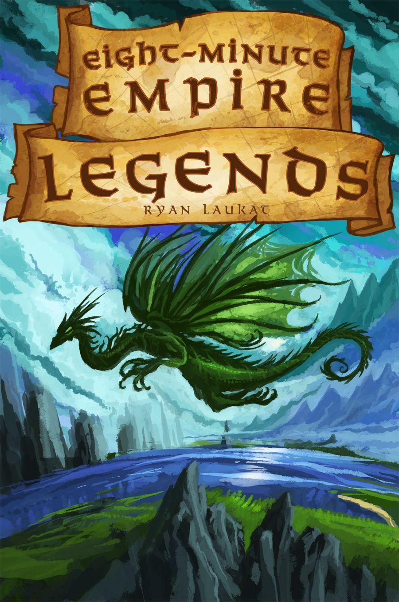
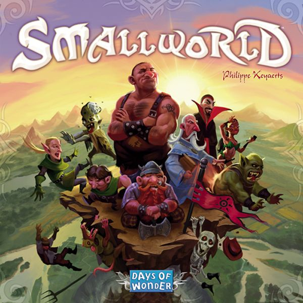
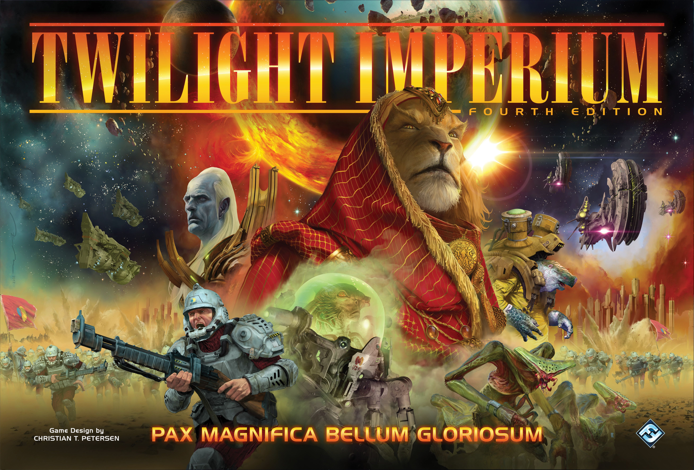

Area control is one of the oldest ideas in board gaming. Put your stuff on the map. Have more stuff than the other person. Win. Except it's never actually that simple, and the genre stretches from cheerful 20-minute filler all the way to diplomatic marathons that destroy friendships over the span of an afternoon.

This ladder takes you from "I've never fought over a map" to "I'm negotiating trade routes while simultaneously backstabbing my ally in the Wormhole Nexus." Each rung teaches a new skill that the next game assumes you already have. Skip a rung if you want, but don't say I didn't warn you.

## 🟢 Rung 1: [Eight-Minute Empire: Legends](https://boardgamegeek.com/boardgame/142326)
**Weight:** 1.96/5
**Players:** 2–4
**Play time:** 8–20 min
**BGG Rating:** 6.91/10, Rank #1,379

*Box art: Red Raven Games*

The perfect first step because it strips area control down to its absolute skeleton. On your turn, you pick a card from a shared row. That card lets you place troops, move troops, or do something else useful. After a fixed number of rounds, whoever controls the most regions and continents wins.

That's it. The entire teach takes two minutes.

What makes it brilliant as a first rung is the **card row economy**. Cards on the left are free; cards further right cost coins. So you're constantly weighing "I need that movement card, but it costs 3 coins and I only have 4 left for the whole game." It's area control with a budget, and that constraint teaches you the most important lesson in the genre: **you can't be everywhere at once**.

**What it teaches you:** Spatial awareness. Opportunity cost. The pain of watching someone take the card you needed.

## 🟡 Rung 2: [Small World](https://boardgamegeek.com/boardgame/40692)
**Weight:** 2.35/5
**Players:** 2–5
**Play time:** 40–80 min
**BGG Rating:** 7.19/10, Rank #404

*Box art: Days of Wonder*

Small World adds the concept that made Risk boring and makes it fun: **decline**. Your race will spread across the map, score points for territories held, and then inevitably overextend. At that point, you put them into decline (flip the tokens over, they become zombified husks) and draft a completely new race-power combo.

This is where area control gets its first real strategic layer. The map is deliberately too small — the name isn't subtle — so conflict is guaranteed from turn one. But the decline mechanic means you're never stuck with a bad position. You're always one turn away from a fresh start with Flying Amazons or Commando Halflings or whatever absurd combination the randomiser has thrown up.

**What it teaches you:** Timing your aggression. When to overextend and when to consolidate. The concept of knowing when to abandon a position rather than defending it.

**The jump from Rung 1:** Eight-Minute Empire gave you spatial thinking. Small World adds **tempo** — the game rewards knowing *when* to act, not just *where*.

## 🟠 Rung 3: [Blood Rage](https://boardgamegeek.com/boardgame/170216)
**Weight:** 2.88/5
**Players:** 2–4
**Play time:** 60–90 min
**BGG Rating:** 7.90/10, Rank #65

*Box art: CMON*

Now we're cooking. Blood Rage wraps area control inside a **card drafting engine** and says "also, dying can be a valid strategy."

Each age begins with a draft: you pick cards that give you combat bonuses, quest objectives, upgrades, and monsters. Then you deploy Vikings to provinces on the map and fight over them. Provinces that get destroyed by Ragnarök score nothing — unless you drafted the cards that reward you for losing battles in doomed provinces. Yes, you can build an entire strategy around glorious defeat.

This is the rung where area control stops being purely about map position and starts being about **reading your opponents' plans through the draft**. If someone is taking every Loki card (the trickster god who rewards losing), you know their Vikings are expendable. If someone's loading up on combat strength, you know where *not* to pick a fight.

**What it teaches you:** Draft reading. Multi-path victory strategies. The idea that map control is a means to an end, not the end itself.

**The jump from Rung 2:** Small World taught you timing. Blood Rage adds **hidden information** — you can't see exactly what your opponents drafted, so you have to read the table.

## 🟠 Rung 4: [El Grande](https://boardgamegeek.com/boardgame/93)
**Weight:** 2.93/5
**Players:** 2–5
**Play time:** 60–120 min
**BGG Rating:** 7.77/10, Rank #100

*Box art: Hans im Glück*

The granddaddy. Published in 1995, El Grande essentially *defined* modern area control. It's been in the BGG Top 100 for over two decades, and it earns that spot every single year.

The core mechanism is fiendishly elegant: each round, you play a power card (numbered 1–13) to determine turn order. Higher card = earlier pick of the action cards. But here's the twist — each action card has a different ability *and* lets you deploy a different number of caballeros to the board. The strongest abilities often come with the fewest deployments. So you're constantly torn between doing something powerful and actually getting troops on the map.

And then there's the Castillo — a cardboard tower where you can secretly place caballeros, and they only get revealed and distributed during scoring rounds. It's the purest form of area control bluffing in any game, ever.

**What it teaches you:** Turn order manipulation. The Castillo teaches **hidden commitment** — putting resources into a secret bet. Scoring round awareness (you can see exactly when the three scoring rounds happen, so everything is about positioning for those moments).

**The jump from Rung 3:** Blood Rage's draft gave you hidden information. El Grande makes the bluffing *spatial* with the Castillo, and adds the critical skill of **playing to the scoring rhythm** rather than fighting constantly.

## 🔴 Rung 5: [Inis](https://boardgamegeek.com/boardgame/155821)
**Weight:** 2.94/5
**Players:** 2–4
**Play time:** 60–90 min
**BGG Rating:** 7.81/10, Rank #124

*Box art: Matagot*

Inis is the game where area control and negotiation become inseparable. On paper, the weight (2.94) is almost identical to El Grande (2.93). In practice, it *feels* heavier because the decisions are so agonising.

Three victory conditions. You can win by being present in six different territories. You can win by being chieftain (majority) in territories containing six or more opponents' clans. You can win by controlling six sanctuaries. And here's the kicker: when someone meets a victory condition, *everyone gets one more turn to either also meet a condition or stop them*. This means the entire game is a tense dance of "I could win, but if I reveal that, they'll dogpile me."

Combat is optional. Clashes happen when two players are in the same territory and one initiates, but you can always negotiate peace. The card draft (similar to Blood Rage, but with a rotating hand of action and advantage cards) means you know roughly what everyone *could* do, but not what they *will* do.

**What it teaches you:** Diplomacy as a core mechanism. Multiple-path victory tracking. The art of disguising your intentions — looking weak when you're strong, looking disinterested when you're one move from winning.

**The jump from Rung 4:** El Grande taught you to play the scoring rhythm. Inis removes fixed scoring rounds entirely and replaces them with a constant, nerve-wracking proximity to victory that makes every single card play political.

## 🔴 Rung 6: [Root](https://boardgamegeek.com/boardgame/237182)
**Weight:** 3.84/5
**Players:** 2–4
**Play time:** 60–90 min
**BGG Rating:** 8.07/10, Rank #34

*Box art: Leder Games*

Root is where area control goes asymmetric, and it's a significant jump. Every faction plays by completely different rules. The Marquise de Cat is an industrialist, building sawmills and workshops across the forest. The Eyrie Dynasty follows a programmed decree that gets more powerful but more fragile each turn. The Woodland Alliance is an insurgency, building sympathy and erupting into revolt. The Vagabond isn't even playing area control — they're playing an RPG inside someone else's wargame.

This means you can't just understand your own faction. You need to understand *everyone's* faction well enough to know when they're becoming dangerous. The Marquise looks dominant early but often stalls. The Eyrie looks shaky but can score enormous bursts if their decree holds. The Alliance looks irrelevant until they suddenly control half the map through revolt.

Root teaches you that area control isn't just about the map — it's about understanding **asymmetric power curves** and knowing when to intervene in someone else's game.

**What it teaches you:** Asymmetric evaluation. Policing the leader. Understanding that "who's winning" is the most important and most difficult question in the game.

**The jump from Rung 5:** Inis gave you diplomacy with symmetric factions. Root makes every faction a different *game*, so the diplomatic calculus becomes "I need to understand four different games simultaneously."

## ⚫ Rung 7: [Twilight Imperium: Fourth Edition](https://boardgamegeek.com/boardgame/233078)
**Weight:** 4.35/5
**Players:** 3–6
**Play time:** 240–480 min
**BGG Rating:** 8.56/10, Rank #7

*Box art: Fantasy Flight Games*

The summit. The Everest. The game that, when someone says "we're playing TI4 on Saturday," you know to cancel your Sunday plans too.

Twilight Imperium is area control at galactic scale, wrapped in negotiation, wrapped in an objective-based victory point race, wrapped in a political system where you're literally voting on laws that change the rules of the game. There are 17 asymmetric factions (with expansions), each with unique technologies, flagships, and abilities. There's a full economy of trade goods. There's a tech tree. There's a political phase where you can vote to make war illegal (temporarily).

But here's the thing people miss about TI4: **it's not actually about combat**. It's about objectives. Each round, new public objectives are revealed, and you score points by meeting them. Sometimes the objective is "spend 10 resources." Sometimes it's "control 4 planets in non-home systems." The map fighting is in service of those objectives, not the other way around. The players who try to play TI4 as a wargame always lose to the players who treat it as a negotiation game with occasional combat.

Everything from the previous six rungs comes together here. Spatial awareness from Eight-Minute Empire. Timing from Small World. Draft reading from Blood Rage. Scoring rhythm from El Grande. Diplomacy from Inis. Asymmetric evaluation from Root. TI4 demands all of it, simultaneously, for four to eight hours.

**What it teaches you:** Everything. Resource management at macro scale. Long-term strategic planning across an entire day. The ability to lose a battle, lose a fleet, lose a home system, and still win the game because you played the objectives.

**The jump from Rung 6:** Root's asymmetry times ten, El Grande's politics turned up to eleven, and a time commitment that turns the whole thing into a genuine social event.

---

## The Full Ladder at a Glance

| Rung | Game | Weight | Key Skill Added |
|------|------|--------|-----------------|
| 🟢 1 | Eight-Minute Empire: Legends | 1.96 | Spatial awareness, opportunity cost |
| 🟡 2 | Small World | 2.35 | Tempo, knowing when to abandon |
| 🟠 3 | Blood Rage | 2.88 | Draft reading, multi-path victory |
| 🟠 4 | El Grande | 2.93 | Turn order, hidden commitment, scoring rhythm |
| 🔴 5 | Inis | 2.94 | Diplomacy, disguising intentions |
| 🔴 6 | Root | 3.84 | Asymmetric evaluation, policing the leader |
| ⚫ 7 | Twilight Imperium 4E | 4.35 | Everything, simultaneously, for 8 hours |

Every game on this ladder is genuinely excellent. You could stop at any rung and have a fantastic area control experience. But if you've climbed to Rung 7 and come back wanting more — well, there's always [War of the Ring](https://boardgamegeek.com/boardgame/115746) waiting for you.

*All stats sourced from [BoardGameGeek](https://boardgamegeek.com). Box art used with attribution to respective publishers.*
