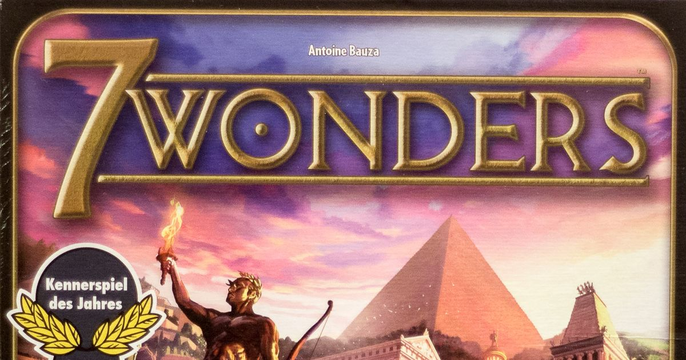
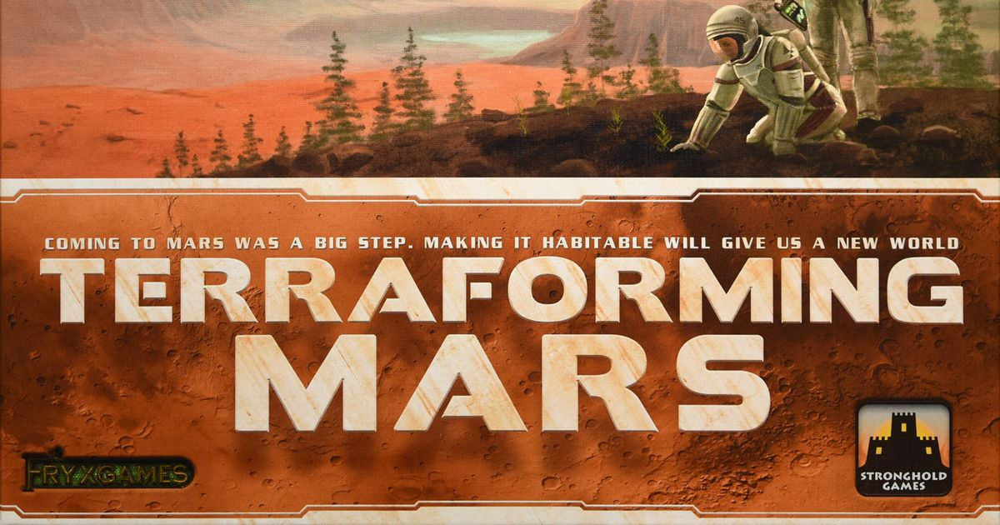
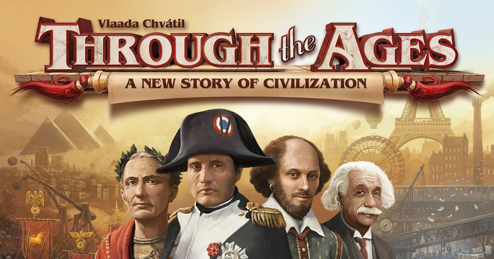

If you want the civilisation game journey without face-planting into a six-hour rules teach, this is the ladder I’d use. Not the “most famous game first” ladder. Not the “buy the biggest box and hope your friends cope” ladder. The actual path from “I quite like board games” to “I’ve spent 45 minutes deciding between Democracy and Monarchy and I regret nothing”.

The goal here is simple: map out a progression through civilisation and civ-adjacent board games where each step teaches one new thing cleanly, then hands you off to the next rung. This isn’t a ranking of the best games in the genre overall. It’s a learning path, from gateway-level systems to full-on strategic overload.

## 🟢 Gateway: [7 Wonders](https://boardgamegeek.com/boardgame/68448)  
**Weight:** 2.31/5  
**Players:** 2-7  
**Play time:** 30 min  
**BGG:** 7.66/10, Rank #115

This is still the best starting point for civilisation games. Full stop.

[7 Wonders](https://boardgamegeek.com/boardgame/68448) gives you the fantasy of building a society without asking anyone to spend their evening buried in edge-case rules. You draft cards across three ages, build up resources, push military, dabble in science, chase commerce, and work on your wonder. It teaches the core civ rhythm brilliantly. Build economy first, convert that into points later, and keep one eye on what your neighbours are doing.

The real magic is that it’s learnable in under 10 minutes and plays in 30. Simultaneous turns do a lot of heavy lifting there. No downtime. No player elimination. Nobody gets knocked out in Age II and then sits there staring at the snack table.

What it introduces:
- Card drafting
- Basic resource management
- Multiple victory paths
- The idea that a civ game is really about long-term planning in stages

What it does better than most gateway civ games is balance breadth and speed. You feel like you’re building something. Not just collecting symbols for the sake of it.

The complaints are familiar if you’ve spent five minutes on BGG. Some players hate the indirect interaction. Some think science can snowball. Fair. But for teaching the shape of the genre, it’s superb.

**Skip to here if...** you mostly play party games, gateways, or family games and want your first “proper” civilisation-style game.

**Trap game to avoid jumping to too early:** [Civilization: A New Dawn](https://boardgamegeek.com/boardgame/233247) sounds tempting because of the name, but it’s a clunkier first date with the genre than [7 Wonders](https://boardgamegeek.com/boardgame/68448).

## 🟢 Gateway+: [Splendor](https://boardgamegeek.com/boardgame/148228)  
**Weight:** 1.78/5  
**Players:** 2-4  
**Play time:** 30 min  
**BGG:** 7.42/10, Rank #243

The next rung looks lighter on paper, but that’s not really the point. Complexity ladders are about what you learn next, not just the raw BGG number.

Yes, the weight is actually lower than [7 Wonders](https://boardgamegeek.com/boardgame/68448). No, I’m not moving it down the ladder.

[Splendor](https://boardgamegeek.com/boardgame/148228) is the perfect second step because it teaches **engine-building** in the cleanest possible way. Take gem tokens. Buy cards. Those cards make future cards cheaper. Tiny decisions start compounding. Suddenly you’re planning three turns ahead.

In [7 Wonders](https://boardgamegeek.com/boardgame/68448), your economy is broad and a bit abstract. In [Splendor](https://boardgamegeek.com/boardgame/148228), the engine is visible. You can feel it clicking into place. It’s one of those games where new players suddenly sit forward halfway through and go, “Oh. Right. I see what I’m doing now.”

It’s also quick, widely available, and dangerously replayable for something this streamlined. The downside is that if you want rich theme or loads of table drama, [Splendor](https://boardgamegeek.com/boardgame/148228) is dry as old toast. The random market can also stall noble races in a way that irritates more competitive players.

Still, as a lesson in economic pacing, it’s excellent.

What it introduces:
- Engine-building
- Efficiency maths
- Open market tension
- Planning around scarcity rather than just drafting what appears

**When you’re ready to level up:** move on when you want your engine to affect a shared world, not just your personal tableau.

**Skip to here if...** you’ve already played gateway games for years and want the cleanest route into economic strategy.

## 🟡 Medium: [Terraforming Mars](https://boardgamegeek.com/boardgame/167791)  
**Weight:** 3.27/5  
**Players:** 1-5  
**Play time:** 120 min  
**BGG:** 8.34/10, Rank #9

Once you understand how a personal engine works, the next lesson is what happens when that engine starts pushing against a shared board.

This is where the hobby proper starts. You know it. I know it. Half of Reddit owns a copy with at least one insert.

[Terraforming Mars](https://boardgamegeek.com/boardgame/167791) takes the engine-building logic from [Splendor](https://boardgamegeek.com/boardgame/148228) and blows it up into a full-fat strategy game. Now your cards are weird, specific, and often gloriously combo-driven. You’re not just buying discounts. You’re building a corporation with a personality, shaping a shared board, competing for milestones and awards, and deciding how much you care about the actual terraforming versus your own point engine.

That shared board is the key lesson here. Oceans, cities, greeneries, map position. Suddenly your civ game has public stakes.

What it introduces:
- Action selection in a richer game state
- Shared incentives on a communal board
- Card combo evaluation
- Tactical pivots inside a long-term engine

I love this rung because it feels huge without being impossible. It gives you epic scope. It also gives you epic card flood, occasional analysis paralysis, and the kind of first play where someone spends ten minutes reading every card in hand while the table quietly ages.

That’s the tax.

But if [7 Wonders](https://boardgamegeek.com/boardgame/68448) showed you the shape of civilisation gaming, [Terraforming Mars](https://boardgamegeek.com/boardgame/167791) shows you the obsession. This is where people stop dabbling and start having opinions about tags.

**Skip to here if...** you already know drafting, tableau building, and basic resource conversion, and you’re ready for a two-hour game with real strategic heft.

**Trap game to avoid jumping to too early:** [Through the Ages: A New Story of Civilization](https://boardgamegeek.com/boardgame/182028). Brilliant game. Terrible idea if [Terraforming Mars](https://boardgamegeek.com/boardgame/167791) already sounds exhausting.

## 🟡 Medium+: [Scythe](https://boardgamegeek.com/boardgame/169786)  
**Weight:** 3.45/5  
**Players:** 1-5  
**Play time:** 115 min  
**BGG:** 8.10/10, Rank #26

After a game about shared incentives, the natural next lesson is space. Actual map space. Territory. Presence. Pressure.

[Scythe](https://boardgamegeek.com/boardgame/169786) is the medium-weight civ-adjacent game I’d put in front of someone who wants conflict on the board without diving straight into a lifestyle game. It blends engine building, area control, worker placement, and combat in a way that looks far meaner than it often is. The giant mechs do a lot of marketing.

Underneath that gorgeous art and those hulking m[inis](/posts/games-like-inis/) is a game about tempo. Produce, move, upgrade, deploy, enlist. Push your faction board and player mat into a slick personal engine, then use position on the map to convert that efficiency into stars and points.

What it introduces:
- Area control
- Spatial efficiency
- Combat as threat, not constant bloodbath
- The idea that your economy can be attacked, blocked, or pressured

This is also where players discover whether they actually like confrontation or just like the idea of it. A lot of [Terraforming Mars](https://boardgamegeek.com/boardgame/167791) fans bounce off [Scythe](https://boardgamegeek.com/boardgame/169786) because the board state matters in a more immediate way. You can’t just turtle in your corner and admire your engine.

The criticism is fair, though. Some encounter draws can feel swingy. Some groups make it too passive. Some players expect mech warfare and get a chilly Euro with occasional slaps. The BGG arguments on this one never really stop.

**When you’re ready to level up:** move on when you want your civ game to include diplomacy, table talk, and the possibility that another human being will ruin your plans on purpose.

## 🔴 Heavy: [Twilight Imperium: Fourth Edition](https://boardgamegeek.com/boardgame/233078)  
**Weight:** 4.35/5  
**Players:** 3-6  
**Play time:** 240-480 min  
**BGG:** 8.57/10, Rank #7

If [Scythe](https://boardgamegeek.com/boardgame/169786) teaches pressure on the map, the next rung is what happens when that pressure becomes fully social.

This is the big event game. The one people schedule three weeks in advance and then cancel because somebody’s child has a temperature.

[Twilight Imperium: Fourth Edition](https://boardgamegeek.com/boardgame/233078) is where civilisation gaming stops being just systems mastery and becomes social theatre. You’re still building your economy, researching technology, expanding fleets, and chasing objectives. But now politics matters. Negotiation matters. Threat assessment matters. Promises matter, right up until they don’t.

That’s the new lesson. Not complexity for its own sake. Human complexity.

You can be doing perfectly sensible strategic things and still lose because you misread the table, backed the wrong alliance, or forgot that the quiet player in the corner was one turn away from nicking the win. That’s glorious. Also infuriating.

This is one of my all-time favourites for a reason. Few games create stories like this. Few games also demand this much time, patience, and the right group. Uneven experience levels can wreck it. A bad teach can wreck it. One grumpy player can turn the whole galactic senate into a hostage situation.

So no, this is not the next step for everyone.

**Skip to here if...** your group already loves long games, negotiation, and big-table drama, and “240-480 min” sounds exciting rather than medically concerning.

## ⚫ Expert: [Through the Ages: A New Story of Civilization](https://boardgamegeek.com/boardgame/182028)  
**Weight:** 4.44/5  
**Players:** 2-4  
**Play time:** 120 min  
**BGG:** 8.25/10, Rank #18

If [Twilight Imperium: Fourth Edition](https://boardgamegeek.com/boardgame/233078) is the grand opera version of civilisation gaming, [Through the Ages: A New Story of Civilization](https://boardgamegeek.com/boardgame/182028) is the spreadsheet that became sentient.

I mean that with affection.

This is the expert rung because it asks for relentless long-term planning. Every decision echoes. Your population, food, resources, science, military strength, government, leaders, wonders, and civil actions all interlock. There’s very little fluff here. Very little forgiveness either. If you drift into a weak production base or neglect military, the game will punish you with the cold efficiency of a tax office.

What it introduces:
- Full-spectrum civilisation planning
- Tight action economy
- Event deck timing
- Multi-era optimisation where every inefficiency hurts

This is the civ game for players who want the whole arc of history as a strategic puzzle. No map marching. No charming minis. Just brutal, beautiful decision density.

It’s also fiddly in physical form, mentally exhausting, and absolutely not a casual recommendation. But as the top rung of the ladder, it’s perfect. You’ve learned drafting. Engines. Shared incentives. Map pressure. Diplomacy. Now comes pure systems mastery.

## So where should you start?

That depends on which lesson you want first, because this ladder has really been about learning how civilisation games expand: from drafting, to engines, to shared incentives, to map pressure, to diplomacy, and finally to pure systems mastery.

- Start with **[7 Wonders](https://boardgamegeek.com/boardgame/68448)** if you want the best first civ game.
- Jump to **[Splendor](https://boardgamegeek.com/boardgame/148228)** if you want cleaner economic training.
- Land on **[Terraforming Mars](https://boardgamegeek.com/boardgame/167791)** if you’re ready for your first proper hobby heavyweight.
- Choose **[Scythe](https://boardgamegeek.com/boardgame/169786)** if board presence and threat matter to you.
- Commit to **[Twilight Imperium: Fourth Edition](https://boardgamegeek.com/boardgame/233078)** if your group wants an event.
- Climb to **[Through the Ages: A New Story of Civilization](https://boardgamegeek.com/boardgame/182028)** if you want the most demanding pure civ puzzle on this list.

If I had to pick the single best game at each level, this exact ladder is it.

Where are you on the ladder?