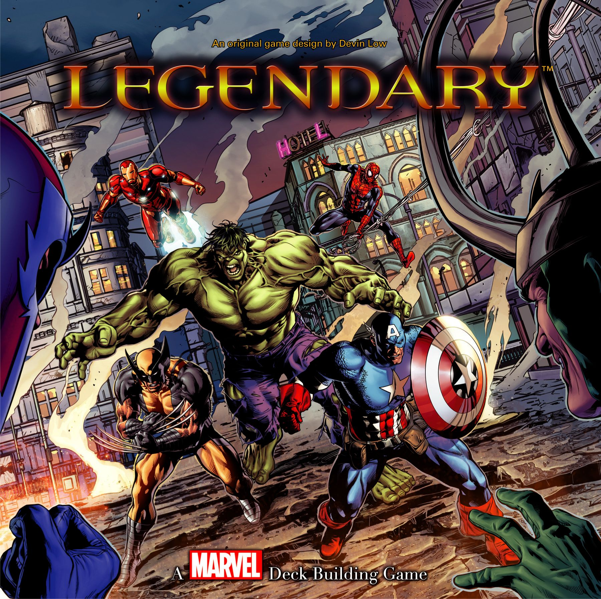

If you want to get into deck-building properly, not just dabble for a night and move on, this is the ladder I'd use. A real progression. Each step teaches a different part of the genre: first the basic loop, then engine-building, then boards and movement, then co-op pressure, then a different way of thinking about cards entirely, and finally the sprawling brain-burner people recommend a bit too casually online.

That escalates quickly. In a good way.

I'm starting with the cleanest on-ramp and ending with the game that can leave you staring at a hand of cards for ten minutes trying to turn one crystal and a sideways unit into an entire military campaign.

## 🟢 Gateway: [Star Realms](https://boardgamegeek.com/boardgame/147020)
**Weight:** 1.92/5
**Players:** 2
**Play time:** 20 min
**BGG:** 7.55/10, rank #174

This is the best first deck-builder. Full stop.

[Star Realms](https://boardgamegeek.com/boardgame/147020) teaches the core loop in under 10 minutes. You start with a rubbish little deck. You buy better cards from a shared market. You draw, play, attack, heal, and slowly turn your pile of sad starter cards into a machine that spits out damage. That's the genre. No extra fluff needed.

What it introduces:
- Buy, draw, play cycles
- Deck thinning through trashing weak cards
- Faction synergies and combo chaining
- Tempo swings from market timing and hand draws

Why it works so well is that everything matters immediately. Buy a ship. Play a ship. Punch your opponent in the face. There's no victory point conversion puzzle, no board to interpret, no "actually this symbol means reserve influence unless it's Tuesday" nonsense. You feel the deck-building doing something right away.

And yes, there's luck. Sometimes your perfect blob combo sits in the wrong half of the deck and you mutter darkly at the table. That's part of the package. The games are 20 minutes. Shuffle up and go again.

**Skip to here if...** you mostly play card games, duellers, or want something cheap and sharp that actually gets played on weeknights.

**Common trap to avoid:** jumping straight from this to some giant box because you think "I get deck-building now". You get the verbs. You do not yet get the grammar.

## When you're ready to level up

Once the basic loop makes sense, the next step should teach engine-building without burying you in theme chrome. That means the genre classic.

## 🟢 Gateway+: [Dominion](https://boardgamegeek.com/boardgame/36218)
**Weight:** 2.34/5
**Players:** 2-4
**Play time:** 30 min
**BGG:** 7.60/10, rank #145

[Dominion](https://boardgamegeek.com/boardgame/36218) is still one of the smartest designs in the hobby. People joke that it's dry. It is dry. It's also brilliant.

Where [Star Realms](https://boardgamegeek.com/boardgame/147020) teaches deck-building as a duel, [Dominion](https://boardgamegeek.com/boardgame/36218) teaches it as an engine puzzle. Now you're not just buying better cards. You're building a deck that produces extra actions, extra buys, extra money, and eventually victory points without collapsing into sludge.

That's the new lesson here:
- Variable market setup
- Action economy
- Deck efficiency versus bloat
- Winning through points, not direct damage

This is where players learn that "more cards" is not automatically "better deck". Every [Dominion](https://boardgamegeek.com/boardgame/36218) player has had the same painful revelation. You buy all the cool stuff, draw a hand of nonsense, and lose to someone who bought a lean little village-smithy-money engine and started greening earlier than you.

Beautiful. Cruel. Educational.

The replayability is absurd because the kingdom card mix changes everything, and the expansion rabbit hole is legendary for a reason. BGG has spent years arguing over best sets, weakest cards, and whether attack cards are healthy design or a personal insult. That's how you know the game has legs.

**Skip to here if...** you've played a few hobby games already and don't need the hand-holding of a pure intro dueller.

**Common trap to avoid:** assuming [Dominion](https://boardgamegeek.com/boardgame/36218) is "too old" to matter. Nonsense. Plenty of newer deck-builders are still borrowing its homework.

## When you're ready to level up

Once you understand engine-building in a mostly pure form, it helps to see what happens when that card play starts interacting with a board. Not a giant one. Just enough to make your deck care about position, timing, and whether greed is about to get you roasted by a dragon.

## 🟡 Medium: [Clank! A Deck-Building Adventure](https://boardgamegeek.com/boardgame/201808)
**Weight:** 2.23/5
**Players:** 2-4
**Play time:** 30-60 min
**BGG:** 7.76/10, rank #98

I love what [Clank! A Deck-Building Adventure](https://boardgamegeek.com/boardgame/201808) does for people who think deck-builders are just spreadsheet card games. Suddenly, your cards move you through a dungeon. They make noise. They tempt you deeper. They threaten to get you killed.

That's the leap:
- Spatial decisions on a board
- Push-your-luck tension
- A race structure
- Semi-co-operative table drama, because everyone is kind of in it together until they absolutely are not

This is the point on the ladder where deck-building starts feeling like an adventure rather than a card mechanism. You're not just tuning an engine. You're deciding whether to grab a safer artifact and leave, or push one room deeper because maybe, just maybe, you can snag something glorious and still escape before the dragon turns your plan into ash.

Of course, dragon draws can be swingy. Sometimes the bag hates you. Sometimes the player who made every bad decision survives while you, a responsible adult, get clipped by chaos. That's [Clank! A Deck-Building Adventure](https://boardgamegeek.com/boardgame/201808). It's messy in a very human way.

**Skip to here if...** your group likes theme, table talk, and games that create stories instead of just efficient card lines.

**Common trap to avoid:** treating this like a pure optimisation exercise. The whole point is that greed has teeth.

## When you're ready to level up

After that, the next rung asks for more commitment: more setup, more card text, and more pressure from the game state itself. It also shifts the focus from racing each other to dealing with a shared problem, even if the table politics stay a bit strange.

## 🟡 Medium+: [Legendary: A Marvel Deck Building Game](https://boardgamegeek.com/boardgame/129437)
**Weight:** 2.44/5
**Players:** 1-5
**Play time:** 30-60 min
**BGG:** 7.52/10, rank #280

[Legendary: A Marvel Deck Building Game](https://boardgamegeek.com/boardgame/129437) is where deck-building gets properly modular and co-operative, sort of. You're working together to stop a mastermind and their scheme, but there are still personal scores involved, so the table dynamic gets deliciously weird.

What it adds over [Clank! A Deck-Building Adventure](https://boardgamegeek.com/boardgame/201808):
- Full co-op pressure with shared loss conditions
- Scenario modularity through masterminds, schemes, villains, and hero mixes
- Team synergy and tactical coordination
- More complex market and board-state reading

The appeal is obvious. You draft Spider-Man, Wolverine, Storm, and whoever else your inner twelve-year-old wants, then try to build ridiculous combo turns while the villain deck steadily makes life worse. When it sings, it really sings.

It can also be lopsided. Some setups are smoother than others. Some schemes feel rude. The BGG and Reddit crowd have been debating "best randomiser method" for years because players love the variety but do not love accidentally creating a scenario that feels like a bin fire.

Still, this is a great next step if you want your deck-builder to have more event texture and more table conversation.

## When you're ready to level up

At this point, most people jump to something too big, too soon. My pick is different. Not because it's easier, but because it teaches a genuinely new idea before the final leap.

## 🔴 Heavy: [Dune: Imperium](https://boardgamegeek.com/boardgame/316554)
**Weight:** 3.01/5  
**Players:** 1-4  
**Play time:** 60-120 min  
**BGG:** 8.4/10, rank #6

[Dune: Imperium](https://boardgamegeek.com/boardgame/316554) is what happens when someone decides deck-building should share a table with worker placement and then dares you to manage both at once. You draft cards that determine where your agents can go, place workers on Arrakis to gain resources and political influence, and then fight over control of contested spaces. The deck doesn't just fuel an engine. It dictates your strategy turn by turn.

That's a genuine weight jump from everything below:
- Worker placement integrated with card play
- Multi-system resource management (spice, solari, water, influence)
- Conflict resolution through committed troops
- Long-term faction alignment and intrigue card timing
- Variable player powers through leader abilities

This is the rung where deck-building stops being the whole game and becomes one system inside a larger strategic puzzle. Your deck controls your options, but the board state, the conflict track, and the other players' positioning all matter just as much. Buying the perfect card means nothing if you can't get your agents to the right spaces at the right time.

The Dune theme isn't just wallpaper, either. The faction tracks, the spice economy, the intrigue — it all maps onto the source material in a way that makes thematic sense without being slavish about it. Paul Dennen's design earned its place in the BGG top 10 for a reason.

**Skip to here if...** you want your deck-builder to feel like a proper strategy game, not just a card optimisation puzzle.

**Common trap to avoid:** ignoring the conflict. New players often focus on engine-building and skip fights. In [Dune: Imperium](https://boardgamegeek.com/boardgame/316554), the battles are where the victory points live. You have to get your hands dirty.

## When you're ready to level up

This is the final rung: the mountain. The one people recommend with a glint in their eye, as if teaching it is a public service. It is not. It is an event.

## ⚫ Expert: Mage Knight Ultimate Edition
**Weight:** not listed here for Ultimate Edition
**Play time:** epic, plan your evening
**Price:** roughly $100-130

[Mage Knight](https://boardgamegeek.com/boardgame/96848) is where deck-building stops being the main dish and becomes one part of a giant fantasy efficiency puzzle. Slow-motion deck-building. Exploration. Combat maths. Unit recruitment. Mana dice. Scenario goals. Multiple solutions to the same problem. It's magnificent.

And exhausting.

What it adds over [Dune: Imperium](https://boardgamegeek.com/boardgame/316554):
- Limited deck cycles, so every card use matters more
- Multi-use cards and intricate hand management
- Exploration on map tiles
- Combat and diplomacy paths
- Dense turn puzzles with long-range planning

This is not a natural next purchase for everyone who likes [Star Realms](https://boardgamegeek.com/boardgame/147020). That would be absurd. This is for the player who actively wants a game where their first turn can take 20 minutes and still feel worthwhile. The reward is immense. Character growth feels earned. Every conquered site feels like you solved something, not just defeated it.

But the warnings are real. Analysis paralysis is brutal. The rules load is heavy. Every "it's not that bad once you know it" comment online is technically true and deeply unhelpful.

**Common trap to avoid:** buying this as your second or third deck-builder because the internet told you it's a masterpiece. It is a masterpiece. That doesn't mean it's your next game.

## The ladder at a glance

- **Start here:** [Star Realms](https://boardgamegeek.com/boardgame/147020)
- **Want the genre foundation:** [Dominion](https://boardgamegeek.com/boardgame/36218)
- **Want theme and movement:** [Clank! A Deck-Building Adventure](https://boardgamegeek.com/boardgame/201808)
- **Want co-op modular chaos:** [Legendary: A Marvel Deck Building Game](https://boardgamegeek.com/boardgame/129437)
- **Want the strategy leap:** [Dune: Imperium](https://boardgamegeek.com/boardgame/316554)
- **Want the deep end:** [Mage Knight](https://boardgamegeek.com/boardgame/96848)

If you forced me to name the **best** game at each level, I'd go:
- **Gateway:** [Star Realms](https://boardgamegeek.com/boardgame/147020)
- **Gateway+:** [Dominion](https://boardgamegeek.com/boardgame/36218)
- **Medium:** [Clank! A Deck-Building Adventure](https://boardgamegeek.com/boardgame/201808)
- **Medium+:** [Legendary: A Marvel Deck Building Game](https://boardgamegeek.com/boardgame/129437)
- **Heavy:** [Dune: Imperium](https://boardgamegeek.com/boardgame/316554)
- **Expert:** [Mage Knight](https://boardgamegeek.com/boardgame/96848)

That's a very satisfying journey. You start with clean duelling, learn proper engine-building, add a board, add co-op pressure, integrate deck-building with full-blown strategy, and then f[inish](/posts/games-like-inis/) with one of the hobby's great brain-burners.

Where are you on the ladder?