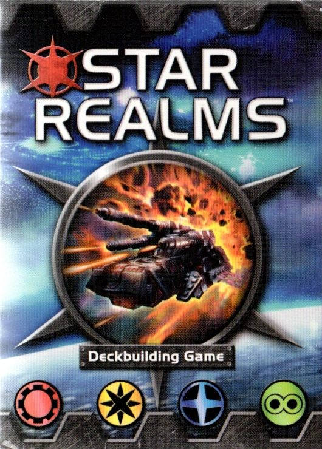
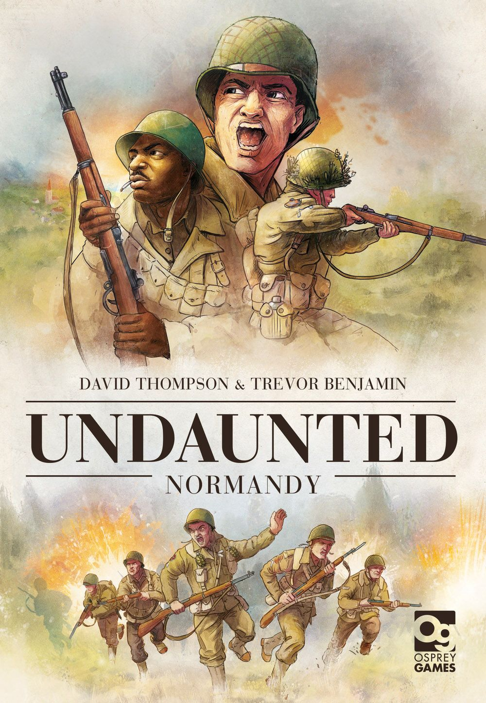
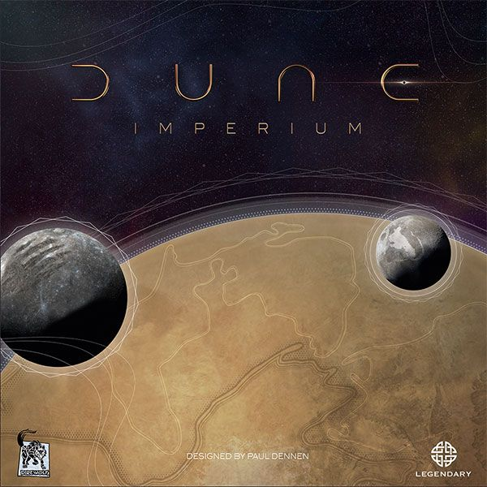

Deck-building is one of those mechanics that sounds deceptively simple. You start with rubbish cards. You buy better cards. You play those better cards. You win. Except you don't win, because your opponent just chained six cards together into a combo that made you question whether you're even playing the same game.

The genre has exploded since Dominion invented it in 2008, and modern deck-builders borrow from worker placement, area control, dungeon crawling, and even war games. This ladder walks you from "what's a deck-builder?" all the way to "I'm simultaneously managing a deck, placing workers, and fighting for political control of Arrakis." Each rung introduces something new that future rungs assume you've already internalised.

## 🟢 Rung 1: [Star Realms](https://boardgamegeek.com/boardgame/147020)
**Weight:** 1.92/5
**Players:** 2
**Play time:** 20 min
**BGG Rating:** 7.55/10, Rank #174

*Box art: White Wizard Games*

If Dominion is the godfather of deck-building, Star Realms is the scrappy kid who made it accessible to everyone. The entire game fits in a box the size of a standard deck of cards, costs less than a cinema ticket, and teaches in five minutes.

You start with a handful of weak scouts and vipers. On your turn, you play your hand, use trade to buy better ships from a shared market row, and use combat to punch your opponent in the face. When someone's authority (health) hits zero, they lose. That's the whole game.

What makes it a perfect first rung is the **faction system**. Cards belong to four factions, and playing multiple cards of the same faction triggers ally abilities — bonus draws, extra damage, forced discards. This is your first taste of **deck synergy**: buying random powerful cards is worse than buying cards that work together. That lesson will save you a lot of pain on higher rungs.

The shared market row is important too. You can't always buy what you want, so you learn to adapt your strategy to what's available rather than trying to force a plan.

**What it teaches you:** Buy cards that synergise. Thin your deck by scrapping weak cards. Adapt to what the market gives you.

## 🟡 Rung 2: [Clank!: A Deck-Building Adventure](https://boardgamegeek.com/boardgame/201808)
**Weight:** 2.23/5
**Players:** 2-4
**Play time:** 60 min
**BGG Rating:** 7.76/10, Rank #98

*Box art: Dire Wolf Digital*

Star Realms taught you to build a deck. Clank! asks: what if your deck also moved a thief through a dragon's dungeon?

Here's the jump — your cards don't just generate resources, they also produce movement (to navigate a modular board), swords (to fight monsters), and *clank* (noise that attracts the dragon's attention). Every turn, you're balancing "I need to go deeper for better loot" against "but the dragon bag has an alarming number of my cubes in it."

The dragon bag is genius. When the dragon attacks, cubes are drawn randomly — if your colour comes out, you take damage. The more clank you make, the more cubes go in. So buying powerful-but-loud cards is a genuine risk calculation, not just "bigger number good."

Clank! introduces **board state** to deck-building. Your cards interact with a physical space. You care about *where* you are, not just *what's in your hand*. And you need to get back out of the dungeon before the dragon eats you, which means your deck needs to shift from exploration to escape partway through the game. That pivot — building for one strategy, then deliberately transitioning — is a skill you'll use constantly from here on.

**What it teaches you:** Deck-building as one system within a larger game. Risk management. Knowing when to shift your strategy mid-game.

## 🟡 Rung 3: [Undaunted: Normandy](https://boardgamegeek.com/boardgame/268864)
**Weight:** 2.27/5
**Players:** 2
**Play time:** 60 min
**BGG Rating:** 7.77/10, Rank #181

*Box art: Osprey Games*

This is where the ladder takes a sharp left turn. Undaunted isn't a deck-builder that borrowed a war game theme — it's a war game that uses deck-building as its core engine. WWII squad combat where your deck *is* your platoon.

Each card represents a soldier type: scouts who reveal map tiles, riflemen who shoot, squad leaders who let you add new troops to your deck. When you recruit a card, you're not buying a shiny upgrade — you're calling in reinforcements. When a soldier dies on the board, you remove their card from your deck permanently. Your deck is literally your army's roster, and it degrades as you take casualties.

The initiative system adds a layer Star Realms didn't have. Each turn, both players reveal a card simultaneously — the higher initiative goes first. So you're thinking about *when* cards appear in your hand, not just *what's* in it. A perfectly built deck that always draws its scout on the wrong turn will lose to a messier deck with better tempo.

Undaunted teaches you that deck-building can serve a purpose beyond "generate victory points." Your deck is a simulation, a representation of something in the game world, and the act of building it carries thematic meaning.

**What it teaches you:** Deck-building as simulation. Initiative and tempo. Loss as a mechanic — cards leave your deck, not just enter it.

## 🟠 Rung 4: [Dominion](https://boardgamegeek.com/boardgame/36218)
**Weight:** 2.34/5
**Players:** 2-4
**Play time:** 30 min
**BGG Rating:** 7.60/10, Rank #145

*Box art: Rio Grande Games*

"Wait," you're saying, "you put the game that *invented* deck-building on rung four?" Yes. And here's why.

Dominion is a *pure* deck-builder. There's no board, no dragon, no soldiers. It's just you, a hand of five cards, and the cold mathematics of probability. That purity makes it one of the best games ever designed, but it also means there's nowhere to hide. In Star Realms, a lucky market flip can save you. In Clank!, a good board position covers sloppy deck construction. In Dominion, your deck is everything. If it's bad, you lose, and you can see exactly why you lost.

The kingdom card setup — ten piles of action cards chosen from hundreds across 15+ expansions — means no two games use the same set of tools. You can't memorise one strategy. You need to read the tableau, identify combos between *this specific set of ten cards*, and build toward them while watching what your opponents are doing.

Dominion forces you to understand **deck density**. Your deck starts with ten cards. Victory point cards are dead draws during play. So buying provinces (worth 6VP) early makes your deck worse at buying more provinces. The skill is knowing *exactly when* to pivot from building your engine to grabbing points. One turn too early and your engine sputters out. One turn too late and your opponent already bought the last province.

This is where deck-building becomes mathematical. Card counting, probability of drawing certain combos, actions-per-turn management — Dominion rewards you for thinking about your deck as a system rather than a collection of cool cards.

**What it teaches you:** Deck density. The engine-to-points pivot. Combinatorial thinking with variable setups. Deck-building in its purest form.

## 🔴 Rung 5: [Aeon's End](https://boardgamegeek.com/boardgame/191189)
**Weight:** 2.80/5
**Players:** 1-4
**Play time:** 60 min
**BGG Rating:** 7.86/10, Rank #108

*Box art: Indie Boards & Cards*

Aeon's End breaks the fundamental rule of deck-building: you never shuffle your discard pile. Your cards go into a discard pile in the order you played them, and when your draw pile runs out, you flip the discard pile over and that's your new draw pile. Same order, no shuffle.

This changes *everything*. In every other game on this ladder, you buy a card and hope it shows up at a good time. In Aeon's End, you can *engineer* your draws. If you play your cards in the right order, you know exactly when your new purchase will come up. You're not building a deck — you're programming a sequence.

The cooperative structure adds pressure that competitive games don't. You're fighting a boss-style nemesis with unique attack patterns, and if any player dies or the shared city is destroyed, everyone loses. So you need to coordinate your decks — one player might focus on damage, another on shielding, another on generating energy for powerful breach spells. Your deck is one instrument in an orchestra, and you need to play in tune.

Breach mechanics add spatial deck management on top of the sequencing. You have four breaches (spell slots) that you must open in order, and only open breaches can hold ready spells. Managing which breaches to open and when to prep which spells is a resource puzzle layered on top of the deck sequencing.

**What it teaches you:** Deterministic deck management. Cooperative synergy between multiple decks. Multi-system resource management.

## 🔴 Rung 6: [Lost Ruins of Arnak](https://boardgamegeek.com/boardgame/312484)
**Weight:** 2.93/5
**Players:** 1-4
**Play time:** 120 min
**BGG Rating:** 8.08/10, Rank #30

*Box art: Czech Games Edition*

Lost Ruins of Arnak asks: what if deck-building, worker placement, and a research track all existed in the same game, and you had to be good at all three simultaneously?

Your deck provides resources and exploration tools, but you also have physical archaeologists that you place on locations to gather resources and discover new sites. Cards feed workers. Workers unlock cards. The research track rewards both, but requires careful timing. It's three engines that share the same fuel supply.

What makes Arnak particularly devious is **deck thinness as strategy**. The game runs for exactly five rounds. You draw five cards per round. That means you'll see your entire deck roughly 2.5 times in the whole game. Every card you buy takes a very specific number of turns to pay off, and you can calculate exactly when. Buying a powerful card in round four is usually worse than buying a mediocre card in round two, because the mediocre card will cycle through twice.

The research track creates a tension Dominion players will recognise on steroids — it's another version of engine-versus-points, but the "points" also give you powerful bonuses on the way up. So the pivot isn't a binary switch, it's a continuous negotiation across the entire game.

And artifacts — single-use items that bypass your deck entirely — add a whole new dimension. Sometimes the best play isn't building your deck at all. It's buying an artifact that gives you exactly what you need right now without diluting your draws.

**What it teaches you:** Deck-building as one system among many. Finite-game optimisation. When not to build your deck.

## 🟣 Rung 7: [Dune: Imperium](https://boardgamegeek.com/boardgame/316554)
**Weight:** 3.08/5
**Players:** 1-4
**Play time:** 120 min
**BGG Rating:** 8.41/10, Rank #6

*Box art: Dire Wolf Digital*

Ranked 6th on BGG for a reason, Dune: Imperium is the summit of this ladder — a game where your deck is simultaneously a worker-placement action selector, a combat resource, a political influence engine, and a thematic narrative device.

Here's the core twist: each card has *two uses*. During the worker-placement phase, you play a card to place an agent on a matching board space. During the reveal phase, any cards you didn't use as agent actions get played for their reveal effects — usually combat strength or resources. So every card in your deck creates a painful either/or decision. That incredible Spacing Guild card could let you place an agent on the game's best action space, or it could provide four swords in the combat that decides who controls the next territory. Never both.

This means your deck has to be good in two completely different contexts simultaneously. A deck full of amazing agent icons but weak reveal effects will dominate the board and lose every fight. The reverse gets you combat wins but terrible placement options. Finding the balance is the whole game.

Layer in the four political factions (Fremen, Bene Gesserit, Spacing Guild, Emperor), an intrigue card system with instant and plot effects, the Conflict row that determines military rewards, and the influence tracks that gate endgame scoring — and you've got a game where deck-building is one instrument in a full orchestra, but the conductor keeps changing the tempo.

If you've climbed every rung to get here, you'll feel it. Recognising faction synergy from Star Realms. Reading the board state from Clank!. Understanding tempo from Undaunted. Calculating deck density from Dominion. Coordinating multi-system resources from Aeon's End. Timing your acquisitions across a finite game from Arnak. Dune: Imperium asks you to do all of it at once, and it's glorious.

**What it teaches you:** Everything above, simultaneously. Multi-use cards. Deck-building as action selection. The full integration of deck-building into a hybrid eurogame design.

---

## The Full Ladder at a Glance

| Rung | Game | Weight | Players | Time | Key Lesson |
|------|------|--------|---------|------|------------|
| 🟢 1 | [Star Realms](https://boardgamegeek.com/boardgame/147020) | 1.92 | 2 | 20 min | Faction synergy & deck thinning |
| 🟡 2 | [Clank!](https://boardgamegeek.com/boardgame/201808) | 2.23 | 2-4 | 60 min | Deck-building meets board state |
| 🟡 3 | [Undaunted: Normandy](https://boardgamegeek.com/boardgame/268864) | 2.27 | 2 | 60 min | Deck as simulation & tempo |
| 🟠 4 | [Dominion](https://boardgamegeek.com/boardgame/36218) | 2.34 | 2-4 | 30 min | Pure probability & engine pivots |
| 🔴 5 | [Aeon's End](https://boardgamegeek.com/boardgame/191189) | 2.80 | 1-4 | 60 min | Deterministic sequencing & co-op |
| 🔴 6 | [Lost Ruins of Arnak](https://boardgamegeek.com/boardgame/312484) | 2.93 | 1-4 | 120 min | Multi-system integration |
| 🟣 7 | [Dune: Imperium](https://boardgamegeek.com/boardgame/316554) | 3.08 | 1-4 | 120 min | Everything, all at once |

The weight gap between rungs 4 and 5 (2.34 → 2.80) is the biggest single jump on this ladder, and it's where most people stall. If Dominion clicks for you, don't rush past it — play enough to really understand deck density and combo timing. Aeon's End and everything above it assumes that understanding is already second nature.

Happy climbing. 🎲
