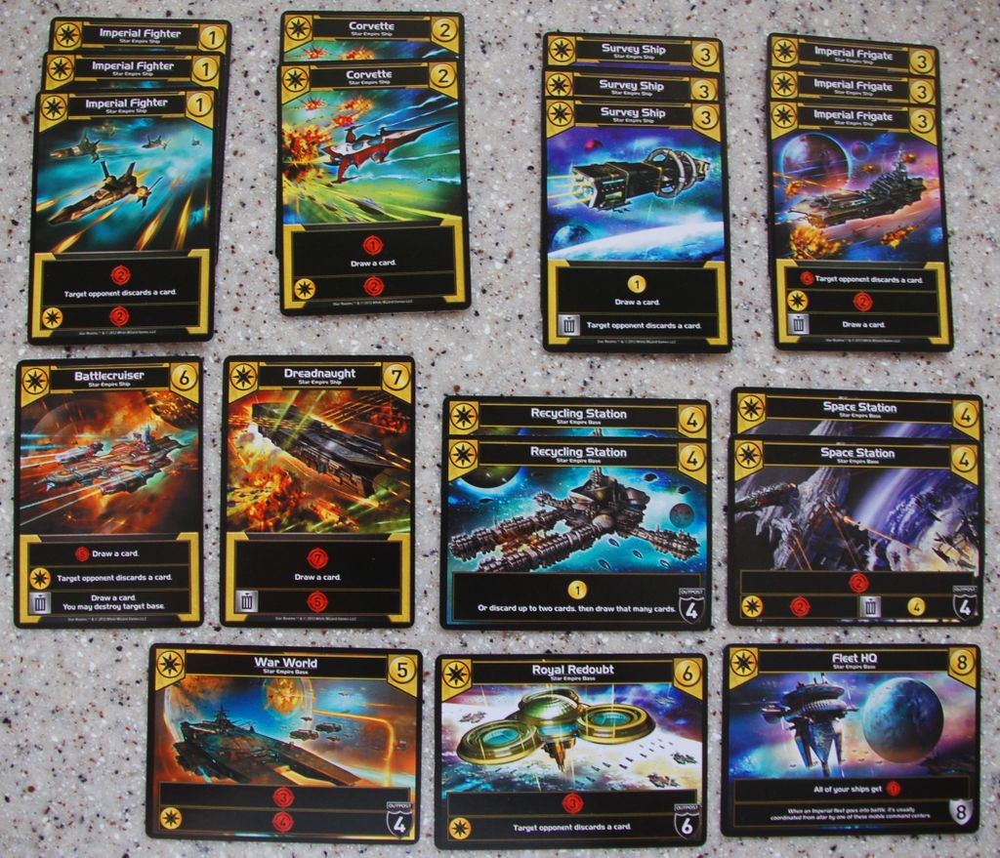
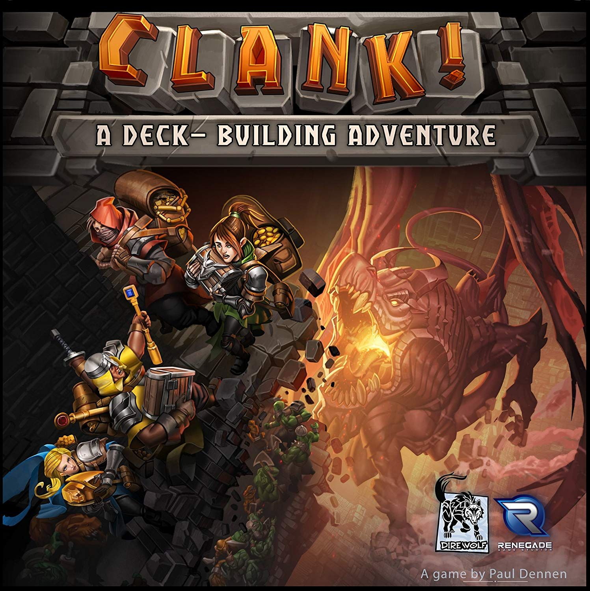
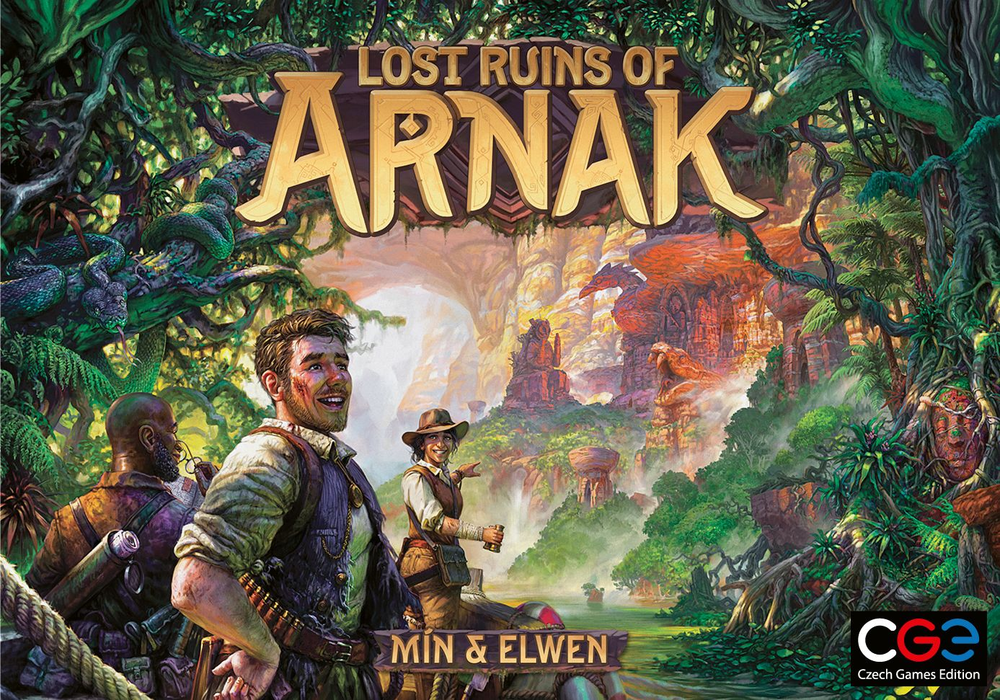
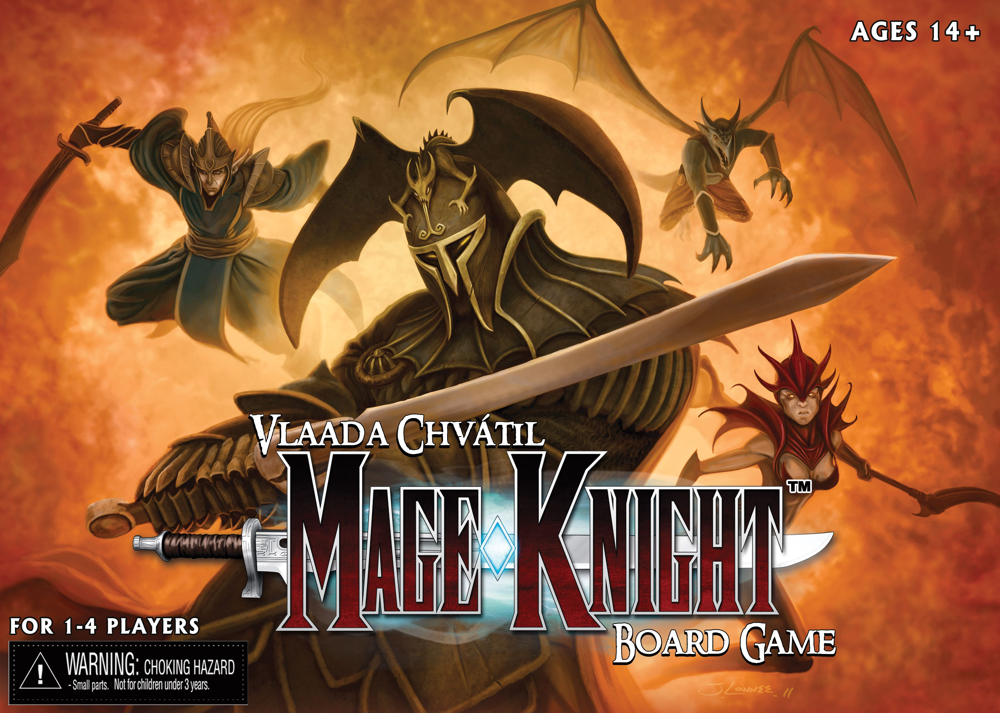

Deck-building is one of those mechanics that scales beautifully. At its simplest, you're buying cards and playing cards. At its most extreme, you're orchestrating a hand of twelve multi-use cards against a branching decision tree that would make a chess engine sweat. The jump from one end to the other is enormous, and knowing where you are on that spectrum  -  and where you want to go next  -  is half the battle.

This ladder covers seven deck-builders, each a genuine step up in weight and decision density from the last. Not seven random games with the same mechanic. Seven deliberate rungs. If you're comfortable at one level, the next one up should stretch you without breaking you.

All stats pulled directly from BGG. No guesswork.

---

## Rung 1: [Star Realms](https://boardgamegeek.com/boardgame/147020)  -  The Gateway Drug

**Weight:** 1.92/5 · **Rating:** 7.55/10 · **Players:** 2 · **Time:** ~20 min · **BGG Rank:** #174

If you've never built a deck before, start here. Star Realms strips the mechanic to its bones: you buy ships from a shared trade row, you play them to generate trade or combat, and you smash your opponent's authority to zero. Done. Twenty minutes, shuffle up, go again.

What makes Star Realms such an effective teacher is that faction synergies are immediately visible. Play two Machine Cult cards, get a bonus. Play three Blob cards, get a bigger bonus. You learn the core lesson of every deck-builder  -  that the cards you *don't* buy matter as much as the ones you do  -  without needing a rulebook thicker than a napkin.

The weight of 1.92 is generous. This is closer to a card game than a board game, and that's the point. It costs less than a takeaway, fits in a pocket, and teaches you everything you need to know about building a synergistic engine under pressure.

**When you're ready to move on:** You'll know because you start wanting the game to do *more*. More space. More options. More ways to express your strategy beyond "buy the biggest ship in the row."

---

## Rung 2: [Clank!: A Deck-Building Adventure](https://boardgamegeek.com/boardgame/201808)  -  The Board Changes Everything

**Weight:** 2.23/5 · **Rating:** 7.76/10 · **Players:** 2-4 · **Time:** 30-60 min · **BGG Rank:** #98

Clank! takes the Star Realms formula and bolts a board onto it. Suddenly you're not just building a deck  -  you're navigating a dungeon, pushing your luck against a dragon that gets angrier every time someone makes noise, and racing other players to grab artifacts and escape alive.

The deck-building itself is only marginally heavier than Star Realms. You're still buying from a shared row, still looking for synergies. But the spatial element adds an entire decision layer: do you go deeper for better loot and risk dying, or do you grab something modest and sprint for the exit? Your deck has to serve two masters now  -  generating resources *and* moving your pawn  -  and that tension is what makes Clank! click.

At 2.23 weight, it's a perfect family-weight strategy game that happens to have deck-building at its core. The dragon bag-pull mechanic adds drama without adding complexity. You'll laugh. You'll curse. You'll absolutely buy the expansions.

**When you're ready to move on:** You'll find yourself wishing the card market had more meaningful choices, or wanting the deck-building to be the main event rather than one tool in a dungeon-crawling toolbox.

---

## Rung 3: [Dominion](https://boardgamegeek.com/boardgame/36218)  -  The One That Started It All

**Weight:** 2.34/5 · **Rating:** 7.60/10 · **Players:** 2-4 · **Time:** ~30 min · **BGG Rank:** #145

Dominion invented the genre. There is no complexity ladder for deck-building games without Dominion on it, and the fact that it still holds up after almost two decades says everything.

Where Star Realms gives you a randomised trade row, Dominion gives you a curated kingdom of 10 card stacks that everyone can see from the start. No luck of the draw in the market. Just you, the available cards, and the question of how fast you can build an engine that converts actions into buys into victory points before the Provinces run out.

The brilliance is in deck thinning. Dominion is where most players first learn that a lean deck beats a fat one. Buying a Chapel to trash your starting coppers is one of those "lightbulb" moments that reshapes how you think about every deck-builder from here on. The game is pure engine optimisation. No board, no combat, no theme to speak of. Just the mechanism, pristine and elegant.

At 2.34 weight, it's only a hair above Clank!, but the *feel* is very different. Dominion demands you plan ahead. Turns are snappy  -  Action, Buy, Clean-up, done  -  but the strategy runs deep. With hundreds of kingdom card combinations across its many expansions, no two games play the same.

**When you're ready to move on:** You'll start craving a game where the deck-building plugs into something bigger. A boss fight. A shared threat. A puzzle beyond "get to 8 coins, buy a Province."

---

## Rung 4: [Aeon's End](https://boardgamegeek.com/boardgame/191189)  -  Cooperation Under Siege

**Weight:** 2.80/5 · **Rating:** 7.86/10 · **Players:** 1-4 · **Time:** ~60 min · **BGG Rank:** #107

Aeon's End is where the ladder starts to lean. This is a cooperative deck-builder where you and your team are breach mages defending the last remnants of humanity against a nightmarish boss called a Nemesis. The boss has its own deck, its own escalation, and it will absolutely destroy you if your team doesn't coordinate.

Two innovations set it apart. First: you never shuffle your discard pile. You choose the order cards go into your discard, which means you're planning not just this turn but two or three turns ahead. That alone would be enough, but second: turn order is randomised each round via a card draw. You might get two turns in a row. The boss might get two turns in a row. Planning around this chaos is the game.

At 2.80, there's a genuine step up from Dominion. You're managing breach charges, gem purchases, spell pre-loading, health pools for yourself and the city, and a boss whose abilities escalate in genuinely nasty ways. The first time a Nemesis card forces you to discard your entire hand after you just carefully stacked it, you'll feel the weight.

Best at two players according to BGG poll data (487 Best votes), and strongly recommended solo (144 Best, 331 Recommended). If you want to take deck-building into cooperative territory, this is the gold standard.

**When you're ready to move on:** You'll want the deck-building to sit alongside other mechanisms  -  worker placement, exploration, resource management  -  rather than being the entire game.

---

## Rung 5: [Lost Ruins of Arnak](https://boardgamegeek.com/boardgame/312484)  -  The Hybrid Machine

**Weight:** 2.93/5 · **Rating:** 8.08/10 · **Players:** 1-4 · **Time:** 30-120 min · **BGG Rank:** #30

Arnak is the moment where "deck-building game" stops being the full description. This is a deck-builder, a worker placement game, and a resource management puzzle stacked on top of each other, and somehow none of those layers feel vestigial.

Cards serve double duty: play them to place a worker at an exploration site, or use them for their resource effect during your reveal phase. The research track rewards you for pushing past guardians. Artifacts you discover become powerful additions to your deck. The whole thing fits together like a puzzle box  -  tight, interlocking, satisfying.

At 2.93 weight, the complexity comes from the number of things competing for your attention rather than any single system being hard. You're asking yourself five questions per turn: Which site should I explore? Can I afford the guardian? Should I save this card for its worker placement or its resource value? How far can I push the research track? And crucially: is it worth buying this card when I only have two rounds left to actually draw it?

That last question matters. Arnak runs only five rounds. Late-game card purchases rarely pay off, which forces a discipline that many heavier deck-builders don't require. It teaches you to stop building and start executing.

**When you're ready to move on:** You want a game where the deck-building isn't just *one* mechanism  -  you want it woven into every single decision, layered with bluffing, combat, and politics.

---

## Rung 6: [Dune: Imperium](https://boardgamegeek.com/boardgame/316554)  -  Politics, Spice, and Hidden Information

**Weight:** 3.08/5 · **Rating:** 8.41/10 · **Players:** 1-4 · **Time:** 60-120 min · **BGG Rank:** #6

There's a reason this sits at #6 on all of BoardGameGeek. Dune: Imperium uses deck-building to add a layer of hidden information to worker placement that most games in that genre can't touch. The cards in your hand determine where your agents can go, which means your opponents can never be fully sure what you're capable of on any given turn.

The weight jump from Arnak is modest  -  2.93 to 3.08  -  but the *feel* is meaningfully heavier because combat matters, faction allegiances matter, and the Intrigue cards add a layer of backstabbing and bluffing that pure euros don't have. You might reveal a card that swings a combat at the last second, or spend an entire round sandbagging to look weak before committing everything to the fight that awards three victory points.

The deck-building here serves the strategy rather than being the strategy. You're not optimising a draw engine in a vacuum. Every card you buy must justify itself against a very specific question: does this card let my agents go where I need them, when I need them, while also contributing to my reveal-phase combat power? Cards that do both are gold. Cards that do neither are dead weight.

At 3.08 weight with a 60-120 minute play time, it's a serious game that respects your evening without devouring your entire night. Same designer as Clank!  -  Paul Dennen  -  which tells you something about how well the deck-building integrates with the board.

**When you're ready to move on:** You want to go off the deep end. You want a game where every card in your hand has three possible uses, the map unfolds as you explore, and a single play session might take an entire afternoon. You want Mage Knight.

---

## Rung 7: [Mage Knight Board Game](https://boardgamegeek.com/boardgame/96848)  -  The Everest

**Weight:** 4.38/5 · **Rating:** 8.08/10 · **Players:** 1-4 · **Time:** 60-240 min · **BGG Rank:** #39

Mage Knight is the mountain at the end of the trail. Designed by Vlaada Chvátil  -  the same mind behind Codenames, Galaxy Trucker, and Through the Ages  -  it takes deck-building and folds it into an RPG-scale adventure game where every single card in your hand can be played in multiple ways, and the puzzle of how to combine them against the challenge in front of you is genuinely brain-burning.

At 4.38 weight, this is a different category entirely. Every card can be played for a basic effect, boosted with mana for a stronger effect, or sideways for movement, attack, block, or influence depending on what you need. Combat is a multi-step calculation: ranged attack, then block, then melee, with each step drawing from your hand, your units, and your mana pool. Sieging a fortified city might take ten minutes of careful hand optimisation. And that's one turn.

The game is best solo. BGG poll data makes that unambiguous: 851 Best votes at 1 player, versus 627 at 2 and a steep drop-off after. With more players, downtime between turns can stretch painfully. Solo, it's one of the greatest puzzle experiences in the hobby  -  a fantasy adventure where the real boss fight is your own hand management.

Setup is significant. Teardown is significant. A full conquest scenario can take 3-4 hours solo. But if you've climbed this entire ladder and you want the ultimate expression of "what can I do with these cards?"  -  there is nothing else like it.

**When you're ready to move on:** You don't. You're at the top. Enjoy the view.

---

## The Full Ladder at a Glance

| Rung | Game | Weight | Rating | Time | The Step Up |
|------|------|--------|--------|------|-------------|
| 1 | [Star Realms](https://boardgamegeek.com/boardgame/147020) | 1.92 | 7.55 | 20 min | Pure deck-building, no distractions |
| 2 | [Clank!](https://boardgamegeek.com/boardgame/201808) | 2.23 | 7.76 | 30-60 min | Adds a board and push-your-luck |
| 3 | [Dominion](https://boardgamegeek.com/boardgame/36218) | 2.34 | 7.60 | 30 min | Pure engine optimisation, deck thinning |
| 4 | [Aeon's End](https://boardgamegeek.com/boardgame/191189) | 2.80 | 7.86 | 60 min | Co-op, no-shuffle planning, boss fights |
| 5 | [Lost Ruins of Arnak](https://boardgamegeek.com/boardgame/312484) | 2.93 | 8.08 | 30-120 min | Hybrid: deck-building + worker placement |
| 6 | [Dune: Imperium](https://boardgamegeek.com/boardgame/316554) | 3.08 | 8.41 | 60-120 min | Hidden info, combat, political factions |
| 7 | [Mage Knight](https://boardgamegeek.com/boardgame/96848) | 4.38 | 8.08 | 60-240 min | Multi-use cards, RPG-scale puzzle |

Every game on this ladder is excellent at what it does. The question isn't which is best  -  it's which one matches where you are right now, and which one you'll be ready for next.

Happy climbing. 🎲
