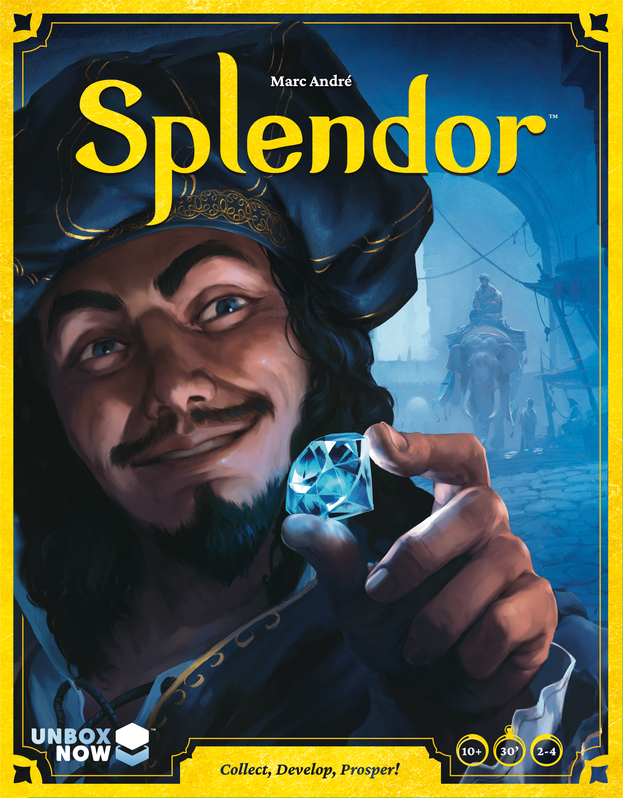
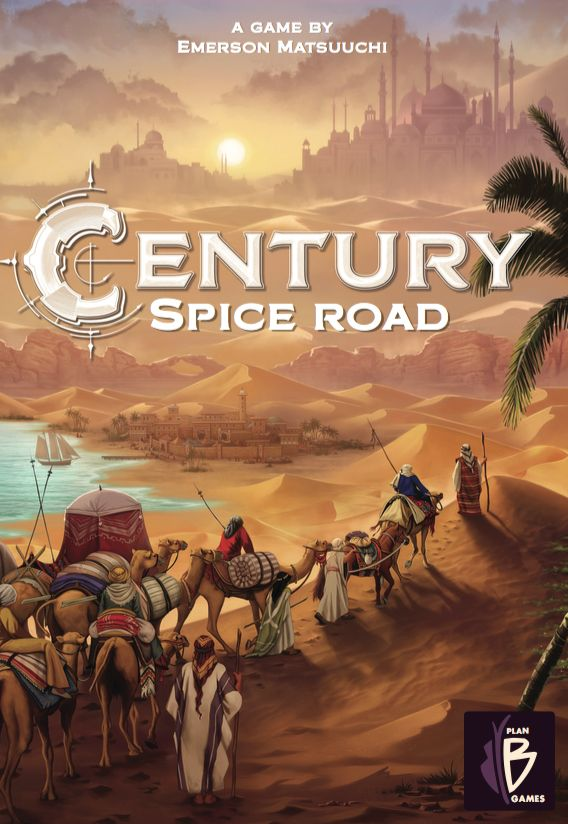
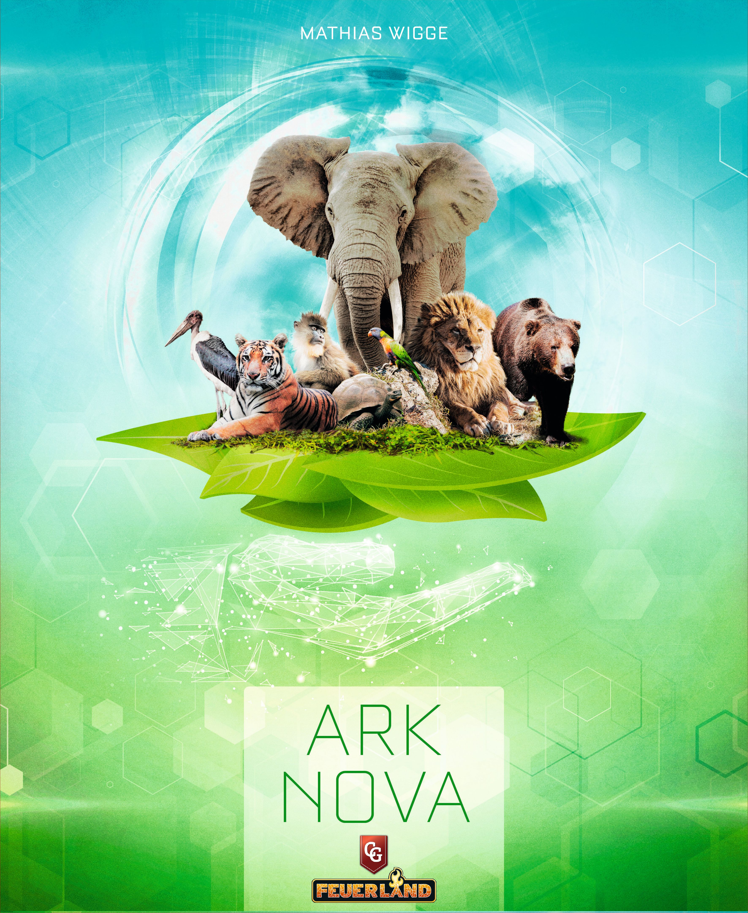
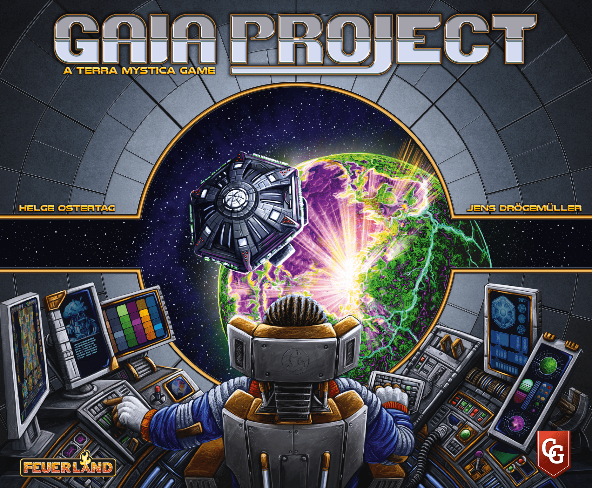

There's a moment in every engine building game where it clicks. Your turns stop being individual decisions and start becoming inevitable consequences of everything you've built. Cards chain into cards. Resources generate resources. What took three actions on turn two now happens for free on turn eight.

That feeling — the hum of a machine you've constructed from nothing — is why engine building is one of the most satisfying mechanics in all of board gaming. But the genre spans an enormous range, from games you can teach in five minutes to beasts that need a full evening just for setup.

This ladder gives you six steps from gateway to galaxy-brain. Each game builds on skills from the one before it, so by the time you reach the top, you'll have earned every neuron-frying decision.

## Rung 1: Splendor — The Perfect First Engine

| Stat | Value |
|------|-------|
| **BGG Rating** | 7.42 |
| **Weight** | 1.78 / 5 |
| **Players** | 2–4 |
| **Play Time** | 30 min |
| **BGG Rank** | #243 |

[Splendor](https://boardgamegeek.com/boardgame/148228) is engine building reduced to its purest form. You collect gem tokens, buy cards, and those cards permanently discount future purchases. That's it. That's the whole game.

And it's brilliant.

What makes Splendor the ideal starting point isn't just its simplicity — it's that the engine-building feedback loop is completely transparent. Buy a ruby card, and every future ruby purchase costs one less. There's no hidden maths, no delayed gratification that takes five turns to pay off. The engine is visible, immediate, and deeply satisfying.

**What you'll learn here:** Resource accumulation, discount chains, the tension between building your engine and racing toward victory points. You'll also get your first taste of hate-drafting — taking a card not because you need it, but because your opponent does.

**When to move on:** When you start seeing the entire card market as a network of discount paths rather than individual purchases, you're ready for the next rung.

## Rung 2: Century: Spice Road — Engines That Transform

| Stat | Value |
|------|-------|
| **BGG Rating** | 7.29 |
| **Weight** | 1.80 / 5 |
| **Players** | 2–5 |
| **Play Time** | 30–45 min |
| **BGG Rank** | #384 |

[Century: Spice Road](https://boardgamegeek.com/boardgame/209685) looks like Splendor's twin at a glance, but it introduces a concept that changes everything: **conversion chains**.

In Splendor, your engine gives you discounts. In Century, your engine *transforms* resources. Yellow cubes become red cubes become green cubes become brown cubes, and the specific sequence of merchant cards you acquire determines how efficiently you can climb that chain. Your hand of cards isn't a static collection — it's a programmable sequence.

The twist that elevates Century is the rest mechanic. Play a card, it's gone from your hand until you spend a full turn picking everything back up. Suddenly you're not just building an engine — you're programming a *cycle*. The best players time their rest turns so that every card fires in the perfect order, converting a handful of yellow cubes into exactly the combination needed for a 20-point delivery.

**What you'll learn here:** Resource conversion, hand management, cycle optimisation. The idea that your engine isn't just "stuff you have" but "actions you can chain together."

**When to move on:** When you can look at a row of merchant cards and immediately calculate the conversion chain to any delivery card on the table, you've mastered this rung.

## Rung 3: Wingspan — Engines With Personality

| Stat | Value |
|------|-------|
| **BGG Rating** | 8.00 |
| **Weight** | 2.48 / 5 |
| **Players** | 1–5 |
| **Play Time** | 40–70 min |
| **BGG Rank** | #38 |

[Wingspan](https://boardgamegeek.com/boardgame/266192) is where engine building gets its first real dose of complexity — and beauty. Each bird card you play adds a permanent ability to one of three habitat rows, and every time you activate that habitat, *every* bird in it fires in sequence. Your tableau isn't just an engine; it's an assembly line.

The jump from Century to Wingspan is significant. You're no longer just managing one conversion chain — you're building three parallel engines (food, eggs, cards) that need to feed each other. A bird in your forest might generate food that lets you play a bird in your wetland that draws cards that contain the perfect bird for your grassland. When it works, it's genuinely magical.

But Wingspan also teaches something the previous rungs didn't: **engine impermanence**. Your action cubes decrease each round, meaning your beautiful engine gets fewer activations as the game progresses. The engine you build in round one might fire eight times; the one you build in round four fires once. This forces a strategic awareness of *when* to build versus when to harvest.

**What you'll learn here:** Multi-track engine building, combo sequencing, diminishing returns, and the art of building an engine that peaks at the right moment.

**When to move on:** When you stop chasing pretty birds and start calculating which row needs the next activation trigger, you're thinking like an engine builder.

## Rung 4: Terraforming Mars — The Engine Sprawl

| Stat | Value |
|------|-------|
| **BGG Rating** | 8.34 |
| **Weight** | 3.27 / 5 |
| **Players** | 1–5 |
| **Play Time** | 120 min |
| **BGG Rank** | #9 |

[Terraforming Mars](https://boardgamegeek.com/boardgame/167791) is where engine building stops being elegant and starts being *sprawling*. With over 200 unique project cards, your engine isn't a tidy machine — it's a Frankenstein creation bolted together from whatever the card draw gave you.

Every game of Terraforming Mars produces a fundamentally different engine. One game you're a plant-based terraforming machine, converting heat into greenery into oxygen. The next you're a microbe-hoarding scientist whose engine lives in tags and discount chains that only become visible twenty cards in. The game doesn't hand you a framework and ask you to optimise it — it dumps a pile of parts on the table and asks you to *invent* something.

The production phase is where the engine sings. Every generation, your income tracks pay out steel, titanium, plants, energy, heat, and megacredits based on the production levels you've accumulated. Early in the game, this trickle barely covers a single card. By the endgame, your production phase alone might generate more resources than your first three generations combined.

**What you'll learn here:** Long-term engine planning over 10+ generations, tag synergies, the discipline of drafting for your engine rather than drafting the "best" card, and the painful lesson that an engine without victory points is just an expensive hobby.

**When to move on:** When you can evaluate a hand of four cards in the draft and instantly identify which one feeds your engine versus which one is a trap, you're ready to go deeper.

## Rung 5: Ark Nova — The Engine Ecosystem

| Stat | Value |
|------|-------|
| **BGG Rating** | 8.54 |
| **Weight** | 3.80 / 5 |
| **Players** | 1–4 |
| **Play Time** | 90–150 min |
| **BGG Rank** | #2 |

[Ark Nova](https://boardgamegeek.com/boardgame/342942) is currently the #2 ranked game on all of BoardGameGeek, and it earned that spot by creating an engine-building experience unlike anything else on this list.

Your five action cards — Animals, Build, Cards, Association, and Sponsors — each have a power level from 1 to 5 that shifts every time you use one. Play the Animals action at strength 5 and it drops to strength 1, while everything else shuffles up. Your engine isn't just what you've built on the board — it's the *rhythm* of your actions themselves.

This is engine building as ecosystem management. Your zoo needs enclosures to house animals, money to fund them, reputation to unlock powerful associations, and conservation points to actually win. Every card you play ripples across multiple systems simultaneously. A single animal might require a specific enclosure size, grant a conservation bonus, trigger a sponsor discount, and push your reputation past a threshold that unlocks a university partnership — all at once.

The brilliance is that Ark Nova's engine doesn't just *produce* resources. It produces *options*. The more you build, the more pathways open up, and the game becomes a constant exercise in identifying which of your fifteen possible moves generates the most cascading value.

**What you'll learn here:** Multi-system optimisation, action efficiency curves, the difference between engines that produce resources and engines that produce *opportunities*, and the crucial skill of knowing when your engine is "done enough" to pivot toward scoring.

**When to move on:** When you can plan three action card cycles ahead and see how each sequence positions your entire zoo differently, you're ready for the summit.

## Rung 6: Gaia Project — The Engine Singularity

| Stat | Value |
|------|-------|
| **BGG Rating** | 8.35 |
| **Weight** | 4.40 / 5 |
| **Players** | 1–4 |
| **Play Time** | 60–150 min |
| **BGG Rank** | #13 |

[Gaia Project](https://boardgamegeek.com/boardgame/220308) sits at the top of this ladder not because it's the highest-rated (Ark Nova edges it out), but because it represents the most *demanding* engine-building challenge in modern board gaming. At weight 4.40, it's in the top tier of complexity on BGG, and every ounce of that weight is engine.

As the spiritual successor to Terra Mystica, Gaia Project gives each player a unique alien faction with asymmetric abilities, a tech tree with six tracks to climb, and a modular galaxy of planets to colonise. Your engine is built across three interconnected layers: your faction board (which literally reveals income and abilities as you build structures), the tech tracks (which grant powerful one-time and permanent bonuses), and the map itself (where federation tokens reward clustering).

What makes Gaia Project the pinnacle is that your engine decisions are almost entirely *permanent and irreversible*. Every mine you build uncovers a resource on your faction board. Every trading station reveals more income. You can't undo these decisions, and the order in which you build determines what resources you have access to for every subsequent turn. This isn't an engine you iterate on — it's an engine you commit to.

The tech tracks add another layer of engine building on top. Each track offers increasingly powerful abilities, and the level 5 capstone of each track is a game-warping power that can define your entire strategy. But advancing costs resources, and the same resources could build structures that fuel your income engine. The tension between investing in tech versus investing in production is the core strategic dilemma, and there's no correct answer — only the answer that best fits your faction, your position, and your opponents' plans.

**What you'll learn here:** Everything. Irreversible engine commitment, asymmetric optimisation, multi-layered production systems, tech tree investment timing, and the terrifying beauty of an engine that you planned six rounds ago finally reaching critical mass.

## The Climb

Engine building as a mechanic teaches something profound about game design: the joy of compounding returns. Whether you're collecting gems in Splendor or terraforming planets in Gaia Project, the fundamental pleasure is the same — watching your early investments multiply into late-game abundance.

| Rung | Game | Weight | The Core Lesson |
|------|------|--------|----------------|
| 1 | [Splendor](https://boardgamegeek.com/boardgame/148228) | 1.78 | Discounts and resource accumulation |
| 2 | [Century: Spice Road](https://boardgamegeek.com/boardgame/209685) | 1.80 | Conversion chains and cycle timing |
| 3 | [Wingspan](https://boardgamegeek.com/boardgame/266192) | 2.48 | Multi-track engines and diminishing activations |
| 4 | [Terraforming Mars](https://boardgamegeek.com/boardgame/167791) | 3.27 | Emergent engines from card synergy |
| 5 | [Ark Nova](https://boardgamegeek.com/boardgame/342942) | 3.80 | Action rhythm and ecosystem management |
| 6 | [Gaia Project](https://boardgamegeek.com/boardgame/220308) | 4.40 | Irreversible commitment and asymmetric mastery |

Each rung prepares you for the next. Splendor's discount chains teach you the logic that Century's conversion engines expand on. Wingspan's multi-track management scales into Terraforming Mars's sprawling card synergies. Ark Nova's action rhythm prepares you for Gaia Project's unforgiving strategic commitment.

You don't need to climb every rung. Some people find their forever game at rung three and never look up. That's not failure — that's knowing yourself. But if you do make the full ascent, you'll have a deep, intuitive understanding of what makes the engine-building genre one of the richest in all of tabletop gaming.

Start with gems. End with galaxies. Enjoy every rung.
