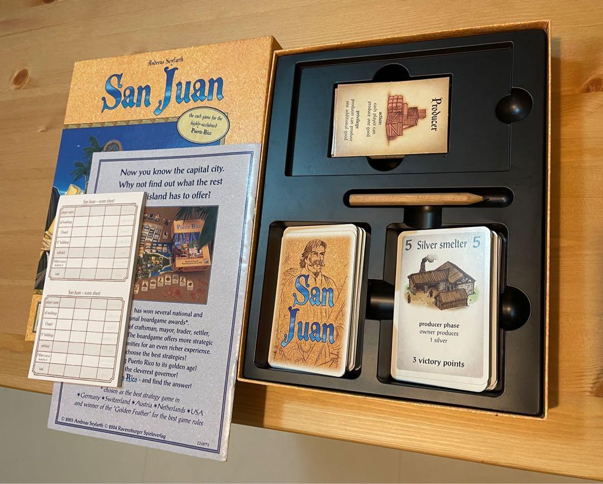

Tableau building is one of those mechanisms people learn before they know there’s a name for it. You play cards in front of you. Those cards start doing stuff. Then they make your later cards better, cheaper, stronger, weirder. Suddenly your little personal area becomes a machine. That’s the hook.

This article is about a specific way to learn that style of play: a seven-step progression from approachable tableau builders to much heavier, more demanding ones. The goal here isn’t to rank every game in the genre or settle forum arguments. It’s to outline a learning path where each stop adds one important idea without frying the table.

And if you want the cleanest path from “I like card combos” to “I now spend turns calculating tags, engines, and endgame multipliers,” this is the ladder I’d use.

Look, there are other routes. The BGG forums will happily throw 40 alternatives at your face. Somebody will yell that [Res Arcana](https://boardgamegeek.com/boardgame/262712/res-arcana) belongs here. Somebody else will insist [51st State: Master Set](https://boardgamegeek.com/boardgame/192458/51st-state-master-set) is the truth. Fine. Good games. But for a *learning path*, I want each step to teach one new thing without frying the table.

So here’s the journey. Seven rungs. From approachable to brain-melting.

If you already know hobby games and just want the shortcut: skip to 🟡 Medium if you love accessible engines, skip to 🔴 Heavy if you already handle multi-step card combos comfortably, and skip to ⚫ Expert only if your idea of a relaxing evening includes silent staring and a 25-minute first turn.

## 🟢 Gateway: [San Juan](https://boardgamegeek.com/boardgame/8217/san-juan)
**Weight:** 1.97/5  
**Players:** 2-4  
**Play Time:** 60 min

This is the first rung. Not because it’s the most famous. Because it teaches the bones of tableau building better than almost anything.

In [San Juan](https://boardgamegeek.com/boardgame/8217/san-juan), your cards are basically everything. They’re your buildings, and they’re also your money. That one decision alone teaches a huge lesson: every card is opportunity cost. Build this now, or spend it to build something else. Simple. Elegant. Mean in a very polite German way.

The role selection is the real teaching tool. There are 7 universal roles, and when one gets chosen, everybody gets the action. The chooser gets a bonus. That means new players aren’t trapped in their own little puzzle. They stay connected to the table. They learn the rhythm fast.

**What it teaches:**  
Core tableau building. You build cards that improve future turns, especially around production and trade.

**Why this is the right first step:**  
You can teach it in 10 minutes, and people immediately get the fun part. Build a thing. Make your role better. Chain that into more stuff.

Best in class at this level? Yeah, I think so. There are lighter tableau-ish games, but [San Juan](https://boardgamegeek.com/boardgame/8217/san-juan) actually teaches habits that matter later.

**Trap game to avoid here:** jumping straight to [Terraforming Mars](https://boardgamegeek.com/boardgame/167791/terraforming-mars) because “it’s just cards, right?” No. That road leads to one confused player, one AP spiral, and one person checking their phone by generation three.

## 🟢 Gateway+: [Race for the Galaxy](https://boardgamegeek.com/boardgame/28143/race-for-the-galaxy)
**Weight:** 2.89/5  
**Players:** 2-4  
**Play Time:** 30-60 min

Once [San Juan](https://boardgamegeek.com/boardgame/8217/san-juan) has taught the basic rhythm of building and improving your personal area, the next useful leap is learning that your engine also depends on timing and prediction. That’s where [Race for the Galaxy](https://boardgamegeek.com/boardgame/28143/race-for-the-galaxy) comes in.

Here’s the thing: this article says “from Race for the Galaxy to Terraforming Mars,” and I get it. For a lot of people, [Race for the Galaxy](https://boardgamegeek.com/boardgame/28143/race-for-the-galaxy) *feels* like the true beginning. It’s the game that turns tableau building from “nice little card engine” into “oh wow, this can sing.”

The iconography scares people. Every thread about this game eventually becomes an icon debate. Half the comments say the symbols are a barrier. The other half say once you learn them, the game becomes telepathy. I’m on team telepathy. The first play can be bumpy. After that, it flies.

What changed from [San Juan](https://boardgamegeek.com/boardgame/8217/san-juan)? Phases. Instead of everyone simply doing a chosen role, players secretly select from 5 phases, and only chosen phases happen. That’s a huge leap. Now timing matters. Prediction matters. You’re not just building a tableau. You’re trying to surf the same wave as everyone else.

**New concept vs previous step:**  
Phase selection through icons. Your engine cares not just *what* you build, but *when* the table lets that phase happen.

This is the best game at this rung. Full stop. It’s faster than it looks, deeper than its playtime suggests, and still one of the sharpest card engines ever printed.

**Skip to here if...** you already know modern hobby games and don’t mind learning a visual language.

**Common mistake:** people bounce off the icon wall too early. Give it two plays. Not one. Two. [Race for the Galaxy](https://boardgamegeek.com/boardgame/28143/race-for-the-galaxy) is famous for the “bad first game, brilliant third game” arc.

## 🟢 Family+: [Splendor](https://boardgamegeek.com/boardgame/148228/splendor)
**Weight:** 1.68/5  
**Players:** 2-4  
**Play Time:** 30 min

From there, it helps to strip the idea back down again and make the engine visible. That’s why [Splendor](https://boardgamegeek.com/boardgame/148228/splendor) sits here even though its BGG weight is lower than [Race for the Galaxy](https://boardgamegeek.com/boardgame/28143/race-for-the-galaxy). The ladder is about learning progression, not worshipping one number on a website.

[Splendor](https://boardgamegeek.com/boardgame/148228/splendor) works here because it teaches engine building in the most visible, tactile way possible. Take gems. Buy cards. Those cards become permanent discounts. Discounts buy better cards. Better cards attract nobles. Done. It’s clean enough to teach your cousin who thinks Catan is “the advanced one.”

**New concept vs previous step:**  
Economic chaining. Your tableau isn’t about phases anymore. It’s about discounts and reservation timing. You start to see a classic engine loop: invest now, profit later.

This is also where players learn that tableau building doesn’t need text-heavy cards to feel smart. [Splendor](https://boardgamegeek.com/boardgame/148228/splendor) is almost absurdly stripped down, and that’s why it works.

Would I call it deeper than [Race for the Galaxy](https://boardgamegeek.com/boardgame/28143/race-for-the-galaxy)? No chance. But as a stepping stone for mixed groups, it’s excellent.

What [Splendor](https://boardgamegeek.com/boardgame/148228/splendor) really teaches, better than people give it credit for, is tempo. New players look at it and see gem collection. Experienced players see a race defined by turn efficiency and denial. That sounds dramatic for a game with poker chips and Renaissance merchants, but sit at a table where two good players are eyeing the same level-two blue card and suddenly every token matters.

A concrete example. Let’s say you’re building toward a noble that wants four blue and four green bonuses. The beginner move is obvious: buy every blue and green card you can. The better move is usually stranger. You might grab a cheap white card first because it discounts the blue card you actually need, and it does it a turn earlier. That one turn is the whole game. [Splendor](https://boardgamegeek.com/boardgame/148228/splendor) is full of little sequences like that. Take tokens now, reserve the contested card, then use the gold as a timing patch later. It’s not flashy, but it’s sharp.

Reservations are also the mechanism that turns this from “pleasant engine builder” into “I see what you’re doing and I hate it.” If another player is telegraphing a level-three purchase, reserving that card can completely break their route, even if you never intend to buy it yourself. Some groups think that’s too mean. I think it’s the point. Tableau building gets more interesting the second your engine exists in a contested market.

This is why [Splendor](https://boardgamegeek.com/boardgame/148228/splendor) belongs in the ladder even with a lower BGG weight than [Race for the Galaxy](https://boardgamegeek.com/boardgame/28143/race-for-the-galaxy). It teaches visible economy in a way almost anybody can read across the table. You can point at someone’s tableau and say, “They’re one red discount away from popping off.” That clarity matters when you’re training players to think in engines rather than isolated turns.

One tactical tip that carries into heavier tableau games: don’t overvalue expensive cards just because they look important. If a cheap card completes your discount web and accelerates two later buys, it may be stronger than the shiny seven-point monster. [Splendor](https://boardgamegeek.com/boardgame/148228/splendor) rewards players who understand infrastructure before payoff. That lesson ages very, very well.

## 🟡 Medium: [Wingspan](https://boardgamegeek.com/boardgame/266192/wingspan)
**Weight:** 2.43/5  
**Players:** 1-5  
**Play Time:** 40-70 min

Once players can read a visible economy, the next jump is learning that placement and activation order can matter just as much as raw efficiency. That’s why [Wingspan](https://boardgamegeek.com/boardgame/266192/wingspan) is such a strong middle rung.

This is the hobby sweet spot. There’s a reason [Wingspan](https://boardgamegeek.com/boardgame/266192/wingspan) exploded beyond the usual board game bubble. It makes engine building feel friendly without making it dull.

Your tableau is split into habitat rows, and that positional structure matters. Early turns are tiny. One bird here, one food there. Then the row activations start stacking. You run the grasslands and get eggs, which trigger birds, which feed goals, which support later plays. It feels like watching your own machine wake up.

**New concept vs previous step:**  
Engine activation by position. Where you place cards matters because rows trigger in sequence. That’s a major jump from [Splendor](https://boardgamegeek.com/boardgame/148228/splendor)’s passive discounts.

I love this rung because it teaches a crucial tableau lesson: not every card is just a resource converter. Some are timing pieces. Some are row glue. Some exist because they become amazing *later*.

**Best at this level?** Easily. If someone asks for the one tableau builder that welcomes newer players but still gives hobby gamers enough to chew on, [Wingspan](https://boardgamegeek.com/boardgame/266192/wingspan) is still the cleanest answer.

**When you’re ready to level up:**  
Once you can look at your opening hand and think, “I know what kind of engine I’m aiming for,” you’re ready for the next rung.

## 🟡 Medium-Heavy: [Hadara](https://boardgamegeek.com/boardgame/269144/hadara)
**Weight:** 2.44/5  
**Players:** 2-5  
**Play Time:** 45-60 min

From there, the ladder widens. Instead of optimizing one visible engine line, you start managing a broader system over time. That’s exactly what [Hadara](https://boardgamegeek.com/boardgame/269144/hadara) teaches.

[Hadara](https://boardgamegeek.com/boardgame/269144/hadara) does not get talked about enough. Probably because it lacks the birds, the Mars map, or the prestige aura of heavier euro monsters. But for progression? It’s fantastic.

The key shift here is drafting across eras. Instead of building a static little engine and polishing it, you’re cycling through epochs, grabbing cards that feed multiple scoring tracks and long-term set goals. It feels broader. More civic. More “build a civilization that can actually score in six different ways.”

**New concept vs previous step:**  
Era-based drafting and set scoring. Your tableau now has temporal structure. Cards arrive in waves, and your plan has to survive those waves.

That matters. A lot. Players moving up in complexity need to learn how engines adapt over time, not just optimize a single visible row like in [Wingspan](https://boardgamegeek.com/boardgame/266192/wingspan).

This is also a great rung for groups that want more decisions without doubling playtime. That’s a sweet spot many games miss.

**Skip to here if...** your group already enjoys drafting and wants more scoring texture than [Wingspan](https://boardgamegeek.com/boardgame/266192/wingspan) provides.

The reason I like [Hadara](https://boardgamegeek.com/boardgame/269144/hadara) so much on this ladder is that it teaches breadth without becoming mush. A lot of medium-weight civilization games throw ten scoring paths at you and trust the table to sort it out. [Hadara](https://boardgamegeek.com/boardgame/269144/hadara) is cleaner than that. Your military, culture, agriculture, income, and population all matter, but the game presents them in a way that lets players feel the tension between short-term gains and long-term structure.

The drafting rhythm does a lot of heavy lifting. You’re not simply picking the best card in a vacuum. You’re deciding whether a card is worth the immediate buy, whether you should spend to remove something from circulation, and how much of your economy you can commit this epoch without crippling the next one. That “buy or bin” pressure is sneaky good design. It teaches selective development. Sometimes the right move is not adding to your tableau. It’s controlling what remains available.

A useful comparison here is [Wingspan](https://boardgamegeek.com/boardgame/266192/wingspan). In [Wingspan](https://boardgamegeek.com/boardgame/266192/wingspan), your engine often feels like a visible row puzzle. You can usually tell which habitat you’re investing in, and your payoff comes from repeating that row efficiently. In [Hadara](https://boardgamegeek.com/boardgame/269144/hadara), the engine is more distributed. Your tableau sprawls across colored card categories and scoring tracks, and the challenge is balancing them before one neglected area starts taxing your whole civilization. It’s less about firing one beautiful combo and more about building a society that doesn’t collapse under its own priorities.

A gameplay example. Maybe you’ve built strong income early, so the temptation is to keep buying premium cards every round. But if your military lags, you can get punished hard because those tracks are not decorative. Or you chase population because it feels rewarding, only to discover your economy can’t actually support the pace you’ve set. [Hadara](https://boardgamegeek.com/boardgame/269144/hadara) is full of these “good idea, wrong timing” moments.

That’s why it’s such a smart bridge to heavier tableau games. It asks players to think in systems. Not just “what card helps me now,” but “what part of my overall structure is weakest, and can I afford to ignore it for one more round?” Once a player starts asking that question naturally, they’re ready for [Terraforming Mars](https://boardgamegeek.com/boardgame/167791/terraforming-mars).

## 🔴 Heavy: [Terraforming Mars](https://boardgamegeek.com/boardgame/167791/terraforming-mars)
**Weight:** 3.26/5  
**Players:** 1-5  
**Play Time:** 120 min

After [Hadara](https://boardgamegeek.com/boardgame/269144/hadara) teaches evolving plans across multiple systems, the next major leap is learning how your engine functions inside a shared public race. That’s where [Terraforming Mars](https://boardgamegeek.com/boardgame/167791/terraforming-mars) earns its place.

This is where tableau building stops being a tidy engine and becomes a sprawling project. [Terraforming Mars](https://boardgamegeek.com/boardgame/167791/terraforming-mars) is the capstone for most people because it asks you to juggle private engine growth with public board pressure.

That shared board is the twist. You are not just building cards in front of yourself. You’re raising oxygen, heat, and oceans with everyone else. You’re racing for milestones, watching awards, checking tags, managing prerequisites, and trying to decide whether this expensive science combo is worth the time it takes to come online.

**New concept vs previous step:**  
Global parameters and interactive tempo. Your tableau now lives inside a shared progression system. If [Hadara](https://boardgamegeek.com/boardgame/269144/hadara) teaches evolving plans, [Terraforming Mars](https://boardgamegeek.com/boardgame/167791/terraforming-mars) teaches contested plans.

This is the best heavy tableau builder for the climb. No question. It has the depth people want, but the core joy is still visible. Play card. Gain tags. Build production. Convert engine into points. It’s a lot, but it’s legible.

And yes, the components in the base game have been roasted for years. The player boards are one accidental elbow away from tragedy. The BGG comments section has litigated this to death. The game still rules.

**Trap game to avoid here:** jumping from [Splendor](https://boardgamegeek.com/boardgame/148228/splendor) straight into this because both have engine building. That’s like going from jogging around the block to signing up for a marathon next weekend.

## ⚫ Expert: [Gaia Project](https://boardgamegeek.com/boardgame/220308/gaia-project)
**Weight:** 4.46/5  
**Players:** 1-4  
**Play Time:** 60-180 min

If [Terraforming Mars](https://boardgamegeek.com/boardgame/167791/terraforming-mars) is the big, glorious heavy endpoint for most players, [Gaia Project](https://boardgamegeek.com/boardgame/220308/gaia-project) is the “you live here now” version.

This is asymmetry, variable scoring, faction powers, tech tracks, federations, spatial competition, and long-term conversion planning all stacked together. Your tableau is no longer just cards or upgrades. It’s an entire faction economy welded to a map puzzle.

**New concept vs previous step:**  
Asymmetry and [hype](/posts/hype-vs-reality-march-2026-edition/)r-specialization. Not only is your engine stronger, it’s fundamentally different from everyone else’s.

Look, this is not the natural next game for everybody. For many players, [Terraforming Mars](https://boardgamegeek.com/boardgame/167791/terraforming-mars) is the happy ending. That’s fine. Great, even. But if you want the true deep end, this is it.

This is the rung where rules overhead becomes part of the hobby pleasure. You don’t “casually try” [Gaia Project](https://boardgamegeek.com/boardgame/220308/gaia-project). You schedule it. You read ahead. You accept that the first play is part learning exercise, part spiritual trial.

And for the right crowd? Incredible.

What makes [Gaia Project](https://boardgamegeek.com/boardgame/220308/gaia-project) an expert-level tableau builder isn’t just the weight number. It’s the way every subsystem talks to every other subsystem, constantly, with very little mercy. In some heavy games, you can survive a weak opening because your engine eventually smooths itself out. In [Gaia Project](https://boardgamegeek.com/boardgame/220308/gaia-project), a sloppy early structure can haunt you for two hours.

The first brutal lesson is that your “tableau” is not confined to a neat row of cards. It’s your faction board, your income bowls, your technology progression, your built structures on the map, your federation network, and the round scoring incentives all feeding one giant economic brain. That’s why players coming from [Terraforming Mars](https://boardgamegeek.com/boardgame/167791/terraforming-mars) often need a mental reset. In Mars, you can sometimes brute-force value by playing generally good project cards and letting synergies emerge. In [Gaia Project](https://boardgamegeek.com/boardgame/220308/gaia-project), “generally good” is not enough. Your faction, map position, and scoring tiles demand specificity.

A concrete example. Suppose the round bonuses reward mine building early and federation formation later. A newer player might expand aggressively because expansion always feels productive. But if that expansion strands your structures too far apart to form efficient federations, you’ve built a pretty empire that scores badly. Another player might look slower for three rounds, quietly climbing the right tech track and setting up one explosive federation turn that swings the whole game. That delayed payoff is classic expert-level engine design. It rewards planning that looks boring until it suddenly looks brilliant.

This is also where asymmetry stops being a fun garnish and becomes the whole meal. Different factions don’t merely start with a tiny perk. They change what “good play” even means. That’s why [Gaia Project](https://boardgamegeek.com/boardgame/220308/gaia-project) has such a devoted fanbase. Every faction is a new argument with the system. Every setup asks a different question.

My practical advice for people climbing into this rung: stop trying to optimize everything. You can’t. Pick a scoring lane, understand your conversion economy, and respect adjacency and federation timing from the start. Also, play with people willing to learn together. A table with one shark and three first-timers can turn this masterpiece into a public execution.

## The natural progression, in one line

This ladder works because each game adds one major layer while keeping the heart of tableau building intact:

**roles → phases → economy → activation → drafting → globals → asymmetry**

That’s the path. Clean. Teachable. Real.

If you’re brand new, start with [San Juan](https://boardgamegeek.com/boardgame/8217/san-juan).  
If you want the first truly great obsession, play [Race for the Galaxy](https://boardgamegeek.com/boardgame/28143/race-for-the-galaxy).  
If you want the hobby’s comfort-food engine builder, it’s [Wingspan](https://boardgamegeek.com/boardgame/266192/wingspan).  
If you want the heavyweight destination, it’s [Terraforming Mars](https://boardgamegeek.com/boardgame/167791/terraforming-mars).  
If you want to see God and also three tech tracks at once, [Gaia Project](https://boardgamegeek.com/boardgame/220308/gaia-project).

Where are you on the ladder?

That sequence matters because each rung adds complexity in a way players can actually feel at the table. [San Juan](https://boardgamegeek.com/boardgame/8217/san-juan) teaches the basic joy of building a personal card economy. [Race for the Galaxy](https://boardgamegeek.com/boardgame/28143/race-for-the-galaxy) adds timing and prediction, so your tableau is no longer a private machine. [Splendor](https://boardgamegeek.com/boardgame/148228/splendor) strips things back and makes the economy visible, teaching efficiency and denial in a market everyone can read. [Wingspan](https://boardgamegeek.com/boardgame/266192/wingspan) introduces positional activation, which is a huge leap because order and placement start shaping your engine’s output. [Hadara](https://boardgamegeek.com/boardgame/269144/hadara) widens the frame into multi-track planning across eras. [Terraforming Mars](https://boardgamegeek.com/boardgame/167791/terraforming-mars) then bolts your tableau onto a shared global project, where timing and interaction matter in a much louder way. Finally, [Gaia Project](https://boardgamegeek.com/boardgame/220308/gaia-project) blows the whole thing open with asymmetry, spatial tension, and scoring structures that force specialization.

Look, that’s why this isn’t just a list of good games with ascending weight numbers. It’s a curriculum. Each game teaches a skill that the next game assumes you’ve started to develop. If you skip too far ahead, you can still play the heavier title, sure. People do it all the time. Then they end the night saying the game felt random, bloated, or impossible to plan. Usually the game wasn’t the problem. The ladder got skipped.

You want to know if a progression guide is doing its job? Ask whether the next step feels challenging but legible. That’s the sweet spot. You should finish one rung with a new instinct. Watching for role timing. Valuing cheap infrastructure. Reading activation order. Respecting public scoring pressure. If the last game taught you that instinct, the next game won’t feel like punishment. It’ll feel like discovery.