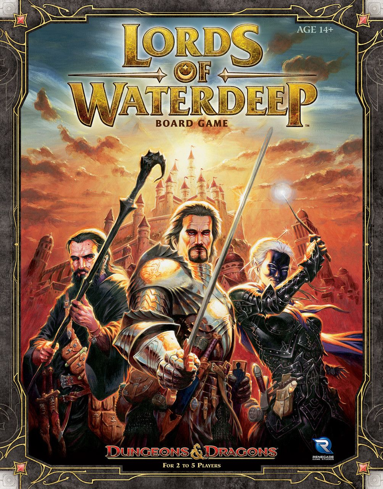
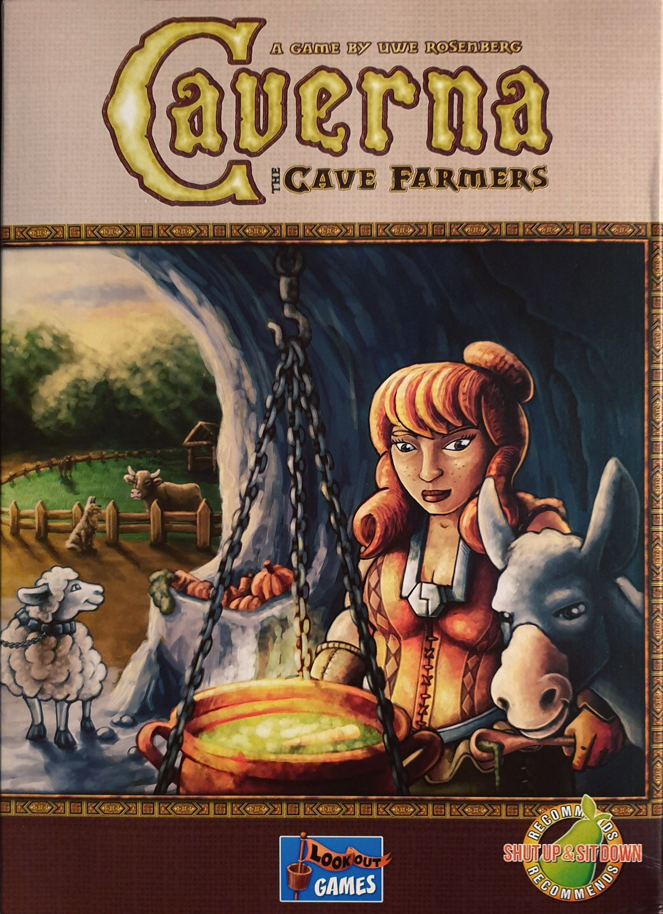
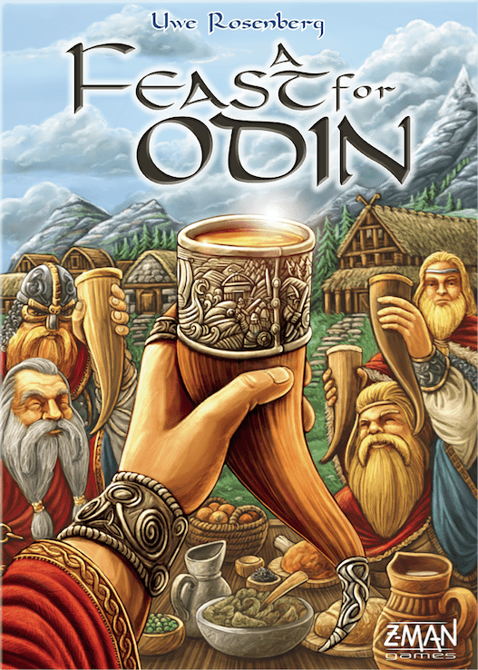

Worker placement is the backbone of modern euro gaming. The concept is simple — place your workers on action spaces, do the thing, block everyone else from doing the thing — but the genre spans an enormous range of depth. Some games you can teach in five minutes. Others require a spreadsheet and a prayer.

This complexity ladder takes you through six essential worker placement games, ordered by BGG weight from the friendliest gateway to the heaviest brain-burner. Whether you're looking for your first step into the genre or your next level up, there's a rung here for you.

---

## Rung 1: Lords of Waterdeep

**BGG Weight: 2.45** · 2–5 Players · 60–120 min · [BGG Page](https://boardgamegeek.com/boardgame/110327/lords-of-waterdeep)

The D&D theme is mostly a veneer — you're really collecting coloured cubes to fulfil contracts — but that's precisely why Lords of Waterdeep works as a gateway. The worker placement is as pure as it gets: place an agent, take the resources, complete quests for points.

**Why start here:** The rules overhead is minimal. You're never juggling complex supply chains or feeding your family at harvest. The Intrigue cards add just enough interaction to keep things spicy without overwhelming new players. At 3–4 players, the board tension is perfect.

**What it teaches:** The core lesson of worker placement — action denial. When someone takes the space you wanted, you learn to pivot. That's the foundational skill for everything above.

**Who it's for:** Complete beginners to the genre, D&D fans looking for a board game entry point, and groups who want a worker placement game that plays briskly at higher player counts.

**BGG Rating:** 7.73 · Rank #107

---

## Rung 2: Stone Age

**BGG Weight: 2.46** · 2–4 Players · 60–90 min · [BGG Page](https://boardgamegeek.com/boardgame/34635/stone-age)

Stone Age sits at almost the exact same weight as Lords of Waterdeep, but it introduces a critical new concept: dice-based resource gathering. You don't just take resources — you roll for them, and the number of workers you commit affects your odds. It's a gentle introduction to risk management within the worker placement framework.

**Why it's the next step:** Feeding your tribe is your first real ongoing obligation in a worker placement game. It's not punishing (you lose 10 points if you fail, which is survivable), but it teaches you to plan ahead rather than just opportunistically grabbing whatever looks good. The tool track and agriculture track add strategic layers without piling on rules.

**What it teaches:** Resource conversion chains, probability management, and the tension between investing in infrastructure versus grabbing points now. The hut-scoring system also introduces set collection as a secondary objective.

**Who it's for:** Players who've outgrown pure gateway games but aren't ready for spreadsheet-heavy euros. Excellent at 4 players, where the board gets delightfully tight.

**BGG Rating:** 7.51 · Rank #188

---

## Rung 3: Viticulture Essential Edition

**BGG Weight: 2.90** · 1–6 Players · 45–90 min · [BGG Page](https://boardgamegeek.com/boardgame/183394/viticulture-essential-edition)

This is where the genre starts to reveal its true depth. Viticulture has you running a vineyard through a full seasonal cycle: plant vines in spring, harvest grapes in autumn, age wine in your cellar, and fulfil orders for victory points. The seasonal structure gives the game a natural rhythm that makes the complexity feel intuitive rather than arbitrary.

**Why it belongs in the middle:** The Visitor cards are the wild card. They're powerful, occasionally game-swinging, and they give Viticulture a more tactical, reactive feel than the deterministic euros higher on this list. Some players love this; purists find it swingy. Either way, the cards ensure no two games feel the same.

**What it teaches:** Multi-step production chains (vine → grape → wine → order), tempo and timing (the Grande Worker that ignores blocking is a masterclass in when to push), and long-term planning across rounds. The wake-up track also introduces a fascinating trade-off between turn order and bonuses.

**Who it's for:** The player ready to graduate from "place worker, get stuff" to "place worker as part of a five-step plan." Also one of the best-looking games in the genre, with Beth Sobel's gorgeous art on every card.

**BGG Rating:** 7.96 · Rank #44

---

## Rung 4: Agricola

**BGG Weight: 3.64** · 1–5 Players · 30–150 min · [BGG Page](https://boardgamegeek.com/boardgame/31260/agricola)

Here's where the ladder gets steep. Agricola is the game that popularised worker placement, and nearly two decades later it's still one of the most demanding games in the genre. You're a subsistence farmer, and the game never lets you forget it. Every round, you must feed your family. Fail, and you take begging cards — a permanent scar on your final score.

**What makes it harder:** Agricola punishes you for what you *don't* do. Empty fields, missing animal types, unused rooms — they all cost negative points. You're not just building an engine; you're desperately trying to avoid having holes in your farm. The Occupation and Minor Improvement cards (over 300 in the base game) create a unique strategic puzzle every session, but they also mean you need to read, evaluate, and plan around a hand of cards from turn one.

**The jump from Viticulture:** Where Viticulture lets you lean on powerful Visitor cards to recover from a bad position, Agricola gives you almost no safety net. Every action matters. Every wasted turn hurts. The resource scarcity is real, and the feeding pressure creates a constant, low-grade anxiety that defines the entire experience.

**Who it's for:** Players who want to feel the weight of every decision. Agricola isn't cruel — it's demanding. The Family variant (no cards) is actually a very clean medium-weight game, so you can ease into it. But the full card game is where Agricola becomes Agricola.

**BGG Rating:** 7.86 · Rank #64

---

## Rung 5: Caverna: The Cave Farmers

**BGG Weight: 3.78** · 1–7 Players · 30–210 min · [BGG Page](https://boardgamegeek.com/boardgame/102794/caverna-the-cave-farmers)

Caverna is Agricola's bigger, friendlier, more sandbox-y sibling. Same designer (Uwe Rosenberg), same farming core, but with a crucial difference: no cards. Instead, you get 48 furnishing tiles available to everyone from the start. And you get caves to mine. And weapons for expeditions. And donkeys.

**Why it's heavier than Agricola (despite feeling friendlier):** The sheer option space. With no card-driven direction, you're staring at an enormous decision tree every turn. Agricola's cards narrow your focus ("build around this Occupation"); Caverna says "do whatever you want" and expects you to find your own path. The feeding is more forgiving, but the strategic demands are higher because nothing is guiding you.

**The paradox:** Many players find Caverna *easier* to play than Agricola because it's less punishing. But "easier to play" and "lighter" aren't the same thing. The weight comes from evaluating dozens of viable strategies every game, not from the pressure of survival.

**Who it's for:** Agricola veterans who want more freedom and less stress. Groups who bounced off Agricola's severity but still want deep worker placement. Families who appreciate that Caverna lets you build a cool-looking farm with caves and rubies rather than desperately scrounging for food.

**BGG Rating:** 7.92 · Rank #62

---

## Rung 6: A Feast for Odin

**BGG Weight: 3.87** · 1–4 Players · 30–120 min · [BGG Page](https://boardgamegeek.com/boardgame/177736/a-feast-for-odin)

The summit. Uwe Rosenberg's magnum opus has **61 action spaces** on the main board. Sixty-one. You'll use maybe six per round. The game is a Viking-themed sandbox where worker placement meets polyomino tile-laying, and the result is one of the deepest, most rewarding strategy games ever designed.

**What makes it the peak:** It's not just the number of actions — it's the columnar system. Actions in the first column cost one worker; the second column costs two, and so on up to four. More powerful actions require more workers, creating an inherent economy of labour. Meanwhile, your home board starts at -86 points, and your entire game is an exercise in covering those negative squares with goods tiles of specific types and colours.

**The puzzle:** A Feast for Odin is unique on this list because it combines worker placement with a spatial puzzle. You're not just gathering resources — you're fitting them together on your boards like Tetris pieces, following colour placement rules, trying to uncover income icons while covering penalty squares. It engages a completely different part of your brain simultaneously.

**Who it's for:** The player who has climbed every other rung and wants the ultimate sandbox. If you've played Agricola, loved Caverna's freedom, and wish the decision space were even larger — this is your game. It's also surprisingly excellent solo, with a well-designed Automa that makes it one of the top-rated solo games on BGG.

**BGG Rating:** 8.16 · Rank #27

---

## The Full Ladder at a Glance

| Rung | Game | BGG Weight | Players | Time | Rating |
|------|------|-----------|---------|------|--------|
| 1 | [Lords of Waterdeep](https://boardgamegeek.com/boardgame/110327/lords-of-waterdeep) | 2.45 | 2–5 | 60–120 min | 7.73 |
| 2 | [Stone Age](https://boardgamegeek.com/boardgame/34635/stone-age) | 2.46 | 2–4 | 60–90 min | 7.51 |
| 3 | [Viticulture Essential Edition](https://boardgamegeek.com/boardgame/183394/viticulture-essential-edition) | 2.90 | 1–6 | 45–90 min | 7.96 |
| 4 | [Agricola](https://boardgamegeek.com/boardgame/31260/agricola) | 3.64 | 1–5 | 30–150 min | 7.86 |
| 5 | [Caverna](https://boardgamegeek.com/boardgame/102794/caverna-the-cave-farmers) | 3.78 | 1–7 | 30–210 min | 7.92 |
| 6 | [A Feast for Odin](https://boardgamegeek.com/boardgame/177736/a-feast-for-odin) | 3.87 | 1–4 | 30–120 min | 8.16 |

---

## Where to Start?

If you've never played a worker placement game, **Lords of Waterdeep** or **Stone Age** are both excellent entry points — they're nearly identical in weight but offer quite different experiences (theme-driven contracts vs. dice-based resource gathering).

If you've already played a few and want to level up, **Viticulture Essential Edition** is the consensus sweet spot of the genre: deep enough to reward repeated plays, accessible enough that you can teach it in 15 minutes.

And if you're ready for the deep end? Skip straight to **Agricola**. The Family variant eases you in, the full game keeps you coming back for years, and the card variety means you'll never play the same game twice.

The top of the ladder — Caverna and A Feast for Odin — isn't "better." It's *different*. More sandbox, more freedom, more overwhelming. Some players prefer the knife-edge tension of Agricola to the open playground of Odin. That's not a complexity preference — it's a taste preference. And knowing which you prefer is the mark of a seasoned gamer.

*Happy climbing.* 🎲
