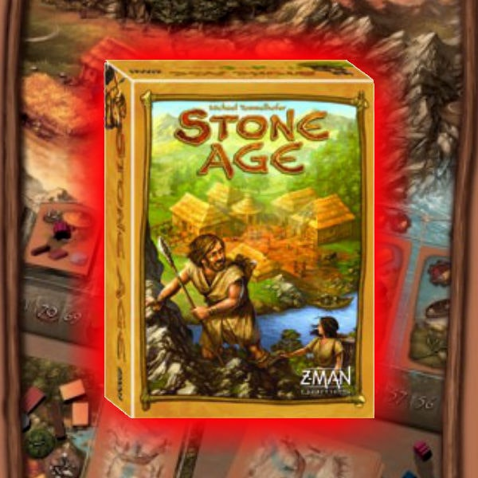
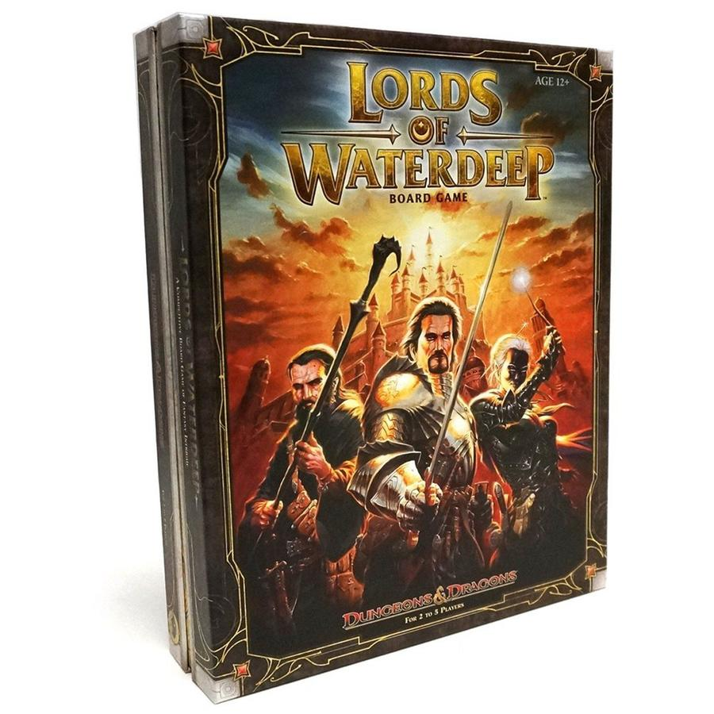
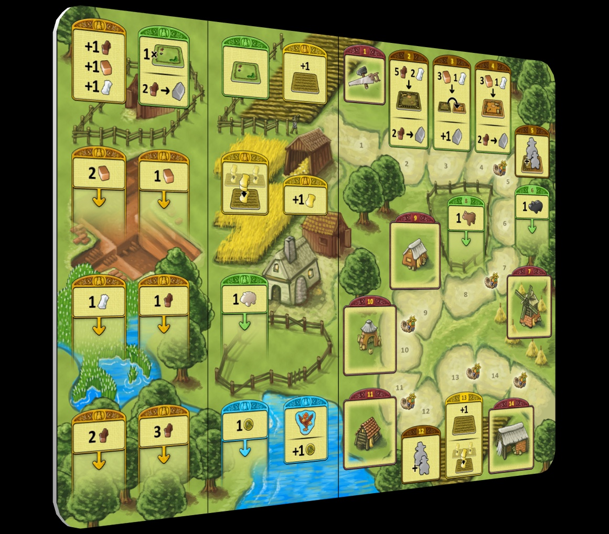

Worker placement is one of the cleanest journeys in board gaming. You put a worker on a space, take the action, and suddenly a whole genre opens up. Then the genre starts mutating. Blocking matters. Feeding matters. Timing matters. Your cute little placement puzzle turns into ten interlocking systems and a quiet panic attack by round three.

That is the fun.

If you want the natural path from "I just learned what a worker placement game is" to "I am now planning a Norse economy across six subsystems," this is the ladder I’d use. Not the only path. But a very good one. What follows is a progression through worker placement games that each teach a different skill: basic blocking, tableau building, player interaction, scarcity management, tight efficiency, temporal planning, and finally full-system overload.

## 🟢 Gateway: [Stone Age](https://boardgamegeek.com/boardgame/34635)  
**Weight:** 2.46/5  
**BGG Rating:** 7.51  
**Players:** 2-4  
**Time:** 60-90 min

If you are placing your first worker, start here.

[Stone Age](https://boardgamegeek.com/boardgame/34635) is still one of the best on-ramps because it teaches the grammar of worker placement without making you feel like you’ve enrolled in a night class. Put people on wood, brick, stone, gold, food, tools, buildings. Take the stuff. Build the thing. Feed your tribe. Simple. But not too simple.

That matters.

The big lesson [Stone Age](https://boardgamegeek.com/boardgame/34635) teaches is **basic blocking and resource conversion**. You stop seeing spaces as isolated actions and start seeing them as links in a chain. I need wood now so I can build that hut before you do. I need food because if I ignore feeding, the game stops being cute and starts slapping me. The dice on resource rolls add tension without turning the whole thing into chaos. Purists grumble about luck here. I get it. I also think the luck is doing useful work for newer players. It keeps the game lively and prevents the early sessions from becoming a spreadsheet.

This is the gateway pick because it feels like a real hobby game right away. Not a baby version. A real one.

**Skip to here if...** you’ve played modern gateway games already and want your first proper worker placement with just enough teeth.

**Common trap game to avoid jumping to too early:** [Agricola](https://boardgamegeek.com/boardgame/31260). People see "farming game" art and think cozy. It is not cozy. It is debt with sheep.

## When you’re ready to level up: add a tableau

Once basic placement feels natural, the next useful jump is learning that your workers are not just collecting things. They are supporting a longer plan.

## 🟡 Medium-Light: [Everdell](https://boardgamegeek.com/boardgame/199792)  
**Weight:** 2.83/5  
**BGG Rating:** 7.98  
**Players:** 1-4  
**Time:** 40-80 min

[Everdell](https://boardgamegeek.com/boardgame/199792) is the game a lot of people buy before they know whether they actually like worker placement, because the table presence is absurdly inviting. Giant cardboard tree. Woodland critters. Gorgeous cards. Then they sit down and realize there’s a pretty sharp efficiency puzzle under all that moss.

Good. That’s why it belongs here.

What [Everdell](https://boardgamegeek.com/boardgame/199792) adds over [Stone Age](https://boardgamegeek.com/boardgame/34635) is **persistent tableau effects**. Your workers aren’t just grabbing resources for immediate use anymore. You’re building a small engine. Cards stay in play. They combo. They discount other cards. They trigger value now and later. Suddenly the question is not just "what action do I take?" It’s "what kind of town am I building, and in what order do I build it so the whole thing hums?"

That shift is huge.

It teaches long-term planning without becoming miserable. You start seeing tempo. Sometimes taking a plain old resin space is correct because it unlocks the critter that unlocks the event that swings the season. There’s also a bit of card luck, and yes, the BGG forums have had that argument for years. Fair enough. But as a progression step, [Everdell](https://boardgamegeek.com/boardgame/199792) is excellent because it asks you to think beyond the board.

The reason this step matters so much is that a lot of players hit worker placement and treat every turn like a one-turn math problem. Take best space. Gain stuff. Spend stuff. Done. [Everdell](https://boardgamegeek.com/boardgame/199792) breaks that habit. Your city asks you to think in arcs. A green production card now might look modest, but if it fires again next season and also discounts the critter you want later, that early "boring" play can be the best turn of the game.

That is a real jump in skill.

A common beginner mistake in [Everdell](https://boardgamegeek.com/boardgame/199792) is chasing every shiny card in the meadow because the art is charming and the effects sound fun. That road leads to a city full of disconnected nonsense. The better approach is to identify a thread early. Maybe you have construction cards that let you play matching critters for free. Maybe your opening hand nudges you toward production chains. Maybe an event is clearly within reach if you build around it. Once you see that line, your workers stop being generic gatherers and start acting like support staff for your tableau plan.

The seasonal structure helps teach another subtle lesson: timing your own progression separately from everyone else’s. In [Stone Age](https://boardgamegeek.com/boardgame/34635), the round rhythm is shared and obvious. In [Everdell](https://boardgamegeek.com/boardgame/199792), players move into new seasons at different times, and that creates weird, wonderful tension. Sometimes advancing early is great because it refreshes workers and restarts your engine. Sometimes it’s a trap because you’re giving opponents access to spaces while your city still isn’t ready to capitalize.

One tactical tip that newer players often miss: don’t overvalue worker spaces compared to card play. In [Everdell](https://boardgamegeek.com/boardgame/199792), a single well-timed card can outproduce several routine placements. If a card gives recurring resources, discounts, or extra card flow, that is often your real acceleration. The board gets you moving. The tableau wins the race.

My only warning: people often bounce off it because the cute art lies to them. This is not a sleepy woodland greeting card. It’s an optimization game in a cardigan.

**Best for this level:** the player who already gets placement and now wants engine-building layered on top.

## When you’re ready to level up: make interaction matter

Once you can build your own engine, the next lesson is learning that the table is not just background noise. Other players are part of the puzzle.

## 🟡 Medium: [Lords of Waterdeep](https://boardgamegeek.com/boardgame/110327)  
**Weight:** 2.45/5  
**BGG Rating:** 7.73  
**Players:** 2-5  
**Time:** 60-120 min

A lot of people would put [Lords of Waterdeep](https://boardgamegeek.com/boardgame/110327) before [Everdell](https://boardgamegeek.com/boardgame/199792) because its weight is technically lower. I’m not doing that. Weight numbers don’t always capture what a game teaches well. [Lords of Waterdeep](https://boardgamegeek.com/boardgame/110327) is where I like players to learn that worker placement is not just about building your own machine. It’s about living with other people at the table.

And occasionally ruining their day.

The new idea here is **intrigue cards for swingy bonuses, hidden scoring, and disruption**. You’re still placing agents to collect cubes and convert them into quests, but now there’s a layer of indirect nastiness. Mandatory quests. Surprise bonuses. Hidden lord goals steering your strategy. This is where newer players learn one of the central truths of the genre: that perfect plan you mapped out? Someone else wanted that space too.

I still love how clean [Lords of Waterdeep](https://boardgamegeek.com/boardgame/110327) feels. The D&D theme is pasted on pretty hard. Let’s not pretend orange cubes feel like clerics in your hand. But [mechanically](/posts/mechanic-deep-dive-hidden-roles/), it sings. It teaches blocking, timing, and reading opponents without burying you in edge cases. Every turn feels understandable. Every denied space feels personal.

This is also the point on the ladder where you learn the difference between "interactive" and "chaotic." [Lords of Waterdeep](https://boardgamegeek.com/boardgame/110327) is not a game where someone flips the table and your strategy dies. The interaction is cleaner than that. Sharper, too. You know the spaces that matter. You know the quests people are likely building toward. You know that if someone takes the building spot or the exact cubes you needed, your turn just got worse. That kind of pressure is the genre’s bread and butter.

The brilliance of [Lords of Waterdeep](https://boardgamegeek.com/boardgame/110327) is how readable that interaction is. If another player is clearly hoarding fighters and rogues, you can infer the kinds of quests they want. If a building enters play that efficiently produces the resources they need, you have a decision to make. Use it yourself and help them by paying the owner bonus? Ignore it and hope they lose tempo? Those are great middleweight decisions because they force you to care about the table without requiring a twelve-step prediction tree.

Intrigue cards are where the game gets its smirk. New players tend to hold them too long, waiting for a perfect moment that never comes. Use them. The extra resources, bonus placements, or scoring swings are there to create tempo, and tempo matters more than theoretical value sitting dead in your hand. Yes, mandatory quests can feel rude. That is the point. They teach resilience. Can your plan absorb a setback, or was it too narrow to begin with?

Compared with [Everdell](https://boardgamegeek.com/boardgame/199792), the interaction here is more public and more transactional. In [Everdell](https://boardgamegeek.com/boardgame/199792), another player can incidentally wreck your hopes by taking a key card or event. In [Lords of Waterdeep](https://boardgamegeek.com/boardgame/110327), the conflict is more direct and easier to parse. That makes it a better teaching tool for players who need to internalize that worker placement is not multiplayer solitaire with wooden pawns. It is polite competition with a dagger under the table.

That’s worker placement.

**Skip to here if...** you already know basic placement games and want one that introduces player interaction without becoming a bloodbath.

**Common trap game:** [Viticulture] gets this recommendation a lot in the hobby, and I get why, but if your goal is a clean genre ladder, [Lords of Waterdeep](https://boardgamegeek.com/boardgame/110327) teaches conflict and denial more directly.

## When you’re ready to level up: feel real pressure

After interaction comes a harsher lesson: sometimes the board is not merely competitive. Sometimes it is actively starving you.

## 🔴 Heavy-ish: [Agricola](https://boardgamegeek.com/boardgame/31260)  
**Weight:** 3.64/5  
**BGG Rating:** 7.86  
**Players:** 1-5  
**Time:** 30-150 min

This is where the genre stops smiling politely.

[Agricola](https://boardgamegeek.com/boardgame/31260) is the best next step if you want to understand why worker placement fans get a little wild-eyed talking about tension. You start with almost nothing. Two actions. Barely any room. Constant need. Then the game keeps opening new action spaces while demanding that you feed your family at harvest. Every round feels like five emergencies in a coat.

The key concept it introduces is **action escalation and family growth under pressure**. More spaces appear. More options open up. You can grow your family to get more actions, but that means more mouths to feed. That little push-pull is brilliant. Brutal, too. Some games make you feel clever because they hand you toys. [Agricola](https://boardgamegeek.com/boardgame/31260) makes you earn every potato.

This is also where players learn to value denial at a deeper level. In [Stone Age](https://boardgamegeek.com/boardgame/34635), missing a space stings. In [Agricola](https://boardgamegeek.com/boardgame/31260), missing a space can collapse your entire round. The occupation and improvement cards add texture and asymmetry, but even without getting fancy, the base game is a masterclass in meaningful scarcity.

What separates [Agricola](https://boardgamegeek.com/boardgame/31260) from the earlier rungs is that the game weaponizes scarcity in a way few designs do. In [Stone Age](https://boardgamegeek.com/boardgame/34635), food is a maintenance cost. In [Agricola](https://boardgamegeek.com/boardgame/31260), food is a recurring threat hanging over every plan you make. You are not just asking, "What scores points?" You are asking, "What keeps this whole farm from falling apart before harvest?" That shift from optimization to survival is exactly why this game belongs here.

A classic [Agricola](https://boardgamegeek.com/boardgame/31260) experience goes like this: you desperately need wood for rooms, reed for renovation, grain for food, and a family growth space before someone else grabs it. You can maybe do two of those things. Maybe. That tension creates painful but meaningful turns. You are constantly choosing which problem to solve and which problem to leave smoldering for later. Great worker placement games create tradeoffs. [Agricola](https://boardgamegeek.com/boardgame/31260) makes those tradeoffs feel personal.

One huge tactical lesson here is that growth is not automatically good. Newer players see the family growth action and lunge for it because more workers means more actions. True. It also means another person to feed, more pressure on your farm, and often a warped next round if you chased growth before your economy could support it. The best [Agricola](https://boardgamegeek.com/boardgame/31260) turns are often the ones where you prepare for growth one round earlier than feels necessary. Build the room. Secure the food engine. Then expand.

It also teaches board reading at a much higher level. Accumulation spaces get stronger the longer they sit, so the question is not only what you need, but whether you can afford to wait. If three wood is useful now but six wood next round unlocks a much bigger turn, patience can be worth more than urgency. Unless your opponent sees the same thing. Which they usually do.

Compared with [Lords of Waterdeep](https://boardgamegeek.com/boardgame/110327), where missed opportunities are annoying, [Agricola](https://boardgamegeek.com/boardgame/31260) makes every blocked space feel like a tiny agricultural tragedy. That is why people adore it. And why some bounce off it hard. It does not flatter you. It teaches you.

Some people hate that pressure. I love it. Not every game needs to be relaxing. Sometimes I want a design that looks me dead in the eye and says, "No, you cannot do everything."

**Best game at this level:** easily [Agricola](https://boardgamegeek.com/boardgame/31260). If you click with it, a whole wing of the hobby opens.

## When you’re ready to level up: optimize every single move

Once you can handle scarcity, the next challenge is precision. Not just surviving pressure, but extracting maximum value from almost no room for error.

## 🔴 Heavy: [The White Castle](https://boardgamegeek.com/boardgame/371942)  
**Weight:** 3.05/5  
**BGG Rating:** 7.98  
**Players:** 1-4  
**Time:** 80 min

If [Agricola](https://boardgamegeek.com/boardgame/31260) is about pressure, [The White Castle](https://boardgamegeek.com/boardgame/371942) is about compression.

This game is mean in a very specific way. It gives you very few turns, then asks you to make each one sing. The new lesson is **limited placements with dice drafting**. You’re not just choosing a worker spot. You’re drafting a die that affects cost, timing, and the sequence of actions that follows. One placement can cascade into several effects if you set it up right. If you don’t, the game is over before your engine has even cleared its throat.

That short-round structure is what makes it such a good bridge upward. You start thinking in tighter lines. Not broad strategy. Surgical sequencing. Can I use this die to place here, trigger that lantern, move this courtier, line up that visitor, and turn one action into four pieces of progress? That’s the headspace.

It also helps that [The White Castle](https://boardgamegeek.com/boardgame/371942) plays in 80 minutes. You get a very thinky, very modern efficiency challenge without an all-night commitment. The downside is obvious. This game can feel unforgiving fast. New players sometimes finish and say, "Wait, that was it?" Yes. That was it. You had nine-ish moments to matter. Welcome to the party.

What [The White Castle](https://boardgamegeek.com/boardgame/371942) does better than almost any game in this range is expose waste. You feel every inefficient turn immediately. There is nowhere to hide because the game is so short and your placements are so limited. In a looser euro, you can recover from a mediocre round by building a stronger engine later. Here, later arrives almost instantly. If one die placement produces only a small gain with no follow-up, you usually feel that failure all the way to final scoring.

That sounds punishing, but it is also why the game is such a strong teacher.

The big tactical habit to build here is planning backward from scoring opportunities rather than forward from convenient actions. Newer players often draft a die because it seems flexible right now. Better players draft with a destination in mind. Which courtier track am I trying to advance? Which lantern action am I setting up? Which resource conversion lets this placement unlock the next one? The game rewards turns that create structure, not just income.

A useful comparison is [Agricola](https://boardgamegeek.com/boardgame/31260). In [Agricola](https://boardgamegeek.com/boardgame/31260), pressure comes from too many needs and not enough actions. In [The White Castle](https://boardgamegeek.com/boardgame/371942), pressure comes from the fact that almost every action can be good if sequenced properly, and mediocre if taken in isolation. That is a different kind of difficulty. Less survival, more precision. You are not trying to patch holes in a farm. You are trying to stitch together a perfect little machine before the game ends.

This is also where players learn to respect action density. One of the strongest feelings in [The White Castle](https://boardgamegeek.com/boardgame/371942) is taking a turn that appears simple on the surface, then watching it trigger movement, resources, influence, and setup for another score. That is the standard you should be chasing. Not flashy turns. Dense turns.

If your group likes tight euros, this section of the ladder is often where the obsession starts. One play becomes three, because everybody sees the lines they missed. The board is compact, but the post-game discussion is not.

**Skip to here if...** you like eurogames already and want a tighter, sharper worker placement puzzle than [Agricola](https://boardgamegeek.com/boardgame/31260).

## When you’re ready to level up: think in time, not just space

At this point, the natural next step is a game that changes not just what actions are available, but when they mature.

## ⚫ Expert: [Tzolk'in](https://boardgamegeek.com/boardgame/126163)  
**Weight:** 3.66/5  
**BGG Rating:** 7.85  
**Players:** 2-4  
**Time:** 90 min

[Tzolk'in](https://boardgamegeek.com/boardgame/126163) is one of those designs that makes people lean over the table and grin the first time the gears start moving. Because yes, the gears are the gimmick. But they are also absolutely the game.

The new concept is **temporal worker progression via gears**. You place workers on rotating cogs, and the longer they stay, the stronger the eventual action becomes. So now worker placement stops being purely spatial. It becomes temporal. You are planning not just where to go, but when to leave. Pull too early and you waste potential. Wait too long and your whole economy jams up.

That’s brilliant.

It also creates one of the most satisfying forms of tension in the genre. You can see your future action growing stronger every round, but the board state is shifting, your food needs are changing, and your opponents are messing with timing windows. [Tzolk'in](https://boardgamegeek.com/boardgame/126163) rewards patience, but not blind patience. You need flexibility. You need to read the gears. You need to accept that your plan from two rounds ago might now be nonsense.

This is a real step up. Not because the rules are impossible, but because the decision space is demanding in a way that many midweight games never are.

**Common trap game:** people jump straight from gateway worker placement to [Tzolk'in](https://boardgamegeek.com/boardgame/126163) because the table looks cool. Then halfway through they realize they are scheduling labor on giant cardboard clocks and quietly unravel.

## When you’re ready to level up: run the whole empire

Once timing itself becomes part of the puzzle, there is really only one place left to go: the giant, sprawling version where every lesson on the ladder shows up at once.

## ⚫ Expert+: [A Feast for Odin](https://boardgamegeek.com/boardgame/177736)  
**Weight:** 3.87/5  
**BGG Rating:** 8.16  
**Players:** 1-4  
**Time:** 30-120 min

This is the summit.

[A Feast for Odin](https://boardgamegeek.com/boardgame/177736) takes everything worker placement has taught you and dumps it onto the table in one glorious excess of options. Sixty-one action spaces. Hunting, raiding, crafting, whaling, emigrating, breeding, trading, exploring, pillaging, and then a polyomino puzzle on top because apparently Uwe Rosenberg woke up and chose abundance.

The new lesson is **massive action arrays and polyomino optimization**. You are no longer learning the genre. You are managing a civilization-scale web of possibilities. The worker placement board is huge, but it’s not random sprawl. It’s a map of tradeoffs. Cheap actions now versus stronger actions later. Income versus territory. Raw goods versus upgraded goods. Every decision spills into the tile-laying board, where covering negative spaces and arranging goods becomes its own economy puzzle.

And somehow, despite all that, the game flows.

That is what makes [A Feast for Odin](https://boardgamegeek.com/boardgame/177736) special. It looks ridiculous. It is ridiculous. But after the teach, the turns make sense. You pick a lane, then another lane opens, then your board starts telling the story of your strategy. Maybe you become an exploration monster. Maybe you breed animals. Maybe you fill your sheds with upgraded goods like a Viking logistics manager. The scale is intimidating, yes. The pleasure is real.

If you love worker placement, this is one of the genre’s great rewards.

If you don’t love worker placement yet, do not start here. Reddit is full of "I bought this because it was highly ranked and now it lives on my shelf like a threat" posts for a reason.

## So where should you jump in?

- Start with [Stone Age](https://boardgamegeek.com/boardgame/34635) if you’re new to the mechanism.
- Start with [Everdell](https://boardgamegeek.com/boardgame/199792) if you like card combos and want your worker placement prettier and more engine-driven.
- Start with [Lords of Waterdeep](https://boardgamegeek.com/boardgame/110327) if you want cleaner interaction and classic hobby-game structure.
- Start with [Agricola](https://boardgamegeek.com/boardgame/31260) if you already know euros and want the genre to punch back.
- Start with [The White Castle](https://boardgamegeek.com/boardgame/371942) if you want a modern, compact efficiency test.
- Aim for [Tzolk'in](https://boardgamegeek.com/boardgame/126163) when timing itself sounds like the puzzle.
- Climb to [A Feast for Odin](https://boardgamegeek.com/boardgame/177736) when you’re ready for the full monster.

Worker placement is such a satisfying ladder because every step teaches a real new skill. First you learn to take actions and convert resources. Then you learn to build a tableau. Then to deal with interaction and denial. Then to survive scarcity. Then to optimize tiny windows. Then to think in time as well as space. Then, finally, to manage an entire sprawling system.

And somewhere along the way, placing one little wooden worker starts to feel enormous.

Where are you on the ladder?