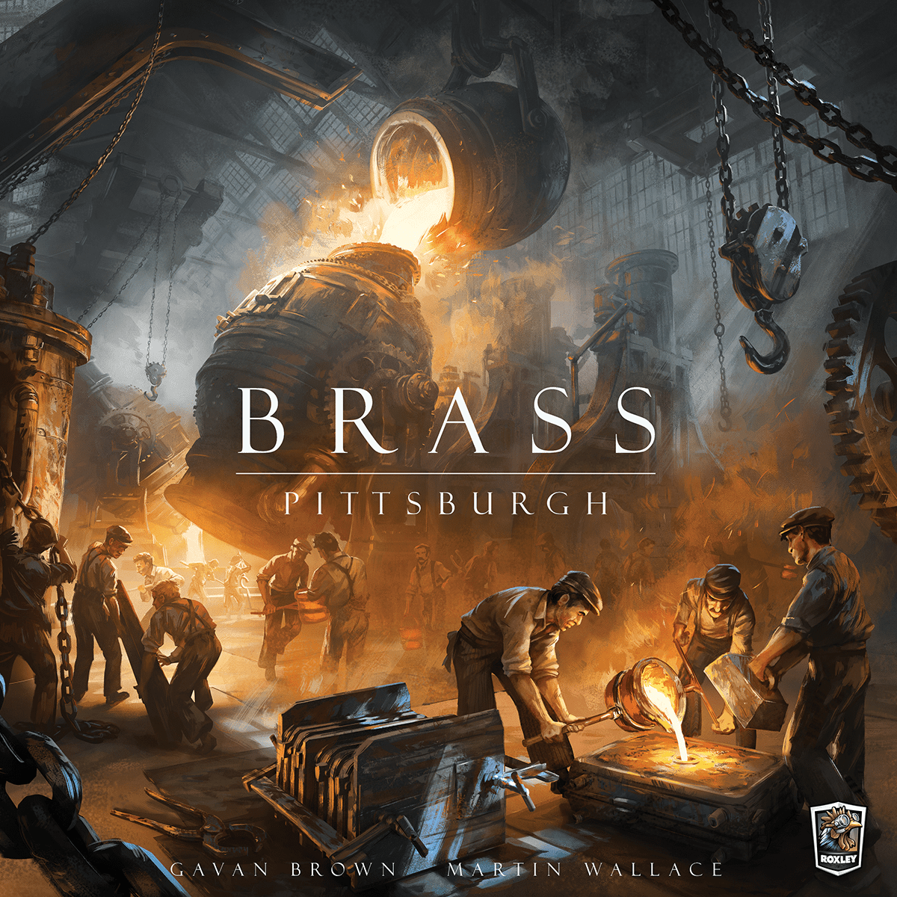
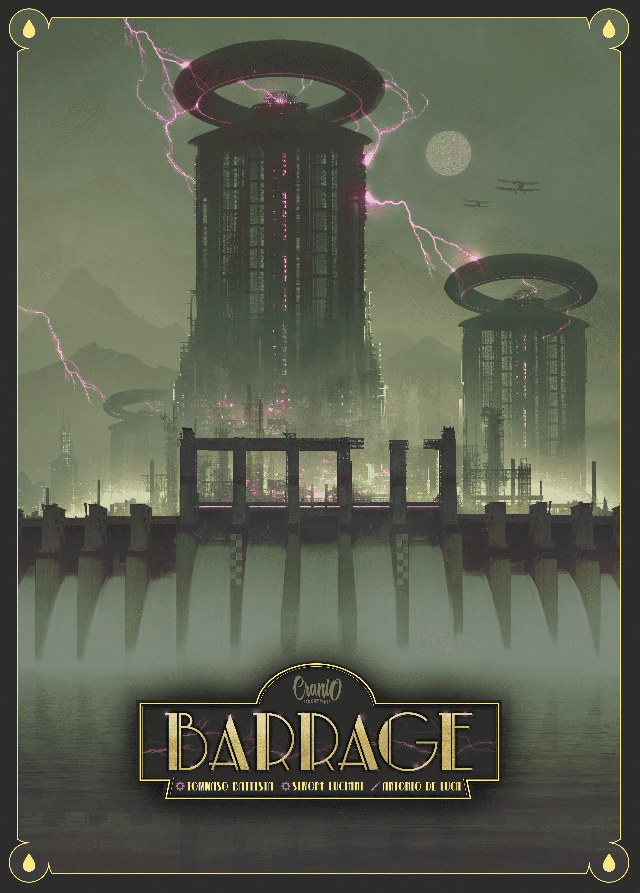
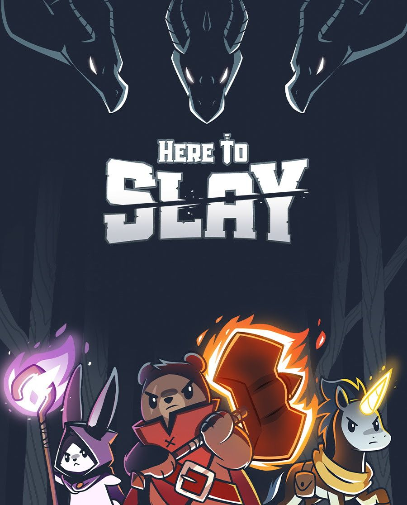
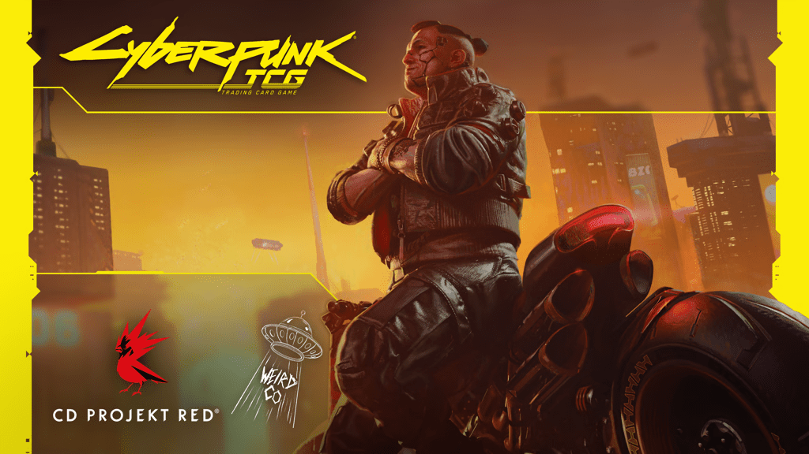

April continues to be one of the most stacked crowdfunding months in recent memory. Between a record-shattering TCG, a new entry in the Brass dynasty, and expansions for some of the hobby's most beloved titles, there's a lot competing for your wallet this week. Here's what you need to know.

## 🔥 The Big One: [Brass: Pittsburgh](https://gamefound.com/en/projects/roxley/brass-pittsburgh)

**Platform:** [Gamefound](https://gamefound.com/en/projects/roxley/brass-pittsburgh) | **Pledge:** $79+ | **Status:** Over €4.2 million raised | **Ending: TODAY (April 12th)**

[Brass: Pittsburgh](https://boardgamegeek.com/boardgame/452264/brass-pittsburgh) is the third standalone game built on Martin Wallace's acclaimed Brass system. After [Brass: Lancashire](https://boardgamegeek.com/boardgame/28720/brass-lancashire) (the original) and [Brass: Birmingham](https://boardgamegeek.com/boardgame/224517/brass-birmingham) (which currently holds the #1 spot on BGG's overall rankings), Pittsburgh has enormous shoes to fill.

The good news: it isn't just a reskin. Pittsburgh introduces new mechanics while maintaining the strategic depth and economic tension that made the Brass name synonymous with heavy euro gaming. The Gamefound campaign has been a juggernaut, blasting past €4.2 million with a Collector's Edition that's generated serious buzz.

**Why you should care:** If you love economic strategy games, this is likely the crowdfunding event of the spring. The Brass system is one of the most respected designs in the hobby, and a third entry with genuinely new mechanics (not just a new map) is worth paying attention to. The campaign ends **today**, so if you're interested, don't sleep on it.

**BGG stats (early):** 2–4 players | Weight: 3.70/5 | Rating: 6.9 (limited votes so far)

---

## 🚀 [Arcs: Beyond the Reach](https://www.kickstarter.com/projects/colewehrle/arcs-beyond-the-reach)

**Platform:** [Kickstarter](https://www.kickstarter.com/projects/colewehrle/arcs-beyond-the-reach) | **Status:** Funded and surging | **Pledge:** Varies by add-on

Cole Wehrle's [Arcs](https://boardgamegeek.com/boardgame/359871/arcs) was already one of the most acclaimed games of 2024 — a lean, mean space opera that distilled grand strategy into tight 90-minute sessions. Now *Beyond the Reach* brings two new expansions: **Lost Vaults** and **Faded Leaders**, plus the option for a fifth player.

Lost Vaults adds new edifices, a bastion for defensive play, and the Stone Road connecting previously inaccessible planets. Faded Leaders introduces new leader abilities and special pieces that alter the core rules. There are also two new campaign expansions — *Beyond the Reach* and *Halls of Power* — with 36 new fates.

**Why you should care:** Arcs sits at #104 on BGG with an 8.0 rating and a dedicated community that considers it one of the best asymmetric strategy games ever made. If you already own the base game, this is almost certainly a must-back. If you don't, the campaign also includes base game reprints.

**BGG stats:** 2–4 players (5 with expansion) | 60–120 min | Weight: 3.44/5 | Rating: 8.0 | Rank: #104

---

## ⚡ [Barrage: Earned Authority](https://www.kickstarter.com/projects/craniocreations/barrage-the-legendary-box)

**Platform:** [Kickstarter](https://www.kickstarter.com/projects/craniocreations/barrage-the-legendary-box) | **Status:** Live and funded

[Barrage](https://boardgamegeek.com/boardgame/251247/barrage) is one of those games that inspires genuine passion. The hydroelectric dam-building euro from Cranio Creations sits at #40 on BGG with an 8.1 rating and a weight of 4.1 — firmly in heavy territory. It's a game about building dams, channelling water, and wrestling with one of the most punishing action wheels in modern gaming.

*Earned Authority* is a new expansion that continues to build on the base game's foundation. If you've bounced off Barrage before, this probably won't change your mind. But if you're one of the faithful who consider it peak euro design, this is exactly what you've been waiting for.

**Why you should care:** Barrage is a modern classic that doesn't get the casual conversation it deserves because it's *hard*. It rewards mastery like few other games. An expansion for a game this well-regarded is always worth watching.

**BGG stats:** 1–4 players | 90–180 min | Weight: 4.11/5 | Rating: 8.1 | Rank: #40

---

## 🗡️ [Here to Slay: Dungeons](https://gamefound.com/en/projects/unstable-games/here-to-slay-dungeons)

**Platform:** [Gamefound](https://gamefound.com/en/projects/unstable-games/here-to-slay-dungeons) | **Status:** Over €3.2 million raised

Unstable Games (the studio behind Unstable Unicorns) has taken their hit card game [Here to Slay](https://boardgamegeek.com/boardgame/299252/here-to-slay) and turned it into a full cooperative dungeon crawler. *Dungeons* keeps the charming anthropomorphic art style but completely shifts genres — you're now exploring dungeons, fighting bosses, and building character abilities.

The campaign offers three standalone-but-combinable base boxes, each with four heroes, six ability schools, two modular dungeons, and four bosses. Mix and match across sets for variety. There's also a Gamefound-exclusive Deluxe Edition.

**Why you should care:** At €3.2 million and climbing, the community has spoken. This is gateway-level dungeon crawling with gorgeous art and a massive amount of content. If you have younger gamers in your life (or just love the aesthetic), this one's delivering serious value per dollar.

**BGG stats:** 2–6 players | 30–60 min | Weight: 1.68/5 | Rating: 6.9 | Rank: #1,506

---

## 🎨 The Indie Pick: Concrete Canvas

**Platform:** Kickstarter | **Status:** Funded (€24K+)
**Campaign:** Search "Concrete Canvas" on Kickstarter

[Concrete Canvas](https://boardgamegeek.com/boardgame/456102/concrete-canvas) is a street art-themed game where you move through New York City collecting spray cans and tagging different boroughs to earn "street cred." It's a resource management and spatial movement game with a genuinely fresh theme — you don't see many board games about graffiti culture.

The game ends when someone runs out of legal moves, and scoring is based on artwork placed and majority control in city districts. It's lighter than most of the campaigns on this list, sitting at a weight of 2.0, making it a solid mid-weight gateway game.

**Why you should care:** Original themes get attention. In a crowdfunding landscape drowning in fantasy and sci-fi, a game about street art in NYC stands out. The art direction looks stellar, and at 30–45 minutes it hits that sweet spot for weeknight gaming.

**BGG stats:** 2–4 players | 30–45 min | Weight: 2.0/5 | Rating: 8.8 (very limited votes)

---

## 💀 Record Breaker: Cyberpunk Trading Card Game

**Platform:** Kickstarter | **Status:** Over €14 million - most funded TCG campaign ever

We'd be remiss not to mention the elephant in the room. The [Cyberpunk Trading Card Game](https://boardgamegeek.com/boardgame/463317/cyberpunk-trading-card-game) from WeirdCo (in partnership with CD Projekt Red) has become the most funded tabletop game campaign **of all time** on Kickstarter, blowing past €14 million. It combines classic TCG mechanics with handmade artworks set in the Cyberpunk 2077 universe.

This isn't strictly a board game, but it's impossible to ignore. First deliveries are planned for Q3 2026.

**Why you should care (or not):** TCGs are their own beast. If you're a Cyberpunk fan or TCG collector, this is historic. If you're a board gamer who doesn't touch TCGs, you can safely admire from a distance. Either way, €14 million is €14 million.

**BGG stats:** 2 players | 15–30 min | Weight: N/A (too new)

---

## 🎲 Also On Our Radar

- **Slay the Spire: The Board Game — Downfall** (Kickstarter, ended April 9th) — Reprint and expansion for the [#17 game on BGG](https://boardgamegeek.com/boardgame/338960/slay-the-spire-the-board-game). If you missed the original campaign, the late pledge may still be available.
- **Gods & Mortals** (Gamefound) — A tactical mythological game from Wolff Designa that's pulled in €95K+.
- **Arribada & Seagrass** (Kickstarter) — Two charming travel-friendly games from Bitewing Games. Perfect for holidays.
- **The Great Sea & Towers of Sifnos** (Kickstarter) — Garphill Games' latest dual-game campaign set in ancient Greece. [The Great Sea](https://boardgamegeek.com/boardgame/453699/the-great-sea) already sits at a solid 7.5 on BGG.
- **Goa** (Gamefound) — Quined Games is bringing back this classic auction and resource management game with an upgraded edition.

---

## The Bottom Line

If you can only back one thing this week, **Brass: Pittsburgh** is the campaign to watch — but it ends today, so move fast. For long-term value, **Arcs: Beyond the Reach** is expanding one of the best strategy games of the decade. And if you want something lighter and more original, **Concrete Canvas** is the sleeper pick.

Your wallet has our sympathies. Happy backing.

---

*Prices and funding totals accurate as of April 12, 2026. Always check campaign pages for current information. The Dice Drop is not affiliated with any of these campaigns.*
