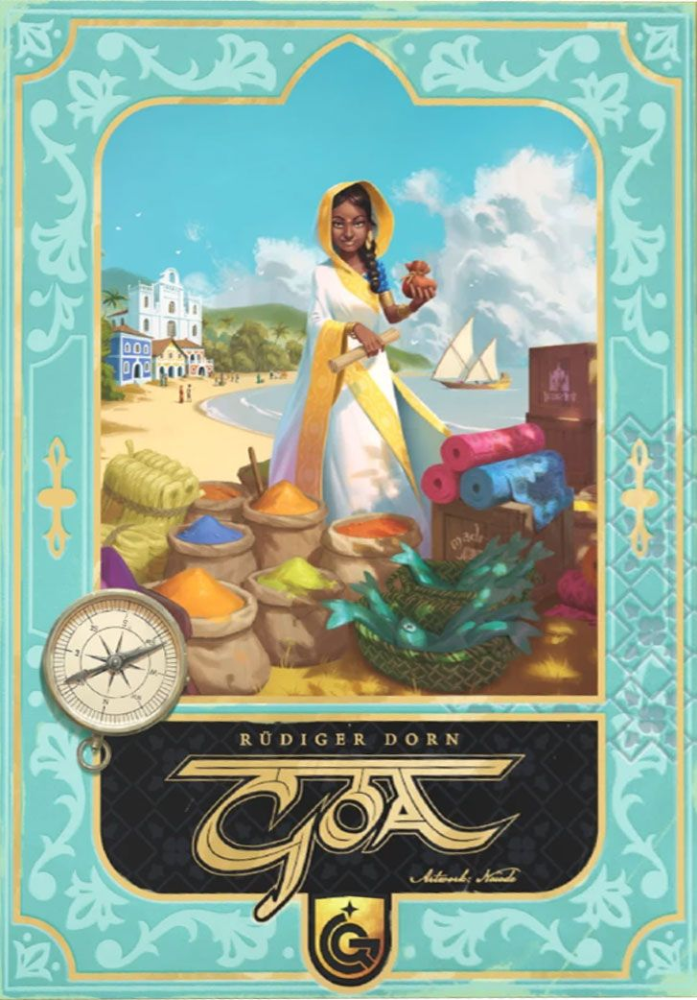
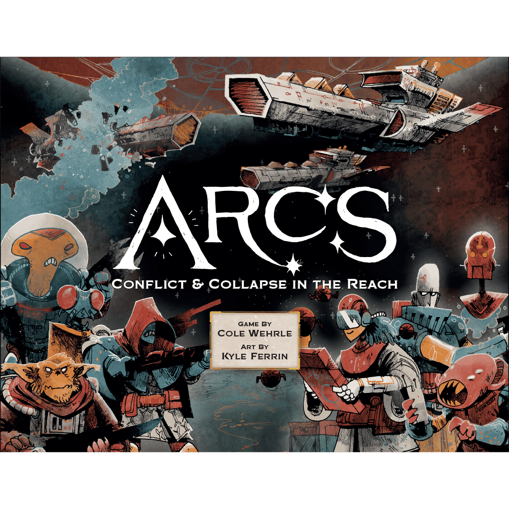
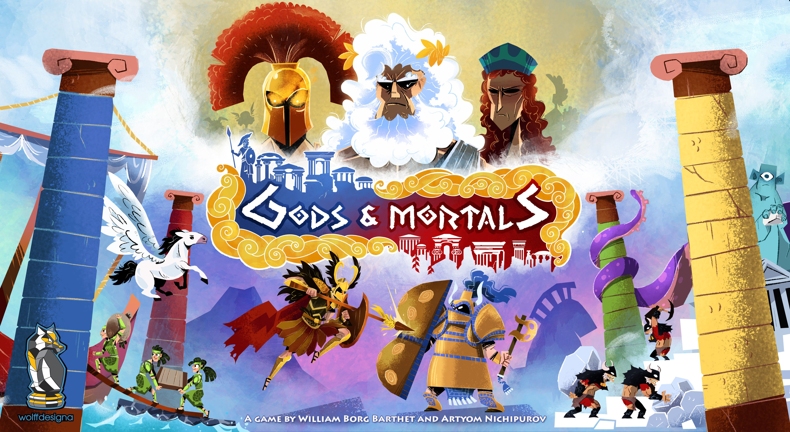
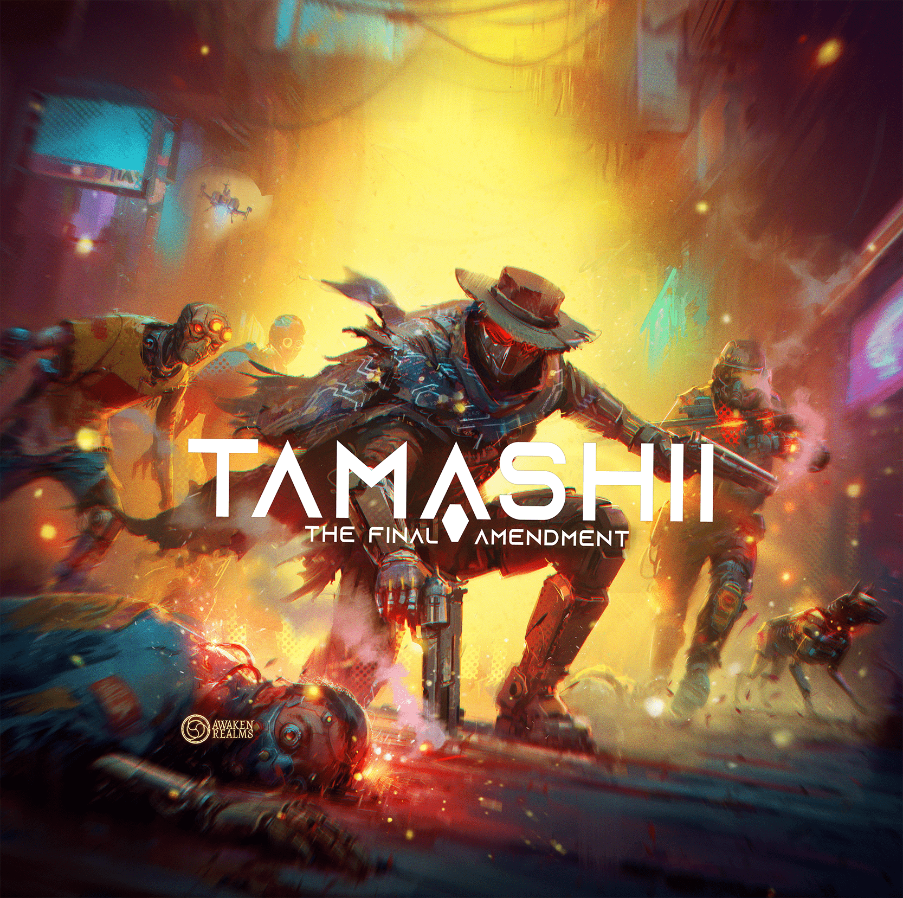
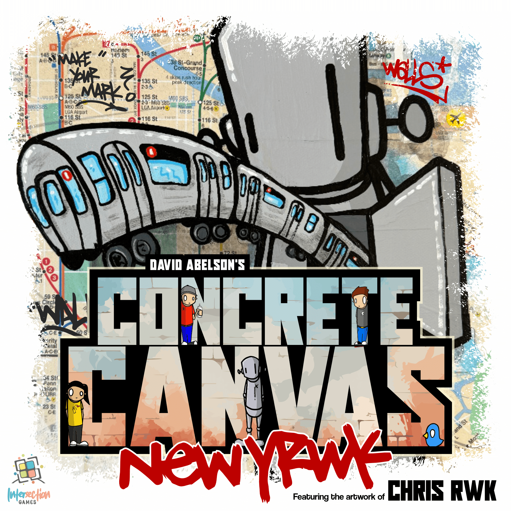

Spring 2026 is shaping up to be one of the busiest crowdfunding seasons in recent memory. Between Gamefound campaigns breaking records and Kickstarter buzzing with everything from deluxe reprints to fresh indie designs, there's almost too much to track.

We've cut through the noise. Here are five campaigns across Kickstarter and Gamefound that deserve a closer look — whether you're a euro devotee, a co-op crawler, or just someone who appreciates gorgeous art on cardboard.

## 1. Goa — A Modern Classic Reborn

**Platform:** Gamefound | **Pledge:** €69+ | **Ends:** April 26, 2026 | **Status:** Funded

If you've never played [Goa](https://boardgamegeek.com/boardgame/9216), here's the pitch: it's a 2004 eurogame by Rüdiger Dorn that somehow flew under the radar of mainstream hype while quietly earning the devotion of every auction-mechanism enthusiast on the planet. Twenty-two years later, Quined Games is giving it the deluxe treatment it deserves.

The game sits at a **7.55 rating** on BGG with nearly 12,000 ratings and a weight of **3.36/5** — firmly in medium-heavy territory. It plays **2–4 players** in about **90 minutes**.

### Why It Matters

Goa's auction system is unlike anything else in the genre. Players don't just bid on goods — they bid on the *right to auction specific tiles*, creating a meta-layer of negotiation and positioning that makes every round feel like a chess match played with money. Combine that with a tech-tree advancement system where every upgrade path feels equally tempting, and you've got a game that rewards repeated plays without ever feeling stale.

The new edition promises updated art, improved components, and quality-of-life tweaks while preserving the mechanical elegance that made the original a cornerstone of eurogaming. At €69, it's a fair price for a game that's been out of print and commanding premium resale prices for years.

**Our take:** If you like auction games, engine builders, or just impeccably designed euros, this is the campaign to watch this week. Goa's reputation is earned.

---

## 2. Arcs: Beyond the Reach

**Platform:** Kickstarter | **Pledge:** Varies | **Status:** Funded

Cole Wehrle's [Arcs](https://boardgamegeek.com/boardgame/359871) was one of the most talked-about releases of 2024, and for good reason. A political sci-fi game of interstellar ambition that plays in 90–120 minutes with **2–4 players**, it currently holds an **8.01 rating** on BGG with over 16,700 ratings and a weight of **3.44/5**. It's ranked **#103 overall** — and climbing.

Now *Beyond the Reach*, a new expansion campaign, is live on Kickstarter alongside a refreshed base game printing. This is your chance to get in on the ground floor if you missed the first run, or to expand an already excellent game.

### Why It Matters

Arcs does something genuinely rare: it makes a grand political space opera feel *lean*. Where other 4X-adjacent games bloat into four-hour commitments, Arcs delivers shifting alliances, dramatic betrayals, and sweeping narrative arcs in under two hours. The card-driven action system forces impossible choices every turn — do you follow suit to stay in the round, or break away to seize an opportunity that might not come again?

The *Blighted Reach* campaign expansion already added a legacy-style narrative layer. *Beyond the Reach* promises to push even further into uncharted space — literally and mechanically.

**Our take:** If you have even a passing interest in political games, asymmetric powers, or Cole Wehrle's design philosophy, back this immediately. Arcs is a modern classic in the making.

---

## 3. Gods & Mortals — Ancient Greece, Divine Scheming

**Platform:** Gamefound | **Pledge:** €59+ | **Ends:** April 25, 2026 | **Status:** Funded

Step into the sandals of an Olympian deity in [Gods & Mortals](https://boardgamegeek.com/boardgame/447306), a strategy game where **2–4 players** raise armies, erect temples, spark divine conflicts, and unleash unique powers to outmanoeuvre rival gods. It plays in about **80 minutes** with a weight of **3.0/5** — solidly medium.

### Why It Matters

The ancient Greek theme is well-trodden in board gaming, but Gods & Mortals takes a different angle. Rather than putting you in the sandals of a mortal hero, you *are* the god — manipulating mortals as pawns in your celestial power plays. Each deity has unique abilities that shape your strategic approach, creating genuine asymmetry without the overhead of learning entirely different rule sets.

The production values look strong, the mechanical framework blends area control with action selection in a way that feels fresh, and Board&Dice have a solid track record with medium-weight strategy games.

**Our take:** A promising entry in the mythological strategy space. The 80-minute playtime is a sweet spot — long enough for real strategic depth, short enough to actually hit the table on a weeknight. Worth watching if you enjoy games like Cyclades or Kemet but want something with a tighter footprint.

---

## 4. Tamashii: The Final Amendment — Post-Apocalyptic Co-op Returns

**Platform:** Gamefound | **Pledge:** Varies | **Status:** Over 1000% Funded

Awaken Realms is back with [Tamashii: The Final Amendment](https://boardgamegeek.com/boardgame/465818), a standalone sequel to *Tamashii: Chronicle of Ascend*. The original earned an impressive **8.06 rating** on BGG with a weight of **3.0/5**, delivering a narrative-driven cooperative experience for **1–4 players** set in a world ruled by artificial intelligence.

The sequel takes everything that worked — branching storylines, tactical combat, atmosphere thick enough to cut with a knife — and pushes it further with new characters, new scenarios, and expanded campaign content. Estimated playtime is around **180 minutes** per session.

### Why It Matters

Awaken Realms has become synonymous with ambitious, story-first crowdfunding campaigns, and their track record for delivering on promises is among the best in the industry. *Chronicle of Ascend* earned its reputation through genuinely meaningful narrative choices and a combat system that rewards tactical thinking over dice-chucking luck.

*The Final Amendment* is already past 1000% funding, which means stretch goals are piling up and the final product will likely be significantly more than what's on the campaign page today.

**Our take:** If you're into narrative co-op games and want something with more bite than your average dungeon crawler, Tamashii has earned the hype. The funding numbers speak for themselves — but more importantly, the first game's BGG rating tells you this isn't just marketing. It's a genuinely good game getting a sequel.

---

## 5. Concrete Canvas — Street Art Meets Strategy

**Platform:** Kickstarter | **Pledge:** Varies | **Status:** Funded

[Concrete Canvas](https://boardgamegeek.com/boardgame/456102) is the fresh indie pick this week — a game about spray-painting your way to street art glory across a city map. **2–4 players** compete to claim districts through artistic influence, collecting spray cans and leaving their mark in a race for neighbourhood dominance. It plays in about **45 minutes** with a weight of **2.0/5**, making it the most accessible game on this list.

### Why It Matters

Sometimes you want a game that does something *different*. Concrete Canvas stands out from the crowdfunding pack through sheer personality — the art style is vibrant and distinctive, the theme is genuinely underexplored in board gaming, and the 45-minute playtime means it can serve as either a gateway game or a satisfying weeknight filler.

The campaign is still building momentum at around €32,000 in funding, making it the underdog on this list. But underdog campaigns often deliver the most passionate, focused final products — the designers aren't managing a sprawling empire of stretch goals, they're making one tight game and making it well.

**Our take:** If you're tired of yet another medieval/sci-fi/fantasy theme and want something with genuine urban style, Concrete Canvas is worth a look. It's the kind of game that could become a sleeper hit.

---

## The Big Picture

This week's campaigns span the full spectrum — from a 22-year-old euro classic finally getting the deluxe reprint it deserves (Goa) to a fresh indie design with a theme we've never seen before (Concrete Canvas). The Arcs expansion is a must-watch for anyone who cares about the bleeding edge of strategy game design, while Tamashii and Gods & Mortals cater to co-op and competitive mythological cravings respectively.

A few other campaigns worth keeping an eye on that didn't make our main list:

- **Drop Drive: Second Sun** (Kickstarter, ends April 23) — a solo/co-op space exploration expansion
- **Oakspire: The Builders of the Sunleaf Grove** (Kickstarter) — cosy woodland engine building for 1–5 players
- **Zombicide: Dead Men Tales** (Gamefound, launching now) — fantasy pirate Zombicide from Asmodee

As always, do your homework before backing. Read the campaign pages, check BGG for community discussion, and never pledge more than you're comfortable losing. Crowdfunding is investing in a promise, not buying a product.

Happy backing. 🎲
