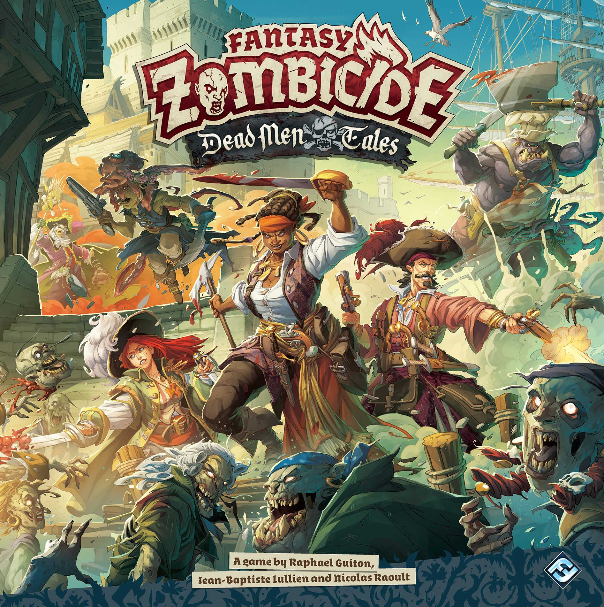
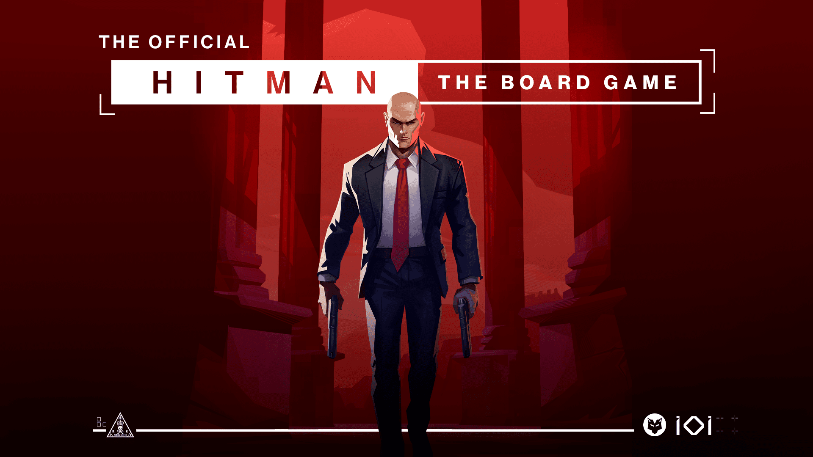

The crowdfunding platforms haven't been this busy in months. Between a massive franchise changing hands, a video game adaptation making waves, and a litRPG series smashing records on BackerKit, there's a lot to unpack. Here's what caught our eye this week.

## 🏴‍☠️ Zombicide: Dead Men Tales — The Pirate Zombicide We've Been Waiting For

**Platform:** Gamefound | **Launched:** April 22 | **Ends:** ~May 12 | **Pledge:** $110+ (Davy Jones' Plunder)

This is a big deal for multiple reasons. [Zombicide: Dead Men Tales](https://gamefound.com/en/projects/asmodee/dead-men-tales) isn't just a new core box — it's the **first Zombicide game under Fantasy Flight Games and Asmodee's banner** after they acquired the IP from CMON. And they've kicked things off with the pirate theme the community has been begging for since roughly the Black Plague days.

### What's New

Dead Men Tales is part of the Fantasy Zombicide line (1–6 players, cooperative), but the pirate setting brings a stack of genuinely fresh mechanics:

- **Sea zones** — survivors can't cross them, but zombies can. Because of course they can
- **Rope swinging** — spend one action to swing across three zones in any direction, leaping over buildings, water, and zombie hordes. The designers officially encourage muttering pirate shanties while doing this
- **Grom** — a fantasy booze mechanic. Visit taverns, stockpile Grom tokens, then spend them for devastating bonus attacks. Get too greedy and your survivor passes out mid-combat
- **Dual equipment decks** — Governor (precise, tactical) and Pirate (chaotic, pistol-heavy) gear found in different zones
- **Treasure hunting** — almost every tile has a buried "X" that can spawn epic loot, events, or fresh threats
- **Moral compass** — your in-game decisions push you toward gold-obsessed scallywag or heroic noble heart, affecting quest objectives and the campaign finale

The campaign funded in **32 minutes** and had already crossed $700K+ within the first 48 hours. Stretch goals are flying — at last count, 12 of 14 were unlocked, including exclusive survivors, special zombie types, and classic zombie cards. There's also a tie-in RPG (Plaguebearer) available as an add-on.

### Should You Back It?

If you're already in the Zombicide ecosystem, this is a no-brainer — the pirate theme is fresh enough to justify the buy, and the new mechanics (Grom, ropes, sea zones) genuinely change how the game plays. For newcomers, the $110 core pledge with all stretch goals is solid value, though you'll need patience — delivery is estimated for **June 2027**.

The lingering question: compatibility with older Fantasy Zombicide content. FFG has promised backwards compatibility for survivors and said they'll offer conversion packs for dashboards and decks. Early signs are positive.

---

## 🎯 Hitman: The Board Game — Silent Assassin on Your Table

**Platform:** Gamefound | **Launched:** April 30 | **Pledge:** TBC

[Hitman: The Board Game](https://gamefound.com/en/projects/mood-publishing/hitman-the-board-game) just launched two days ago from MOOD Publishing (the folks behind Valheim and Deep Rock Galactic board games), developed in close collaboration with IO Interactive.

### The Pitch

A **1–4 player competitive game** where everyone plays as assassins for hire competing to eliminate the same target. That competitive twist is the key differentiator — this isn't a cooperative experience. You're infiltrating exotic locations, improvising with disguises and tools, and trying to deliver the killing blow before your rivals do. Or sabotaging their plans entirely.

### What We Know

- **4 modular maps** with **8 different targets** — mix and match for near-endless replayability
- Each agent is a distinct character from the Hitman universe with unique abilities
- Paris with Viktor Novikov confirmed as one of the scenarios (classic Hitman fans will approve)
- Standees in the base game, with a **miniature upgrade** available through the campaign
- The sandbox design emphasises improvisation and creativity over scripted solutions

MOOD Publishing has a decent track record with video game adaptations, and IO Interactive's direct involvement suggests this isn't a lazy license slap. The early previews from content creators have been cautiously positive, highlighting the competitive tension and the modular sandbox design.

### Our Take

This one's intriguing but wait-and-see. The competitive assassination concept is genuinely novel for board games, and the Hitman license is a great fit. But video game adaptations live and die on whether the tabletop version captures the *feeling* of the original — and we haven't seen enough to know if Hitman's signature "creative chaos" translates to cardboard. Follow the campaign and watch the preview videos before pledging.

---

## 🏆 Dungeon Crawler Carl RPG & Unstoppable — The $9M Monster

**Platform:** BackerKit | **Launched:** April 14 | **Ends:** May 15 | **Pledge:** From $50+

This is the crowdfunding story of 2026 so far. [Dungeon Crawler Carl](https://www.backerkit.com/c/projects/renegade-game-studios/dungeon-crawler-carl-rpg-unstoppable) from Renegade Game Studios launched with **65,000+ followers** (the most-followed TTRPG campaign ever), funded in under a minute, and has currently raised over **$8.9 million** — making it one of the biggest tabletop RPG campaigns in crowdfunding history.

### What You Get

It's actually **two games in one campaign**:

1. **Dungeon Crawler Carl RPG** — a full skill-based TTRPG set in the brutal, televised World Dungeon from Matt Dinniman's bestselling book series. 30+ playable races, massive class roster, progression that mirrors the books (you unlock race and class choices after surviving to floor three)
2. **Dungeon Crawler Carl: Unstoppable** — a solo/co-op card-crafting deck-builder with 280+ cards, four difficulty levels, and campaign/arcade modes

The RPG's standout mechanic is **skills improve through use** — every check gets marked, then you roll after the session to see if the rank increases. That's a lovely old-school touch that rewards actually playing your character rather than min-maxing at creation.

### The Numbers

- **$8.9M+ raised** (goal was $250K)
- **37,000+ backers**
- Already surpassed Draw Steel's BackerKit record ($4.6M)
- Trending toward $12M+ by campaign end
- Delivery target: **October 2026**

For context, the all-time records are Avatar Legends ($9.5M) and Cosmere RPG ($15.1M). Dungeon Crawler Carl is on pace to challenge Avatar for second place.

### Should You Back It?

If you're a DCC book fan, this is a must-back. The campaign is loaded with physical goodies (dice, miniatures, GM screen, character journal) and the dual-game structure means there's something for both RPG groups and solo players. The October 2026 delivery target is ambitious but Renegade has a solid fulfilment history.

If you're not familiar with the books — this is still a well-designed TTRPG with an unusually creative premise (reality TV dungeon survival). The Starter Set at a lower price point is a sensible entry.

---

## 🤖 Tamashii: The Final Amendment — Cyberpunk Co-op Returns

**Platform:** Gamefound | **Live Now** | **Pledge:** €59+ (Standard) / €164 (All-in)

Awaken Realms is back with [Tamashii: The Final Amendment](https://gamefound.com/en/projects/awaken-realms/tamashi2), the standalone sequel to Tamashii: Chronicle of Ascend. This is a **1–4 player cooperative adventure game** set in a cyberpunk dystopia where a rogue AI has returned and humanity must stop it — again.

### What Makes It Interesting

- **Unique programming mechanic** — arrange data patterns on your player board and "execute code" to attack enemies or augment yourself. It's genuinely different from anything else on the market
- **Body-swapping** — jump between different body shells mid-game, fundamentally changing your capabilities
- **Semi-campaign scenarios** with high replayability — no fixed story path, branching decisions, unlockable content
- **Two-way compatibility** with the first game — some miniatures and body types work in both games

The campaign funded in **under 9 minutes** and has already raised over €500K. Delivery is estimated for **May 2027**.

### Our Take

Awaken Realms campaigns always deliver impressive production value, and the programming mechanic genuinely sets Tamashii apart from the crowded dungeon-crawler space. The cyberpunk theme is a refreshing break from fantasy. If you played the first game and wanted more depth and polish, this looks like exactly that. Newcomers can jump in — it's standalone — but the niche theme and heavy mechanics mean this is firmly aimed at experienced gamers.

---

## 👀 Quick Hits — Other Campaigns Worth Watching

- **Earth Express** (Kickstarter) — A streamlined version of the hit game Earth from Inside Up Games. Paired with **Behind the Lens**, a photography-themed tile-laying game. Already well-funded
- **Bloodwork: The Reckoning** (Gamefound) — Dark fantasy co-op for 1–4 players from I Demo Games. Grid-based tactical combat with a branching dual-faction campaign. A ground-up rebuild after the original campaign didn't land. Worth watching if you like Gloomhaven-style tactical puzzles with a darker aesthetic
- **Yotei** (Kickstarter) — Quietly generating buzz. Keep an eye on this one
- **Claustrophobia 1692** (Gamefound, Devir) — A revival of the classic two-player asymmetric dungeon game, now with a witch trial theme

---

## The Bottom Line

This is one of the strongest crowdfunding months we've seen in a while. The standouts:

- **Best Value:** Zombicide: Dead Men Tales — $110 for a massive co-op box with all stretch goals is hard to beat
- **Most Exciting:** Dungeon Crawler Carl — the numbers speak for themselves, and the dual-game approach is smart
- **Most Innovative:** Tamashii: The Final Amendment — that programming mechanic is genuinely unlike anything else
- **Best Watch-and-Wait:** Hitman — great concept, needs more gameplay evidence

Whatever you back, remember the golden rule of crowdfunding: **never pledge money you can't afford to wait 12–18 months to see again.** Estimated delivery dates are exactly that — estimates.

Happy backing! 🎲
