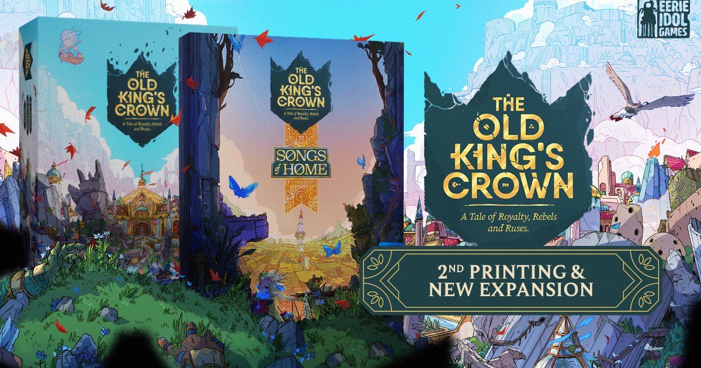
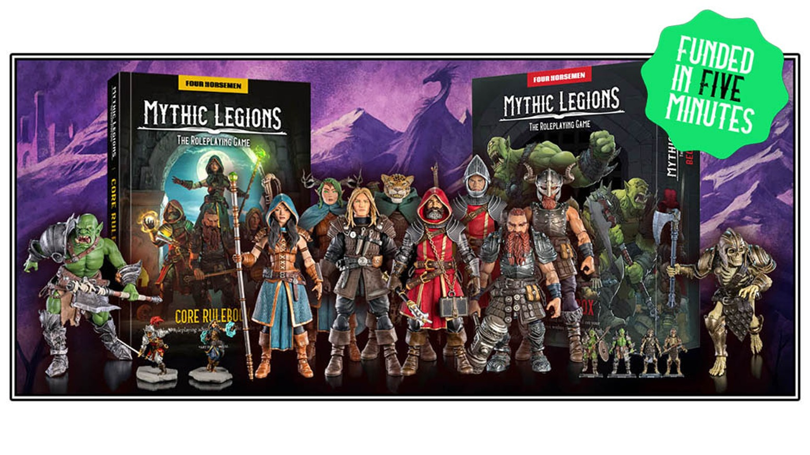
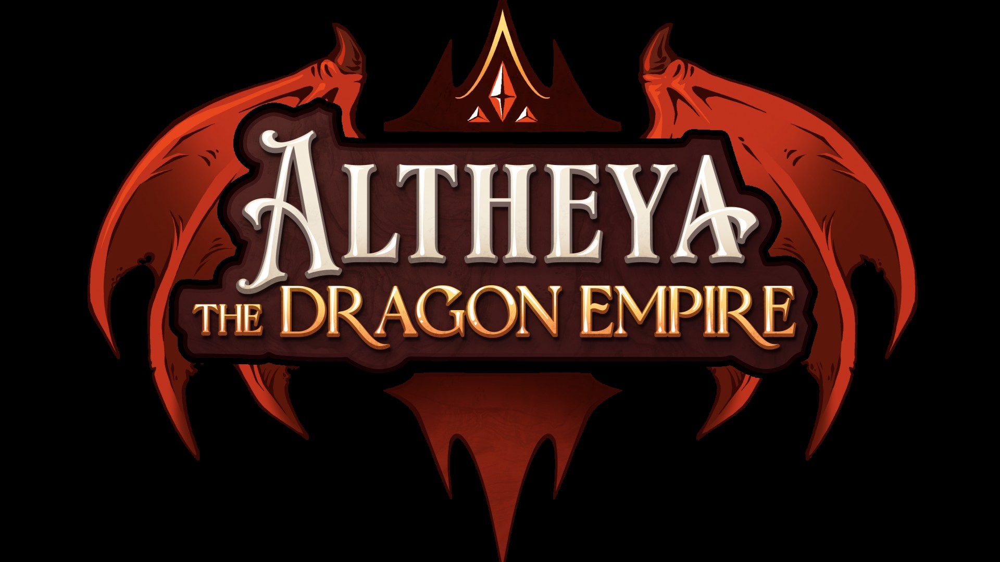
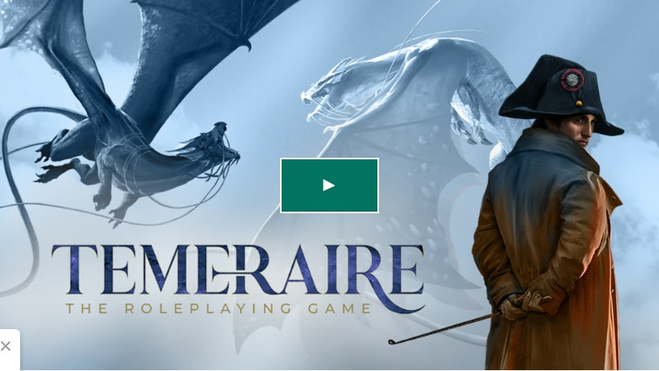
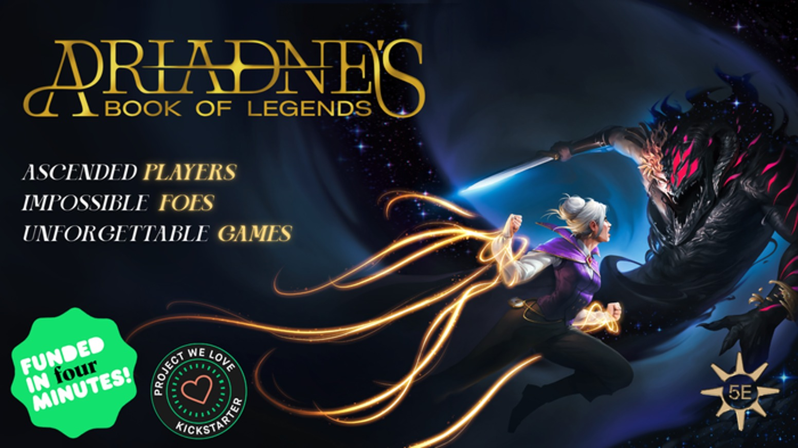
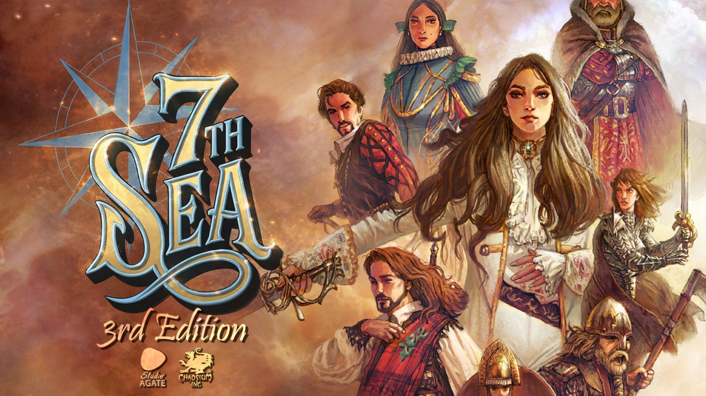
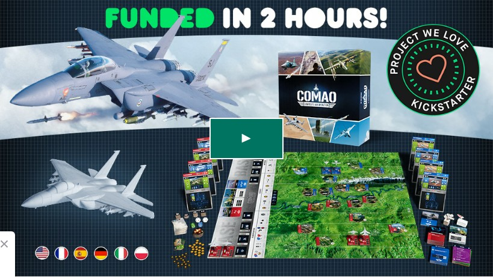

Welcome back to Crowdfunding Watch. It's mid-March 2026 and the tabletop funding scene is absolutely stacked  -  a card game has smashed past £2 million, RPGs are dominating the charts, and one tactical wargame is sneaking up on everyone. Here's what's live, what's worth your money, and what to think twice about.

### Headliner: The Old King's Crown  -  Second Printing & Songs of Home Expansion

[The Old King's Crown](https://gamefound.com/en/projects/eerie-idol-games/the-old-kings-crown) is this week's undisputed champion. Sitting at a staggering **£2.1M** from over **15,800 backers** at 4,227% funded with 11 days still to go, Eerie Idol Games' gorgeous asymmetric card game has become one of the biggest tabletop crowdfunding stories of 2026.

The base game is a two-player asymmetric game of bluffing, hand management, and area control set in a crumbling fantasy kingdom  -  mechanically elegant, visually stunning, and deeply replayable. This second printing comes bundled with the new **Songs of Home** expansion, which adds meaningful depth without bloating the design. If you missed the first campaign, this is your window  -  and the numbers make it clear that word-of-mouth has been doing all the heavy lifting. For fans of tight two-player card games with strong thematic atmosphere, this is unmissable.

**Verdict**: Back it  -  the numbers speak for themselves, and the game deserves every penny.

---

### Mythic Legions: The Roleplaying Game

[Mythic Legions: The Roleplaying Game](https://www.kickstarter.com/projects/fourhorsemen/mythic-legions-the-role-playing-game) has cleared **$865K** from over 2,100 backers with roughly 15 days still on the clock. Four Horsemen Studios built their reputation on some of the finest fantasy action figures in the hobby, and now they're translating that rich lore into a full tabletop RPG.

The world of Mythoss is already fleshed out across years of figure releases: warring factions, ancient evils, deep mythology. Backers aren't buying a promise  -  they're buying a game set in a world they already love. The question is whether Four Horsemen can deliver the mechanical depth a proper RPG demands, or whether this ends up as a beautiful setting propped up by thin rules. Given the talent they've brought in to design the system, there's genuine reason for optimism.

**Verdict**: Back it  -  the lore is rock solid and the momentum is real.

---

### Altheya: The Dragon Empire (5E Setting)

[Altheya: The Dragon Empire](https://www.kickstarter.com/projects/rollandplaypress/high-rollers-altheya-the-dragon-empire) is sitting at **£580K** with a 2,320% funding rate. This is the official 5E setting from the High Rollers actual-play crew, and their fanbase has showed up in force.

The setting is a high-fantasy world built around draconic politics, ancient empires, and the kind of sweeping fantasy geography that makes DMs salivate. Even if you've never watched High Rollers, you get a complete, well-developed campaign world that goes well beyond your typical "here's a map and some factions" sourcebook. The 5E market is crowded, yes  -  but Altheya has the creative pedigree and production ambition to stand apart.

**Verdict**: Back it  -  phenomenal value whether you're a High Rollers fan or just hungry for a new 5E world.

---

### Temeraire: The Roleplaying Game

[Temeraire: The Roleplaying Game](https://www.kickstarter.com/projects/magpiegames/temeraire-the-roleplaying-game) has crossed **$403K** with ~15 days remaining. Based on Naomi Novik's beloved Napoleonic Wars + dragons novel series, this is Magpie Games doing what they do best: taking a beloved IP and building a game that captures its soul.

The Temeraire novels are full of aerial dragon combat, diplomatic intrigue, and the tension of loyalty vs conscience  -  all of which lend themselves brilliantly to RPG play. Magpie's track record (Masks, Avatar Legends, Wanderhome) gives real confidence the mechanical design will match the setting's emotional register. If you've read even one of the books, this is a near-automatic pledge.

**Verdict**: Back it, especially if you know the source material.

---

### Ariadne's Book of Legends  -  D&D Beyond 20th Level

[Ariadne's Book of Legends](https://www.kickstarter.com/projects/codexofstrings/book-of-legends) has pulled in **$280K** tackling one of 5E's most frustrating gaps: what happens after level 20? Epic-tier D&D has always been underserved by official material, and this campaign goes deep  -  new mythic abilities, legendary boss frameworks, realm-shaking encounters, and enough content to run a full epic campaign from 20th level onward.

The demand is clearly there. Players who've run campaigns that outlive the official ruleset's scope need solutions, and until WotC properly addresses this, third-party offerings are the only answer. The preview material looks solid, with structured design philosophy that prevents epic-tier play from devolving into chaos.

**Verdict**: Back it if your campaigns go long  -  this fills a real gap.

---

### 7th Sea 3rd Edition

[7th Sea 3rd Edition](https://www.kickstarter.com/projects/agate/7th-sea-ttrpg-a-new-journey) brings back one of the great swashbuckling RPGs. 7th Sea's Théah  -  a Renaissance-Europe-inspired world of pirates, secret societies, sorcery, and political intrigue  -  has a devoted fanbase, and this third edition is being handled by Agate, who have a strong track record with atmospheric RPG design.

The previous 2nd Edition Kickstarter (by a different team) had a famously troubled rollout, so caution is understandable. Agate is a different outfit with a different approach, and the preview material suggests they've learned from the property's history. If you love nautical adventure and swashbuckling heroics in a world that's distinctly *not* generic fantasy, 7th Sea's setting is one of the richest out there.

**Verdict**: Cautiously optimistic  -  the setting is excellent, watch the campaign updates closely.

---

### Hidden Gem: COMAO - The Game of Modern Air Warfare

[COMAO](https://www.kickstarter.com/projects/jocus-editions/comao-the-ultimate-tactical-air-combat-board-game) is this week's under-the-radar pick. While everyone else is funding dragons and RPG sourcebooks, COMAO is delivering something genuinely different: a deep tactical simulation of modern combined-arms air operations, with real doctrine, realistic threat environments, and the kind of crunchy decision-making that wargame enthusiasts dream about.

The production values look strong, the ruleset has been developed with serious attention to authenticity, and for anyone fatigued by fantasy-adjacent everything on the crowdfunding charts, this is a breath of jet-fuelled fresh air. It won't be for everyone  -  the learning curve will be steep and the audience is niche  -  but within that niche, COMAO looks exceptional.

**Verdict**: Back it if you love wargames or want something genuinely unlike anything else on your shelf.

---

### Crowdfunding Health Check

The Old King's Crown absolutely dominates this week with its £2.1M haul  -  proof that a great game with strong word-of-mouth can compete with the biggest names in crowdfunding, even on Gamefound rather than Kickstarter. Beyond that, this week leans heavily RPG: four of our seven featured campaigns are tabletop roleplaying products, reflecting a broader shift in where crowdfunding energy is flowing in 2026.

The 5E supplemental market keeps producing hits (Altheya, Ariadne's Book of Legends), while established IP adaptations (Temeraire, 7th Sea, Mythic Legions) continue to dominate the upper funding tiers. Budget accordingly  -  there's a lot competing for your money right now  -  and as always, only pledge what you'd be happy to lose if a campaign stumbles post-funding.

