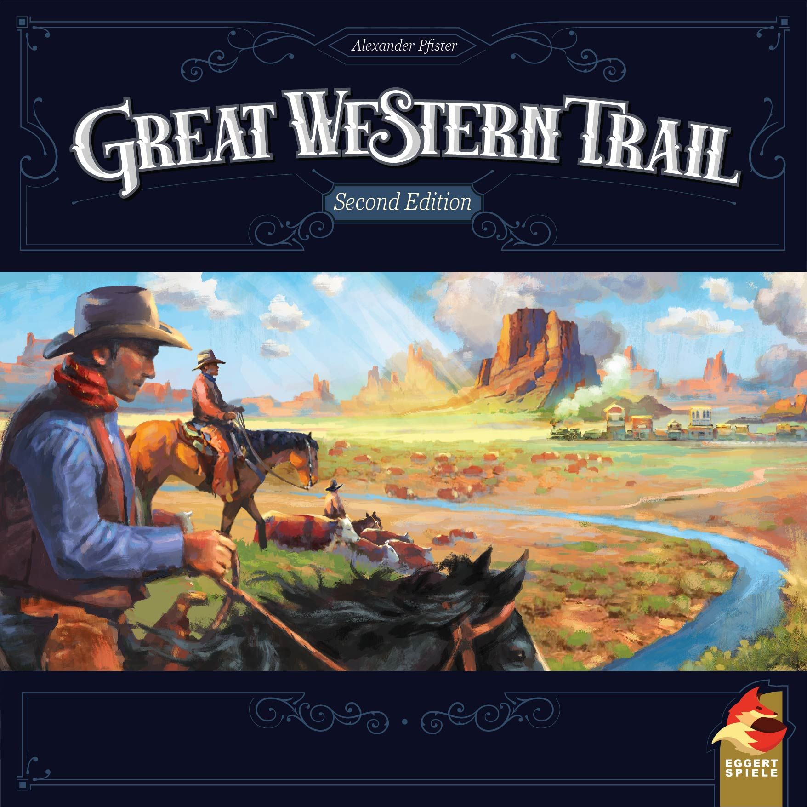
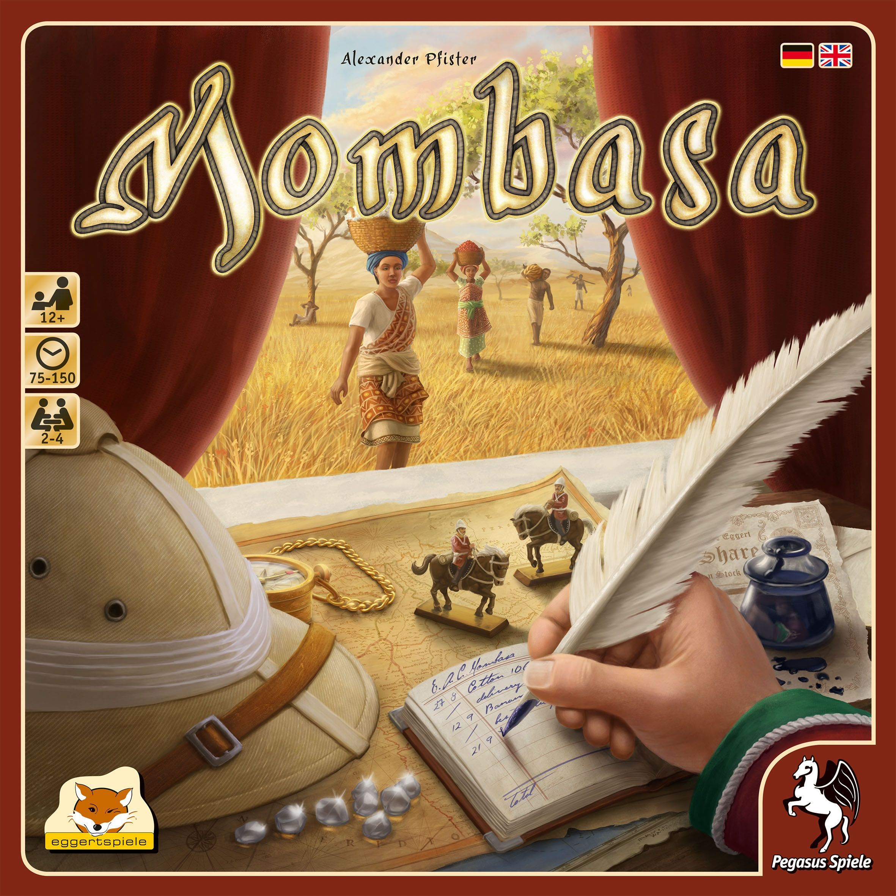
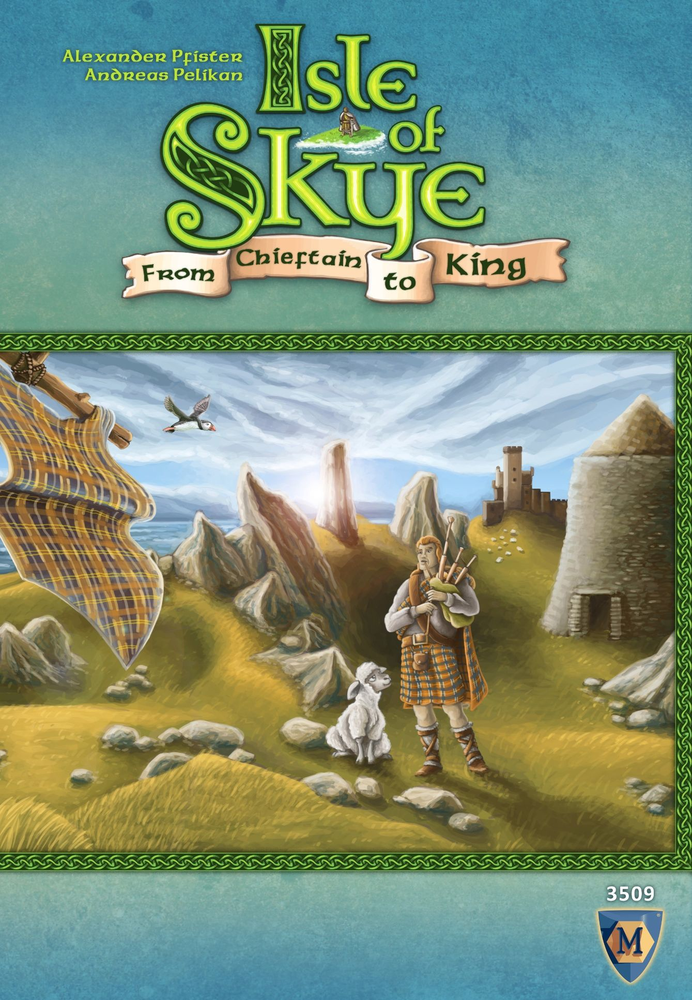
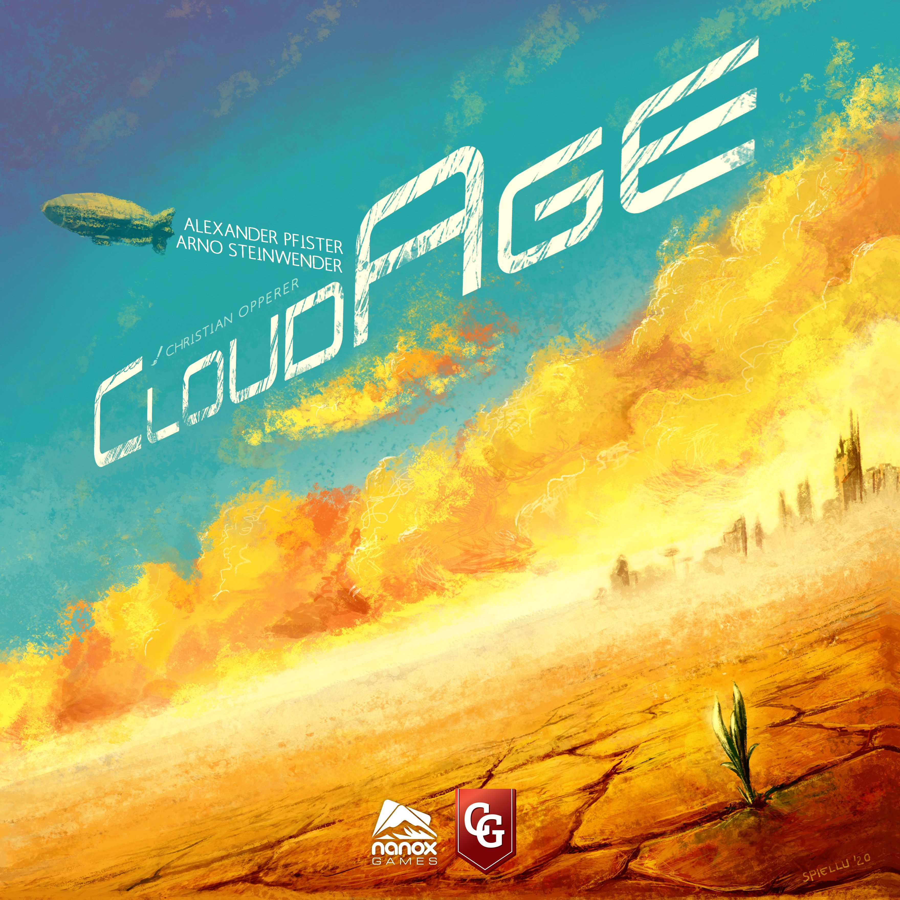
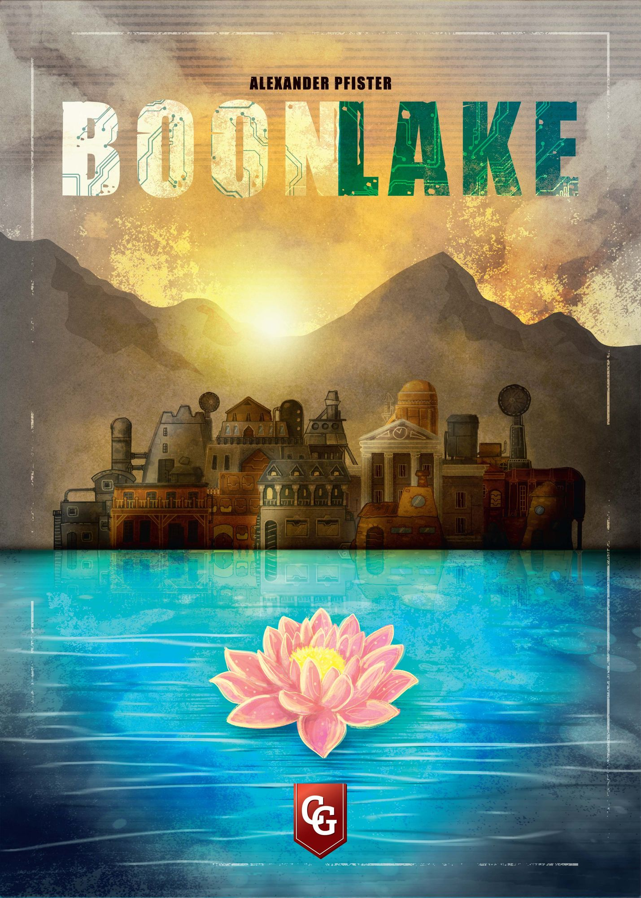

Some designers announce themselves with a single genre-defining game. Alexander Pfister took a different route — he's spent over a decade quietly building one of the most consistently excellent portfolios in modern board gaming, spanning everything from lightweight card games to top-10-on-BGG heavyweights.

If you've played [Great Western Trail](https://boardgamegeek.com/boardgame/193738/great-western-trail), [Maracaibo](https://boardgamegeek.com/boardgame/276025/maracaibo), or even the deceptively simple [Port Royal](https://boardgamegeek.com/boardgame/156009/port-royal), you've already experienced his work. But what ties these wildly different games together? More than you'd think.

## The Pfister Thread: Cards, Planning, and Controlled Chaos

Ask Pfister about his design philosophy and one word keeps coming up: *cards*.

"Everything with cards," he told Punchboard in a 2021 interview. "I think almost all my games except Isle of Skye have cards in them. Keeping cards in your hand is great as it reduces the subjective downtime — you have something to plan with."

That philosophy permeates his entire catalogue. Even [Great Western Trail](https://boardgamegeek.com/boardgame/193738/great-western-trail) (BGG #19, 8.15 rating, weight 3.69) — a game about driving cattle across the American West — has deck-building woven into its DNA. You're constantly managing a hand of cattle cards, deciding when to sell, when to thin your deck, when to push for that high-value delivery to Kansas City.

But cards are just the surface. The deeper Pfister signature is **layered systems that feel independent but secretly interlock.** In Great Western Trail, your cowboys, engineers, and craftsmen each open different strategic paths — cattle herding, railway expansion, building construction — but no single path works in isolation. You need buildings to support your cowboys. You need trains to reduce shipping costs. You need cattle to fund everything.

## From a 12-Year-Old's Africa Game to BGG Royalty

Pfister's origin story is one of the best in board gaming. Born in Vienna, he designed his first game at age twelve — set in Africa, where players bought plantations, produced goods, sold them to cities, and gained political influence. Twenty years later, he found the old game board, reworked it, and it became [Mombasa](https://boardgamegeek.com/boardgame/172386/mombasa) (BGG #144, 7.84 rating, weight 3.89).

"I live in Vienna and work there in the financial business," he explained in early interviews. But as his games kept winning awards — **Kennerspiel des Jahres** for [Isle of Skye](https://boardgamegeek.com/boardgame/176494/isle-of-skye-from-chieftain-to-king) in 2016, **Deutscher Spielepreis** for Great Western Trail the same year — game design moved from side project to primary focus.

His favourite of his own games? Not the one you'd expect.

"My favourite game probably is Port Royal," he said. "It plays quickly and nevertheless has interesting decisions but also a lot of emotions."

## The Essential Pfister: A Field Guide

Here's where to start depending on what kind of gamer you are.

### The Gateway: Port Royal

| Stat | Value |
|---|---|
| BGG Rating | 7.10 (#626) |
| Weight | 1.63 / 5 |
| Players | 2–5 |
| Play Time | 20–50 min |

[Port Royal](https://boardgamegeek.com/boardgame/156009/port-royal) is pure push-your-luck card play. Flip cards from a shared deck — ships earn you coins, but flip two ships of the same colour and you bust. Simple enough to teach in two minutes, deep enough that experienced players consistently outperform newcomers. It's Pfister's best-selling game for a reason, and the one he calls his personal favourite.

### The Stepping Stone: Isle of Skye

| Stat | Value |
|---|---|
| BGG Rating | 7.39 (#291) |
| Weight | 2.26 / 5 |
| Players | 2–5 |
| Play Time | 30–50 min |

[Isle of Skye](https://boardgamegeek.com/boardgame/176494/isle-of-skye-from-chieftain-to-king) takes Carcassonne-style tile laying and adds a brilliant price-setting mechanism. Each round, you draw tiles and secretly assign prices. Too expensive and nobody buys — you're stuck paying for them yourself. Too cheap and opponents snap up your best tiles. Winner of the 2016 Kennerspiel des Jahres, designed with Andreas Pelikan.

### The Deep Cut: Mombasa

| Stat | Value |
|---|---|
| BGG Rating | 7.84 (#144) |
| Weight | 3.89 / 5 |
| Players | 2–4 |
| Play Time | 75–150 min |

[Mombasa](https://boardgamegeek.com/boardgame/172386/mombasa) is where Pfister's love of parallel planning really shines. All players simultaneously choose which cards to play — eliminating downtime — while managing investments in four competing trading companies. The action-programming mechanism (you play cards into three slots, then choose which slot to pick up next round) forces you to think two turns ahead at all times. It's the most brain-burning game in his catalogue by weight, and the one that marked his arrival as a serious heavyweight designer.

### The Masterpiece: Great Western Trail

| Stat | Value |
|---|---|
| BGG Rating | 8.15 (#19) |
| Weight | 3.69 / 5 |
| Players | 2–4 |
| Play Time | 75–150 min |

Five years in development (2011–2016), [Great Western Trail](https://boardgamegeek.com/boardgame/193738/great-western-trail) is the game that cemented Pfister's legacy. The core mechanic — building action spots on a shared path that all players traverse — came first. The cattle theme followed.

"I always start with the mechanic first and then try to find a good theme as quickly as possible," Pfister explained. "The core mechanic was the buildings, which all players build along the same route. I wanted the players to improve the actions, so I introduced workers."

What makes GWT special is that three viable strategic paths (cowboys/cattle, craftsmen/buildings, engineers/trains) each demand attention from the others. You can lean heavy into cattle, but you still need buildings and trains. The interlocking creates a game where every decision ripples outward.

The [Second Edition](https://boardgamegeek.com/boardgame/341169/great-western-trail-second-edition) (BGG #31, 8.26 rating, weight 3.71) updated the art and made small tweaks — including a proper solo mode based on a well-received fan creation. "Knowing that there was a well-received solo version out, I felt it would be pointless to make my own one," Pfister said of adopting the community design.

### The Ambitious Follow-Up: Maracaibo

| Stat | Value |
|---|---|
| BGG Rating | 7.94 (#87) |
| Weight | 3.92 / 5 |
| Players | 1–4 |
| Play Time | 30–120 min |

[Maracaibo](https://boardgamegeek.com/boardgame/276025/maracaibo) takes Great Western Trail's path-traversal core and transplants it to the 17th-century Caribbean. This time the path is a circle (sailing around the Caribbean Sea), and Pfister added a legacy-style campaign with an evolving story across 12 sessions. It's arguably his most mechanically ambitious game — every system from GWT returns in mutated form, plus quests, legacy envelopes, and a solo opponent (Jean) that's one of the best automas in the hobby.

### The Experiment: CloudAge

| Stat | Value |
|---|---|
| BGG Rating | 7.18 (#1568) |
| Weight | 2.84 / 5 |
| Players | 1–4 |
| Play Time | 60–100 min |

[CloudAge](https://boardgamegeek.com/boardgame/316858/cloudage) is the Pfister game nobody talks about, and that's a shame. A post-apocalyptic airship game with a unique "card sleeve" mechanism — cards are partially hidden inside sleeves, and you choose which to reveal based on what you can see peeking through. It combines deck building with resource management in a campaign format. Lower-rated than his other work (7.18), but genuinely inventive. If you love Pfister's design philosophy but want something outside his comfort zone, start here.

### The Frontier: Boonlake

| Stat | Value |
|---|---|
| BGG Rating | 7.61 (#487) |
| Weight | 3.80 / 5 |
| Players | 1–4 |
| Play Time | 80–160 min |

[Boonlake](https://boardgamegeek.com/boardgame/343905/boonlake) sees players settling around a pristine lake, building infrastructure and attracting settlers. It uses a clever multi-use action system — each turn you pick a card from a shared display, which determines both your main action and your secondary action. The game has divided opinions more than any other Pfister title, with some finding it overly constrained and others praising its tight interconnected decision-making.

## What Makes Pfister Pfister?

After playing through his catalogue, a few consistent design principles emerge:

**1. Mechanics first, theme second (but theme matters).** Every Pfister game starts with a mechanism. Great Western Trail began with "build action spots on a shared path." Port Royal began with push-your-luck card flipping. But once he finds the theme, he commits fully. "I'm especially proud because of the theme," he said of GWT. "The theme is more present than in other euro games, and that's the direction I want to go."

**2. Parallel planning kills downtime.** Mombasa's simultaneous card selection, GWT's forward-planning along the trail, Maracaibo's predictable movement — Pfister designs games where you're always thinking on other players' turns. He's on record saying he "hates downtime."

**3. Multiple paths, no pure strategies.** Every Pfister heavyweight offers 3–4 viable strategies, but none work in isolation. You can focus on cowboys in GWT, but you still need buildings and trains. This creates games that reward specialisation but punish tunnel vision.

**4. The 12-year-old test.** If Pfister designed Mombasa at twelve, he's been iterating on game design for over thirty years. That shows in the polish. His games don't have vestigial mechanisms — everything earns its place.

**5. Listen to the community.** Adopting a fan-made solo mode for GWT 2E, incorporating feedback into reprints, creating expansions that address common criticisms — Pfister treats his player community as collaborators, not consumers.

## Where to Start

Already own one Pfister game and want the next one?

- **Own Port Royal →** Try **Isle of Skye** (step up in weight, still accessible)
- **Own Isle of Skye →** Try **Great Western Trail** (the leap is worth it)
- **Own Great Western Trail →** Try **Maracaibo** (familiar DNA, new depth)
- **Own Maracaibo →** Try **Mombasa** (his most brain-burning design)
- **Want something weird →** Try **CloudAge** (you'll either love or admire it)

Or just get Great Western Trail. Honestly. If you play one Pfister game, make it that one.

---

*All game data verified via the BGG XML API. Ratings, weights, and rankings current as of April 2026.*
