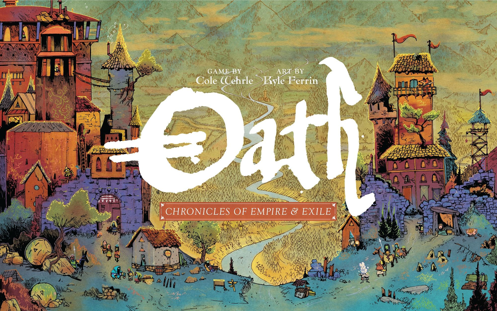
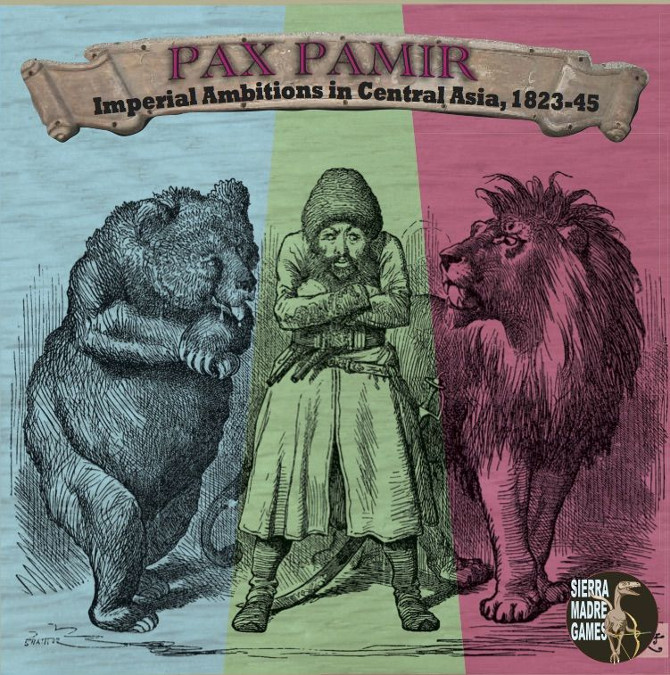

# [Designer](/posts/designer-spotlight-vlaada-chvatil/) Spotlight: Cole Wehrle

Some designers make elegant systems. Some make thematic spectacles. Cole Wehrle makes arguments.

That is the bit that separates him from the pack. Sit down to a Wehrle design and you are rarely just pushing cubes around for efficiency points. You are navigating power, instability, opportunism, and the deeply human talent for making a mess of every institution we touch. His games do not just use history as wallpaper. They poke at it. Sometimes they grin while doing it. Sometimes they leave you feeling a bit grimy. Usually both.

That is why people get evangelical about his work. It is also why every discussion about him turns into a minor forum battle. For one crowd, he is the designer who dragged asymmetric conflict games into the modern hobby spotlight. For another, he is the man responsible for game nights where the teach takes longer than the first play. Both camps have a point.

This piece looks at the arc of his career, the design traits that make his games feel so recognisably his, a ranking of his major titles, and where newcomers should start.

## The career arc

Wehrle’s first published game was [Pax Pamir](https://boardgamegeek.com/boardgame/155255) in 2015, and you can already see the whole career in miniature there. Historical setting. Political instability. Alliances that feel temporary because they are. A design more interested in who holds power than who has the biggest pile of stuff. It got attention from wargamers because it understood conflict in a way most euros simply do not.

Then came the breakout. [Root](https://boardgamegeek.com/boardgame/237182) landed in 2018 and blew the doors off. A woodland war game with adorable art sounds like a joke until you realise it is one of the most influential releases of the last decade. BGG has it at 8.07/10 from 63,464 ratings, with a weight of 3.84/5 and an overall rank of #34. Those numbers tell a story. This was not just a cult hit. This thing escaped containment.

From there, Wehrle’s work got bigger, sharper, and in some ways stranger. [John Company](https://boardgamegeek.com/boardgame/211716) pushed his interest in empire and institutional rot. [Oath](https://boardgamegeek.com/boardgame/291572) turned campaign history into a living political object. [Arcs](https://boardgamegeek.com/boardgame/359871) showed he could take those instincts into space without losing his voice. Along the way he moved from an academic background in teaching into full-time game design at Leder Games, and co-founded Wehrlegig Games with his brother Drew.

That matters because his games still feel like they were built by someone who wants systems to say something. Not preach. Not lecture. Say something.

## What makes Wehrle distinctive

A quick look at that career arc makes the throughline pretty clear: even when the settings change, the underlying concerns do not.

The easy answer is asymmetry. Yes, Wehrle loves asymmetric play. [Root](https://boardgamegeek.com/boardgame/237182) is the obvious poster child, where each faction feels like it wandered in from a different design entirely. The Marquise de Cat is building an industrial war machine. The Eyrie Dynasties are trapped in their own brittle decree. The Vagabond is off playing a dangerous little RPG in the middle of everyone else’s war. It is brilliant.

But asymmetry is not the real signature. Plenty of designers do asymmetry. Wehrle’s thing is political asymmetry. Different players are not just doing different actions. They are inhabiting different relationships to power.

That is why [Pax Pamir](https://boardgamegeek.com/boardgame/155255) matters so much in his catalogue. You are not “being Afghanistan” in some broad historical sense. You are navigating Afghan politics amid British and Russian rivalry, constantly reassessing loyalty, patronage, and survival. The game is compact, nasty, and far more interested in leverage than conquest.

[John Company](https://boardgamegeek.com/boardgame/211716) takes that instinct and makes it almost uncomfortably explicit. A game about the British East India Company should not be breezy fun, and this one is not. It is about families, offices, favours, corruption, and the machine of empire grinding on because everyone around the table finds a way to profit from it. There is a reason people call Wehrle’s designs thought-provoking conflict simulations. He keeps finding ways to make politics playable without sanding off the uglier edges.

Then there is his other great trick: narrative without scripts. [Oath](https://boardgamegeek.com/boardgame/291572) is the clearest example. It is a 1-6 player game, 45-150 minutes, with a BGG rating of 7.72/10 from 9,367 ratings, weight 4.12/5, rank #326. Those stats scream “admired more than universally loved,” and that feels right. Oath is not tidy. It is not interested in being tidy. It wants your table to create a political history, full of grudges, reversals, and weird continuity. Some groups bounce off it hard. Some groups become absolutely insufferable about it in the best possible way.

With those traits in mind, the ranking makes more sense. The order is not just about quality in the abstract. It is about how successfully each game turns those ideas into something people will actually want to bring back to the table.

## Ranked: the major Cole Wehrle games

### 5. [John Company](https://boardgamegeek.com/boardgame/211716)

This is the one I respect more than I crave.

The first edition sits at 7.30/10 from 1,338 ratings on BGG, with a hefty 4.15/5 weight, rank #2398, for 1-6 players and 90-180 minutes. That weight is no joke. This is the kind of game where your first explanation of the board only covers about half of what matters.

What makes it great is also what makes it hard to love casually. It is one of the sharpest designs about institutional self-interest I have ever seen. Every negotiation feels loaded. Every appointment matters. Every success feels compromised. But it needs the right table, the right mood, and a group willing to lean into social bargaining rather than sit there waiting for clean tactical clarity.

For the right players, it is astonishing. For many groups, it is homework with excellent ideas.

### 4. [Oath](https://boardgamegeek.com/boardgame/291572)

I admire [Oath](https://boardgamegeek.com/boardgame/291572) enormously. I also think it is the game most likely to produce the sentence, “It was fascinating, but I’m not sure I had fun.”

That sounds harsher than it is. Oath is one of the boldest designs of the last decade. The campaign memory system, the shifting political order, the way the board itself starts to feel like a record of your table’s behaviour. Wonderful stuff. It creates stories no scenario book could match.

But it is demanding. Not just rules demanding, though at 4.12/5 weight it certainly is that. It asks for repeat plays with the same group, and that is a brutal ask in adult life. Getting three people to commit to dinner next Thursday is hard enough.

Still, when it lands, it really lands.

### 3. [Pax Pamir](https://boardgamegeek.com/boardgame/155255)

The original [Pax Pamir](https://boardgamegeek.com/boardgame/155255) is where the core Wehrle identity first crystallised. BGG puts it at 7.31/10 from 1,326 ratings, weight 3.67/5, rank #2415, for 2-5 players and 60-120 minutes.

This is a smaller game than his later headliners, but not a smaller design. It is tense, slippery, and gloriously political. Coalition shifts are not gimmicks here. They are the whole point. You think you understand the board, then a loyalty change or a clever card play rewrites everyone’s priorities. That sense of instability is deeply Wehrle.

It also shows his gift for getting historical texture into mechanisms. The game does not feel like a generic area control system with a history skin thrown on top. It feels structurally political. That is a harder trick than most designers make it look.

### 2. [Arcs](https://boardgamegeek.com/boardgame/359871)

This was the moment I stopped thinking of Wehrle primarily as “the historical politics designer” and started thinking of him as one of the most flexible conflict designers in the hobby.

[Arcs](https://boardgamegeek.com/boardgame/359871) is 2-4 players, 60-120 minutes, with an 8.01/10 rating from 16,390 ratings, weight 3.44/5, and rank #102. That weight is the key number for me. It is lighter than [Root](https://boardgamegeek.com/boardgame/237182), [Oath](https://boardgamegeek.com/boardgame/291572), and [John Company](https://boardgamegeek.com/boardgame/211716), but it still feels unmistakably his.

It is sharp, tactical, and mean in a very clean way. Space opera, yes, but not flabby sandbox space opera. The decisions bite. The tempo matters. The table talk matters. It captures a lot of Wehrle’s love of shifting power without requiring a dissertation before turn one.

That is not dumbing down. That is range.

### 1. [Root](https://boardgamegeek.com/boardgame/237182)

Yes, it is the obvious pick. It is also the correct one.

[Root](https://boardgamegeek.com/boardgame/237182) remains Wehrle’s masterpiece because it threads a needle almost nobody else can thread. It is deeply asymmetric, genuinely interactive, full of memorable faction identity, and still playable in 60-90 minutes at 2-4 players. Again, 8.07/10, 63,464 ratings, weight 3.84/5, rank #34. Those are monster numbers for a game this odd.

I love how alive Root feels. Every faction forces a different posture. Every table develops its own meta. Every teach starts the same way: everyone ignores the Marquise for two rounds, then acts shocked when the cats own half the map. The game has become one of those hobby touchstones where strategy advice, faction discourse, and expansion arguments never really stop. The BGG threads and Reddit posts could power a small city.

It is not perfect. The teach is exhausting. New players can get flattened. Some factions are simply easier to internalise than others. But perfection was never the point. Root changed the conversation.

## Start here

If the ranking shows anything, it is that Wehrle’s games vary less in ambition than in how easy they are to get to the table.

For newcomers, start with [Root](https://boardgamegeek.com/boardgame/237182) if you have a group willing to learn together and play more than once. It is still the best expression of Wehrle’s core strengths in a package that feels energetic rather than forbidding.

If your group likes conflict but recoils at asymmetry overload, [Arcs](https://boardgamegeek.com/boardgame/359871) is the safer recommendation. It is quicker to get moving and easier to table.

I would not start with [Oath](https://boardgamegeek.com/boardgame/291572) or [John Company](https://boardgamegeek.com/boardgame/211716) unless your group actively enjoys climbing design mountains for sport.

## Why Wehrle matters

The recent arc of Wehrle’s career has been about refinement as much as ambition. [Pax Pamir](https://boardgamegeek.com/boardgame/155255) established the voice. [Root](https://boardgamegeek.com/boardgame/237182) broadened the audience. [Oath](https://boardgamegeek.com/boardgame/291572), [John Company](https://boardgamegeek.com/boardgame/211716), and [Arcs](https://boardgamegeek.com/boardgame/359871) show a designer still pushing at how politics, history, and conflict can work on the table.

That is why Wehrle matters. He is not just making clever systems. He is making games that trust players to wrestle with messy ideas. Sometimes that produces masterpieces. Sometimes it produces fascinating contraptions that are easier to admire than adore. But even the misses are interesting, and that is more than you can say for most designers.

Some designers give you polished toys. Cole Wehrle gives you unstable worlds and asks what you will do with them. That is a rare talent.