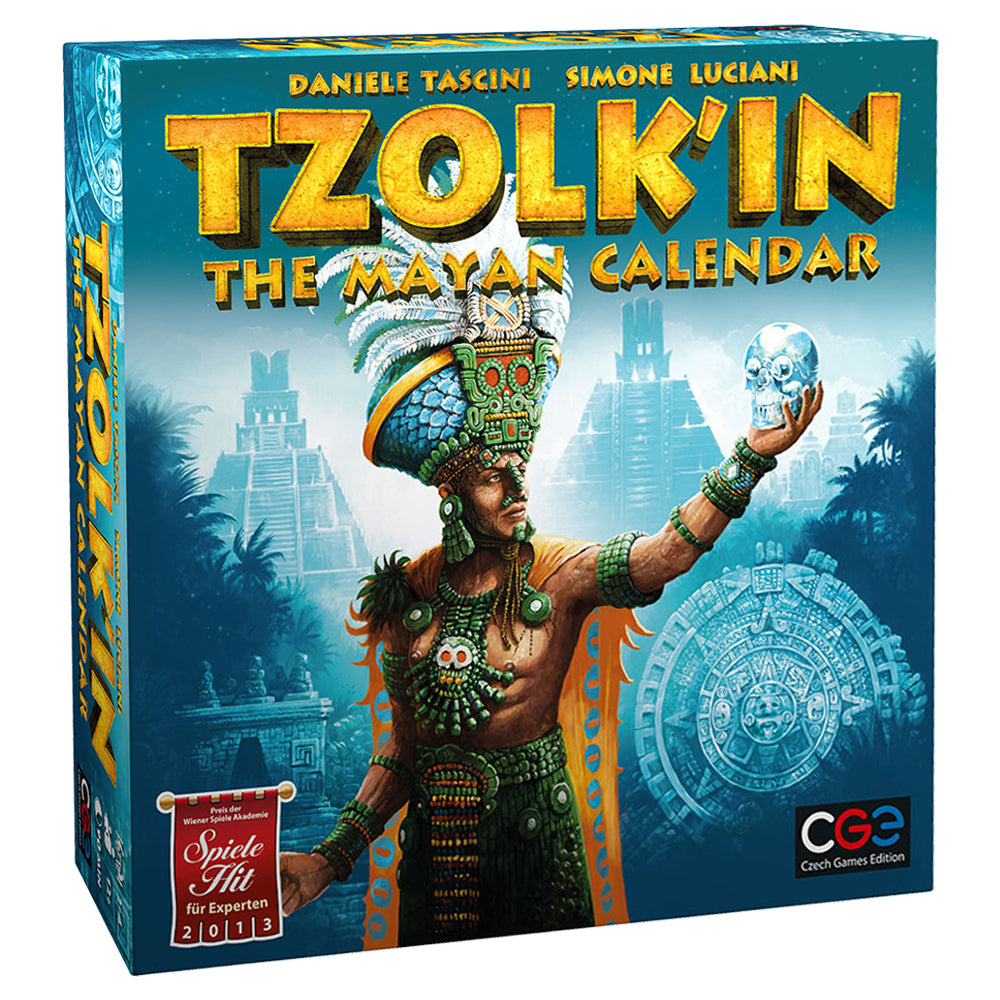
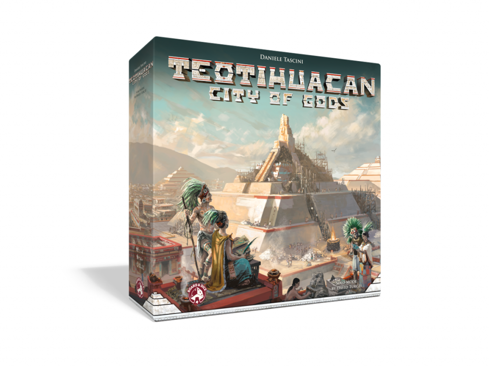
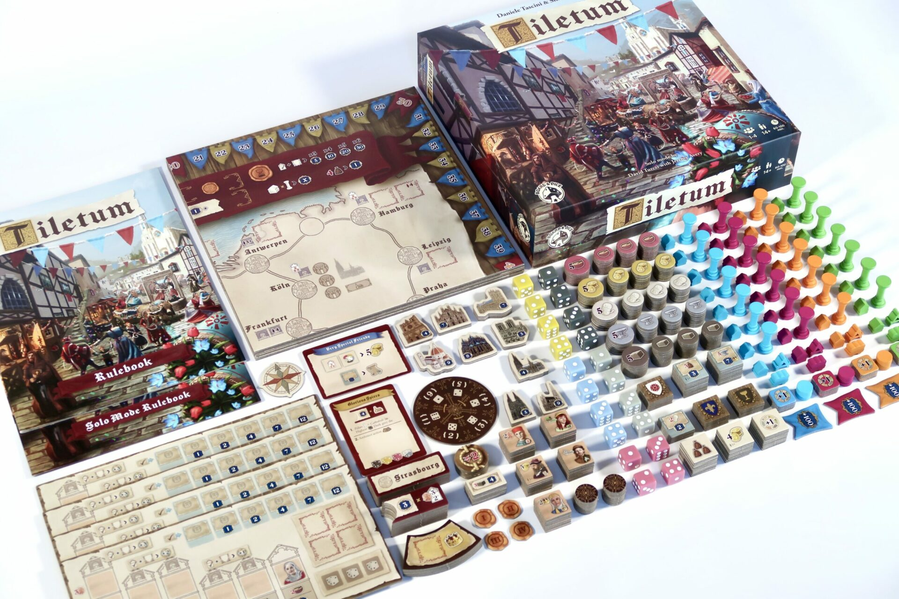

## Daniele Tascini: The Gear-Driven Mind Behind the Board

Daniele Tascini is a name that pops up frequently in the world of Eurogames, and for good reason. The Italian designer has crafted some of the most intriguing and mechanically rich games in the hobby, with a penchant for blending historical themes with head-scratching decisions. But what makes Tascini's work stand out in a crowded field of talented game designers? This article explores his world by dissecting his design philosophy, ranking his major games, and suggesting the best starting point for newcomers.

### The Beginning: Gears in Motion

Tascini burst onto the scene with [Tzolk'in: The Mayan Calendar](https://boardgamegeek.com/boardgame/126163/tzolk-mayan-calendar) in 2012, co-designed with Simone Luciani. This medium-weight Eurogame wasn't just another worker placement game. It introduced a literal gear system that rotated with each round, impacting strategy in a dynamic way that was as visually captivating as it was mechanically innovative. Who could forget the feeling of placing a worker, only to watch the gears turn and open up new possibilities? It was risky, it was rewarding, and it set the tone for Tascini's career: crunchy decisions in complex systems.

### Moving Forward: From Gears to Pyramids

Tascini didn't rest on his laurels. Six years after Tzolk'in, he released [Teotihuacan: City of Gods](https://boardgamegeek.com/boardgame/229853/teotihuacan-city-gods) in 2018. This time, he flew solo and gave us a game centered on dice workers that climb pyramids, with customizable dice faces adding layers of strategy. It was another hit, praised for its replayability and the way it seamlessly blended theme and mechanics. It wasn't just a game; it was an experience that invited players to explore the depths of its strategic possibilities.

### The Evolution: Expanding Horizons

In the subsequent years, Tascini expanded his thematic repertoire while maintaining his signature design style. [Tabannusi: Builders of Ur](https://boardgamegeek.com/boardgame/314220/tabannusi-builders-ur) (2022) and [Zapotec](https://boardgamegeek.com/boardgame/333759/zapotec) (2023) showcased his love for ancient civilizations, with innovative mechanics like multi-level worker movement and dice conversion. These games added depth and complexity without sacrificing accessibility, a testament to Tascini's evolution as a designer.

Then came [Tiletum](https://boardgamegeek.com/boardgame/363196/tiletum) (2022), a collaboration with Luciani that many consider Tascini's magnum opus. It blended market engine-building with intricate strategic layers, proving that Tascini's collaborative chemistry with Luciani was far from a one-time affair.

### Style and Substance: Tascini's Design Philosophy

Tascini's games are not just about winning; they're about the journey. His design philosophy revolves around "crunchy decisions," forcing players to weigh high-risk, high-reward choices. His games often feature:
- Rotating or dynamic boards, like the gears in Tzolk'in.
- Dice manipulation and conversion, as seen in Teotihuacan.
- Track advancement with one-time bonuses and multi-use milestone cards.

These elements create a playground for strategic minds, offering endless possibilities for those willing to dive deep.

### Ranking Tascini's Key Games

1. **Tiletum**: A near-perfect blend of multiple mechanics and themes. The strategic depth is immense, making it a favorite among heavy Euro enthusiasts.
2. **Teotihuacan**: A standout solo design with its unique dice-pyramid mechanic. It's a commercial hit for a reason.
3. **Tzolk'in**: The game that started it all. The gear mechanic is still as fresh today as it was in 2012.
4. **Zapotec**: Impressive for its accessibility and thematic depth, though it lacks the groundbreaking innovation of Tzolk'in.

### Where to Start?

New to Tascini's works? Start with [Teotihuacan](https://boardgamegeek.com/boardgame/229853/teotihuacan-city-gods). It's a game that encapsulates Tascini's love for dice conversion and offers a solo mode that lets you explore its depths at your own pace. It's challenging, rewarding, and beautifully designed.

### What's Next for Tascini?

While Tascini's most recent major release is [Tianxia](https://boardgamegeek.com/boardgame/363196/tianxia), he's already hinted at a new project in the works, slated for release in 2026. The anticipation is palpable, and fans are eager to see what innovative mechanics he brings to the table next.

In conclusion, Daniele Tascini is a master of strategic gameplay, with a knack for creating games that challenge and engage players on multiple levels. His body of work is a testament to his creativity and skill, offering something unique for every type of board game enthusiast. If you're looking for games that push the boundaries of strategy, look no further than the mind of Daniele Tascini.

## Expert Tips and Strategies for Mastering Tascini's Games

So you've taken the plunge into Daniele Tascini's world of intricate Eurogames. Maybe you've been spinning the gears of [Tzolk'in](https://boardgamegeek.com/boardgame/126163/tzolk-mayan-calendar), ascending the pyramids in [Teotihuacan](https://boardgamegeek.com/boardgame/229853/teotihuacan-city-gods), or constructing ancient marvels in [Tabannusi](https://boardgamegeek.com/boardgame/314220/tabannusi-builders-ur). But how do you go from just playing these games to mastering them? Here are some insider tips and strategies to elevate your game and keep you ahead of your opponents.

### Tzolk'in: The Mayan Calendar

**1. Plan for the Long Haul**

In Tzolk'in, impulsivity can be your downfall. The rotating gears mean that every placement should be considered not just for the immediate payoff but for what it will yield several turns down the line. Think of it as strategic foresight. Avoid leaving your workers on the gears for too long, as this can stall your strategy.

**2. Prioritize Resource Management**

Early resource accumulation is crucial. Corn isn't just for feeding your workers; it's the currency that oils the entire machine. Plan your placements to maximize corn collection and spending efficiency. Keep an eye on temple tracks for late-game bonuses—they can be game-changers.

**3. Adaptability Is Key**

With the gears constantly shifting, so should your strategy. Be ready to pivot your plans based on the board's state. Competitors will try to block your moves, and you need to be nimble enough to adjust without losing momentum.

### Teotihuacan: City of Gods

**1. Optimize Dice Advancement**

In Teotihuacan, your workers are dice that evolve as they perform actions. Upgrading these dice should be a priority, as higher-value dice provide more powerful actions. Plan your routes on the board to increment your dice efficiently and avoid stagnation.

**2. Balance Immediate Gains with Long-Term Goals**

It's easy to focus on immediate bonuses, but neglecting long-term strategy can be detrimental. Align your actions with end-game scoring opportunities. The pyramid construction should not just be an afterthought but an integral part of your strategy.

**3. Manage Resources Wisely**

Resource scarcity can be brutal. While wood, stone, and gold are all valuable, don't forget about cacao. Without it, your entire operation can grind to a halt. Integrate cacao collection into your routes to ensure a smooth flow of actions.

### Tabannusi: Builders of Ur

**1. Focus on Area Control**

Tabannusi rewards those who can dominate districts. Ensure that you not only have a presence but also hold majorities in key areas. This control translates into valuable bonuses and opportunities to influence the progression of the game.

**2. Efficient Use of Dice Actions**

The dice in Tabannusi determine which actions and resources you can access. Plan your moves to maximize the utility of each dice roll. Efficient action planning is the difference between a well-oiled engine and a clunky mess.

**3. Anticipate Opponent Moves**

Keep an eagle eye on your opponents' strategies. Disrupting their plans can be as crucial as furthering your own, especially when it comes to denying them critical resources or control of strategic districts.

### Zapotec

**1. Prioritize Temple Tracks**

In Zapotec, advancing on temple tracks not only yields immediate benefits but also sets up powerful end-game scoring opportunities. Prioritize temple advancements early to secure long-term advantages.

**2. Diversify Your Strategy**

Relying too heavily on a single strategy can make you predictable. Balance your focus between building construction and resource accumulation to keep your options open and adapt to the evolving game state.

**3. Efficient Resource Conversion**

The game thrives on converting resources into strategic advantages. Plan your conversions carefully to ensure that every resource you gather serves a purpose in your master plan. Timing these conversions at critical junctures can be the key to pulling ahead.

### General Tactics Across Tascini's Games

- **Adaptation Over Rigidity**: Tascini's games are dynamic and punishing to those who refuse to adapt. Your strategy should be a living thing, evolving with the board state and your opponents' actions.
  
- **Know When to Sacrifice**: Sometimes the best move is to concede a short-term gain for a long-term advantage. Whether it's letting go of a contested area or allowing another player to take a small bonus, always keep your eyes on the ultimate goal.

- **Observe and React**: The most successful players are those who are not only masters of their own strategy but also students of their opponents'. Learn to read the board and the players, predicting their moves and countering them before they know what hit them.

- **Resource Efficiency**: Across all his games, Tascini promotes resource efficiency. Streamline your operations to minimize waste and maximize output. Every resource should work for you, not against you.

By mastering these tips and strategies, you'll not only enhance your enjoyment of Tascini's games but also establish yourself as a formidable force at the table. So, ready your gears, climb those pyramids, and build the cities of Ur—victory awaits those who dare to strategize deeply.

## How to Choose a Daniele Tascini Game: A Buyer's Guide

So, you're intrigued by Daniele Tascini's work and ready to dive into his world of crunchy decisions and strategic complexity. But where do you start? With a portfolio rich in diverse mechanics and thematic content, picking the right game can feel overwhelming. Here's a guide to help you navigate through Tascini's offerings and find the perfect match for your gaming table.

### Know Your Group's Taste

The first step is understanding what your gaming group enjoys. Are they fans of heavy Euros that demand deep thought and strategic planning? Or do they prefer games that are a bit more accessible but still offer plenty of depth? Tascini's games range from medium to heavy in terms of complexity, and knowing your group's appetite for such challenges is crucial.

- **For Heavy Euro Enthusiasts**: [Tiletum](https://boardgamegeek.com/boardgame/363196/tiletum) is a must-try. It's a game that's beloved by hardcore strategists for its engine-building mechanics and intricate strategies. The collaboration with Luciani only amplifies its appeal.

- **For Medium to Heavy Complexity**: [Teotihuacan: City of Gods](https://boardgamegeek.com/boardgame/229853/teotihuacan-city-gods) strikes a fine balance. While it's complex, the pyramid-building and dice manipulation offer a rewarding experience that doesn't overwhelm.

- **For Thematic Depth**: If your group loves historical themes, [Tzolk'in: The Mayan Calendar](https://boardgamegeek.com/boardgame/126163/tzolk-mayan-calendar) is a great pick. The rotating gear system not only provides mechanical depth but also immerses players in its Mayan theme.

### Consider the Learning Curve

Tascini's games are known for their depth, which often comes with a steep learning curve. If you're introducing new players or those newer to heavy Euros, consider how long it will take for everyone to understand the rules and strategies.

- **Easy to Learn, Hard to Master**: [Zapotec](https://boardgamegeek.com/boardgame/333759/zapotec) offers a more accessible entry point. It maintains thematic depth while being slightly easier to teach compared to Tiletum or Teotihuacan.

- **For Experienced Gamers**: If your group relishes a challenge and enjoys dissecting complex strategies, dive headfirst into Tiletum or Teotihuacan. These games reward players who invest time in mastering the intricacies.

### Think About Replayability

Replayability is a key factor in choosing a board game, especially one from a designer like Tascini, where strategy and mechanics offer layers to explore. His games typically boast high replayability due to their deep mechanics and variable setups.

- **High Replayability**: Tzolk'in and Teotihuacan, with their mutable gears and dice mechanics, respectively, promise fresh experiences with each play. The dynamic elements ensure that no two games feel exactly the same.

- **Expansions for Variety**: Teotihuacan has several expansions that add new dimensions to the game, enhancing its replay value and offering fresh challenges for seasoned players.

### Evaluate Player Count and Playtime

Consider how many players you typically have and how long your gaming sessions last. Tascini's games generally accommodate 2-4 players and have variable playtimes.

- **For Larger Groups**: While most of his games cap at four players, they can still be quite enjoyable with the full player count. Keep in mind that the playtime might extend, particularly with Tiletum and Teotihuacan.

- **For Quicker Sessions**: If time is of the essence, Zapotec offers a more condensed experience while still retaining strategic depth. It’s a great choice for shorter gaming sessions.

### Personal Preference: Theme vs. Mechanics

Finally, decide whether theme or mechanics drive your enjoyment more. Tascini’s games offer a rich tapestry of both, but certain titles emphasize one over the other.

- **Theme-Driven**: If you're a sucker for thematic immersion, Tzolk'in should be your go-to. Its historical elements are as integral to the experience as the mechanics.

- **Mechanically Focused**: For those who prioritize strategic depth and mechanical innovation over thematic elements, Teotihuacan and Tiletum deliver in spades.

### Conclusion

Choosing a Daniele Tascini game is like selecting the perfect wine for dinner—each one offers a unique flavor profile and experience. Whether you prioritize theme, mechanics, complexity, or replayability, Tascini’s portfolio has something to offer for every kind of board gamer. Take these factors into account, and you'll find the perfect game to roll out at your next game night.