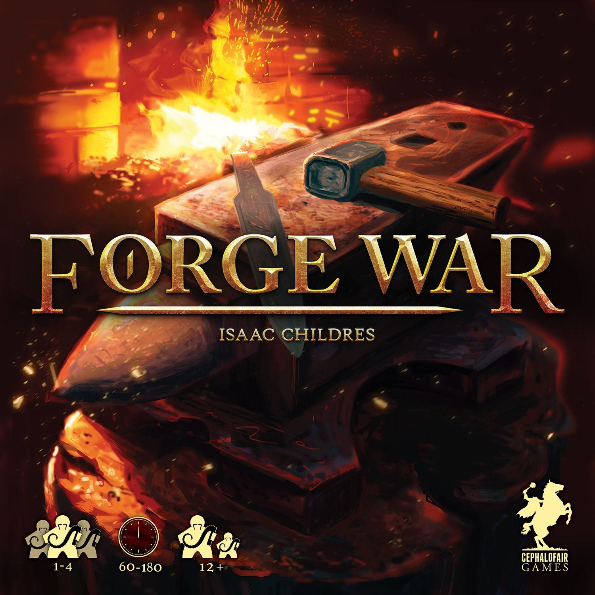
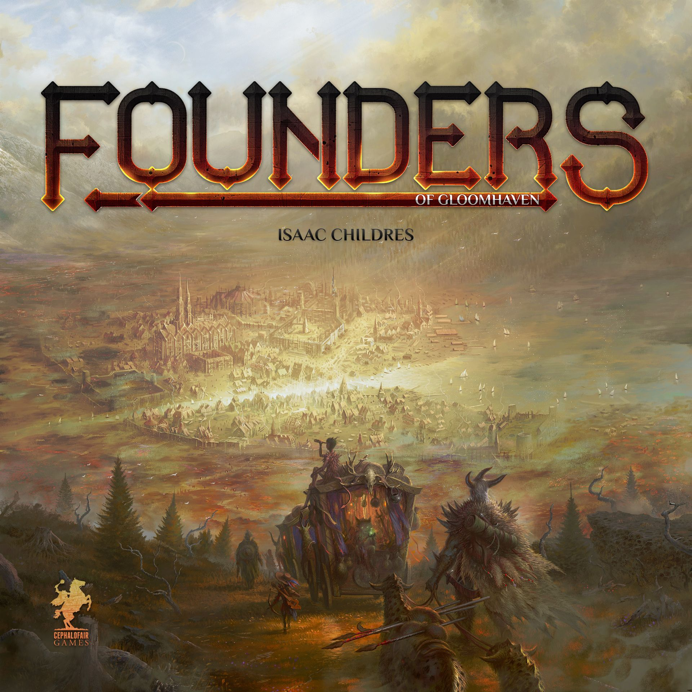

# Isaac Childres: The Man Who Turned Dungeon Crawls into Euro Puzzles

There are [designers](/posts/designer-spotlight-cole-wehrle/) who make good games. Then there are designers who accidentally build subcultures.

Isaac Childres is firmly in the second camp. He started with [Forge War](https://boardgamegeek.com/boardgame/146221) in 2015, founded Cephalofair Games to publish it himself, and then did the sort of thing that sounds ridiculous until you remember this hobby loves ridiculous ambition. Fresh off f[inishing](/posts/games-like-inis/) a PhD in Physics at Purdue, he went all in on [Gloomhaven](https://boardgamegeek.com/boardgame/174430/gloomhaven), a box so absurdly oversized it became a meme, and a design so successful it changed what people expected from campaign games.

That alone would be enough for a career. Instead, Childres kept pushing. [Gloomhaven: Jaws of the Lion](https://boardgamegeek.com/boardgame/291457/[gloomhaven](/posts/gloomhaven-a-deep-dive-review/)-jaws-of-the-lion) made the system approachable without gutting it. [Frosthaven](https://boardgamegeek.com/boardgame/295770/frosthaven) took the whole thing north, made it bigger, heavier, and somehow even more all-consuming. And then there’s [Founders of Gloomhaven](https://boardgamegeek.com/boardgame/214032/founders-of-gloomhaven), which is either a fascinating left turn or an object lesson in what happens when a designer’s love of systems outruns their instinct for usability.

This article looks at that arc, what makes Childres’ design style distinctive, how his major games stack up, where newcomers should start, and what seems to come next.

That’s the Childres story in miniature. Precision. Ambition. Enormous boxes. A refusal to make the easy version of anything.

## The career arc: from blacksmithing Euro to campaign giant

Childres’ first published game, [Forge War](https://boardgamegeek.com/boardgame/146221), tells you a lot about him before [Gloomhaven](https://boardgamegeek.com/boardgame/174430/gloomhaven) ever enters the picture. It’s a resource-management blacksmithing game, originally Kickstarted in 2014 while he was still completing that Physics PhD. Not dragons. Not cinematic splashy nonsense. Blacksmithing. That is such a revealing first step. Even at the start, he was interested in systems, conversion chains, and making players work for their power.

Then came the real pivot. After graduating in 2014, he developed Gloomhaven, dropped an intervening project, and moved into full-time design. You can feel the difference. [Gloomhaven](https://boardgamegeek.com/boardgame/174430/gloomhaven) wasn’t just a bigger game. It was the moment Childres fused two instincts that usually live in separate corners of the hobby: hard-nosed Euro efficiency and campaign adventure storytelling.

That fusion is why the game landed like a meteor. It didn’t play like a traditional dungeon crawler where you chuck dice, shrug at luck, and hope your sword works. It played like a hand-management puzzle wearing a fantasy campaign’s clothes. Every turn mattered. Every lost card hurt. Every room made you recalculate the whole plan.

And yes, the community went feral for it.

From there, Childres has mostly been refining and scaling that formula. [Jaws of the Lion](https://boardgamegeek.com/boardgame/291457/gloomhaven-jaws-of-the-lion) proved he could teach this beast to normal humans. [Frosthaven](https://boardgamegeek.com/boardgame/295770/frosthaven) became the most successful gaming Kickstarter ever, which still feels slightly unreal, and expanded the system into something even more sprawling. More recently, discussion around a Frosthaven digital adaptation at Gen Con 2025 suggests the universe is still growing, this time with better virtual implementation and room for future content.

That’s not a side note. It matters. Childres designs games people want to live in for months.

## What makes Childres distinctive

The career path is interesting on its own, but it matters most because it produced a very specific kind of design voice.

Plenty of designers make campaign games. Plenty make heavy Euros. Childres is unusual because he genuinely understands both.

His designs are driven by resource pressure. That’s the throughline from [Forge War](https://boardgamegeek.com/boardgame/146221) to [Frosthaven](https://boardgamegeek.com/boardgame/295770/frosthaven). You are always spending something precious. Cards, time, positioning, stamina, materials, prosperity, momentum. He doesn’t want you to feel powerful for free. He wants you to earn it through painful trade-offs.

That’s why [Gloomhaven](https://boardgamegeek.com/boardgame/174430/gloomhaven) works as well as it does. Its combat system is a Euro puzzle. Full stop. You’re not just attacking monsters. You’re managing hand depletion, initiative timing, movement efficiency, and scenario tempo. The fantasy theme gives it texture, but the brain of the thing is brutally mathematical.

That physics background shows. Not in some flashy “scientist designs game” marketing sense. In the iteration. The calibration. The feeling that every mechanism has been stress-tested until it either works or gets cut.

But he’s not just cold systems. The real leap was persistent consequence. Retirement goals. Branching stories. A world that changes because your group did, or failed to do, something three sessions ago. That’s where Childres separates himself from designers who use campaign structure as decoration. In his best work, persistence is the point.

The downside is obvious. These games can be a lot. Heavy rules. Big setup. Edge-case questions. The sort of campaign where one player misses three sessions and suddenly feels like they’ve returned to a television series midway through season four. Reddit loves to argue about whether the complexity is genius or self-indulgence. The answer is yes.

## Ranking Isaac Childres’ major games

With that design philosophy in mind, the rankings make a lot more sense. The order here is less about raw ambition than about how well Childres’ systems, campaign instincts, and usability actually come together.

## 4. [Founders of Gloomhaven](https://boardgamegeek.com/boardgame/214032/founders-of-gloomhaven)

This is the miss.

Not because it lacks ideas. It has loads of them. Too many, really. [Founders of Gloomhaven](https://boardgamegeek.com/boardgame/214032/founders-of-gloomhaven) is a 2018 competitive tile-placement, action-selection city-building game with a 6.56/10 BGG rating from 3,327 ratings, weight 4.12/5, ranked #2698 overall. Those numbers tell a fairly blunt story. This one never connected.

And you can see why once it hits the table. It’s dense in a way that feels procedural rather than exciting. The interconnected supply lines and city-building ideas are interesting on paper, but the game has that fatal heavy-Euro problem where explaining the rules already feels like filing tax returns. Worse, it doesn’t generate the same payoff Childres gets from his campaign designs. You’re doing a lot of work for a game that rarely sparks.

The BGG comments section on this one has been grumpy for years, and for once the grumbling is justified.

## 3. [Forge War](https://boardgamegeek.com/boardgame/146221)

I’ve got a soft spot for Forge War because you can see the blueprint here. Resource management. Progression. A designer obsessed with giving players an engine and then asking whether they can actually pilot it well.

It’s not the transformational hit that followed, and it lacks the narrative persistence that would become Childres’ signature. But as a debut, it’s sturdy and revealing. You can trace a straight line from blacksmithing economies here to the harsher efficiency puzzles of Gloomhaven later. This is Childres before he figured out how to weld those systems to a living campaign world.

Important stepping stone. Not essential unless you’re already a fan.

## 2. [Frosthaven](https://boardgamegeek.com/boardgame/295770/frosthaven)

For some players, this is number one. I get it.

[Frosthaven](https://boardgamegeek.com/boardgame/295770/frosthaven), published in 2022, has an 8.75/10 BGG rating from 10,007 ratings, weight 4.41/5, and sits at #20 overall. It plays 1-4 in 90-180 minutes, which is technically true and spiritually hilarious because your campaign will colonise your spare room for months.

This is Childres unleashed. Bigger outpost systems. More scenario variety. More to manage between missions. More of that “edge of civilisation” texture that gives the campaign a stronger sense of place. If Gloomhaven was the breakthrough, Frosthaven is the maximalist sequel from a designer who had no interest in trimming the fat because, in his eyes, the fat is flavour.

The problem is that accessibility matters. Setup matters. Cognitive load matters. Frosthaven is magnificent, but it asks a lot. More than a lot, actually. This is the kind of game where your first turn can take ages and your tenth session still includes someone asking, “Wait, how does this interact with status effects again?”

Brilliant. Also exhausting.

## 1. [Gloomhaven](https://boardgamegeek.com/boardgame/174430/gloomhaven)

Yes, it’s still the king.

[Gloomhaven](https://boardgamegeek.com/boardgame/174430/gloomhaven), published in 2017, holds an 8.54/10 BGG rating from 66,921 ratings, weight 3.92/5, and sits at #4 overall. It plays 1-4 in 60-120 minutes. More importantly, it changed the hobby.

This is the design where Childres’ instincts aligned perfectly. The tactical card play is sharp. The campaign structure is compelling. Character retirement is one of my favourite mechanisms in modern design because it forces you to let go of the thing you’ve built and trust the game to give you a new story worth telling. That’s bold design. Slightly cruel design. Great design.

Most dungeon crawlers sell you on loot and spectacle. Gloomhaven sells you on decisions. Hard ones. Exhausting ones. Delicious ones. Do you burn a card now to survive, knowing that future you will hate present you for it? Do you race the objective or clear the room? Do you optimise for this scenario or for the arc of your character?

That’s why it stuck. Not because it was big, though it was certainly big. Because beneath all the plastic and cardboard, it was a genuinely exceptional game.

## Best starting point: [Gloomhaven: Jaws of the Lion](https://boardgamegeek.com/boardgame/291457/gloomhaven-jaws-of-the-lion)

After ranking the major games, there’s one obvious follow-up question: where should someone actually begin? In Childres’ catalogue, that answer is much simpler than the rest of the discussion.

This is the easiest recommendation in the article.

[Jaws of the Lion](https://boardgamegeek.com/boardgame/291457/gloomhaven-jaws-of-the-lion), from 2020, has an 8.36/10 BGG rating from 40,768 ratings, weight 3.64/5, rank #12 overall, and plays 1-4 in 30-120 minutes. It is the on-ramp Childres desperately needed in his catalogue.

It keeps the core brilliance of the system while teaching it far more gracefully. The scenario book format cuts down setup. The onboarding is miles better. The campaign still feels rich. If you’ve been Gloomhaven-curious but bounced off the size, the memes, or the prospect of spending your evening sorting cardboard, start here.

For newcomers, this is the answer. For veterans, it’s also excellent. That’s hard to pull off.

## What’s next

If Jaws of the Lion showed Childres could make his ideas more approachable, the next likely step points in a different direction: making them easier to live with.

Right now, the obvious next chapter is digital. Frosthaven’s digital adaptation was a major talking point at Gen Con 2025, with promises of better AI implementation, improved virtual play, and room for future expansions. That makes perfect sense. Childres’ games are beloved partly because they’re enormous, and tolerated partly because digital versions remove a chunk of the admin.

As for the broader legacy, it’s already secure. Childres carved out a space few designers occupy comfortably: heavy campaign design with real Euro bones. Not quick narrative thrills. Not airy legacy gimmicks. Proper systems. Proper commitment. Proper table-consuming obsession.

His best games feel like solving a machine that also happens to tell a story.

That’s a rare trick. And when he nails it, almost nobody does it better.