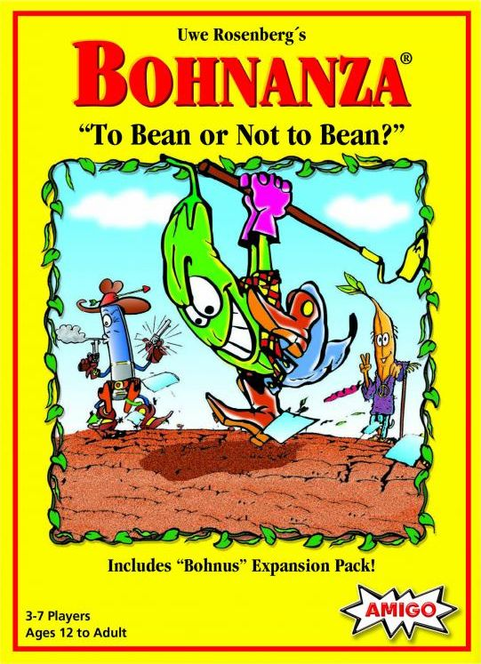
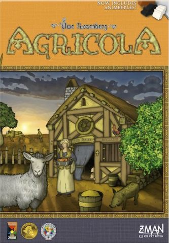
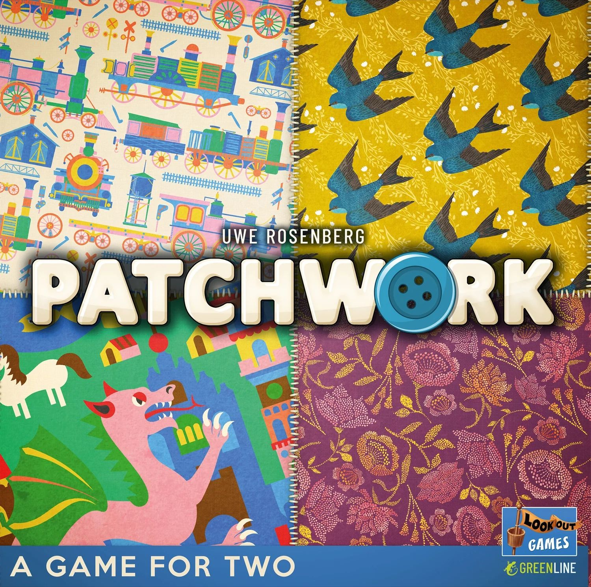
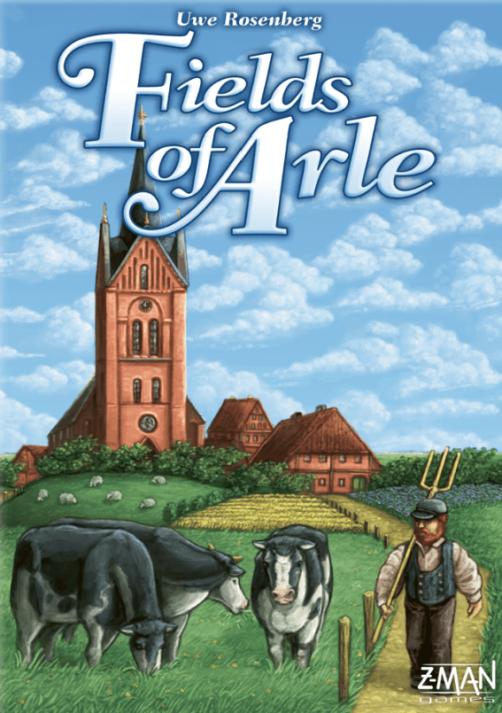
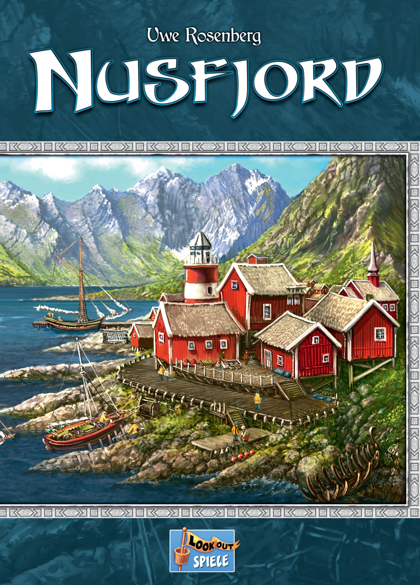
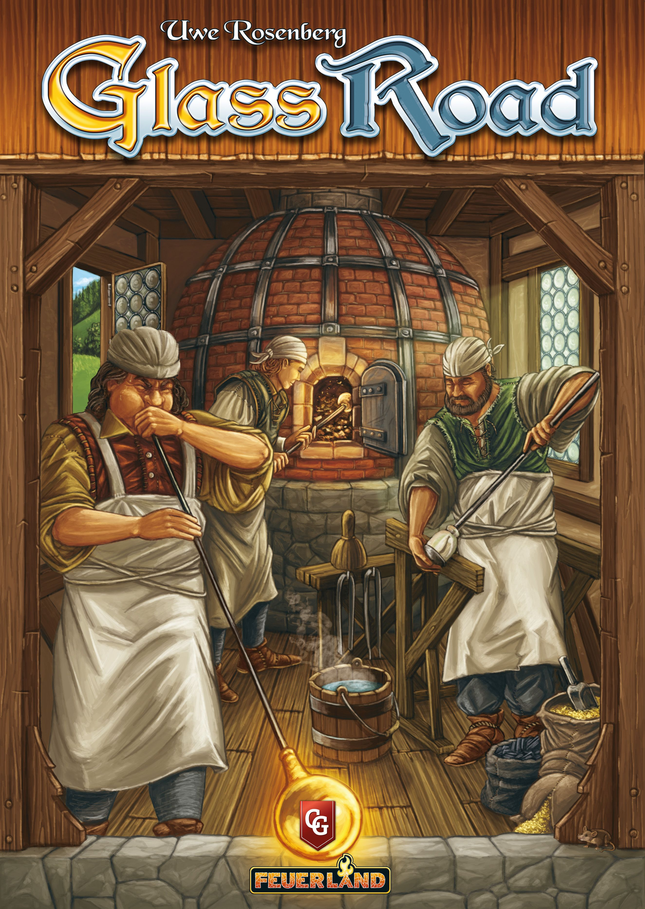

There's something deeply ironic about Uwe Rosenberg's career. He's one of the most prolific and celebrated designers in the history of board gaming — with multiple titles in BGG's top 100 and a catalogue spanning nearly 30 years — yet if you described his games to someone unfamiliar with the hobby, they'd think you were joking.

"So you... plant beans? And argue about bean futures? And that's *fun*?"

Yes. Yes it is. And the fact that Rosenberg made it fun is precisely the point.

## From Beans to Everything: A Career in Three Acts

### Act I: The Bean Phase (1997–2006)

Rosenberg's breakout game wasn't about farming fields or feeding Vikings. It was about *beans*.

[Bohnanza](https://boardgamegeek.com/boardgame/11/bohnanza) (1997) is one of those designs that shouldn't work. You can't rearrange your hand. You *must* plant beans in order. The whole game runs on negotiation — wheeling, dealing, and occasionally begging other players to take your unwanted coffee beans. It sits at a breezy 1.67 weight on BGG (currently rated 7.08, rank #546) and has sold millions of copies worldwide.

What Bohnanza revealed about Rosenberg was a designer who understood social dynamics and player interaction — qualities that would largely disappear from his later work, replaced by something equally compelling: the puzzle of building something from nothing.

### Act II: The Harvest Trilogy and Beyond (2007–2013)

In 2007, everything changed. [Agricola](https://boardgamegeek.com/boardgame/31260/agricola) didn't just put Rosenberg on the map — it redrew the map entirely. A worker placement game about medieval subsistence farming, Agricola introduced the concept of *feeding your family* as a persistent, anxiety-inducing pressure that turned every decision into agony. Do you plough a field or build a room? Gather wood or take the starting player token? Every round, the family demands food, and every round, you're never quite ready.

**Agricola by the numbers:** BGG rating 7.86, rank #64, weight 3.64. Players: 1–5. Time: 30–150 minutes.

The game was revolutionary. It spent years at the very top of the BGG rankings and single-handedly popularised the "feed your workers" mechanism that dozens of designers have iterated on since. The occupation and minor improvement cards gave it near-infinite replayability — there are over 360 unique cards in the base game alone.

What followed was a sequence of designs that explored similar territory with increasing ambition:

- [Le Havre](https://boardgamegeek.com/boardgame/35677/le-havre) (2008) — BGG rating 7.83, rank #80, weight 3.71. Shifted from farming to port economics, with a brilliant resource accumulation system where goods pile up on the board each round.
- [Ora et Labora](https://boardgamegeek.com/boardgame/70149/ora-et-labora) (2011) — BGG rating 7.67, rank #244, weight 3.89. A monastic economy game with a rotating resource wheel. The heaviest of the trilogy in terms of weight, and arguably the most underrated.
- [Caverna: The Cave Farmers](https://boardgamegeek.com/boardgame/102794/caverna-the-cave-farmers) (2013) — BGG rating 7.92, rank #62, weight 3.78. "Agricola, but friendlier" is the common shorthand, and it's not wrong. Caverna replaced the card-driven asymmetry with an open market of furnishings and added cave exploration. Less punishing, more sandbox.

### Act III: The Puzzle Master (2014–Present)

Then came [Patchwork](https://boardgamegeek.com/boardgame/163412/patchwork) (2014), and suddenly everyone had to rethink what an Uwe Rosenberg game could be.

A two-player-only abstract about quilting? From the guy who made Agricola? But Patchwork is a masterclass in elegant design — a tight, mean little puzzle about spatial efficiency and tempo. At weight 1.60 and a 15–30 minute playtime, it's the polar opposite of his heavy euros, and it's brilliant. BGG rating 7.58, rank #146.

**Patchwork proved Rosenberg wasn't just a "heavy euro" designer.** He was a *puzzle* designer — someone obsessed with the satisfaction of fitting pieces together, whether those pieces are polyominoes on a quilt board or workers on a farm.

This spatial puzzle obsession exploded in [A Feast for Odin](https://boardgamegeek.com/boardgame/177736/a-feast-for-odin) (2016), which might be Rosenberg's magnum opus. It combines a massive worker placement board (with over 60 action spaces) with a polyomino-based income system where you cover your personal board with goods to generate silver and prevent income penalties. It is *enormous* — in scope, in components, in decisions — and it sits at BGG rank #27 with an 8.16 rating and 3.87 weight.

## The Rosenberg Signature: What Makes His Games *His*

Across nearly three decades, certain patterns keep emerging:

**1. The pressure to sustain.** Whether it's feeding your family in Agricola, covering negative spaces in Feast for Odin, or managing your fishing fleet in Nusfjord — Rosenberg games almost always have a baseline cost of existence. You don't just build toward victory; you fight to survive first.

**2. Spatial puzzles.** From Patchwork to Feast for Odin to [Fields of Arle](https://boardgamegeek.com/boardgame/159675/fields-of-arle) (BGG rating 8.02, rank #103, weight 3.85), Rosenberg loves making you fit things into spaces. His personal boards aren't just score trackers — they're puzzles in themselves.

**3. Thematic groundedness.** His games are about *work* — farming, fishing, building, crafting. There are no dragons, no space empires, no zombie apocalypses. The fantasy is competence: the satisfaction of a well-run farm, a productive harbour, a thriving village. It's remarkably unsexy, and remarkably compelling.

**4. Solo modes that actually work.** Rosenberg was designing excellent solo experiences long before it was fashionable. Agricola, Caverna, Feast for Odin, [Hallertau](https://boardgamegeek.com/boardgame/300322/hallertau) (BGG rating 7.82, rank #301, weight 3.29), Fields of Arle — all have dedicated, well-designed solo modes. He understands that the puzzle at the heart of his games is inherently satisfying whether you're competing against others or against the game itself.

## The Smaller Gems

Rosenberg's heavyweight designs get the headlines, but some of his most interesting work happens at lower weight classes:

- [Glass Road](https://boardgamegeek.com/boardgame/143693/glass-road) (2013) — BGG rating 7.41, rank #388, weight 2.96. A card-driven resource management game with a unique production wheel mechanic where resources automatically convert when both halves are filled. Tight, clever, and perpetually underappreciated.
- [Nusfjord](https://boardgamegeek.com/boardgame/234277/nusfjord) (2017) — BGG rating 7.63, rank #383, weight 2.85. A compact worker placement game about running a Norwegian fishing village. It distils classic Rosenberg mechanisms into a lean 20–60 minute package. [We covered Nusfjord as a hidden gem recently](/posts/hidden-gem-nusfjord/) — it deserves far more attention than it gets.
- [Hallertau](https://boardgamegeek.com/boardgame/300322/hallertau) (2020) — BGG rating 7.82, rank #301, weight 3.29. A hop-farming game set in Bavaria with a clever card-management system. It shows Rosenberg still iterating, still finding new angles on worker placement after 15 years.

## Where to Start

If you've never played a Rosenberg game, your entry point depends entirely on your appetite for complexity:

| **Comfort Level** | **Start Here** | **Weight** |
|---|---|---|
| I'm new to modern board games | [Patchwork](https://boardgamegeek.com/boardgame/163412/patchwork) | 1.60 |
| I like medium-weight euros | [Nusfjord](https://boardgamegeek.com/boardgame/234277/nusfjord) | 2.85 |
| I want the classic experience | [Agricola](https://boardgamegeek.com/boardgame/31260/agricola) | 3.64 |
| I want the sandbox | [Caverna](https://boardgamegeek.com/boardgame/102794/caverna-the-cave-farmers) | 3.78 |
| Give me everything | [A Feast for Odin](https://boardgamegeek.com/boardgame/177736/a-feast-for-odin) | 3.87 |

Note: the weight ordering above matches verified BGG complexity ratings.

## The Quiet Legacy

Uwe Rosenberg doesn't do flashy. He doesn't chase trends. He doesn't make games with miniatures or legacy campaigns or app integrations. He makes games about planting, harvesting, building, and feeding — and he makes them better than almost anyone else.

In an era where board gaming often chases spectacle, there's something reassuring about a designer who's spent 30 years proving that the most compelling fantasy in gaming isn't saving the world. It's running a good farm.

---

*What's your favourite Uwe Rosenberg game? The anxiety of Agricola? The sprawl of Feast for Odin? The elegance of Patchwork? Let us know in the comments or find us on [Twitter](https://twitter.com/TheDiceDrop).*
