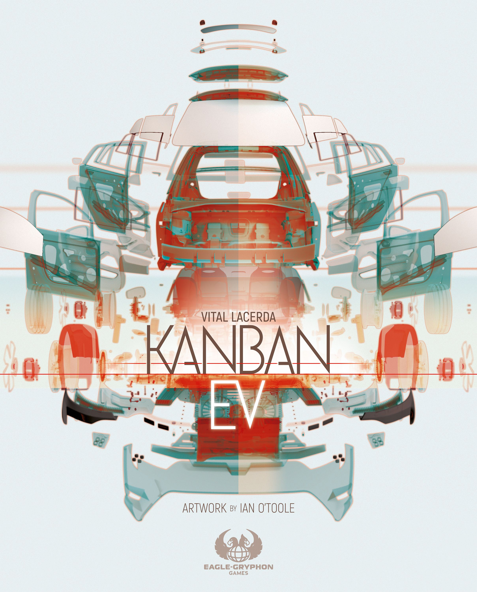

There's a particular breed of board gamer who, upon being told a game has a weight rating above 4.0 on BoardGameGeek, doesn't flinch — they *lean forward*. If you're one of those people, you've almost certainly encountered the work of **Vital Lacerda**. And if you haven't yet, you're about to understand why his name inspires a kind of reverent enthusiasm that few designers can match.

Lacerda doesn't make games for everyone. He makes games for people who want to spend three hours inside a system so intricate it feels like a living machine — and who walk away wanting to do it all again immediately.

## Who Is Vital Lacerda?

Born in Lisbon, Portugal, Lacerda came to game design from a career in graphic design and advertising. That background isn't incidental — it's *visible* in every game he makes. His titles don't just play well; they're meticulously crafted visual experiences, often in partnership with artist **Ian O'Toole**, whose clean iconography and muted colour palettes have become inseparable from the Lacerda brand.

His first major release, [Vinhos](https://boardgamegeek.com/boardgame/42052/vinhos) (2010), announced his intentions clearly: a game about Portuguese winemaking with a weight of **4.20** on BGG. This wasn't a designer easing into the hobby. This was someone arriving fully formed with a vision for what heavy euro games could be.

Since then, Lacerda has built a catalogue of eight major designs, almost all rated above 4.0 in complexity. That's not a coincidence — it's a philosophy.

## The Lacerda Signature: Theme as Structure

What separates a Lacerda game from other heavy euros? **Theme isn't decoration — it's architecture.**

In many complex games, the theme is draped over mechanical scaffolding like a tablecloth over furniture. You could swap "trading spices" for "mining asteroids" and nothing would change. Lacerda works differently. His mechanisms grow *out of* the theme so organically that learning the rules often means understanding the real-world system the game models.

Take [The Gallerist](https://boardgamegeek.com/boardgame/125153/the-gallerist) (BGG rating **8.00**, weight **4.21**, rank #82). You're running an art gallery. You discover artists, promote their work, attract visitors, close sales, and manage your international reputation. Every action maps to something a real gallerist would do. The genius is that these thematic actions create *mechanical interdependencies* — you can't sell art without visitors, can't attract visitors without famous artists, can't make artists famous without exhibiting their work. The theme *is* the engine.

Or consider [Kanban EV](https://boardgamegeek.com/boardgame/284378/kanban-ev) (BGG rating **8.38**, weight **4.29**, rank #45) — a game about managing an electric vehicle factory. The kanban system (a real lean manufacturing methodology) drives every decision. You're managing production lines, research, logistics, and design, all while Sandra — the factory manager — evaluates your performance. It's a game about efficiency that *teaches* efficiency, and it's Lacerda's highest-rated title on BGG for good reason.

## The Crown Jewel: Lisboa

If there's one game that represents peak Lacerda, it's [Lisboa](https://boardgamegeek.com/boardgame/161533/lisboa) (BGG rating **8.17**, weight **4.57**, rank #69).

Set in the aftermath of the 1755 Lisbon earthquake — one of the deadliest natural disasters in European history — Lisboa puts you in the role of a nobleman helping to rebuild the city. You'll navigate the political landscape of the Marquis de Pombal, the Catholic Church, and the King, using an elegant card-play system that manages to feel both deeply strategic and historically grounded.

The game is *heavy* — 4.57 weight puts it among the most complex games on BGG — but players consistently describe the experience as surprisingly intuitive once you understand the card logic. Each card can be played to the treasury (for political influence) or to your portfolio (for city-building actions), and this single fork creates a decision tree that branches into genuinely different strategic paths every game.

The historical setting isn't window dressing. The real rebuilding of Lisbon involved exactly these tensions — secular versus religious authority, individual ambition versus collective good, short-term profit versus long-term urban planning. Lacerda translates all of this into mechanics, and the result is a game that *teaches* you about a historical moment while giving you one of the richest strategic experiences in the hobby.

## To Mars and Beyond

Lacerda's ambition hasn't dimmed. [On Mars](https://boardgamegeek.com/boardgame/184267/on-mars) (BGG rating **8.16**, weight **4.63**, rank #58) is his most complex design — a sprawling simulation of building a functioning colony on Mars. You split your time between an orbital station and the planet's surface, managing oxygen, water, resources, and research. It's the kind of game where explaining the setup takes twenty minutes and you still have questions by round three.

And yet, On Mars might be the purest expression of what Lacerda does best. Every system models something real about the challenge of colonising another planet. The shuttle between orbit and surface isn't just a game mechanism — it's the *actual logistical bottleneck* that makes Mars colonisation hard. When you finally get your colony humming, producing oxygen, growing food, and conducting research in harmony, the satisfaction is immense precisely because the struggle was real.

[Weather Machine](https://boardgamegeek.com/boardgame/237179/weather-machine) (2022, BGG rating **7.69**, weight **4.56**) pushed into near-science-fiction territory — you're scientists working on a machine that controls the weather, navigating government funding, research priorities, and the ethical implications of climate manipulation. It's trademark Lacerda: dense, thematic, and utterly unique.

## The Lacerda Catalogue: By the Numbers

Here's a quick guide to his major designs, ordered by BGG weight:

| Game | Year | BGG Rating | Weight | Players | Play Time |
|------|------|-----------|--------|---------|-----------|
| [Escape Plan](https://boardgamegeek.com/boardgame/142379/escape-plan) | 2019 | 7.48 | 3.68 | 1–5 | 120 min |
| [CO₂: Second Chance](https://boardgamegeek.com/boardgame/214887/co2-second-chance) | 2018 | 7.47 | 4.09 | 1–4 | 120 min |
| [Vinhos](https://boardgamegeek.com/boardgame/42052/vinhos) | 2010 | 7.46 | 4.20 | 2–4 | 135 min |
| [The Gallerist](https://boardgamegeek.com/boardgame/125153/the-gallerist) | 2015 | 8.00 | 4.21 | 1–4 | 150 min |
| [Kanban EV](https://boardgamegeek.com/boardgame/284378/kanban-ev) | 2020 | 8.38 | 4.29 | 1–4 | 180 min |
| [Weather Machine](https://boardgamegeek.com/boardgame/237179/weather-machine) | 2022 | 7.69 | 4.56 | 2–4 | 150 min |
| [Lisboa](https://boardgamegeek.com/boardgame/161533/lisboa) | 2017 | 8.17 | 4.57 | 1–4 | 120 min |
| [On Mars](https://boardgamegeek.com/boardgame/184267/on-mars) | 2020 | 8.16 | 4.63 | 1–4 | 150 min |

Notice the pattern: *nothing* below 3.68. Lacerda doesn't do lightweight. But also notice the ratings — his four heaviest games are all rated above 7.6, and three of them crack the BGG top 100. Complexity, in Lacerda's hands, isn't a barrier. It's the point.

## The Ian O'Toole Factor

You can't talk about Lacerda without talking about **Ian O'Toole**. The Irish graphic designer and illustrator has been Lacerda's primary artistic collaborator since The Gallerist, and their partnership has produced some of the most visually distinctive games in the hobby.

O'Toole's style is unmistakable: clean lines, restrained colour palettes, iconography that's dense but learnable, and a sense of *space* on the board that makes complex games feel less claustrophobic than they have any right to. Lisboa's board — a reconstruction of the city in cross-section — is genuinely beautiful. On Mars' dual-layer board (orbit and surface) is a masterclass in functional art direction.

The partnership works because both share the same philosophy: form follows function, but function can be gorgeous.

## Where to Start

If you're Lacerda-curious but intimidated by the weight ratings, here's a roadmap:

**Start here:** [The Gallerist](https://boardgamegeek.com/boardgame/125153/the-gallerist) — At 4.21 weight, it's on the lighter end of Lacerda's catalogue (yes, really). The theme is immediately accessible, the turn structure is clean (you go to a location, do an action), and the "kicked out" mechanism — where other players can take bonus actions when you move into their space — gives the game a social rhythm that keeps downtime low.

**Level up:** [Kanban EV](https://boardgamegeek.com/boardgame/284378/kanban-ev) — Slightly heavier at 4.29, but the factory theme makes the systems intuitive. If you've ever worked in a job with performance reviews, Sandra the manager will feel *uncomfortably* familiar.

**Go deep:** [Lisboa](https://boardgamegeek.com/boardgame/161533/lisboa) — The card mechanism clicks surprisingly fast, but the strategic depth is bottomless. This is many players' pick for Lacerda's masterpiece.

**Peak Lacerda:** [On Mars](https://boardgamegeek.com/boardgame/184267/on-mars) — Only attempt this once you're comfortable with the Lacerda style. At 4.63 weight, it's his Everest. But the view from the top is magnificent.

## The Lacerda Devotees

There's a reason the BGG forums for Lacerda games read differently from most. Players don't just *like* these games — they *study* them. You'll find strategy threads dozens of pages deep, passionate debates about optimal opening moves, and a remarkable number of people who own the entire catalogue.

As one BGG user put it: "Lacerda games are the ones I think about when I'm not playing board games."

That's the Lacerda effect. His games don't just occupy your table — they occupy your brain. And for those of us who want our hobby to challenge us, to teach us something, to make us feel like we've genuinely *accomplished* something in three hours — there's no one else quite like him.

---

*Vital Lacerda's games are published by [Eagle-Gryphon Games](https://www.eaglegames.net/). All BGG data accurate as of May 2026.*
