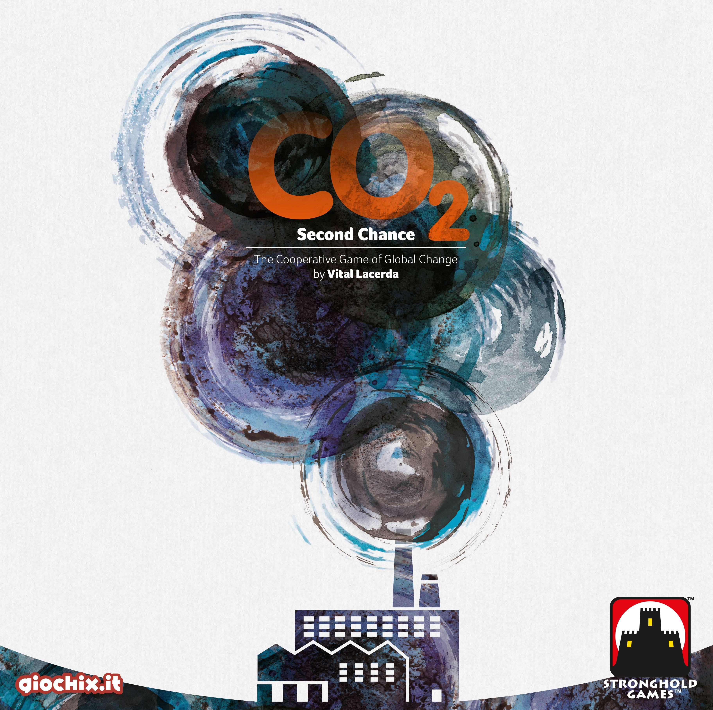
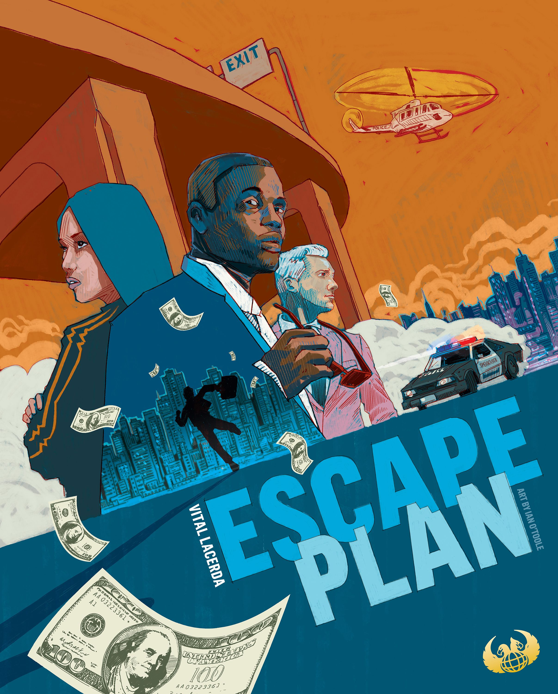
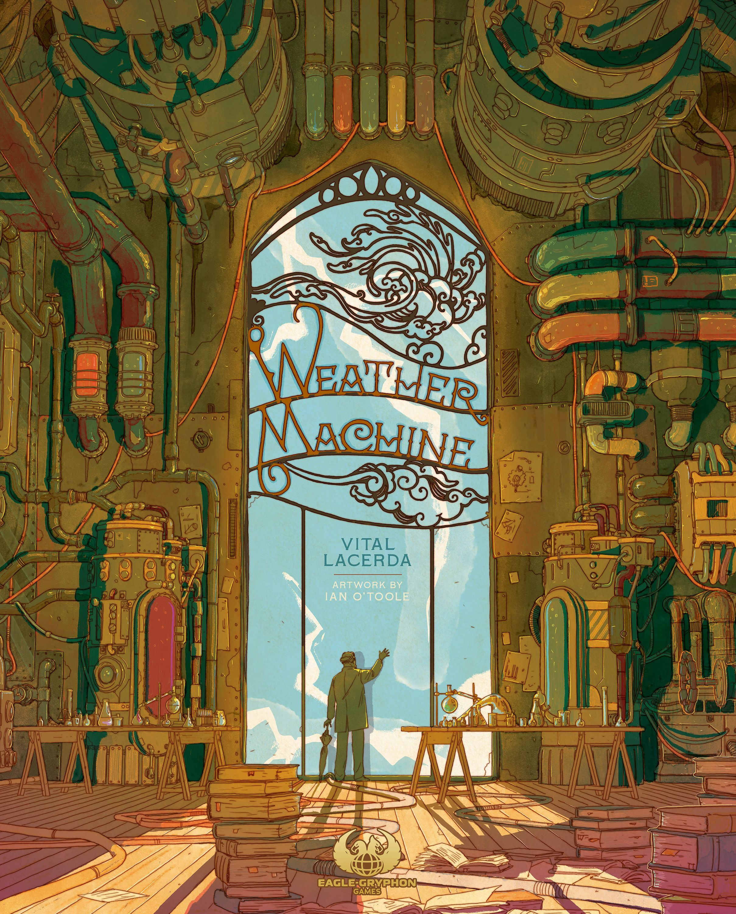

There's a moment in every Vital Lacerda game — usually about 40 minutes in, halfway through someone's first teach — where a player's eyes go glassy. The mechanisms are piling up. The action spaces connect to the resource tracks which connect to the scoring conditions which connect to the timeline which connects back to the action spaces. It feels like too much.

And then, sometime around turn three, something clicks. The interlocking gears suddenly make *sense*. You don't just see what you can do — you see *why* every mechanism exists, why it had to be that way, why removing any single piece would collapse the whole structure. That's the Lacerda moment. And once you've felt it, you'll chase it forever.

## The Man Behind the Mechanisms

Vital Lacerda is a Portuguese architect by training, and it shows. His games don't feel designed so much as *engineered* — every system load-bearing, every connection structural. Where most designers aim for elegance through simplicity, Lacerda finds elegance through *coherence*. His games are complex, yes, but they're never arbitrary. Every rule exists for a thematic reason.

Since [Vinhos](https://boardgamegeek.com/boardgame/42052/vinhos) launched in 2010, Lacerda has built a catalogue that reads like a masterclass in heavy euro design. His partnership with Eagle-Gryphon Games and artist Ian O'Toole (from [The Gallerist](https://boardgamegeek.com/boardgame/125153/the-gallerist) onwards) has produced some of the most visually stunning and mechanically dense games in the hobby.

He doesn't chase trends. He doesn't simplify for mass appeal. He builds the game the theme demands, and trusts players to meet him there.

## The Catalogue: A Tour Through Lacerda's World

### Vinhos (2010) — Where It All Began

| Stat | Value |
|------|-------|
| Players | 2–4 |
| Play Time | 135 min |
| BGG Rating | 7.46 |
| Weight | 4.20 / 5 |
| BGG Rank | #723 |

[Vinhos](https://boardgamegeek.com/boardgame/42052/vinhos) is Lacerda's debut, and it's a Portuguese wine-making game that wears its theme on its sleeve. You're managing vineyards, hiring enologists, ageing wines, and preparing for wine fairs — and every decision feeds into every other decision in ways that feel almost uncomfortably tight.

The 2016 Deluxe Edition streamlined some of the original's rougher edges, but this remains a game that demands respect. It's not where most people *start* with Lacerda, but it's where the philosophy was born: model the real system, then let players find their path through it.

### The Gallerist (2015) — The Breakout

| Stat | Value |
|------|-------|
| Players | 1–4 |
| Play Time | 150 min |
| BGG Rating | 8.00 |
| Weight | 4.21 / 5 |
| BGG Rank | #82 |

[The Gallerist](https://boardgamegeek.com/boardgame/125153/the-gallerist) is where Lacerda found his stride and, crucially, where Ian O'Toole entered the picture. You're running an art gallery — discovering artists, buying and displaying works, attracting visitors, managing reputation. The theme is unusual and the execution is gorgeous.

This is also where Lacerda's signature "kick-out" mechanism debuted. When another player moves to the space you're occupying, you get a bonus executive action. It's a brilliant piece of interaction design: you're always watching what everyone else is doing, because their moves *give* you things. Passive observation becomes active strategy.

### Lisboa (2017) — The Masterpiece

| Stat | Value |
|------|-------|
| Players | 1–4 |
| Play Time | 120 min |
| BGG Rating | 8.17 |
| Weight | 4.57 / 5 |
| BGG Rank | #69 |

[Lisboa](https://boardgamegeek.com/boardgame/161533/lisboa) is the game many consider Lacerda's finest work. Set in the aftermath of the 1755 Lisbon earthquake, you're rebuilding a city from ruins — constructing buildings, gaining the favour of nobles, trading goods, and managing your influence with the church and the crown.

The multi-use card system is extraordinary. Every card can be played in multiple ways depending on where and how you use it, and the cascading consequences of each play ripple across the entire board state. At weight 4.57, this is a *commitment* — but it's a commitment that pays dividends on every subsequent play. The way the theme of reconstruction permeates every mechanism is Lacerda at his most emotionally resonant.

### CO₂: Second Chance (2018) — The Cooperative Detour

| Stat | Value |
|------|-------|
| Players | 1–4 |
| Play Time | 120 min |
| BGG Rating | 7.47 |
| Weight | 4.09 / 5 |
| BGG Rank | #942 |

[CO₂: Second Chance](https://boardgamegeek.com/boardgame/214887/co2-second-chance) is the outlier — a semi-cooperative game about building sustainable energy infrastructure before climate change renders the planet uninhabitable. You're competing for points, but if the group fails to control pollution, everyone loses.

It's the "lightest" Lacerda at weight 4.09 (which is still heavier than 95% of games in existence), and the cooperative tension adds a fascinating layer. You *want* to free-ride on others' green investments, but you *need* to contribute or the whole system collapses. The parallel to real climate politics is painfully on the nose.

### Escape Plan (2019) — The Heist Movie

| Stat | Value |
|------|-------|
| Players | 1–5 |
| Play Time | 120 min |
| BGG Rating | 7.48 |
| Weight | 3.68 / 5 |
| BGG Rank | #632 |

[Escape Plan](https://boardgamegeek.com/boardgame/142379/escape-plan) is Lacerda's most accessible game by the numbers — weight 3.68, which is practically a gateway by his standards. You're a gang of thieves trying to flee the city after a heist, gathering your hidden loot caches while avoiding the police.

The asymmetric information is what makes this sing. Each player knows where *their* loot is hidden but not anyone else's, creating a brilliant fog of deduction. It's also the most directly interactive Lacerda game — you're actively blocking escape routes, manipulating police movement, and occasionally throwing your fellow criminals under the bus.

### On Mars (2020) — The Summit

| Stat | Value |
|------|-------|
| Players | 1–4 |
| Play Time | 150 min |
| BGG Rating | 8.16 |
| Weight | 4.63 / 5 |
| BGG Rank | #58 |

[On Mars](https://boardgamegeek.com/boardgame/184267/on-mars) is the heaviest game in Lacerda's catalogue (weight 4.63) and possibly the most ambitious board game ever published. You're building a colony on Mars — and the game models *everything*. Orbital station logistics. Surface construction. Life support systems. Scientific research. Mining. Power generation. Rover deployment.

The orbit-to-surface shuttle mechanic is inspired: you physically switch between two game boards (the orbital station and the planet surface), and the actions available to you change completely depending on where you are. It's dizzying on first play and mesmerising on the third.

### Kanban EV (2020) — The Crowd Favourite

| Stat | Value |
|------|-------|
| Players | 1–4 |
| Play Time | 180 min |
| BGG Rating | 8.38 |
| Weight | 4.29 / 5 |
| BGG Rank | #45 |

[Kanban EV](https://boardgamegeek.com/boardgame/284378/kanban-ev) is Lacerda's highest-rated game on BGG (8.38) and, somewhat surprisingly, a game about managing an electric vehicle factory. You're working on the production floor — designing cars, sourcing parts, testing vehicles, and presenting your work to Sandra, the factory manager who evaluates your performance.

Sandra is the game's masterstroke. She's an automated NPC who moves around the factory, and when she arrives at your department, you'd better have something to show for yourself. It's the best implementation of "boss pressure" in any board game — a constant, low-grade anxiety that drives every decision. The game models lean manufacturing (the Toyota Production System, specifically) with an obsessive attention to detail that would make any operations manager weep with recognition.

### Weather Machine (2022) — The Latest Chapter

| Stat | Value |
|------|-------|
| Players | 2–4 |
| Play Time | 150 min |
| BGG Rating | 7.69 |
| Weight | 4.56 / 5 |
| BGG Rank | #710 |

[Weather Machine](https://boardgamegeek.com/boardgame/237179/weather-machine) is Lacerda's most recent major release, and it tackles — of all things — weather control technology. You're a scientist working to fix a malfunctioning weather machine, conducting research, deploying bots, and publishing papers.

At weight 4.56, it's right up there with Lisboa and On Mars in terms of complexity, and it features some of Lacerda's most innovative mechanical ideas. The government and initiative tracks create a fascinating meta-game above the main action, and the bot deployment system adds a spatial puzzle that echoes On Mars's rover mechanics. It divided opinion more than his other recent titles — some find it a touch too abstract in its theming — but the mechanical craft is undeniable.

## The Lacerda Signature

What makes a Lacerda game a *Lacerda game*? After playing most of his catalogue, a few signatures emerge:

**Thematic integration over abstraction.** Lacerda doesn't start with mechanisms and paste a theme on top. He starts with a real-world system (wine production, car manufacturing, Mars colonisation) and models it until the mechanisms *are* the theme. You don't learn Kanban EV's rules — you learn how a factory works.

**Interconnected systems.** Nothing exists in isolation. Every subsystem feeds into every other subsystem, creating emergent complexity from individually comprehensible parts. The weight comes not from any single rule being complicated, but from the sheer number of connections between simple rules.

**The teach is the barrier.** Ask anyone who's bounced off a Lacerda game what happened, and they'll almost always say the same thing: the teach. These games take 30-45 minutes to explain, and no amount of clever graphic design (though Ian O'Toole certainly tries) can change the fact that there's a lot to internalise. But — and this is crucial — the games themselves are *not* that hard to play once you understand the structure. The decision space is wide but the decision *process* is usually intuitive.

**Player interaction through shared spaces.** Lacerda's games aren't multiplayer solitaire. The kick-out mechanism, the shared market dynamics, the limited action spaces — other players' moves constantly reshape your plans. It's indirect interaction, but it's *constant*.

## Where to Start

If you've never played a Lacerda game, don't start with On Mars. That's how you end up never playing a second one.

**Escape Plan** (weight 3.68) is the lightest entry point, with a theme that immediately clicks and an interactive structure that keeps everyone engaged. **The Gallerist** (weight 4.21) is the classic recommendation for a reason — it's heavy but remarkably intuitive once the structure clicks.

If you want the best game in the catalogue, the community consensus points to **Kanban EV** (BGG rank #45, rating 8.38). If you want the most *Lacerda* Lacerda game — the one that best represents his design philosophy — **Lisboa** is the answer.

And if you're already deep in the hobby, playing On Mars at weight 4.63 is something every serious gamer should experience at least once. Whether you love it or hate it, you won't forget it.

## The Bottom Line

Vital Lacerda isn't for everyone, and he'd probably be the first to admit it. His games demand time (2-3 hours minimum), table space (bring a big table), and cognitive investment (bring a rested brain). They're the board game equivalent of a three-hour prestige drama — if you want a quick dopamine hit, look elsewhere.

But if you want to feel like you *mastered* something? If you want a game that rewards your fifth play more than your first? If you want to sit at the table and feel the satisfaction of a perfectly executed plan rippling through six interconnected systems?

Lacerda's your designer. Welcome to the deep end.

---

*Have a favourite Lacerda game? Think we got the ranking wrong? Come argue with us on [Twitter](https://twitter.com/TheDiceDrop).*
