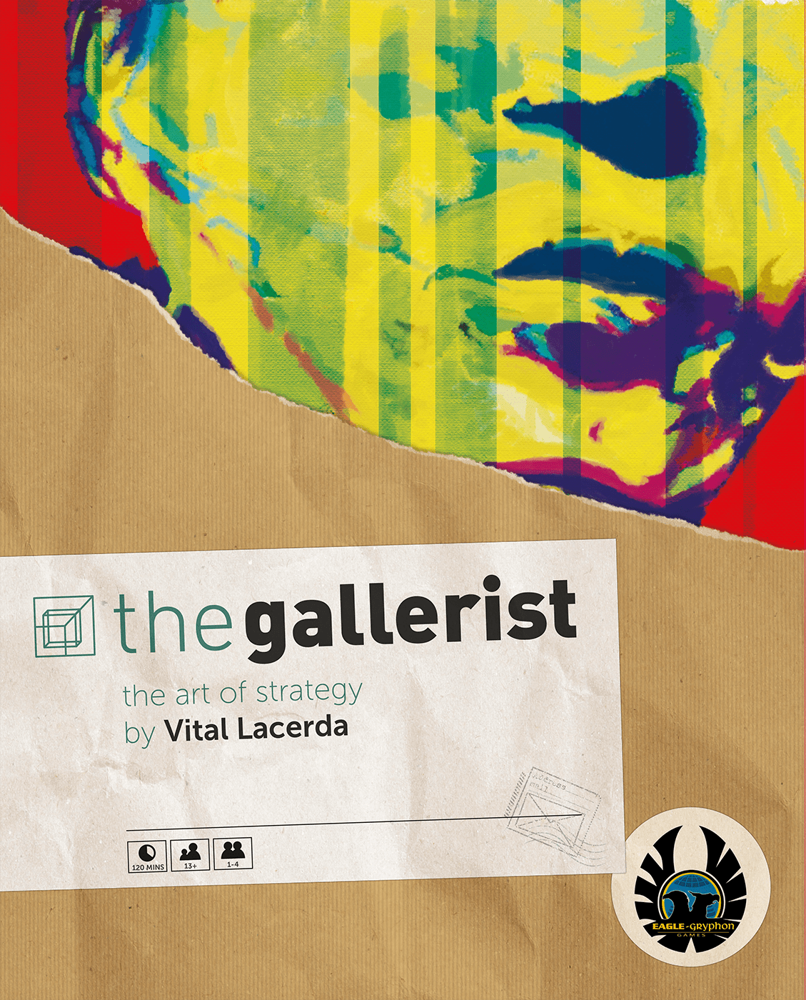

There's a specific moment in every Vital Lacerda game. You're twenty minutes into the teach, staring at a board covered in interlocking tracks, influence markets, and action spaces that seem to connect to everything else. Your brain is screaming that this is too much. And then, somewhere around turn three, something clicks. The systems aren't arbitrary — they're *architectural*. Every connection exists because the theme demands it. Every mechanism serves the story the game is telling.

That's the Lacerda experience. And there's nothing else quite like it in board gaming.

## Who Is Vital Lacerda?

Vital Lacerda is a Portuguese game designer and graphic designer who has carved out one of the most distinctive niches in modern board gaming. Where many designers work across weight classes, Lacerda has committed entirely to the heavy euro — games that sit firmly above a BGG weight of 4.0 and demand genuine cognitive investment from their players.

What makes him unusual isn't just the complexity. Plenty of designers make complex games. It's the *coherence*. A Lacerda game is a simulation disguised as a euro. The mechanisms don't exist because they create interesting decisions (though they do) — they exist because that's how the real system works. Running a winery means managing vintages, weather, and expert critics. Rebuilding Lisbon after the 1755 earthquake means navigating the tension between royal decree, church influence, and noble ambition. These aren't pasted-on themes. They're the structural DNA of the design.

His long-running partnership with artist Ian O'Toole has also given his games a visual identity that's instantly recognisable — dense but readable boards, a distinctive colour palette, and iconography that somehow makes 200-component games feel navigable.

## The Games: A Catalogue of Ambition

### Vinhos Deluxe Edition (2016)

| | |
|---|---|
| **BGG Rating** | 8.05 |
| **Weight** | 3.99 / 5 |
| **Players** | 1–4 |
| **Play Time** | ~180 min |
| **BGG Rank** | #155 |

[Vinhos Deluxe Edition on BGG](https://boardgamegeek.com/boardgame/175640/vinhos-deluxe-edition)

Lacerda's earliest major design, and the one that established his template. You're running a Portuguese winery — buying vineyards, hiring enologists, aging wines, and presenting them at fairs for critical evaluation. The Deluxe Edition refined the original 2010 release with a streamlined action display and the option to play either the original "reserve" rules or the new edition.

What makes Vinhos fascinating as a starting point is that it's one of the lightest Lacerda games at weight 3.99 (only Escape Plan is lighter at 3.68) — and it's still heavier than most games in anyone's collection. It's the gateway drug where the gateway is still a 3-hour commitment. But for Lacerda, this is where the design language was born: thematic integration above all, player interaction through shared markets rather than direct conflict, and the sense that you're operating within a real economic system.

### The Gallerist (2015)

| | |
|---|---|
| **BGG Rating** | 8.00 |
| **Weight** | 4.21 / 5 |
| **Players** | 1–4 |
| **Play Time** | ~150 min |
| **BGG Rank** | #82 |

[The Gallerist on BGG](https://boardgamegeek.com/boardgame/125153/the-gallerist)

The art world as a euro game. You discover artists, promote their work, manage a gallery, attract visitors and collectors, and manipulate the international art market. The Gallerist is often cited as the best entry point into Lacerda's catalogue because its theme is immediately intuitive — everyone understands "buy low, sell high" even when the mechanism is "discover artist early, promote them into fame, sell their work when prices peak."

The genius here is the *kickout action*. When you move to a location another player occupies, they get a bonus action. This creates a constant tension between doing what you want and gifting opponents opportunities. It's player interaction without aggression — you're not attacking anyone, but you're always thinking about what you're giving away.

### Lisboa (2017)

| | |
|---|---|
| **BGG Rating** | 8.17 |
| **Weight** | 4.57 / 5 |
| **Players** | 1–4 |
| **Play Time** | ~120 min |
| **BGG Rank** | #69 |

[Lisboa on BGG](https://boardgamegeek.com/boardgame/161533/lisboa)

Many consider this Lacerda's masterpiece. Set in the aftermath of the 1755 Lisbon earthquake — one of the deadliest natural disasters in European history — Lisboa casts players as nobles working to rebuild the city. You'll petition the King, the Prime Minister (the Marquis of Pombal), and the Cardinal, each offering different resources and powers. Cards can be played to the treasury (for immediate resources), to your portfolio (for end-game scoring), or to nobles (triggering their special abilities).

At weight 4.57, this is uncompromisingly heavy. But it's also where Lacerda's thematic integration reaches its peak. The rubble mechanics, the political tension between church and state, the physical reconstruction of city blocks — it all feels like you're making historically meaningful decisions rather than optimising a point salad. The dual-use card system is also one of the most elegant mechanisms in heavy gaming: every card presents a genuine dilemma, and there's never an obvious play.

### CO₂: Second Chance (2018)

| | |
|---|---|
| **BGG Rating** | 7.47 |
| **Weight** | 4.09 / 5 |
| **Players** | 1–4 |
| **Play Time** | ~120 min |
| **BGG Rank** | #942 |

[CO₂: Second Chance on BGG](https://boardgamegeek.com/boardgame/214887/co2-second-chance)

The most *prescient* Lacerda game. Originally released in 2012, CO₂ was redesigned as Second Chance with a cooperative/semi-cooperative mode. Players work as energy companies transitioning from fossil fuels to renewable energy, and if global pollution rises too high, everyone loses. It's Lacerda's most explicitly political game, and one of the few heavy euros with a genuine cooperative loss condition.

It's also his lowest-rated major release (7.47 on BGG), and that tells an interesting story. The semi-cooperative tension — you need to collectively solve the pollution crisis while individually scoring the most points — can feel awkward. Some players find the cooperative loss condition punishing and the competitive scoring contradictory. But for those who click with it, CO₂ offers something no other Lacerda game does: genuine moral weight. When you build a coal plant because it's more profitable, you *feel* it.

### Escape Plan (2019)

| | |
|---|---|
| **BGG Rating** | 7.48 |
| **Weight** | 3.68 / 5 |
| **Players** | 1–5 |
| **Play Time** | ~120 min |
| **BGG Rank** | #632 |

[Escape Plan on BGG](https://boardgamegeek.com/boardgame/142379/escape-plan)

The outlier. Escape Plan is a heist getaway game — you've already robbed the bank, and now you need to escape the city with your loot while avoiding an escalating police presence. At weight 3.68, it's Lacerda's lightest game by a significant margin, and it plays up to 5 players.

It's also his most *spatial* game. Movement through the city matters in a way it doesn't in his other designs, and the asymmetric information about escape routes creates a different kind of tension. Critics note it doesn't quite reach the interconnected brilliance of his heavier designs, and the BGG rating (7.48) reflects that. But as a change of pace from the Lacerda catalogue, it's a fascinating design — proof that his systems-thinking approach works even when the theme is pulpy rather than historical.

### Kanban EV (2020)

| | |
|---|---|
| **BGG Rating** | 8.38 |
| **Weight** | 4.29 / 5 |
| **Players** | 1–4 |
| **Play Time** | ~180 min |
| **BGG Rank** | #45 |

[Kanban EV on BGG](https://boardgamegeek.com/boardgame/284378/kanban-ev)

A reimplementation of the 2014 original, now set in an electric vehicle factory. Kanban EV is arguably Lacerda's most *game-y* design — the factory management theme is perfectly suited to the interlocking department system (design, logistics, assembly, R&D), and the Sandra boss character who wanders the factory evaluating your work adds a layer of strategic timing that's uniquely engaging.

At rank #45 and a rating of 8.38, this is Lacerda's highest-ranked game on BGG. There's a reason: it's the design where theme and mechanism feel most naturally unified. Every action makes *intuitive* sense — of course you need to get parts from logistics before assembly can build the car. Of course R&D upgrades improve future production. The factory metaphor makes the system learnable in a way that "rebuild 18th-century Lisbon" simply doesn't, and that accessibility-within-complexity is why it resonates so broadly.

### On Mars (2020)

| | |
|---|---|
| **BGG Rating** | 8.16 |
| **Weight** | 4.63 / 5 |
| **Players** | 1–4 |
| **Play Time** | ~150 min |
| **BGG Rank** | #58 |

[On Mars on BGG](https://boardgamegeek.com/boardgame/184267/on-mars)

Peak Lacerda complexity. At weight 4.63, On Mars is one of the heaviest games in BGG's top 100. You're building a Mars colony, splitting your time between the orbital station (where supplies arrive) and the planet surface (where construction happens). The shuttle between orbit and surface is the central tempo mechanism — you can only travel during certain phases, so planning your transitions is the game's fundamental puzzle.

On Mars is the Lacerda game that generates the strongest reactions. Its advocates consider it a triumph of systems design — every decision ripples through the colony in satisfying ways. Its detractors find it overcomplicated, with too many subsystems competing for attention. Both are right. This is a game that rewards deep investment but punishes casual engagement. If you're going to play On Mars, you're committing to *On Mars* as a hobby.

### Weather Machine (2022)

| | |
|---|---|
| **BGG Rating** | 7.69 |
| **Weight** | 4.56 / 5 |
| **Players** | 2–4 |
| **Play Time** | ~150 min |
| **BGG Rank** | #710 |

[Weather Machine on BGG](https://boardgamegeek.com/boardgame/237179/weather-machine)

Lacerda's most recent major release, and perhaps his most divisive. You're scientists working with (and potentially against) a professor whose weather-controlling machine has gone haywire. The theme is more science-fiction than Lacerda's usual historical grounding, and the mechanisms — chemical formulas, weather tokens, government funding — are correspondingly more abstract.

At weight 4.56 and a BGG rank of #710, Weather Machine hasn't achieved the critical consensus of Lisboa or Kanban EV. Some players find the theme too disconnected from the mechanics, which is a rare criticism for a Lacerda game. Others praise the research-and-publication system as one of his most innovative subsystems. It's the game that suggests Lacerda may be pushing against the edges of what thematic integration can do in the heavy euro space — and whether that's exciting or concerning depends entirely on what you want from his designs.

## The Lacerda Design Philosophy

Across eight major releases, several consistent principles emerge:

**Thematic integration isn't decoration — it's architecture.** Every Lacerda game starts from a real system (wine production, art markets, urban reconstruction, factory management) and builds mechanisms that model how that system actually works. This is why his games are heavy: reality is complex, and he refuses to simplify it into abstraction.

**Player interaction through shared systems, not direct conflict.** You'll rarely attack another player in a Lacerda game. Instead, you compete through shared markets, action spaces, and timing. The Gallerist's kickout mechanism, Kanban EV's Sandra evaluations, Lisboa's noble petitions — these create tension without aggression. It's the European design tradition taken to its logical extreme.

**Every game teaches you a system.** There's a genuine educational quality to Lacerda's designs. After playing Vinhos, you understand something about winemaking. After Lisboa, you know about the 1755 earthquake and the Marquis of Pombal's reforms. After Kanban EV, lean manufacturing principles feel intuitive. This isn't accidental — it's core to why the games feel *meaningful* rather than merely clever.

**Dual-use decisions create genuine dilemmas.** Cards in Lisboa can be played three ways. Actions in The Gallerist come with kickout costs. Every choice in a Lacerda game has multiple valid paths, and the "right" answer depends on board state, opponent timing, and long-term strategy. There's very little autopilot.

## Where to Start

If you've never played a Lacerda game, **The Gallerist** or **Kanban EV** are the consensus entry points. The Gallerist has the most intuitive theme and the smoothest teach. Kanban EV has the most natural connection between mechanism and setting — everything just *makes sense* when it's framed as factory operations.

If you're already a heavy euro player and want to go straight to the deep end, **Lisboa** is the masterpiece — dense, rewarding, and thematically extraordinary.

And if you need a solo recommendation, **On Mars** has one of the strongest solo modes in the heavy euro space, with a well-designed automa that captures the colony-building tension without feeling like multiplayer solitaire.

## The Bottom Line

Vital Lacerda makes games for people who want to *learn* a game, not just play one. His designs reward investment — not just of time at the table, but of cognitive engagement with the systems he's modelling. They're not for everyone, and that's precisely the point. In a hobby that increasingly optimises for accessibility and broad appeal, Lacerda's commitment to ambitious, uncompromising design is something worth celebrating.

The man builds cathedrals out of cardboard. Not everyone wants to live in a cathedral. But those who do won't find a better architect.
