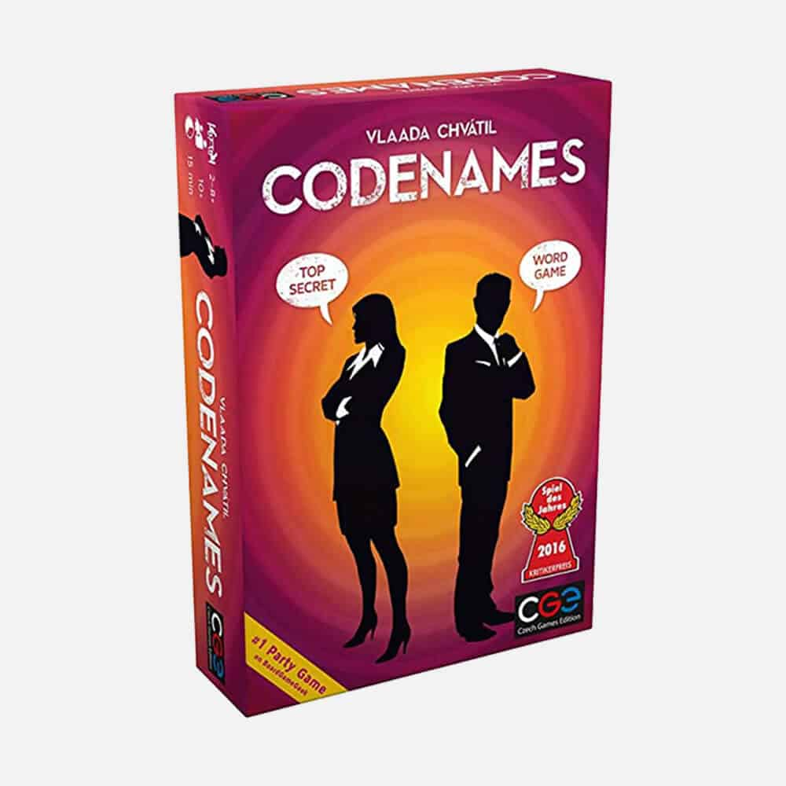
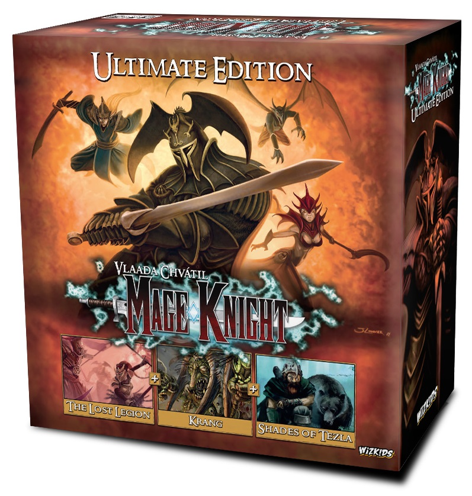

Look, if you're even remotely interested in board games, you've heard of Vlaada Chvátil. This guy is a legend in the board gaming world, and not just for cranking out hits. He’s the kind of designer who makes you scratch your head in disbelief at how he can jump from one genre to another without a hitch. We're talking about the creator of [Through the Ages: A Story of Civilization](https://boardgamegeek.com/boardgame/25613/through-ages-story-civilization), [Mage Knight Board Game](https://boardgamegeek.com/boardgame/96848/mage-knight-board-game), and [Codenames](https://boardgamegeek.com/boardgame/178900/codenames) — each a titan in its category.

Here's the thing: Chvátil's career started in video games, and you can see that influence in his board game designs. He made his board game debut with *Arena: Morituri te Salutant* in 1997, but it was *Through the Ages* in 2006 that really put him on the map. This was his ticket to the big league, establishing him as a key figure in strategy games. But does that mean he's all about heavy strategy? Not a chance. 

Chvátil's secret sauce is his versatility. He’s not just a one-trick pony. Let’s break it down. There's the chaotic, real-time insanity of [Galaxy Trucker](https://boardgamegeek.com/boardgame/31481/galaxy-trucker) where you’re frantically assembling spaceships from random parts like a lunatic. It's stressful, sure, but in that exhilarating way that makes you come back for more. Then there's [Mage Knight Board Game](https://boardgamegeek.com/boardgame/96848/mage-knight-board-game), a solo or cooperative exploration epic that feels like a dungeon crawler on steroids. It’s heavy, complex, and absolutely worth every minute spent learning its intricacies.

Then, just when you think you've figured him out, Chvátil drops [Codenames](https://boardgamegeek.com/boardgame/178900/codenames) on us. A word-based party game that’s about as far from Mage Knight as you can get, but it snagged the 2016 Spiel des Jahres and rocketed to mainstream success. I know, I know. Another word game. But Codenames is different. It’s the kind of game that fills the table with laughter, shouts, and the occasional facepalm when someone misinterprets your oh-so-clever clue.

Now, if we’re ranking them, [Through the Ages](https://boardgamegeek.com/boardgame/25613/through-ages-story-civilization) has to top the list. It's Chvátil's magnum opus, a civilization-building beast that’s a favorite among hardcore strategists. Next, I'd put [Mage Knight Board Game](https://boardgamegeek.com/boardgame/96848/mage-knight-board-game), because it’s an experience unlike any other—immersive and deeply complex. Then [Codenames](https://boardgamegeek.com/boardgame/178900/codenames) for its sheer approachability and infectious fun. Don't sleep on [Galaxy Trucker](https://boardgamegeek.com/boardgame/31481/galaxy-trucker) though, because if chaos and humor are your thing, it’s a wild ride. Finally, there's [Dungeon Petz](https://boardgamegeek.com/boardgame/97207/dungeon-petz), which combines thematic complexity with strategic depth, all wrapped in a quirky, humorous package.

Start here: If you’re a newcomer, grab a copy of [Codenames](https://boardgamegeek.com/boardgame/178900/codenames). It’s accessible, engaging, and a perfect gateway into the world of Chvátil. If your tastes lean more towards strategy and you're game for something heavier, dive into [Through the Ages](https://boardgamegeek.com/boardgame/25613/through-ages-story-civilization). Just be ready for a brain-burner.

Chvátil’s design philosophy is fascinating. He doesn’t just create games; he crafts experiences. His belief in personal enjoyment as the ultimate quality control means he doesn't push a game out the door until he’s absolutely in love with it. And it shows. His creations are meticulously polished, with each playtest adding layers that regular players might never notice but would certainly miss if they were absent.

And here's another thing that sets him apart: He doesn't chase trends. Chvátil isn’t interested in cranking out games just to sell them. He’s all about creating something he believes in, letting the game’s quality speak for itself. This approach has granted him something of a cult status among board gamers who appreciate depth and innovation.

So, what's next for Vlaada Chvátil? That's the million-dollar question. He’s keeping his cards close to his chest as of 2026. But whatever it is, you can bet it's going to be bold, surprising, and thoroughly Vlaada. Keep an eye out because, knowing him, we won't see it coming until it hits the table and blows us away yet again.