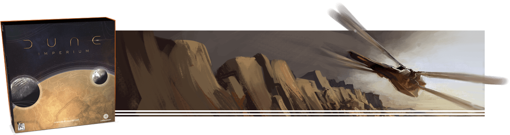
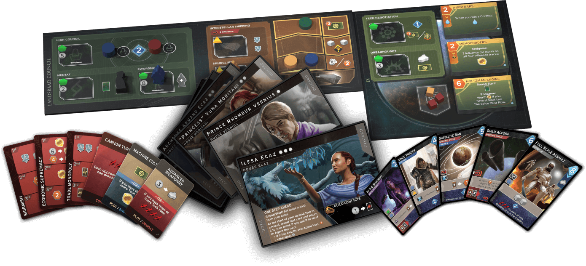
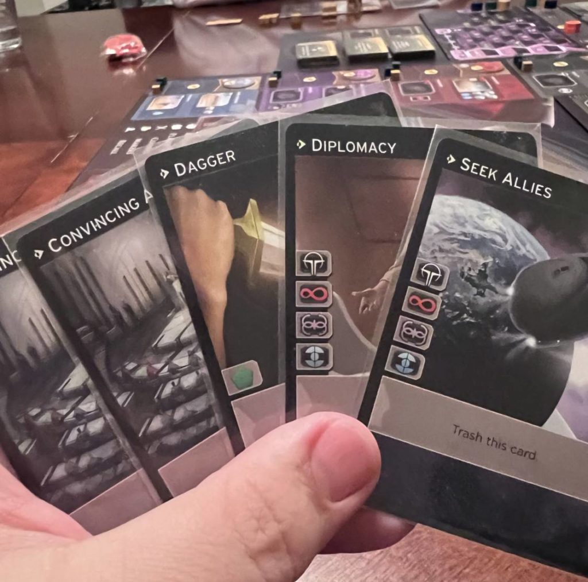
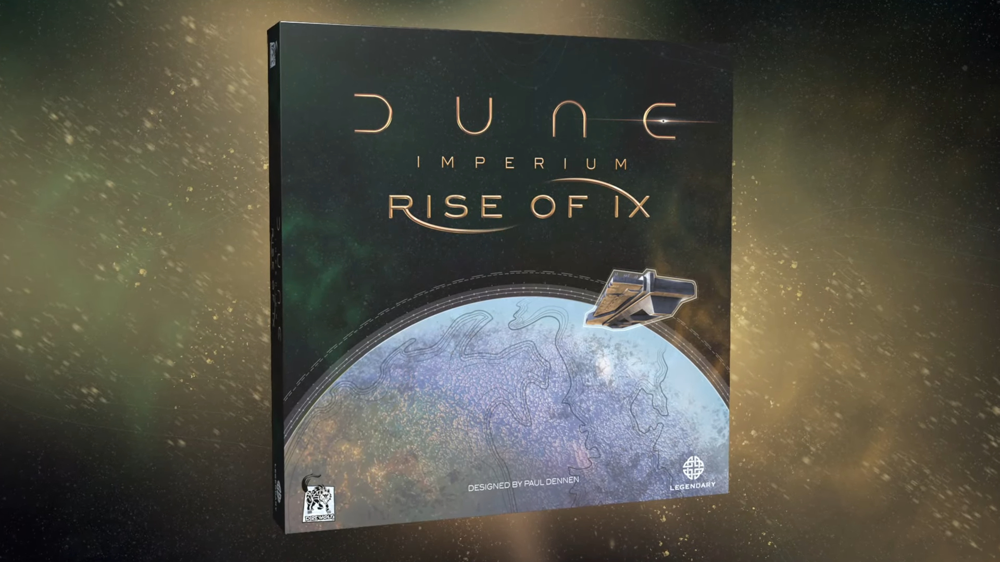
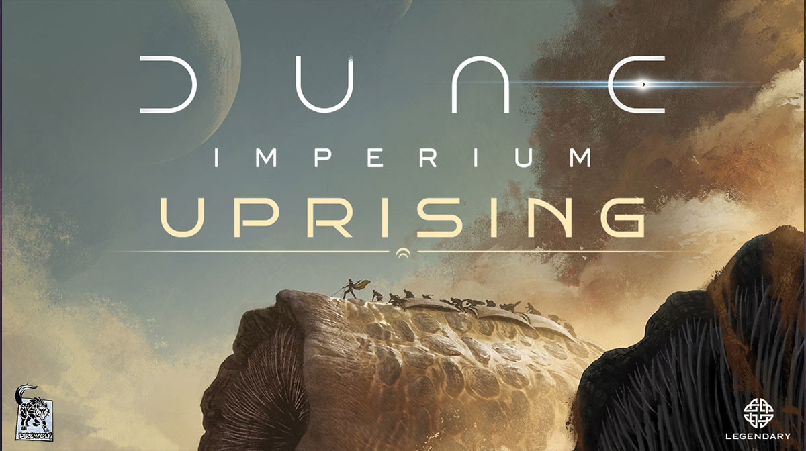

## The Spice Must Flow (But So Does Your Attention)

Three years after its release, [Dune: Imperium](https://boardgamegeek.com/boardgame/316554/dune-imperium) remains a staple in the board game community for a reason. it demands your full attention with every move. In an era where new games are churned out faster than you can say 'Arrakis', Dune: Imperium still matters in 2026 because it has mastered the art of complex simplicity. It's a game that respects your intellect without overwhelming you, a rare quality in today’s market saturated with convoluted mechanics and flashy components. The beauty of Dune: Imperium lies in its ability to engage players through strategic depth rather than sheer volume of content. This game isn't just about collecting spice or conquering planets; it's about outthinking your opponents and adapting to the ever-changing landscape of the board. In a world where attention spans are shorter than ever, Dune: Imperium keeps you hooked from the moment you draw your first card to the final, nail-biting reveal. 

## What You're Getting Into

Designed by Paul Dennen, the mind behind [Clank!](https://boardgamegeek.com/boardgame/201808/clank-a-deck-building-adventure), [Dune: Imperium](https://boardgamegeek.com/boardgame/316554/dune-imperium) is a blend of deck-building and worker placement mechanics, set in the iconic world of Frank Herbert’s Dune. Published by Dire Wolf, the game accommodates 1 to 4 players with a playtime ranging from 60 to 120 minutes. As of 2026, it holds a notable position in the top 20 on BoardGameGeek with a solid rating of 8.3. 

But what exactly are you signing up for? Imagine wading through political intrigue, managing scarce resources, and battling for control of the planet Arrakis, all while plotting your next strategic move. The objective is simple: accumulate 10 victory points before your opponents do. Points can be earned through various avenues. building influence with factions, winning conflicts, and acquiring certain cards. The complexity arises from the interplay of different strategies and the necessity to pivot when the board state changes. This isn't a game you can win by doing just one thing well; you need to be adaptable, cunning, and sometimes, a bit ruthless. If you’re looking for a game that challenges your strategic thinking while immersing you in a rich narrative landscape, Dune: Imperium offers exactly that.

## The Hybrid That Actually Works

The genius of [Dune: Imperium](https://boardgamegeek.com/boardgame/316554/dune-imperium) is its seamless fusion of deck-building and worker placement, two mechanics that can often feel at odds in less capable hands. In this game, your deck isn't just a collection of cards; it's the nerve center of your strategy. Each card in your deck serves three purposes: the icon for worker placement, an action for your agent turn, and a benefit during the reveal phase. This tri-fold utility keeps players constantly engaged in strategic decision-making. 

With only two workers. potentially a third if you play your cards right. you must choose your placements wisely. The presence of limited workers heightens tension, forcing you to weigh the benefits of placing a worker for immediate gain versus holding onto cards for their reveal phase advantages. This dynamic creates a strategic tension that many games lack. Every card draw reshapes your options, making you constantly reassess your strategy. 

The result is an unpredictable yet deeply strategic experience. This isn't a game where you can bank on a single strategy; you need to adapt, react, and sometimes take risks. The synergy between your deck and your board actions ensures that each game feels fresh and challenging, creating a gameplay loop that is as addictive as it is rewarding. It's a testament to Paul Dennen's design prowess. a blending of mechanics that feels not just necessary, but inevitable.

## Blood on the Sand: Combat Done Right

In [Dune: Imperium](https://boardgamegeek.com/boardgame/316554/dune-imperium), combat isn't just a sideshow; it's a crucial part of the strategy. Each round culminates in a conflict phase where players vie for control over essential resources and, ultimately, victory points. The combat system is straightforward but brimming with strategic depth. Troops are deployed to the conflict zone using your agents and any revealed swords during the reveal phase augment their strength.

What sets this system apart is the integration of intrigue cards, which act as tactical surprises that can dramatically alter the outcome of battles. These cards ensure that even when you think you’ve calculated every possibility, there's always an element of unpredictability. But unlike other games where combat can feel tacked on, in Dune: Imperium, it’s intimately tied to the core mechanics. Winning conflicts not only grants resources and points but also strategically alters your position on the board.

The decision to engage in combat or focus on other strategies is a critical one. often decided by the state of your deck and the cards you draw. This makes the combat an ever-present consideration throughout the game rather than a simple rinse-and-repeat mechanic. The stakes are high, the strategies complex, and the rewards worth the risk. It's a carefully crafted balance that turns every conflict into a high-stakes poker game where bluffing, tactical foresight, and a bit of luck all play crucial roles.

## The Political Game: Factions and Influence

The political landscape in [Dune: Imperium](https://boardgamegeek.com/boardgame/316554/dune-imperium) is as crucial as the sands of Arrakis themselves. The game features four prominent factions: the Emperor, the Spacing Guild, the Bene Gesserit, and the Fremen. Each faction offers a unique path to victory through influence tracks, which players advance by placing workers or playing relevant cards. These tracks are more than just a race for points; they represent long-term strategic commitments that can tilt the game in your favor.

The allure of the factions lies in their alliance tokens. Achieving maximum influence with a faction grants you an alliance token, bringing with it significant advantages and a crucial victory point. However, alliances can be stolen by opponents who surpass you on the influence track, adding a layer of competitive tension and long-term planning.

This political maneuvering ensures that every player is constantly engaged, even when it's not their turn. Decisions made early in the game can have far-reaching consequences, influencing your options and interactions with other players. It’s a brilliant representation of the intricate and often cutthroat politics of the Dune universe, where allegiances are fickle, and influence is the ultimate currency. This dynamic ensures that no single strategy reigns supreme; you must remain adaptable and opportunistic, ready to shift alliances as needed.

## How It Stacks Up: Dune vs The Competition

When comparing [Dune: Imperium](https://boardgamegeek.com/boardgame/316554/dune-imperium) to its competitors, the distinctiveness of its hybrid mechanics becomes apparent. Take [Lost Ruins of Arnak](https://boardgamegeek.com/boardgame/312484/lost-ruins-arnak), for example. While both games blend deck-building with worker placement, Arnak leans towards a more puzzly experience with less direct player interaction. Dune: Imperium, in contrast, encourages player interaction through conflict and political maneuvering, creating a more dynamic and engaging experience.

Then there's [Clank!](https://boardgamegeek.com/boardgame/201808/clank-a-deck-building-adventure), a game from the same designer. Where Clank! introduced us to the thrill of a deck-building adventure with the added tension of accumulating noise, Dune: Imperium is its strategic evolution. Dennen has taken the lessons from Clank! and applied them to a more expansive and complex game, offering deeper strategic choices and a more immersive thematic experience.

Comparing [Viticulture](https://boardgamegeek.com/boardgame/183394/viticulture-essential-edition), a pure worker placement game, to Dune highlights the latter's multifaceted decision-making process. Viticulture offers a serene, almost meditative experience, while Dune's worker placement is fraught with tension and strategic depth, due in no small part to its deck-building component.

And when set against [Dominion](https://boardgamegeek.com/boardgame/36218/dominion), the granddaddy of deck-building games, Dune: Imperium shows its versatility. Dominion is a masterpiece of pure deck-building strategy, but Dune takes this mechanic and enriches it with a thematic depth that pure deck-builders struggle to achieve. 

In sum, while all these games offer their own unique experiences, Dune: Imperium stands out for its ability to integrate the best elements of these genres into a cohesive and compelling package. It's for those who want a game that challenges intellect and engagement, not just mechanical prowess.

## The Expansion Maze: What to Buy

For those stepping into the rich world of [Dune: Imperium](https://boardgamegeek.com/boardgame/316554/dune-imperium), expansions offer an enticing way to deepen the experience. The first expansion, [Rise of Ix](https://boardgamegeek.com/boardgameexpansion/342031/dune-imperium-rise-ix), introduces the Ix board, tech tiles, dreadnoughts, and the CHOAM track. It’s an essential expansion that brings both breadth and depth to the base game, offering new paths to victory and escalating the strategic possibilities without overcomplicating the mechanics.

The [Immortality](https://boardgamegeek.com/boardgameexpansion/367466/dune-imperium-immortality) expansion, released in 2023, adds the Bene Tleilax board and a research track, raising the complexity but also enriching the game with new thematic elements that dovetail beautifully with the base experience. It's best paired with the base game, especially for players who relish intricate strategies and thematic immersion.

In 2024, [Uprising](https://boardgamegeek.com/boardgame/397598/dune-uprising) arrived as a standalone reimplementation. It includes spies, sandworms, and contracts, and is widely considered superior to the original. It takes the core mechanics of the original and refines them, providing a fresh take while maintaining the spirit of the game.

For new players, starting with the base game and Rise of Ix is recommended. These offer a robust introduction to the game’s mechanics and thematic storytelling. For those who already own the base game, Immortality and Uprising present exciting new challenges that breathe fresh life into an already dynamic game.

## The Digital Spice: Steam and Mobile

In an age where digital adaptations of board games can make or break a title’s longevity, [Dune: Imperium](https://boardgamegeek.com/boardgame/316554/dune-imperium) holds its ground quite admirably. Available on both Steam and mobile platforms, the digital version offers a faithful recreation of the physical experience with the added convenience of digital management and online matchmaking. The app is polished, with a sleek interface that keeps the thematic elements intact while streamlining the game's more complex mechanics for digital play.

The AI quality is commendable, presenting a decent challenge for solo players looking to hone their strategies without the hassle of setting up a physical board. It serves as an excellent learning tool, allowing new players to familiarize themselves with the game’s mechanics at their own pace.

While the digital version lacks the tactile pleasure of moving pieces and the social nuances of face-to-face play, it compensates with the ability to play anytime, anywhere. This makes it an ideal option for those who struggle to gather a group regularly or wish to keep their skills sharp between gaming sessions. 

In comparison to the physical version, the digital adaptation of Dune: Imperium offers a convenient and engaging alternative without sacrificing the core experience. It’s a testament to the game’s robust design that it translates so well across platforms, retaining its strategic depth and thematic richness in both formats.

## Who Should Play This (And Who Shouldn't)

[Dune: Imperium](https://boardgamegeek.com/boardgame/316554/dune-imperium) is not for the faint of heart. it demands a certain level of strategic foresight and flexibility, making it perfect for gamers who thrive on complex decision-making and enjoy the thrill of adapting strategies on the fly. If you’re someone who appreciates the fusion of thematic depth with mechanical elegance, this game will likely find a cherished place in your collection.

It's best played with four players, where the board is most crowded and the competition for resources and influence is at its fiercest. The game still plays well with three players, though the interactions are slightly less intense. With two, the game becomes more of a chess match, rewarding those who prefer calculated, head-to-head play. For solo players, the experience is more about mastering strategies, as the AI provides a considerable challenge but lacks the unpredictability of human opponents.

On the flip side, Dune: Imperium might not resonate with those seeking a casual or light-hearted gaming experience. The game’s complexity and the need for continuous engagement might be overwhelming for newcomers to the hobby or those who prefer straightforward gameplay. It's also not ideal for those who dislike conflict-heavy games, as the combat and political maneuvering are central to the experience.

## The Verdict

In the crowded landscape of modern board games, [Dune: Imperium](https://boardgamegeek.com/boardgame/316554/dune-imperium) stands as a testament to the power of well-integrated mechanics and thematic storytelling. It offers a rich and rewarding experience for those willing to engage with its strategic depth, easily cementing its status as a must-have for serious gamers. Paul Dennen has crafted a game that not only honors its source material but also elevates the traditional deck-building and worker placement genres to new heights.

For anyone looking to dive into a game that offers layered strategies, intense player interaction, and a narrative that captivates as much as its mechanics, Dune: Imperium is a worthwhile investment. It receives a strong recommendation, especially if you are ready to immerse yourself in the political intrigues and strategic battles of the Dune universe. Whether you're a fan of the books or simply a lover of great board games, this is a title that deserves a place on your gaming shelf.