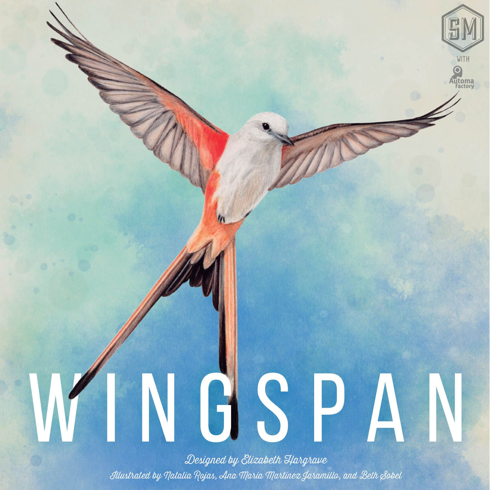
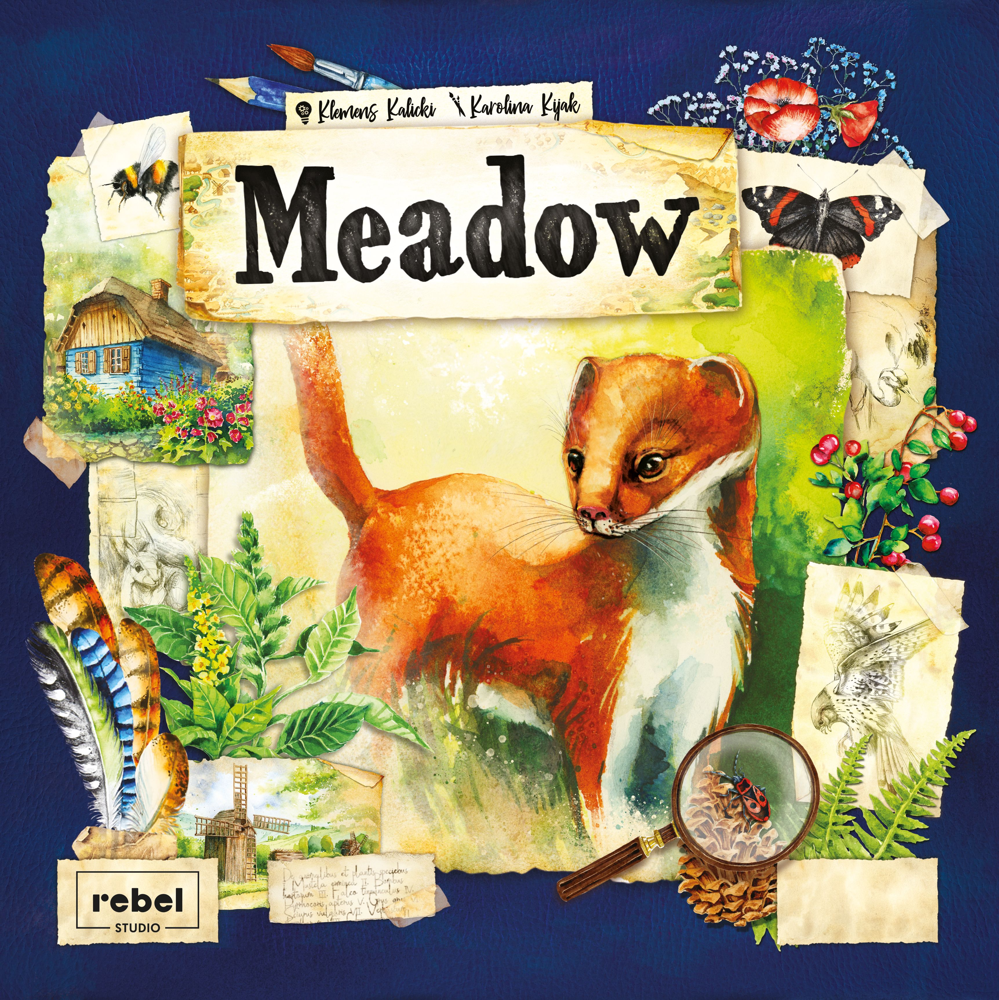
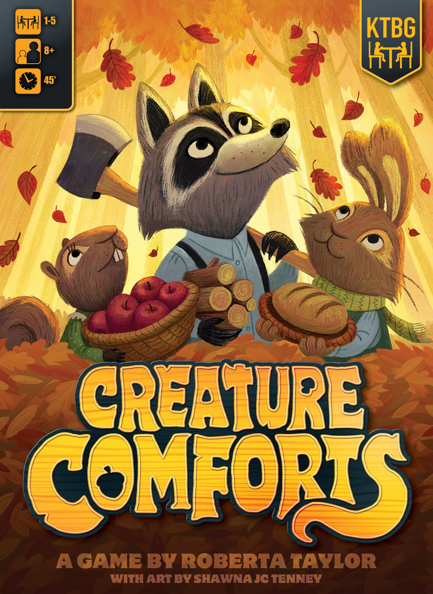
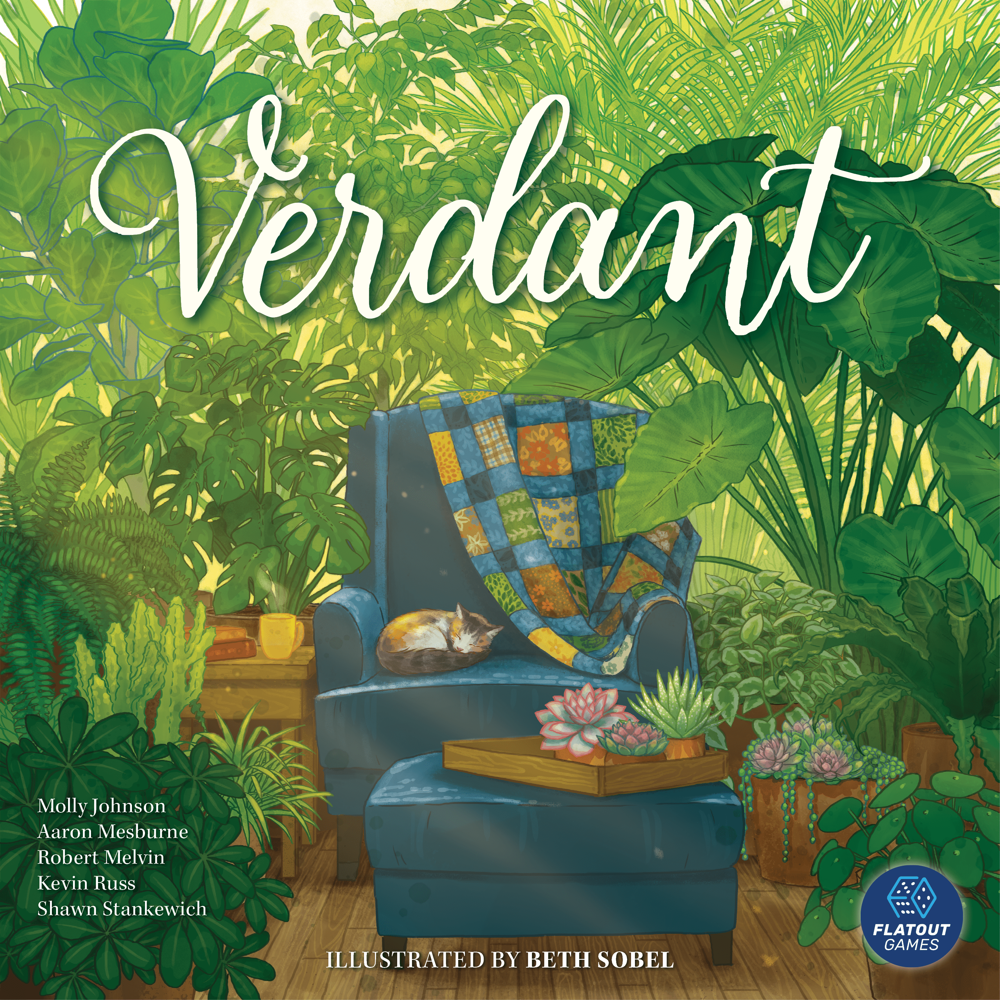

# You finished [Everdell](https://boardgamegeek.com/boardgame/199792/everdell). Now what?

[Everdell](https://boardgamegeek.com/boardgame/199792/everdell) has a very specific trick. It looks like something you'd find in a picture book — woodland creatures, soft colours, a cardboard tree on the table — and then it quietly asks you to run an engine-building optimisation puzzle. It sits at a **2.83/5 weight** on BGG with an **8.0 rating** from well over 60,000 voters. It plays **1–4** in **40–80 minutes**, which is that sweet spot where nobody's checking their phone but nobody's ordering a second dinner either.

The blend of worker placement and tableau building, wrapped in art that makes people lean in and say "oh, that's gorgeous" before they've read a single rule, is hard to replicate. But it's not unique. A handful of other games have found their own version of that cosy-but-crunchy formula, and some of them arguably do certain parts of it better.

Here are six worth knowing about.

---

## 1. [Wingspan](https://boardgamegeek.com/boardgame/266192/wingspan)

**1–5 players · 40–70 min · Weight: 2.48 · BGG: 8.0 · Rank #38**

The obvious one. If Everdell is woodland creatures building a town, Wingspan is birds building an ecosystem, and the comparison writes itself. Both are engine builders with beautiful art, both attract people who wouldn't normally touch a strategy game, and both have a production quality that makes the table feel special.

Where they differ is in the tension. Everdell's worker placement creates tighter competition for spots, especially at lower player counts. Wingspan is more of a parallel engine — you're building your bird habitats side by side, and interaction comes through the bird feeder dice and end-of-round goals rather than direct blocking. That makes Wingspan slightly gentler and slightly lighter (2.48 vs 2.83 weight), which could be exactly what you want or exactly what you don't.

**Pick Wingspan if:** you want something a touch lighter, love the nature theme, or need to accommodate a fifth player. The solo Automa is also excellent.

**Stick with Everdell if:** you want more direct interaction and a tighter economy.

---

## 2. [Ark Nova](https://boardgamegeek.com/boardgame/342942/ark-nova)

**1–4 players · 90–150 min · Weight: 3.80 · BGG: 8.5 · Rank #2**

This is the heavier cousin. Where Everdell keeps things breezy, Ark Nova wants you to sit down, build a zoo, and think about conservation points for two hours. The card play has a similar DNA — you're collecting animals and sponsors into a personal tableau — but the action selection system (five sliding action cards that change power based on position) adds a whole layer of timing decisions Everdell doesn't touch.

At a **3.80 weight**, this is a genuine step up. Games regularly push past two hours, and AP-prone players will push past three. But if Everdell left you wanting more — more decisions, more strategic depth, more "I need to think about this" — Ark Nova delivers. It's the second-highest-ranked game on all of BGG for a reason.

**Pick Ark Nova if:** Everdell felt a bit light and you want a meatier engine with similar card-driven tableau building.

**Not for you if:** you loved Everdell's 60-minute breezy pace and don't want to double it.

---

## 3. [Meadow](https://boardgamegeek.com/boardgame/314491/meadow)

**1–4 players · 60–90 min · Weight: 2.25 · BGG: 7.7 · Rank #215**

Meadow is the game that leans hardest into the "gorgeous nature cards" side of Everdell and pulls back on the mechanical complexity. You're collecting observation cards — plants, animals, landscapes — and chaining them together into sequences that score points. The card art is, genuinely, some of the most beautiful in any board game. Every card is a painting.

The mechanism is an interesting grid-based drafting system where your pawn position determines which cards you can take, creating a spatial puzzle that's lighter than worker placement but more interesting than pure drafting. At **2.25 weight**, it's the most accessible game on this list.

The trade-off is depth. Meadow doesn't have the engine-building escalation of Everdell — you won't get those satisfying chain reactions where one card triggers three others. It's more contemplative, more about collection and sequencing. Some people find that peaceful. Others find it flat.

**Pick Meadow if:** the art and the nature theme were the main draw of Everdell, and you want something you can teach to anyone in five minutes.

**Stick with Everdell if:** you need the mechanical crunch and the thrill of a well-timed combo.

---

## 4. [Creature Comforts](https://boardgamegeek.com/boardgame/304051/creature-comforts)

**1–5 players · 45 min · Weight: 2.36 · BGG: 7.4 · Rank #697**

If you stripped Everdell down to its cosiest elements and turned the charm dial to maximum, you'd get Creature Comforts. You're woodland animals preparing your home for winter — gathering berries, crafting improvements, making your den nice. The worker placement is straightforward, but there's a dice element that adds a push-your-luck feel to resource gathering.

The comparison to Everdell is immediate and obvious: cute animals, worker placement, resource conversion into comfort items. But Creature Comforts is deliberately simpler. The dice-driven resource pool means you can't perfectly plan, which some players love (it creates stories) and others hate (it undermines strategy). At **2.36 weight**, it's right between Everdell and the lighter games on this list.

What it does better than Everdell is accessibility. This is genuinely a game you can play with families, with younger gamers, with people who bounced off Everdell's card synergy puzzle. The art — by Shawna J.C. Tenney — is warm and inviting in a way that goes beyond just "nice looking."

**Pick Creature Comforts if:** you want the Everdell vibe with less rules overhead, or you're playing with mixed-experience groups.

**Not for you if:** you find dice-driven resource gathering frustrating rather than fun.

---

## 5. [Verdant](https://boardgamegeek.com/boardgame/334065/verdant)

**1–5 players · 45–60 min · Weight: 2.08 · BGG: 7.3 · Rank #761**

Verdant swaps Everdell's woodland for houseplants, and worker placement for a spatial card-drafting puzzle. You're arranging plants and rooms in a personal grid, trying to match light requirements and collect tokens that score in various combinations. It's from the same design team behind Calico and Cascadia, and it has that same "simple rules, thinky decisions" DNA.

At a **2.08 weight**, this is lighter than Everdell, but it doesn't feel lightweight while you're playing it. The spatial puzzle — which plant goes where, how to optimise your grid for scoring — creates genuine decision tension. And the houseplant theme, while niche, has a devoted audience that overlaps heavily with the Everdell crowd.

The main thing Verdant lacks compared to Everdell is escalation. There's no engine that ramps up over the game. You're solving a puzzle that gets more constrained as your grid fills, which is satisfying in a different way — more like a crossword than a machine.

**Pick Verdant if:** you enjoy the spatial puzzle side of tableau games and want something cosy that plays in under an hour.

**Not for you if:** engine building and combo chains are the main thing you love about Everdell.

---

## 6. [Harmonies](https://boardgamegeek.com/boardgame/414317/harmonies)

**1–4 players · 30–45 min · Weight: 2.01 · BGG: 8.0 · Rank #57**

The newcomer on this list, and it's climbing fast. Harmonies is a pattern-building game where you're stacking coloured tokens on a personal board to create landscapes that attract animals. It's tactile, it's gorgeous, and it has that same quality Everdell has where non-gamers see it on a table and want to know what's going on.

The gameplay loop is beautifully clean: pick tokens from a shared pool, place them on your board, try to match the patterns shown on animal cards. At **2.01 weight** and **30–45 minutes**, it's the quickest and lightest game here, but the 3D stacking element adds a spatial dimension that keeps experienced players engaged.

What makes Harmonies special is the tactile satisfaction. Physically building landscapes with chunky coloured tokens, watching your board transform from empty grid to rolling hills and forests — it scratches a creative itch that card-based games can't quite reach. Already ranked **#57** on BGG after less than two years, this one has legs.

**Pick Harmonies if:** you want the aesthetic delight of Everdell in a shorter, simpler, more tactile package.

**Not for you if:** you need card combos, engine building, or significant player interaction.

---

## The quick comparison

| Game | Players | Time | Weight | BGG Rating | Best for |
|------|---------|------|--------|------------|----------|
| [Everdell](https://boardgamegeek.com/boardgame/199792/everdell) | 1–4 | 40–80 min | 2.83 | 8.0 | The benchmark — cosy engine building |
| [Wingspan](https://boardgamegeek.com/boardgame/266192/wingspan) | 1–5 | 40–70 min | 2.48 | 8.0 | Slightly lighter, nature theme, 5th player |
| [Ark Nova](https://boardgamegeek.com/boardgame/342942/ark-nova) | 1–4 | 90–150 min | 3.80 | 8.5 | More depth, longer, heavier |
| [Meadow](https://boardgamegeek.com/boardgame/314491/meadow) | 1–4 | 60–90 min | 2.25 | 7.7 | Stunning art, accessible, contemplative |
| [Creature Comforts](https://boardgamegeek.com/boardgame/304051/creature-comforts) | 1–5 | 45 min | 2.36 | 7.4 | Family-friendly, maximum charm |
| [Verdant](https://boardgamegeek.com/boardgame/334065/verdant) | 1–5 | 45–60 min | 2.08 | 7.3 | Spatial puzzle, houseplant vibes |
| [Harmonies](https://boardgamegeek.com/boardgame/414317/harmonies) | 1–4 | 30–45 min | 2.01 | 8.0 | Quick, tactile, beautiful |

---

## Which one should you actually buy?

If you want **more of the same**, Wingspan is the safest pick. Similar weight class, similar play time, equally stunning on the table.

If you want **more depth**, Ark Nova is the answer — but be prepared for a real time commitment.

If you want **easier to teach**, Harmonies or Creature Comforts will get non-gamers playing fastest.

And if you want **the prettiest cards in board gaming**, Meadow wins that contest outright.

The good news is that none of these games replace Everdell. They each take a different slice of what makes it work and develop that slice further. Build a shelf of two or three from this list and you've got the full spectrum covered — from a 30-minute Harmonies session to a 150-minute Ark Nova marathon, all with that same inviting, "come sit down and play" energy.
