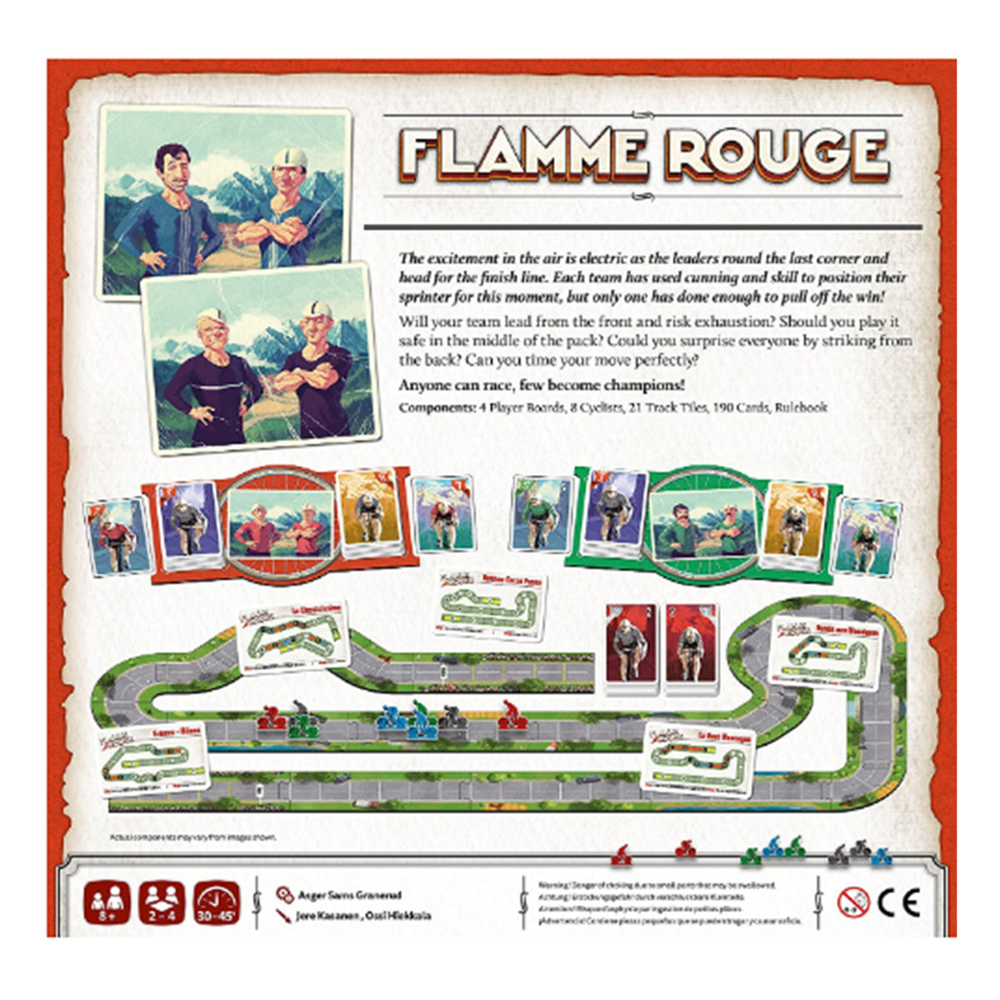
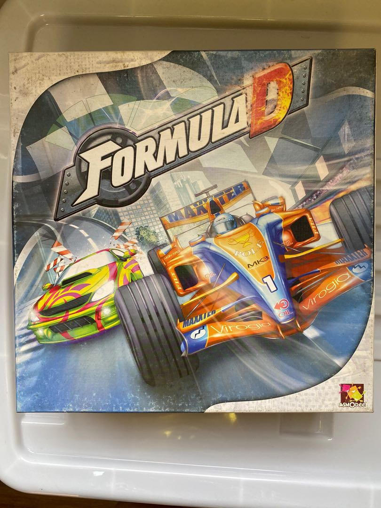
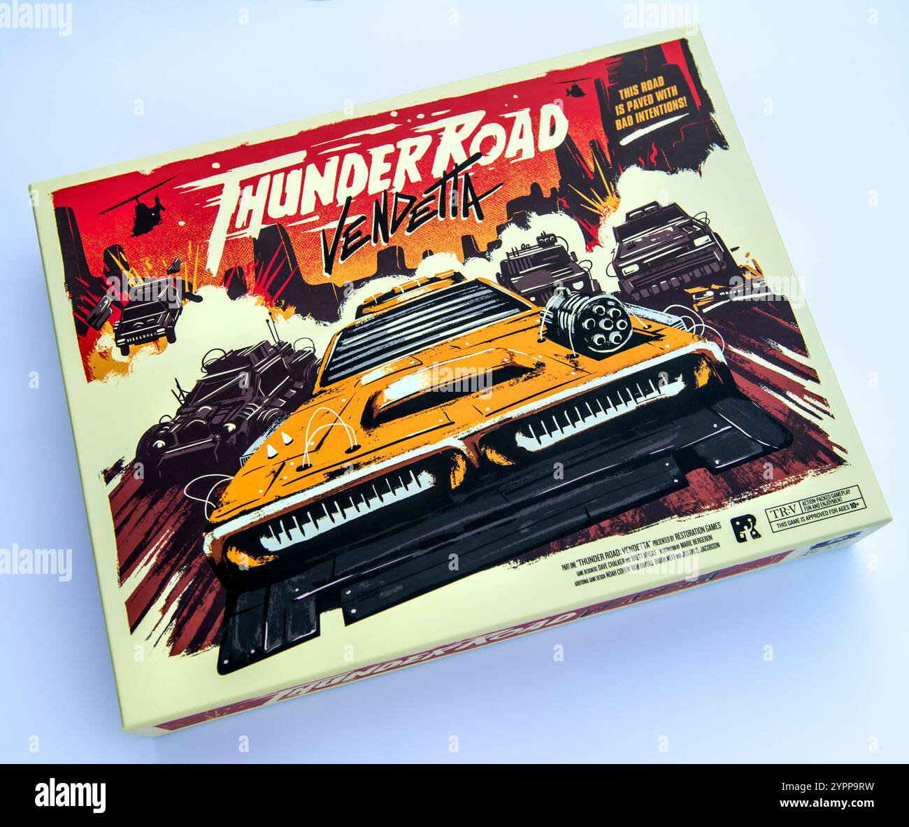
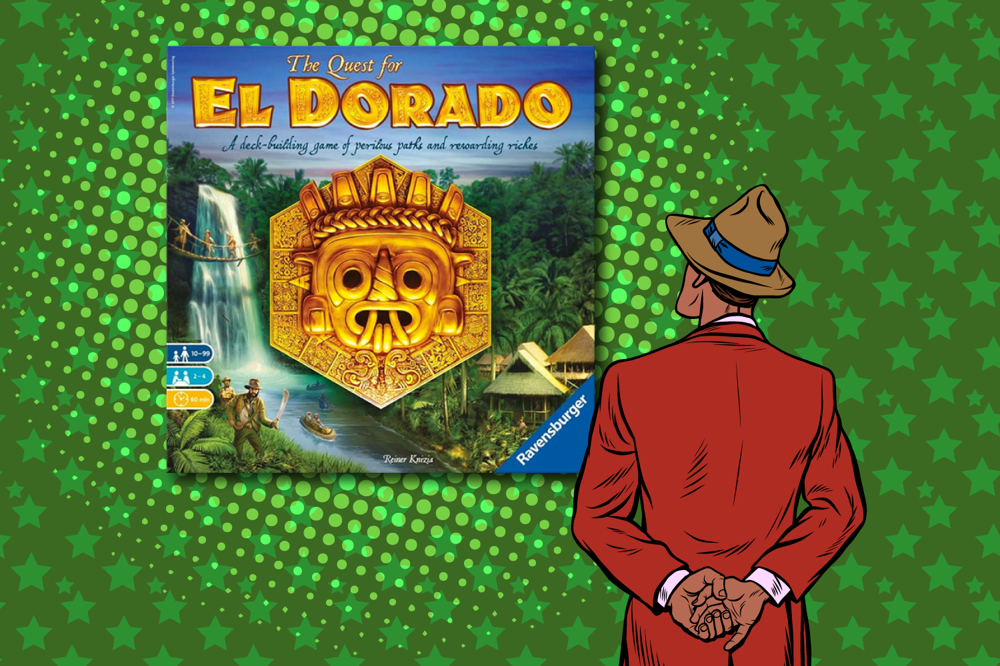

If you love [Heat: Pedal to the Metal](https://boardgamegeek.com/boardgame/366013/heat-pedal-to-the-metal), you probably don’t just want “fast games” or “interactive games” or some nonsense recommendation list that suddenly swerves into dry euros because both titles contain cards. You want racing. Real racing. Positioning, timing, risk, that awful little voice in your head saying, “I can totally take this corner at one more speed,” right before your engine starts coughing up smoke.

That’s the magic of [Heat: Pedal to the Metal](https://boardgamegeek.com/boardgame/366013/heat-pedal-to-the-metal). It’s a racing game first, and a very smart hand-management game second. You’re managing speed cards, heat cards, stress, corners, slipstreams, and the simple but delicious agony of deciding whether now is the moment to push. The design looks clean on the table, but the decisions are not clean. They’re messy. Competitive. Sometimes a little desperate. Great racing games should make you feel clever for three turns and then immediately punish your overconfidence. Heat gets that.

What I can say with confidence is this: this list is focused on games that echo Heat’s specific kind of racing tension. That means hand management tied to pace, risk around corners or overextension, meaningful position on the track, and the constant pressure to push harder than feels safe. Some of these picks stay very close to Heat’s motorsport feel, while one is a deliberate wildcard that captures the same tempo puzzle in a different theme.

Heat’s DNA is built from a few key pieces:

- Hand management that directly maps to speed and control
- Risk management tied to corners and engine strain
- Positional racing where slipstreaming and track order matter
- A ruleset that stays approachable while still creating real tactical tension
- Constant pressure to push harder than feels safe

So this list focuses on games that recreate Heat’s blend of pacing, risk, and race tension — whether through card-driven speed control, punishing corner decisions, or the constant pressure to push one turn harder than feels safe.

## [Flamme Rouge](https://boardgamegeek.com/boardgame/199478/flamme-rouge)

**If your favorite part of Heat is hand management as pace control, this is the cleanest next stop.**

Look, [Flamme Rouge](https://boardgamegeek.com/boardgame/199478/flamme-rouge) is the recommendation that comes up constantly for a reason. This is not lazy list-making. It’s the obvious pick because the connection is real. Both games are racing designs where your hand is your engine. You’re not just moving. You’re choosing how hard to commit now, what to save for later, and how to avoid collapsing at the worst possible moment.

In Flamme Rouge, each player controls two cyclists, a Rouleur and a Sprinteur, each with their own deck. That one twist changes everything. You’re planning bursts, using slipstreams, trying not to overextend, and carefully deciding who should lead and who should draft. Heat players will immediately recognize that same internal rhythm: spend big now and risk paying for it later, or stay efficient and hope the window opens at the right time.

The big similarity is tempo. Both games are obsessed with timing. In Heat, you manage heat and hand quality while navigating corners. In Flamme Rouge, you manage exhaustion, drafting, and deck efficiency over the shape of the course. Every move asks the same question in a slightly different language: are you winning the race, or just winning this turn?

The key difference is that Flamme Rouge is gentler and more transparent. It has less engine-strain drama and less of that “one bad push and the car starts rattling apart” feeling. It’s also a little more elegant, maybe even purer, because the card play is so stripped down. Some groups will love that. Others will miss Heat’s extra chrome and theatrical corner tension.

**Who it’s for:** Players who love Heat’s hand management, drafting, and pace decisions, and want a slightly cleaner, easier teach that still produces great race stories.

## [Formula D](https://boardgamegeek.com/boardgame/37904/formula-d)

**If your favorite part of Heat is sweating every corner and asking “can I get away with this,” Formula D gets mean about it.**

If Flamme Rouge is the clean hand-management comparison, [Formula D](https://boardgamegeek.com/boardgame/37904/formula-d) is the corner-pressure comparison. It comes from an older school of racing design, and you can feel it the second it hits the table. It’s louder. Swingier. More overtly dramatic. Where Heat wraps its risk management in card play, Formula D puts it right in front of you with gears, dice, and corner requirements. You want to fly down the straight? Great. You still need to survive the turn.

That core similarity matters. Both games care deeply about braking points and corner discipline. In Heat, corners are where your hand and engine management get tested. In Formula D, corners are where your nerve gets tested. The game asks you to choose a gear, roll the corresponding die, and then somehow make the corner legally. Every turn becomes a little dare. Push too far and you chew through wear points or spin into disaster.

What makes Formula D feel like Heat’s rougher cousin is that same blend of planning and brinkmanship. Position matters. Speed matters. Reading the track matters. And the emotional beat is very familiar: one player is conservative for too long, one player gets greedy too early, and one maniac somehow survives a line that should have ended in tears.

The key difference is control. Heat gives you more subtlety. Formula D gives you more spectacle. It’s less about tuning a hand over multiple turns and more about choosing how stupid-brave you want to be right now. Some players prefer Heat because it feels tighter and more modern. Fair. But if what you crave is corners with teeth, Formula D still absolutely works.

**Who it’s for:** Players who love Heat’s corner pressure and push-your-luck racing, and don’t mind a swingier, more old-school design with bigger table drama.

## [Thunder Road: Vendetta](https://boardgamegeek.com/boardgame/342070/thunder-road-vendetta)

**If your favorite part of Heat is the chaos around position, blocking, and reading the pack, this is the loudest possible version of that.**

The first two recommendations stay close to Heat’s core racing structure. [Thunder Road: Vendetta](https://boardgamegeek.com/boardgame/342070/thunder-road-vendetta) is where the list gets louder. I know what some people will say. “But Heat is a motorsport race game and Thunder Road: Vendetta is a post-apocalyptic demolition sprint.” Sure. And? It is still absolutely a racing game. More importantly, it nails the same feeling of tactical movement under pressure, where track position is everything and a seemingly safe lane can become a disaster one activation later.

The overlap with Heat is not hand management. It’s race-state awareness. In both games, you need to read the board constantly. Who’s about to surge? Which lane is about to clog? Can you afford to stay behind for slipstream-like positional benefit, or do you need to break out now before the whole thing jams up? Heat does this with cleaner systems. Thunder Road does it with explosions and panic.

And let’s be fair. Panic is fun.

What Thunder Road adds is direct aggression. Heat has interaction through movement order, corners, and drafting. Thunder Road cranks that into full contact. You’re not just trying to optimize speed. You’re trying to survive the table’s nonsense while still crossing the finish line first. The result is a race game that feels far more cinematic and far less controlled, but the turn-to-turn tension around where to be on the track is very much in the same family.

The key difference is obvious. Thunder Road is chaos-forward. If Heat is about measured risk and efficient tempo, Thunder Road is about damage, collisions, and opportunistic brutality. It’s not subtle. That’s the point. Some groups will prefer it because every turn creates a story. Other groups will bounce off because they wanted precision, not mayhem.

**Who it’s for:** Players who love Heat’s positional interaction and race tension, but want more table conflict, more spectacle, and zero concern for paintwork.

## [Rallyman: GT](https://boardgamegeek.com/boardgame/256589/rallyman-gt)

**If your favorite part of Heat is managing risk through corners and speed planning, Rallyman: GT is the thinkier, more procedural version of that same thrill.**

If Formula D is the dramatic version of corner management, [Rallyman: GT](https://boardgamegeek.com/boardgame/256589/rallyman-gt) is the more technical one. It’s for the precision crowd, or at least for the crowd that wants their drama to come from choices they can trace back step by painful step.

The connection to Heat is strong. Both games are about choosing how hard to push while respecting what the track demands. In Heat, your hand and heat cards define what’s possible. In Rallyman: GT, dice selection and gear sequencing define what’s possible. You’re still looking at a corner and making the same core judgment: can I carry this speed safely, or am I about to create my own problem?

That’s why this recommendation feels honest. The emotional rhythm is very similar. Build momentum on the straight. Set up the corner. Consider the risk. Commit. Regret nothing, or regret everything. Great stuff.

The big difference is that Rallyman: GT is more puzzle-like and more granular. It can feel less breezy than Heat because you’re calculating sequences with a little more care. Some players will love that extra detail. Others will miss Heat’s immediate card-driven flow. Heat tends to feel more alive in a casual group because turns move with a bit more snap. Rallyman rewards players who enjoy squeezing efficiency from a tactical line.

Also, if you’re the kind of player who likes explaining afterward exactly where the race turned, Rallyman is fantastic for that. Every mistake has a receipt.

**Who it’s for:** Players who love Heat’s corner-risk puzzle and want a more deliberate racing game where planning your line matters just as much as daring to push it.

## [Quest for El Dorado](https://boardgamegeek.com/boardgame/217372/the-quest-for-el-dorado)

**Wildcard pick: if your favorite part of Heat is hand efficiency in a race, this turns that exact tension into a deck-building sprint.**

After four motorsport-adjacent picks, this is the one wildcard, and it earns its seat. [Quest for El Dorado](https://boardgamegeek.com/boardgame/217372/the-quest-for-el-dorado) is not a motorsport game. It is, however, one of the best race games built around hand management and tempo, which makes it a very clean crossover for Heat fans who care more about the decision texture than the car theme.

Look at the shared mechanism. In Heat, your hand determines your pace, and poor resource management clogs your options. In El Dorado, your hand determines your movement through terrain, and poor deck management clogs your options. That is not a vague “both have cards” comparison. It is the same strategic pleasure of optimizing a hand to move faster than everyone else while avoiding dead turns.

Both games also understand that racing is about more than raw speed. Timing matters. Route choice matters. Reading opponents matters. Sometimes the best play is not the biggest move. It’s the move that keeps your engine, or in this case your deck, from betraying you next round. That tempo sensitivity is exactly why Heat players tend to click with El Dorado.

The key difference is interaction style. Heat creates tension through shared track space, corners, and slipstreaming. El Dorado creates tension through route competition and deck efficiency. It’s less physical, less elbows-out, and more about choosing the right path while refining your card mix. But the race feel is absolutely real. Nobody at the table forgets they’re trying to beat everyone else to the finish.

Also, this game has that rare quality where new players grasp it quickly and experienced players still get deliciously competitive. That’s a hard trick.

**Who it’s for:** Heat players who love the hand-management race puzzle and want a non-car game that preserves the same tempo decisions in a brilliant deck-building framework.

## How to choose

So which one should you actually buy? That depends on what you think Heat is doing best.

If you love **the hand management and pacing**, go straight to [Flamme Rouge](https://boardgamegeek.com/boardgame/199478/flamme-rouge). This is the closest match to Heat’s “your cards are your speed” magic. It’s leaner, cleaner, and easier to get to the table.

If you love **corners, braking, and flirting with disaster**, pick [Formula D](https://boardgamegeek.com/boardgame/37904/formula-d). It’s more theatrical and less controlled, but it absolutely understands the thrill of entering a turn too hot and praying your math was right.

If you love **pack dynamics and interaction on the track**, [Thunder Road: Vendetta](https://boardgamegeek.com/boardgame/342070/thunder-road-vendetta) is your move. This is for the group that wants shouting, blocking, collisions, and race stories that sound exaggerated even when they’re true.

If you love **the tactical line-planning side of Heat**, [Rallyman: GT](https://boardgamegeek.com/boardgame/256589/rallyman-gt) is the sharpest fit. It’s more granular, a bit more procedural, and very satisfying if you enjoy races that feel decided by a chain of technical choices.

If you love **racing through hand efficiency more than the motorsport theme itself**, grab [Quest for El Dorado](https://boardgamegeek.com/boardgame/217372/the-quest-for-el-dorado). That’s the wildcard, but it’s a fair one. It preserves the card-driven tempo battle without pretending to be a car game.

Here’s the thing: a lot of recommendation lists confuse “similar audience” with “similar game.” I don’t care if Heat fans also buy heavy euros or party games. That’s not the assignment. The real question is what game recreates that same table feeling, where every turn asks whether you should push now or hold back for the stretch run.

These five all do that. Just in different dialects.

## Quick picks

- **Most similar to Heat:** [Flamme Rouge](https://boardgamegeek.com/boardgame/199478/flamme-rouge)
- **Lightest feeling teach:** [Quest for El Dorado](https://boardgamegeek.com/boardgame/217372/the-quest-for-el-dorado)
- **Heaviest tactical planning:** [Rallyman: GT](https://boardgamegeek.com/boardgame/256589/rallyman-gt)
- **Most interactive:** [Thunder Road: Vendetta](https://boardgamegeek.com/boardgame/342070/thunder-road-vendetta)
- **Wildcard:** [Quest for El Dorado](https://boardgamegeek.com/boardgame/217372/the-quest-for-el-dorado)

A few more specifics here, because “most similar” and “most interactive” can mean wildly different things depending on your group.

**Most similar to Heat: [Flamme Rouge](https://boardgamegeek.com/boardgame/199478/flamme-rouge)**  
This gets the nod because the core decision loop feels familiar almost immediately. You look at your hand, you judge the moment, you decide whether to spend a strong card now or preserve your options for later. In Heat, that tension is wrapped around corners and heat management. In Flamme Rouge, it’s wrapped around exhaustion and the fact that leading at the wrong time is basically volunteering to do everyone else’s work for them. If your favorite Heat turns are the ones where you thread the needle between “too passive” and “too greedy,” Flamme Rouge lives in that exact space. A great beginner tip, by the way: don’t burn your Sprinteur too early just because the cards let you. New players constantly do this. They see a chance to surge, they take it, and then they spend the back half of the race dragging a tired rider around like a bad decision with wheels.

**Lightest feeling teach: [Quest for El Dorado](https://boardgamegeek.com/boardgame/217372/the-quest-for-el-dorado)**  
This isn’t necessarily the simplest game on paper, but it is the easiest one here to explain in a way that clicks instantly. Buy better cards. Move through terrain. Reach the finish first. Done. The reason it feels so welcoming to Heat players is that the race tension shows up fast. You don’t need three rounds to “see the game.” It’s right there. One player commits to a route, another blocks a choke point, someone realizes their deck is full of cards that don’t match the terrain ahead, and suddenly the table gets very serious. If you’re teaching mixed-experience groups, El Dorado is gold because new players can make competent decisions from turn one while stronger players still find edges in market timing and route efficiency.

**Heaviest tactical planning: [Rallyman: GT](https://boardgamegeek.com/boardgame/256589/rallyman-gt)**  
This is the pick for players who love replaying a turn in their head afterward. “If I had downshifted earlier, I could have kept control through that corner and set up a cleaner exit.” That kind of game. Heat has tactical planning too, obviously, but it keeps the decision space breezier. Rallyman stretches that space out and asks you to live inside it a bit longer. That means the highs are very satisfying if you enjoy technical play. It also means table tempo matters. With a group that likes thinking out loud and tracing lines, Rallyman sings. With a group that wants snap decisions and constant motion, it can feel a little too deliberate.

**Most interactive: [Thunder Road: Vendetta](https://boardgamegeek.com/boardgame/342070/thunder-road-vendetta)**  
Not close. This is the one where your plans are everybody’s business. In Heat, interaction can be sharp, but it’s still mostly positional. In Thunder Road, another player can turn your careful setup into roadside debris. That sounds harsh, and it is, but the game earns it by being quick, funny, and gloriously unapologetic. It’s the right pick if your group treats racing as a contact sport and thinks the best table moments start with someone saying, “Okay, this is going to be a terrible idea.”

**Wildcard: [Quest for El Dorado](https://boardgamegeek.com/boardgame/217372/the-quest-for-el-dorado)**  
Why this wildcard and not some other card-driven game? Because the connection is concrete. It preserves the thing Heat does so well: your hand is not just your options, it’s your momentum. Bad hand management creates bad racing. Good hand management creates windows. That’s the bridge. Not theme. Not “tension.” Actual race tempo built from cards.

## Final thoughts

[Heat: Pedal to the Metal](https://boardgamegeek.com/boardgame/366013/heat-pedal-to-the-metal) works because it understands that racing games live or die on tension. Not simulation. Not chrome. Tension. The best racing designs make every gain feel temporary and every mistake feel personal. These five recommendations all get that, whether they express it through cycling decks, gear dice, vehicular carnage, technical cornering, or deck-building routes.

If you want the closest cousin, start with [Flamme Rouge](https://boardgamegeek.com/boardgame/199478/flamme-rouge). If you want the biggest table stories, go [Thunder Road: Vendetta](https://boardgamegeek.com/boardgame/342070/thunder-road-vendetta). If you want to stare at a corner and make one more bad decision, [Formula D](https://boardgamegeek.com/boardgame/37904/formula-d) is waiting.