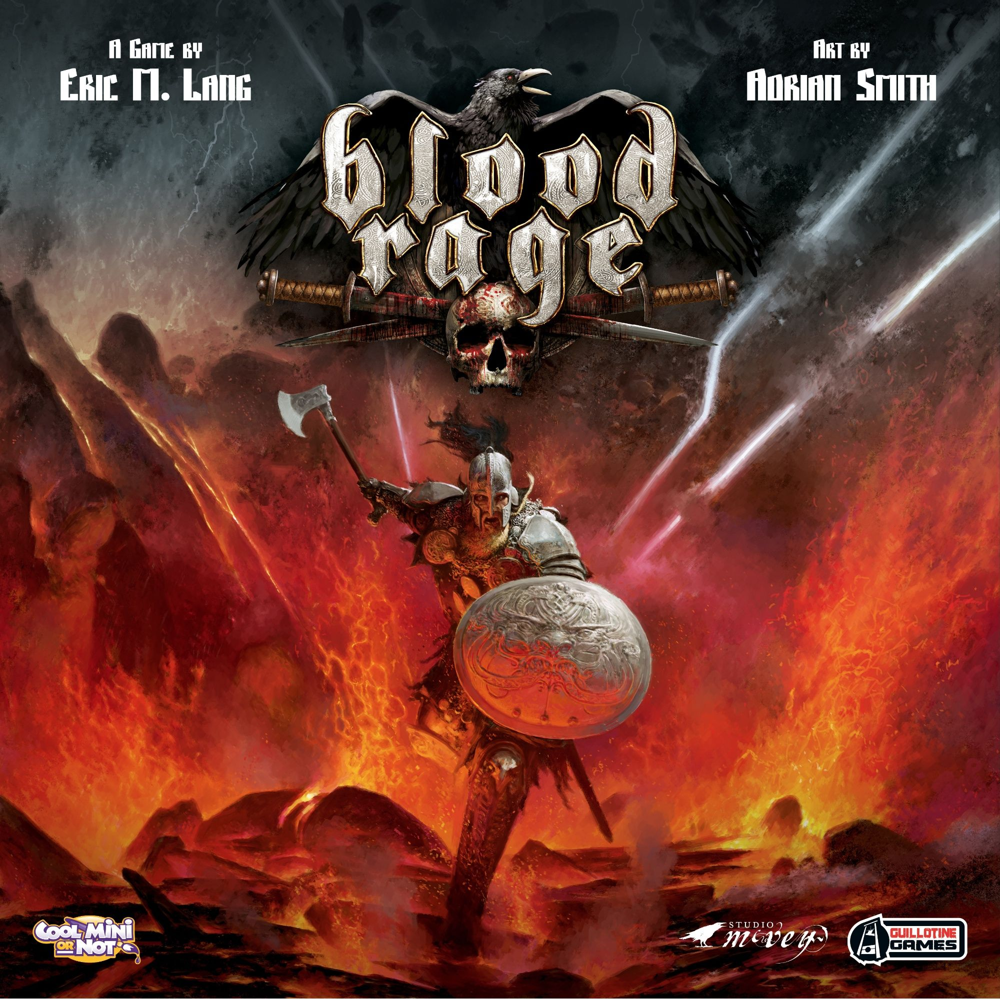
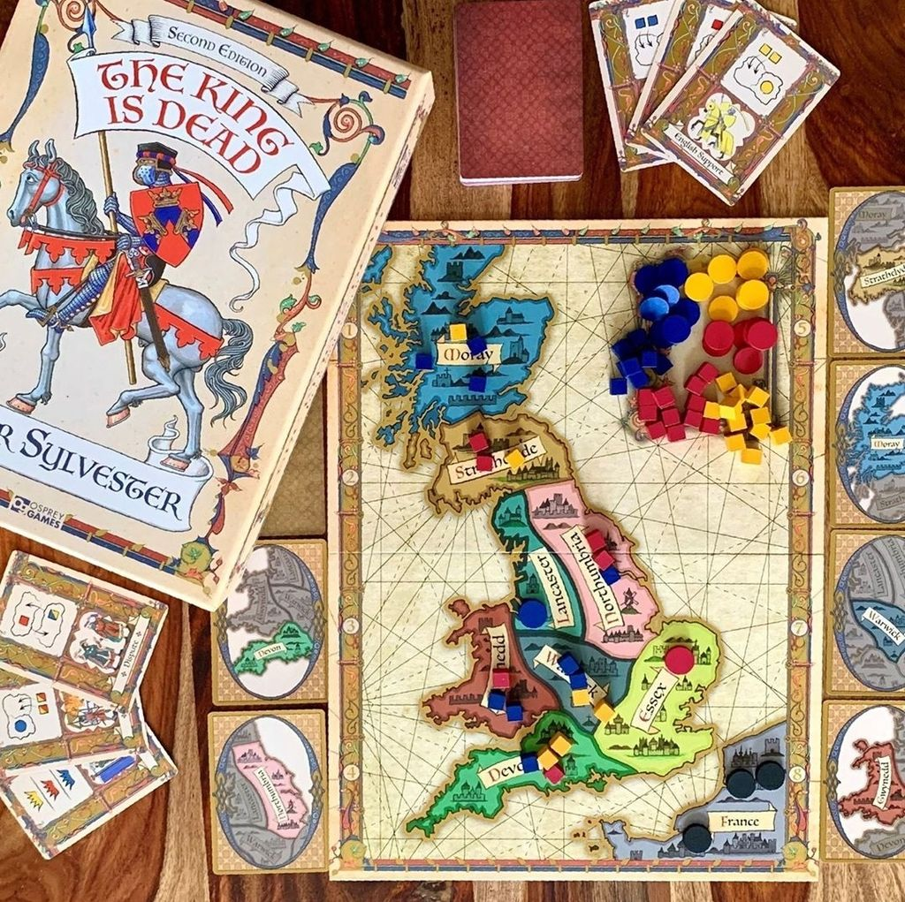
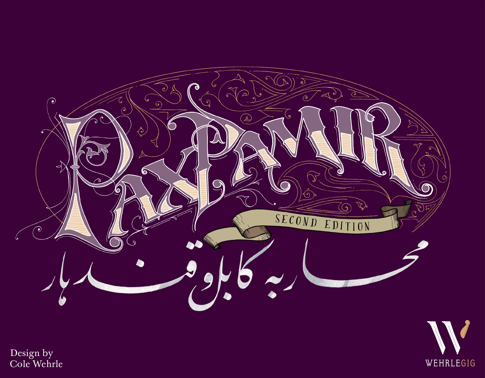
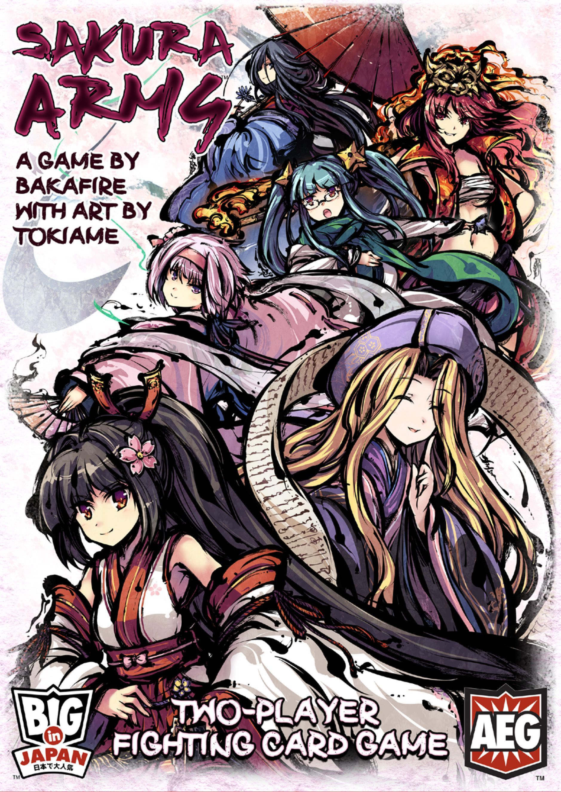

[Inis](https://boardgamegeek.com/boardgame/155821/inis) works because it understands something a lot of area control games forget. The best conflict games are not about smashing plastic into plastic until somebody gives up. They are about pressure. Threats. Timing. That awful little pause when someone declares a victory condition and the whole table suddenly realizes the game might end right now.

That is the juice.

Inis takes area control, action drafting, deterministic combat, and a modular map, then wraps it all around one of the great modern win systems. You do not just quietly hit a point threshold. You announce. Publicly. Then everyone gets one more chance to ruin your day. It rules.

The numbers back up why it keeps showing up in recommendation threads and “best dudes on a map that aren’t just combat math” conversations. [Inis](https://boardgamegeek.com/boardgame/155821/inis) sits at **7.82/10 on BGG from 22,911 ratings**, with a **weight of 2.94/5**, supports **2-4 players**, and runs **60-90 minutes**. That puts it in a sweet spot. Substantial, but not the kind of game where teaching it feels like filing taxes.

So if you love Inis, what are you actually looking for? Usually one of five things:

- area control with brains, not dice-chucking chaos
- card play that drives the whole table state
- conflict that stays tense because information matters
- political timing and table talk
- victory that feels precarious right up to the end

The five games below all hit that DNA from slightly different angles. Some are close area-control cousins. One is a deliberate wildcard for players who care more about Inis’s deterministic card tension than its map play. Either way, each recommendation focuses on a different part of what makes Inis memorable.

## [Blood Rage](https://boardgamegeek.com/boardgame/170216/blood-rage)

**If your favorite part of Inis is drafting cards, reading the table, and turning every battle into a mind game, this is the cleanest next step.**

[Blood Rage](https://boardgamegeek.com/boardgame/170216/blood-rage) is the obvious recommendation people sometimes avoid because it is too obvious. Bad reason to skip it. There is a reason it keeps coming up. The draft matters immediately, the board position matters constantly, and every fight is really a card game wearing a Viking helmet.

The shared DNA with Inis is strong. Both games use card selection to define your options for the round. Both make conflict feel tactical rather than random. Both create those delicious moments where you wonder whether your opponent actually wants the region, wants to lose for compensation, or is baiting you into burning the wrong card. If you love how Inis lets a small hand create huge swings, Blood Rage absolutely gets it.

The big difference is tone and pacing. Inis is more slippery. More political. More “I can still sneak this if nobody notices.” Blood Rage is louder and more openly explosive. It is less about public victory declaration drama and more about building a clan engine across three ages while smashing over provinces that are literally collapsing. Also, where Inis combat often feels like brinkmanship, Blood Rage combat feels like setting a trap and springing it with a grin.

This one is also easier to get to the table with groups that like direct conflict but do not want to parse Inis’s weirder edge cases around pretenders, territories, and the exact texture of victory checks. The teach is smoother. The table presence is huge. The drafting is still the star.

**Who it’s for:** Players who want Inis’s card-driven conflict, but with bigger spectacle, clearer battle payoffs, and less negotiation fog.

## [El Grande](https://boardgamegeek.com/boardgame/93/el-grande)

**If you love Inis because every cube, clan, and position on the map matters, [El Grande](https://boardgamegeek.com/boardgame/93/el-grande) is the old master.**

If Blood Rage is the flashy modern comparison, [El Grande](https://boardgamegeek.com/boardgame/93/el-grande) is the classic that shows how much tension you can get from pure positional play.

Some games age into irrelevance. [El Grande](https://boardgamegeek.com/boardgame/93/el-grande) aged into being annoyingly right about everything. You sit down expecting “classic euro area majority” and then two hours later you are glaring at your friends because one move in Castile just wrecked your entire scoring plan.

The similarity to Inis is not drafting in the same literal sense. It is the feeling of tactical compression. In both games, a small menu of actions creates massive positional consequences. In both games, conflict is deterministic and deeply interactive. No dice are coming to save your bad decisions. If you overextend, the table notices. If you leave an opening, someone takes it. If you think you can quietly line up a win, somebody flips the board state sideways.

El Grande is more austere than Inis. Less mythic flourish, more pure positional cruelty. There is no modular map, no card-combat brinkmanship, no dramatic “announce to win” structure. What you get instead is one of the sharpest majority games ever made. The action power cards force agonizing initiative tradeoffs, and the region scoring cadence means you are always balancing now versus later. It has that same “one wrong read and the whole table punishes you” energy Inis players tend to love.

This is also a great pick if what you really admire in Inis is how elegant it feels. Not simple. Elegant. Every piece matters. Every move echoes.

**Who it’s for:** Players who want the cleanest possible version of Inis’s map tension and majority warfare, with almost zero rules fat.

## [The King Is Dead: Second Edition](https://boardgamegeek.com/boardgame/319966/the-king-is-dead-second-edition)

**If Inis sings for you because a tiny hand of cards creates huge political consequences, this one is lethal.**

From there, it makes sense to go even leaner. [The King Is Dead: Second Edition](https://boardgamegeek.com/boardgame/319966/the-king-is-dead-second-edition) takes a lot of the same pressure and strips it down to almost nothing.

[The King Is Dead: Second Edition](https://boardgamegeek.com/boardgame/319966/the-king-is-dead-second-edition) is one of those games that looks almost too small to matter. Then you play it and realize every card is a loaded weapon. You only get a few actions. That is it. No engine to hide behind. No flood of resources. Just timing, leverage, and the painful knowledge that using a card now means never using it again.

That is where it lines up beautifully with Inis. Both games create tension from limited action sets and public board states. Both are about influence across regions rather than simple elimination. Both reward players who can read not just the board, but what the other players need to happen next. Inis has bigger swings and more table talk. The King Is Dead is tighter, colder, and meaner in a very British way.

The key difference is scale. Inis feels like a sprawling Celtic power struggle with movement, clashes, territory presence, and tactical card play. The King Is Dead strips all that down to the bone. It is almost abstract in how ruthlessly focused it is. But the emotional overlap is real. You spend the game manipulating regional control while also setting yourself up to benefit from whichever faction ends strongest. That means your interests are always slightly crooked. Same as Inis, where your apparent board position does not always reveal your actual plan.

This one especially lands with players who adore Inis at lower player counts or with groups that appreciate knife-edge interaction without wanting a longer, louder conflict game. It is not trying to be epic. It is trying to be exact. And it succeeds.

**Who it’s for:** Players who love Inis’s card tension and political maneuvering, but want something leaner, faster, and brutally distilled.

## [Pax Pamir: Second Edition](https://boardgamegeek.com/boardgame/256960/pax-pamir-second-edition)

**If your favorite Inis moments are the ones where the whole table suddenly recalculates power, [Pax Pamir: Second Edition](https://boardgamegeek.com/boardgame/256960/pax-pamir-second-edition) is magnificent.**

The first three recommendations stay fairly close to Inis as an area-control experience. [Pax Pamir: Second Edition](https://boardgamegeek.com/boardgame/256960/pax-pamir-second-edition) is where the list starts to widen into political conflict that captures the same exposed, unstable feeling.

This is the heaviest recommendation here in terms of systems and table reading, but the connection is still very honest. Both games are conflict games where position is fragile, alliances are conditional, and the leader is never as safe as they look. In both, the board can pivot hard when players coordinate, betray, or simply notice the real threat one turn before it is too late.

The most important shared trait is victory pressure. Inis has that famous declaration system. Pax Pamir has dominance checks that can turn a solid position into ash if your coalition alignment is wrong or the board state shifts under you. In both games, the path to winning is public enough that the table can respond, but slippery enough that a clever player can still thread the needle. That creates the same delicious paranoia. You are never just “ahead.” You are exposed.

What makes Pax Pamir different is that it is not a straightforward area control game in the classic sense. It is a political influence game with market play, tableau effects, coalition loyalty, and a lot more subsystem texture. It asks more from players. The first game can be rough. The second is usually electric. By the third, people start doing that thing where they stare at the board in silence because they finally understand how nasty it can get.

If Inis gives you enough conflict but you wish it had even more shifting loyalties and more room for grand political reversals, this is where I would go. If what you want is a breezier 90-minute map fight, do not do this to yourself.

**Who it’s for:** Players who love Inis’s exposed victory windows, table politics, and tactical reversals, and want a denser political war game.

## [Sakura Arms](https://boardgamegeek.com/boardgame/204493/sakura-arms)

**If what really grabs you in Inis is deterministic conflict and trying to read hidden intentions from a tiny card space, this is the wildcard that actually makes sense.**

After four games that connect to Inis through map pressure and public conflict, [Sakura Arms](https://boardgamegeek.com/boardgame/204493/sakura-arms) is the one recommendation here that shifts format entirely while keeping the same kind of tactical tension.

Yes, this is a two-player dueling card game, not an area control map game. The connection is specific. [Sakura Arms](https://boardgamegeek.com/boardgame/204493/sakura-arms) is all about pregame selection, tight card management, deterministic combat, and the constant threat of getting blown out because you misread what your opponent was setting up.

That overlap matters. Inis players often love the fact that fights are not decided by dice. They are decided by preparation, leverage, and timing. Sakura Arms lives there. You build your deck from chosen character sets before the match, which gives it a draft-adjacent planning feel, and then every turn becomes a tense exchange of positioning and card pressure. The game state is legible, but intentions are not. Sound familiar?

The difference is obvious. This is a duel. No table talk. No kingmaking anxieties. No multiplayer pile-on once somebody looks dangerous. It is cleaner and more surgical. You lose some of Inis’s political theater, but you gain incredible precision. If you are the kind of Inis player who cares less about the map and more about the elegance of card-driven, no-luck confrontation, Sakura Arms can absolutely land.

This is also a nice answer for people who mostly play at two and keep asking for “games that feel like Inis but actually work as a dedicated head-to-head experience.”

**Who it’s for:** Two-player gamers who love Inis’s deterministic card battles and hidden-threat tension more than its multiplayer area majority shell.

## How to choose

Each of these games matches a different part of Inis, so the best pick depends on which part you want more of.

If you want the **closest overall feel**, start with [Blood Rage](https://boardgamegeek.com/boardgame/170216/blood-rage). Drafting into conflict is the headline, and it gives you that same joy of weaponizing a hand of cards against a crowded map.

If you want **pure map tension**, go [El Grande](https://boardgamegeek.com/boardgame/93/el-grande). It strips away flourish and leaves you with positional warfare so clean it feels rude.

If you want **Inis distilled into a smaller, sharper game**, pick [The King Is Dead: Second Edition](https://boardgamegeek.com/boardgame/319966/the-king-is-dead-second-edition). Tiny ruleset. Massive consequences.

If your favorite thing about Inis is **public victory pressure and table-wide recalculation**, [Pax Pamir: Second Edition](https://boardgamegeek.com/boardgame/256960/pax-pamir-second-edition) is the heavyweight champion.

If you mostly play **two players** and care about **deterministic tactical reads**, [Sakura Arms](https://boardgamegeek.com/boardgame/204493/sakura-arms) is the smart wildcard.

## Quick picks

- **Most similar:** [Blood Rage](https://boardgamegeek.com/boardgame/170216/blood-rage)
- **Lightest feel:** [The King Is Dead: Second Edition](https://boardgamegeek.com/boardgame/319966/the-king-is-dead-second-edition)
- **Heaviest:** [Pax Pamir: Second Edition](https://boardgamegeek.com/boardgame/256960/pax-pamir-second-edition)
- **Most interactive:** [El Grande](https://boardgamegeek.com/boardgame/93/el-grande)
- **Wildcard:** [Sakura Arms](https://boardgamegeek.com/boardgame/204493/sakura-arms)

[Inis](https://boardgamegeek.com/boardgame/155821/inis) is still special because it makes area control feel clever instead of lumbering. Every move matters. Every card matters. Every almost-win becomes a table event. The five games above were chosen for how they echo those specific strengths: drafting and tactical battles in [Blood Rage](https://boardgamegeek.com/boardgame/170216/blood-rage), positional majority pressure in [El Grande](https://boardgamegeek.com/boardgame/93/el-grande), distilled political card tension in [The King Is Dead: Second Edition](https://boardgamegeek.com/boardgame/319966/the-king-is-dead-second-edition), exposed victory windows in [Pax Pamir: Second Edition](https://boardgamegeek.com/boardgame/256960/pax-pamir-second-edition), and deterministic head-to-head reads in [Sakura Arms](https://boardgamegeek.com/boardgame/204493/sakura-arms). Pick the one that matches the part of Inis you keep thinking about after the game ends.