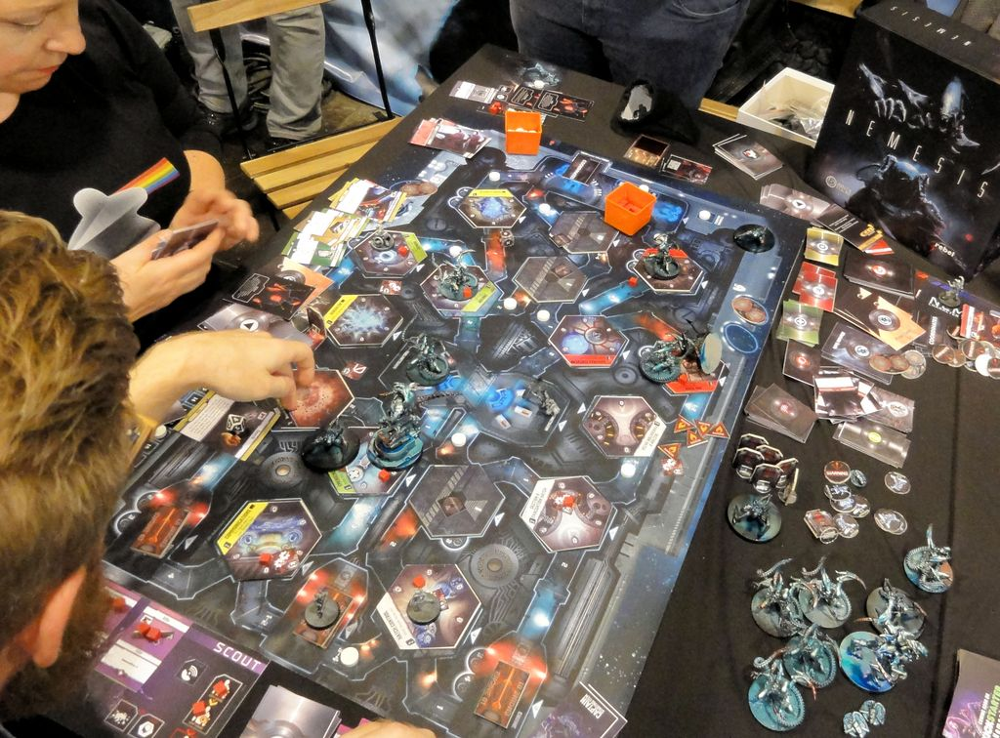
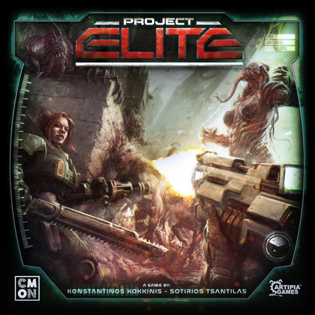
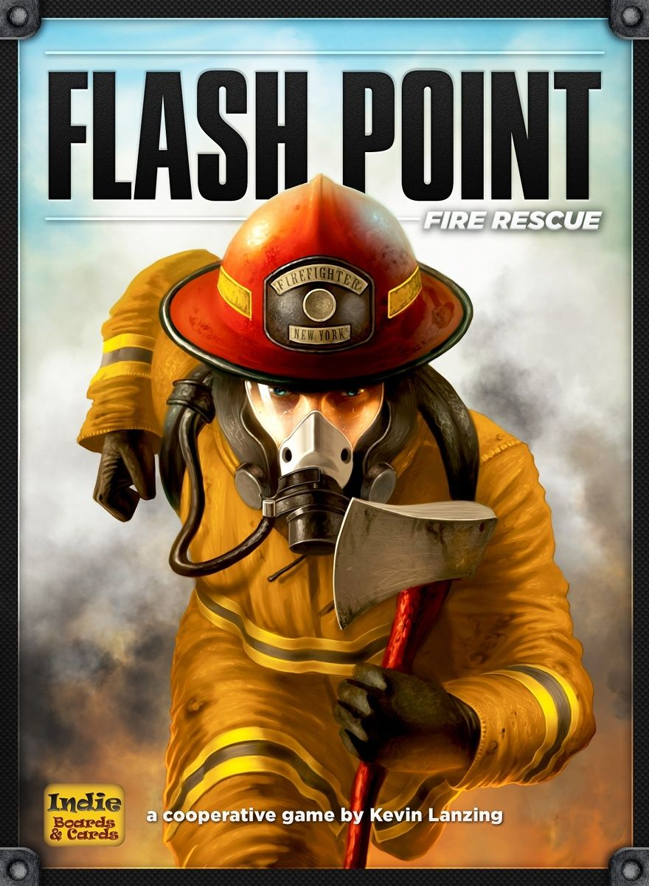
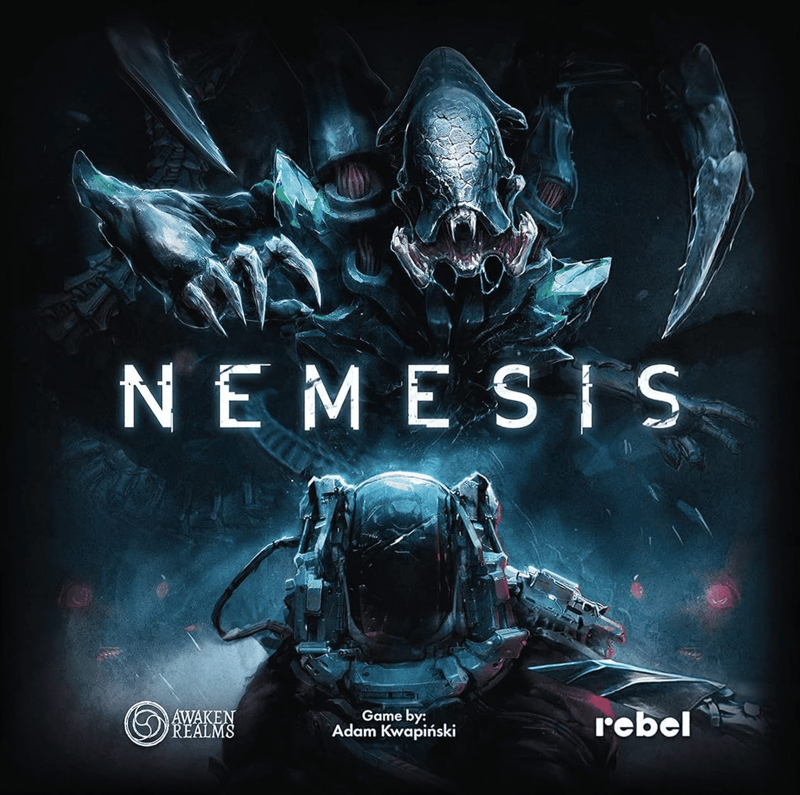

What people love about [Nemesis](https://boardgamegeek.com/boardgame/167355) is not just "space horror". Plenty of games have aliens, corridors, and someone shouting that the scanner room is compromised. Nemesis works because it turns paranoia into a system. Noise matters. Movement matters. Your objective matters. The person sat opposite you saying "we should stick together" might be sincere, or might be quietly setting you on fire for a corporate bonus.

That tension is the whole meal.

[Nemesis](https://boardgamegeek.com/boardgame/167355) sits at a BGG rating of 8.25/10 from 37,011 ratings, with a weight of 3.49/5. It plays 1-5 and runs 90-180 minutes. That tracks. This is the kind of game where the first hour can feel like a horror film loading its gun, and the last 30 minutes are pure panic, accusations, and desperate maths about who can actually reach an escape pod before the ship becomes a very expensive coffin.

So if you want games like Nemesis, this list focuses on the parts that actually make it special: sci-fi horror pressure, hidden or competing objectives, escalating threats, and that constant sense that survival is possible, but never comfortable. Not every pick matches Nemesis in exactly the same way, but each one shares a meaningful piece of that DNA.

## [Project: ELITE](https://boardgamegeek.com/boardgame/256999)

**Nemesis, but with the dial cranked from tense dread to full-volume panic.**

[Project: ELITE](https://boardgamegeek.com/boardgame/256999) is the closest recommendation here if what you really want is "aliens everywhere, everybody shouting, somebody please cover that corridor". It shares Nemesis’ sci-fi horror frame, the sense of being trapped in a hostile environment, and the constant pressure of enemy escalation. Personal objectives help create that lovely little crack in the team dynamic too. Not everyone is always pulling in exactly the same direction, which is where these games start to sing.

The big difference is pace. Nemesis is methodical. You creep, scan, calculate, then everything goes wrong. Project: ELITE is real-time chaos. Enemies flood in, decisions happen simultaneously, and your group has to process a ridiculous amount of information very quickly. It feels less like a survival horror film and more like the section of the film where the motion tracker starts screaming and everyone loses the plot.

That change matters. A lot. If your group loves Nemesis but gets bogged down by the downtime, by the rules lookups, by one player spending six minutes deciding whether to open a door, Project: ELITE solves that problem by refusing to let anyone think in peace. It is lighter, punchier, and more immediately accessible. You lose some of Nemesis’ slow-burn treachery, but you gain pure kinetic energy.

This is also one of those games that creates table stories instantly. Not subtle stories. Big, ridiculous, "how are we still alive?" stories. That has real value.

Who it's for: Players who love Nemesis for the alien swarm panic and survival pressure, but want faster turns, less adm[inistration](/posts/games-like-inis/), and more glorious shouting.

## ISS Vanguard

**If Nemesis makes you want a longer, richer sci-fi campaign instead of a brutal one-shot, this is the move.**

After the immediacy of Project: ELITE, ISS Vanguard sits at the other end of the spectrum. It keeps a lot of the same appeal alive, but channels it into a longer-form experience. You have a spaceship. You have a crew with asymmetric roles. You have exploration, danger, branching mission structure, and the sense that the unknown can absolutely ruin your evening. It also shares that lovely "crew under pressure" atmosphere Nemesis does so well, where every decision feels like it has knock-on effects for the rest of the mission.

The key shift is that ISS Vanguard leans into campaign progression rather than semi-co-op betrayal. Nemesis is built for cinematic disaster in a single sitting. ISS Vanguard wants an ongoing saga. You upgrade systems, develop your ship, pursue research, and watch the story build over time. That means the emotional texture changes. Instead of asking "which one of you is about to doom us?", it asks "how do we keep this expedition alive across the next ten disasters?"

For some groups, that is better. Flat-out better. Especially if they love the immersive sci-fi setting and crew management in Nemesis but bounce off the semi-co-op backstabbing. There’s still threat, still uncertainty, still that excellent feeling of pushing into dangerous territory because curiosity and necessity both demand it. But the game is more interested in continuity and discovery than betrayal.

It also suits the sort of group that likes unpacking a world over several sessions. Nemesis gives you a brilliant horror story. ISS Vanguard gives you a season of television.

Who it's for: Groups who love Nemesis’ spaceship exploration and survival narrative, but want a heavier campaign with progression and less player treachery.

## Darkrock Ventures

**A leaner, pulpier sci-fi horror crawl that keeps the pressure but trims the ceremony.**

If ISS Vanguard is the sprawling campaign answer, Darkrock Ventures is the compact one. It is for the crowd that loves the confined-environment tension of Nemesis but does not always have the appetite for a 90-180 minute event game. The shared DNA is pretty clear. You’re in a dangerous enclosed setting. Alien threats are waiting to make a mess of your plans. Combat is dice-driven. Exploration carries risk. And there’s enough secret-role or traitor-flavoured tension to keep trust from ever feeling fully safe.

What makes it different is its scale and mood. Darkrock Ventures is quicker, more tactical, and a bit more pulpy. Nemesis wants cinematic horror with betrayal and dread hanging over every room reveal. Darkrock Ventures is more willing to let things get messy and loud. The destructible environment angle helps too. It creates that excellent "the board itself is becoming a problem" feeling, which any Nemesis fan should recognise immediately.

This one also benefits from being easier to get to the table. That matters more than hobby discourse likes to admit. The internet loves recommending giant spectacle boxes as if we all have infinite shelf space, infinite prep time, and four friends who can reliably arrive by 7 pm. We do not. Sometimes you want the alien-infested disaster, just in a form that respects a weeknight.

You do give up some of Nemesis’ layered objective drama. The betrayal side is thinner. The emergent narrative is less elaborate. But if what you want is the pressure of survival horror with less overhead, Darkrock Ventures has a very fair case.

Who it's for: Nemesis fans who want sci-fi horror tension, dice combat, and suspicious teamwork in a shorter, lighter package.

## Sanctum

**For players who want the same escalating survival pressure, but with more calculation and less chaos.**

From there, Sanctum makes sense as the recommendation for players who like Nemesis’ pressure but want more control over how they respond to it. Sanctum takes several Nemesis ideas and pushes them toward a more systems-driven experience. You still get sci-fi horror framing, modular spaces, hidden agendas, and intruder-style threats that force you to react to a board state that keeps becoming more dangerous. That part will feel familiar very quickly. You are still trying to manage a crisis while the environment actively resents your existence.

The difference is in how much control the game gives you. Nemesis is famous, or infamous depending on your BGG tolerance for suffering, for letting luck and disaster shape the story. That is part of its brilliance. It is also the reason some players bounce off it hard. Sanctum answers that by leaning further into resource management, energy planning, and strategic development. There’s more euro blood in its veins. You can see lines. You can build toward things. Your bad turns feel less like the universe mocking you personally.

For the right group, that is a huge upgrade. Especially if they adore the setting and pressure of Nemesis but want a game where their planning pays off more reliably. Alliances also feel a touch more structured here, which changes the social texture. You still watch people carefully. You just spend a bit more time reading the board and a bit less time reading their soul.

This recommendation is slightly less immediate than the first three, but still honest. If the thing you love in Nemesis is survival horror decision-making under escalating pressure, Sanctum absolutely belongs in the conversation.

Who it's for: Strategy-first players who want Nemesis-style sci-fi horror and hidden agendas, but with more deliberate planning and less swingy chaos.

## [Flash Point: Fire Rescue](https://boardgamegeek.com/boardgame/100901)

**The wildcard. Same escalating disaster energy, none of the aliens, and a much friendlier teach.**

After four sci-fi horror picks, [Flash Point: Fire Rescue](https://boardgamegeek.com/boardgame/100901) is the deliberate curveball. It is the one recommendation here that leaves the genre entirely, so it needs a proper reason to exist. It has one. The [mechanical](/posts/mechanic-deep-dive-tableau-building/) connection is the way danger spreads faster than the players can comfortably contain it. In Nemesis, noise, intruders, and ship crises pile up until the whole situation feels one bad draw away from catastrophe. In Flash Point, fire and structural damage do exactly the same thing. Ignore one hotspot, and suddenly half the building is trying to kill you.

That cascading emergency structure is the link. A real one, not a hand-wavy "both are tense" excuse.

Of course, the experience changes massively. Flash Point is fully cooperative. No traitor. No secret agenda. No one quietly deciding that your death is acceptable collateral. The tone is heroic rather than nasty. You’re rescuing victims from a burning building, not deciding whether to abandon the scientist in Room 3 because the engines need sabotaging and you have priorities.

But tension? Loads of it. More than people sometimes expect, because the game is so approachable. This is one of the best examples of a lighter design still creating proper table urgency. The board degrades, plans collapse, and suddenly everyone is arguing over whether to save the dog or stop the explosion chain. Good stuff.

If Nemesis is too much for some of your group, too dark, too long, too backstabby, Flash Point can preserve that "the situation is spiralling and we need to act now" feeling in a form that actually gets played.

Who it's for: Groups who love Nemesis’ escalating disaster management but want a lighter, fully cooperative game without the betrayal and horror nastiness.

## How to choose

These five picks overlap with Nemesis in different ways, so the best choice depends on which part of the experience you are actually chasing.

If your favourite part of Nemesis is the **alien siege panic**, pick [Project: ELITE](https://boardgamegeek.com/boardgame/256999). It’s the most immediate recommendation here, and the one most likely to produce shouting within five minutes.

If you love the **spaceship setting, crew roles, and story arc**, go with ISS Vanguard. This is the best fit for players who want the world and tension of Nemesis stretched across a campaign.

If you want **something quicker and easier to table** while keeping sci-fi horror pressure, Darkrock Ventures is the practical choice. Less ceremony, still plenty of danger.

If Nemesis frustrates you because it feels **too chaotic or too luck-driven**, Sanctum is your answer. More planning. More structure. Still nasty.

If what you actually love is the **cascading emergency**, not the aliens specifically, [Flash Point: Fire Rescue](https://boardgamegeek.com/boardgame/100901) is the smart wildcard. Different theme, same rising dread as the board state gets away from you.

## Quick picks

- **Most similar:** [Project: ELITE](https://boardgamegeek.com/boardgame/256999)
- **Lightest feel:** [Flash Point: Fire Rescue](https://boardgamegeek.com/boardgame/100901)
- **Heaviest long-form option:** ISS Vanguard
- **Most interactive:** [Project: ELITE](https://boardgamegeek.com/boardgame/256999)
- **Best wildcard:** [Flash Point: Fire Rescue](https://boardgamegeek.com/boardgame/100901)

Nemesis is still a brilliant monster of a game. When it lands, it really lands. You get suspicion, panic, stupid heroics, and the sort of ending people rehash in the car park. But as these five games show, it is not the only way to get that pressure-cooker survival feeling. Whether you want more aliens, more campaign, more tactics, or just less emotional damage from your friends, one of these options should do the job nicely.

