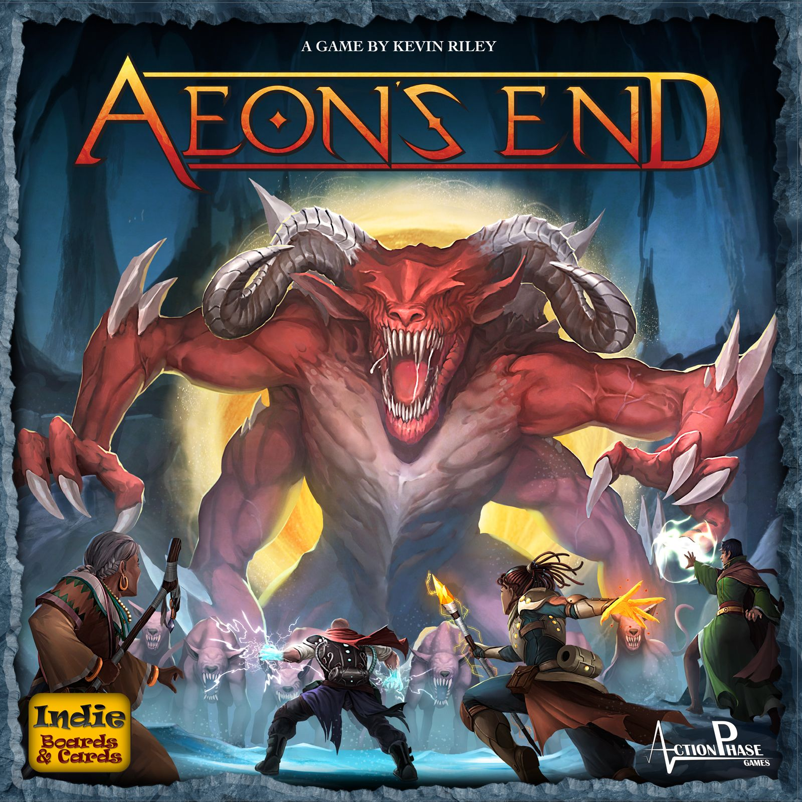
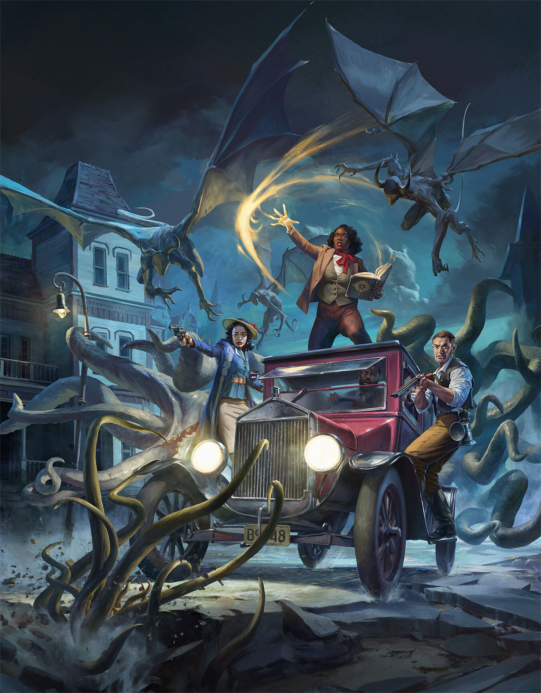
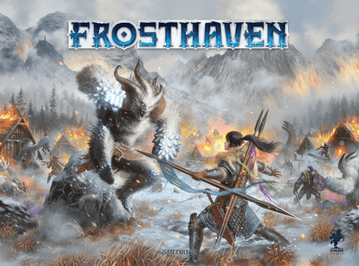

What makes [Spirit Island](https://boardgamegeek.com/boardgame/162886/spirit-island) special is not that it is a co-op. Co-ops are everywhere. It is that the game treats cooperation as a puzzle rather than a polite activity. Each spirit is genuinely different. Your hand of powers is a pool of fragile tools. The board is a living threat that escalates whether you like it or not. And every round you are balancing four different problems at once: your growth track, the invader card in play, where the blight is landing, and whatever your teammates desperately need you to cover.

That last bit is the real magic. Spirit Island rewards planning across seats. It punishes autopilot. It has teeth.

[Spirit Island](https://boardgamegeek.com/boardgame/162886/spirit-island) sits at an **8.37/10 on BGG**, with a **weight of 3.91/5**, ranked around **#10 overall** and holding the **#1 slot in the People's Choice Top 200 Solo Games** three years running. It plays **1-4 players** and runs **90-120 minutes**. Those numbers say the quiet part out loud. This is a heavy, highly strategic game that people keep coming back to because the puzzle keeps biting.

So if you want games like Spirit Island, the question is really which part of the puzzle you are chasing:

- fully cooperative play with no quarterbacking baked into the design
- asymmetric powers that genuinely feel different from seat to seat
- card-driven actions where hand management is half the fight
- an environment that escalates relentlessly no matter what you do
- that specific satisfaction of a team plan coming together on the last possible turn

The five games below all hit parts of that DNA from different angles. Some are very close cousins. One is a campaign beast. One is a deliberate change of pace for groups that bounce off the weight class. Each shares a meaningful piece of Spirit Island's soul without pretending to be a reskin.

## [Aeon's End](https://boardgamegeek.com/boardgame/191189/aeons-end)

**Cooperative deck-building where the boss evolves faster than you do. The closest pure match on this list.**

[Aeon's End](https://boardgamegeek.com/boardgame/191189/aeons-end) is the recommendation that will feel most immediately familiar to Spirit Island players. You pick an asymmetric mage, each with their own starting deck and breach layout. You spend the game assembling spells, hitting the nemesis, and trying to survive its escalating attacks. It is fully cooperative, deeply strategic, and every run feels like a puzzle you almost did not solve.

Shared DNA with Spirit Island runs deep here. Asymmetric characters with meaningfully different tool kits. Card play that forces hand management under pressure. A threat side of the game that generates pain on a timer, not on your whim. And that specific moment in the mid-game where the whole table quietly agrees things are about to get very bad.

[Aeon's End](https://boardgamegeek.com/boardgame/191189/aeons-end) sits at around **7.88/10 on BGG**, with a lighter complexity than Spirit Island — about **2.8/5 weight**. That lower weight is the main difference. You still plan across seats, you still fear the next nemesis card, but the rules overhead is cleaner. No shuffling your discard pile, elegant breach and cast timing, and a turn order deck that prevents the table from falling into the same rhythms every game.

The trade is breadth. Spirit Island's spirits feel like entirely different games. Aeon's End characters are differentiated but sit closer to each other on the spectrum. You also lose the map layer — Spirit Island's geography is half the puzzle, and Aeon's End simply is not trying to replicate that. What you get in exchange is a tight, replayable co-op that scales beautifully from solo up to four, and a horror-fantasy setting that has genuine atmosphere rather than thematic wallpaper.

Who it's for: Spirit Island fans who want the same asymmetric co-op card puzzle in a lighter package, with faster setup, cleaner rules, and a boss that absolutely wants to kill you.

## [Arkham Horror: The Card Game](https://boardgamegeek.com/boardgame/205637/arkham-horror-the-card-game)

**Asymmetric investigators vs an encounter deck that wants you dead. Different genre, same DNA.**

[Arkham Horror: The Card Game](https://boardgamegeek.com/boardgame/205637/arkham-horror-the-card-game) is the logical next stop if what you love in Spirit Island is asymmetric character powers, card-driven action, and an opposing system that keeps turning up the heat. Each investigator has their own deck built from their class pools, with real personality. A survivor plays nothing like a seeker. A guardian plays nothing like a mystic. Sound familiar?

The mechanical overlap is the encounter deck. Every round the game reveals new problems — monsters, mysteries, agendas advancing, doom landing on cards whether you engage with it or not. That forced-escalation pressure is extremely Spirit Island. There is always a new threat arriving, and you are always one bad check from watching the run collapse.

[Arkham Horror: The Card Game](https://boardgamegeek.com/boardgame/205637/arkham-horror-the-card-game) sits at around an **8.1/10 on BGG**, with a **weight of 3.56/5**. Slightly lighter than Spirit Island on paper, but heavier in commitment. This is a Living Card Game with proper campaigns, deckbuilding between scenarios, and character progression that matters. Base box plays **1-2**, scaling to 4 with a second core or the revised core.

Caveats are real. Arkham's puzzle is narrative and investigative rather than spatial — no map pressure to manage, no elegant growth track. The card pool has also become sprawling, so budget this like a hobby rather than a single box. What you get in exchange is the same nervous system: a character with a real identity, a hand under pressure, a system that escalates on its own.

Who it's for: Spirit Island fans who want asymmetric heroes, card-driven pressure, and an escalating opposition in a long-form, story-led format.

## [Frosthaven](https://boardgamegeek.com/boardgame/295770/frosthaven)

**If Spirit Island's appeal is the tactical puzzle of asymmetric kits, Frosthaven is the campaign answer.**

[Frosthaven](https://boardgamegeek.com/boardgame/295770/frosthaven) is for groups who adore Spirit Island's asymmetric puzzle and want to stretch it across a full campaign. Sixteen starter classes, all meaningfully different. A card-driven action system where every turn is a little puzzle of timing, positioning, and exhaustion. A cooperative framework where quarterbacking is actively discouraged because you cannot freely discuss your hand.

That last point matters. The hand-communication limit in Frosthaven will feel most familiar to Spirit Island players who have ever watched one loud voice try to solve everyone's turn. The game designs around that problem. You plan, commit, deal with the fallout together.

[Frosthaven](https://boardgamegeek.com/boardgame/295770/frosthaven) sits at roughly **8.7/10 on BGG**, with a **weight of 4.41/5** — heavier than Spirit Island and genuinely enormous in the box. It plays **1-4**, each scenario runs **60-120 minutes**, and the campaign is a hundred-plus scenarios of content. This is the one you clear shelf space for.

Differences are worth being honest about. Frosthaven is tactical combat in dungeons; Spirit Island is strategic defence of a map. Frosthaven also has a logistics layer — progression, crafting, base building — that Spirit Island refuses to care about. Some players love that. Others want the clean one-shot puzzle without the bookkeeping.

Who it's for: Spirit Island groups who want the same "asymmetric characters, card-driven turns, forced table discipline" feel, but stretched into a long campaign with character progression and tactical combat.

## [The Lord of the Rings: The Card Game](https://boardgamegeek.com/boardgame/77423/the-lord-of-the-rings-the-card-game)

**Cooperative card-driven puzzle where the encounter deck sets the tempo. Quieter, crueller, tighter.**

[The Lord of the Rings: The Card Game](https://boardgamegeek.com/boardgame/77423/the-lord-of-the-rings-the-card-game) is the oldest recommendation on this list and one of the most thoughtful. Draft a hero trio. Build a deck around them. Play scenarios against a self-running encounter system that does not care about your plans. And lose. A lot. That is the point.

What it shares with Spirit Island is the texture of co-op card play. Your hand is limited. Your resources are limited. The encounter deck generates threats on a timer, so every round is a hard trade — commit heroes to quest and leave yourself undefended, or hold back and watch the threat meter climb. Same structural pressure Spirit Island applies through invader cards and blight, different dressing.

[The Lord of the Rings: The Card Game](https://boardgamegeek.com/boardgame/77423/the-lord-of-the-rings-the-card-game) sits at roughly **7.6/10 on BGG**, with a **weight of 3.20/5**. Lighter than Spirit Island on paper, famously punishing in practice. The 2022 Revised Core Set is the obvious entry point now — it fixes the original's scaling issues and ships with pre-built playable decks.

Caveats. This suits solo and two-player play best — at higher counts the game slows and quarterbacking creeps in, exactly what Spirit Island fans tend to hate. It is also a deckbuilder, so enjoyment is partly bound up in tuning decks between scenarios. Some players love that extra layer. Others want "open box, play, pack up", in which case this is not the one.

Who it's for: Spirit Island solo and two-player fans who want a tight, card-driven co-op puzzle with a deckbuilding meta-layer and a Middle-earth flavour.

## [Pandemic Legacy: Season 1](https://boardgamegeek.com/boardgame/161936/pandemic-legacy-season-1)

**The wildcard. Same escalating co-op pressure, a fraction of the weight, and a story that raises the stakes month after month.**

[Pandemic Legacy: Season 1](https://boardgamegeek.com/boardgame/161936/pandemic-legacy-season-1) is the deliberate curveball. Spirit Island people sometimes dismiss it because "Pandemic" feels like the wrong reference point. Fair instinct, wrong conclusion. Base Pandemic is a pure co-op puzzle with quarterbacking problems. Pandemic Legacy weaponises that same system against an escalating campaign that changes the board, the rules, and the stakes every month.

The shared DNA is escalation. Spirit Island builds it into one session — invader cards getting nastier, blight accumulating, terror rising. Pandemic Legacy stretches the same feeling across 12-24 sessions. Each month the game changes what can hurt you. Your group develops a history — losses that matter, characters that evolve, decisions you regret.

[Pandemic Legacy: Season 1](https://boardgamegeek.com/boardgame/161936/pandemic-legacy-season-1) sits at an astonishing **8.5/10 on BGG**, ranked **#2 overall**, at a **weight of just 2.83/5**. It plays **2-4**, roughly **60 minutes per session**, and the magic compounds.

Caveats. Roles here are lighter than Spirit Island spirits — the asymmetry is real but not on the same scale. And yes, the quarterbacking risk exists. The counter is that permanent consequences and the time pressure of an advancing campaign keep the table more honest than a one-shot co-op usually does. Real decisions carry real weight.

Who it's for: Groups who love Spirit Island's escalating co-op pressure but want a campaign-driven, lower-weight experience that mixed skill levels can share.

## How to choose

These five overlap with Spirit Island in different ways, so the right pick depends on which part of the experience you are actually chasing.

If your favourite part of Spirit Island is the **asymmetric co-op card puzzle**, pick [Aeon's End](https://boardgamegeek.com/boardgame/191189/aeons-end). It is the cleanest fit, and the lightest runway.

If you want **asymmetric heroes and card-driven pressure in a long-form story**, go with [Arkham Horror: The Card Game](https://boardgamegeek.com/boardgame/205637/arkham-horror-the-card-game). You are signing up for a hobby, not a single box, but the payoff is enormous.

If you want **a full campaign with character progression** and a hand-communication rule that actively fights quarterbacking, [Frosthaven](https://boardgamegeek.com/boardgame/295770/frosthaven) is the answer.

If you want **a quieter, card-pure co-op** with a deckbuilding meta-layer, especially at 1-2 players, [The Lord of the Rings: The Card Game](https://boardgamegeek.com/boardgame/77423/the-lord-of-the-rings-the-card-game) is the pick.

If Spirit Island is **too heavy for part of your group** but you still want rising stakes and an arc, [Pandemic Legacy: Season 1](https://boardgamegeek.com/boardgame/161936/pandemic-legacy-season-1) is the wildcard that keeps earning its spot.

## Quick picks

- **Most similar:** [Aeon's End](https://boardgamegeek.com/boardgame/191189/aeons-end)
- **Heaviest campaign option:** [Frosthaven](https://boardgamegeek.com/boardgame/295770/frosthaven)
- **Best for solo / two-player:** [The Lord of the Rings: The Card Game](https://boardgamegeek.com/boardgame/77423/the-lord-of-the-rings-the-card-game)
- **Richest story and character depth:** [Arkham Horror: The Card Game](https://boardgamegeek.com/boardgame/205637/arkham-horror-the-card-game)
- **Lightest and most accessible:** [Pandemic Legacy: Season 1](https://boardgamegeek.com/boardgame/161936/pandemic-legacy-season-1)

## What to skip

Two recommendations come up in every Spirit Island thread on BGG and Reddit. Both deserve a caveat.

**Mage Knight** gets suggested constantly, and the surface logic is fair — heavy solo-leaning co-op, card-driven actions, emergent puzzle. But Mage Knight is really a solo game with optional co-op bolted on, and its card system is a hand-cycling adventure puzzle rather than a shared defence under escalating pressure. If you loved Spirit Island for the fully co-op, multi-player coordination, Mage Knight will not scratch that itch. Brilliant game. Wrong shape.

**Gloomhaven** also gets offered up, and the asymmetric-characters-in-a-campaign framing is not wrong. But Gloomhaven is tactical combat with a progression layer, not a co-op card puzzle against an escalating environment. If you want that feel, jump straight to Frosthaven — it is the sharper design and benefits from years of iteration. Gloomhaven is still excellent. It is just the wrong stop if Spirit Island is your touchstone.

Spirit Island is a properly special co-op. The fact that it keeps climbing the BGG chart years after release is not an accident. But it is not the only door into its particular flavour of escalating, asymmetric, card-driven puzzle. Whether you want a lighter version, a campaign version, or a story-led version, one of these five should do the job nicely.
