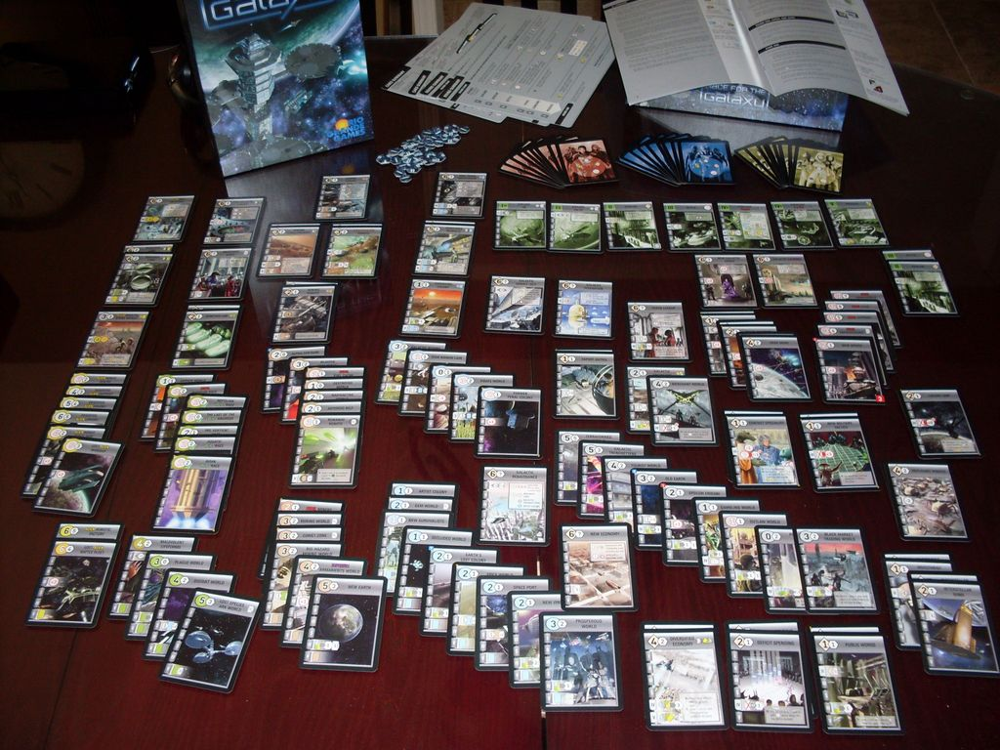
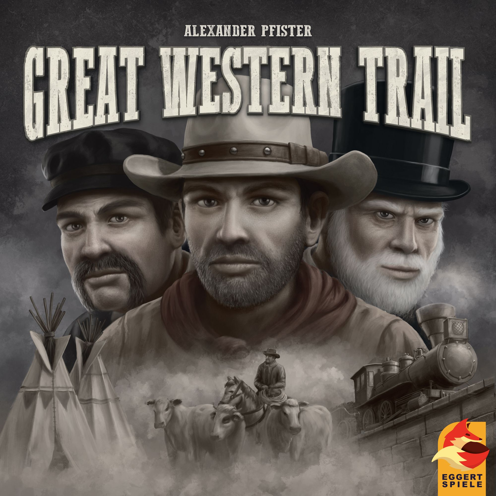
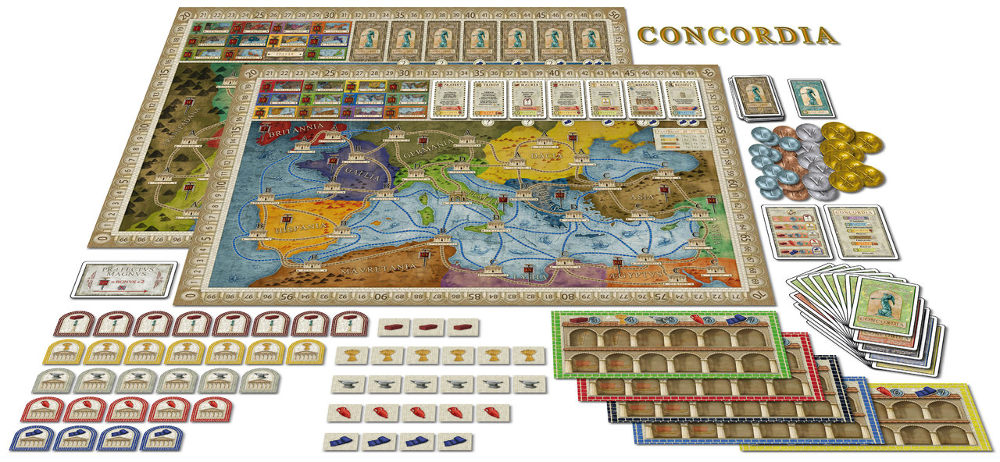

# You've terraformed Mars. Now what?

[Terraforming Mars](https://boardgamegeek.com/boardgame/167791/terraforming-mars) earned its place in the [2026 BGG Hall of Fame](https://boardgamegeek.com/boardgame/167791/terraforming-mars) for a reason. It sits at a **3.24/5 weight** on BGG with a rating hovering around **8.4**, and it's held a top-five overall rank for years. It plays **1–5** in roughly **120 minutes**, though two experienced players can push through faster and a full table of new players might be there all evening.

The appeal is specific and hard to replicate. You start with almost nothing — a corporation, a handful of credits, and a barren planet. Over generations, you play cards that chain into other cards, building an economic engine that starts as a trickle and ends as a flood. The moment when your production income finally eclipses your spending is one of the best feelings in board gaming. And because the card pool is enormous (over 200 unique project cards in the base game), no two games feel the same.

But you've played it fifty times. Maybe you've added Prelude, Venus Next, and Colonies. Maybe you've played the solo game until you can reliably terraform by generation 12. You want that same engine-building arc — the slow build, the satisfying combo, the "look what my tableau does now" moment — in a different package.

Here are six games worth knowing about.

---

## 1. [Ark Nova](https://boardgamegeek.com/boardgame/342942/ark-nova)

**1–4 players · 90–150 min · Weight: 3.71 · BGG: ~8.5 · Rank: ~3**

This is the obvious first recommendation, and for good reason. Ark Nova does for zoo-building what Terraforming Mars does for planetary engineering — it gives you a massive deck of unique cards and asks you to construct a sprawling engine from whatever the draw gives you.

The similarities run deep. Both games feature hundreds of unique cards that you draft and play into a growing tableau. Both reward long-term planning over tactical pivoting. Both have a "generation" structure (Ark Nova's is triggered by the Break token rather than a fixed round count, which actually creates better pacing). And both produce that feeling where, mid-game, your engine suddenly starts working and everything accelerates.

Where they differ is in the action system. Instead of spending credits on cards from your hand, you manage five action cards in a slot system — each action's power depends on its current position, and using it resets it to the weakest slot. This creates a natural rhythm that Terraforming Mars's "buy cards, play cards, produce" structure doesn't have.

**Pick this if:** You want the closest thing to Terraforming Mars but with tighter pacing and a theme that isn't trying to kill a planet.

**Skip this if:** You're looking for something shorter. Ark Nova runs long, especially at four players, where 3+ hours is realistic.

---

## 2. [Wingspan](https://boardgamegeek.com/boardgame/266192/wingspan)

**1–5 players · 40–70 min · Weight: 2.46 · BGG: ~8.0 · Rank: ~25**

Wingspan is what happens if you take the engine-building core of Terraforming Mars, strip out the complexity, and wrap it in the most beautiful production design in modern board gaming. That's not a criticism — it's a different game solving a different problem, and it solves it brilliantly.

You're building a bird sanctuary across three habitats, and each bird you play adds a new power to that habitat's row. Play a bird in the forest and your "gain food" action gets better. Play one in the wetlands and drawing cards improves. The rows chain together exactly like a Terraforming Mars engine — one action feeds the next, which feeds the next, until your turns generate cascading benefits.

At 2.46 weight, it's significantly lighter than TFM. The decisions are real but they don't require the same mental overhead. Turns are quicker. Downtime is minimal. And the bird powers, while less dramatic than Terraforming Mars's project cards, create genuinely satisfying combos once you learn the deck.

**Pick this if:** You love the engine-building arc but want something your non-gaming friends will actually agree to play. Also excellent solo with the Automa.

**Skip this if:** You specifically love Terraforming Mars for its crunchiness. Wingspan will feel too light if weight is the point.

---

## 3. [Race for the Galaxy](https://boardgamegeek.com/boardgame/28143/race-for-the-galaxy)

**2–4 players · 30–60 min · Weight: 2.99 · BGG: ~7.7 · Rank: ~81**

This is the one for people who think Terraforming Mars is too slow.

Race for the Galaxy shares more design DNA with Terraforming Mars than most people realise. Both are card-driven engine builders where your cards are simultaneously your opportunities and your currency. In TFM, you spend credits to play cards. In RftG, you literally discard cards from your hand to pay for other cards. The fundamental tension — "I want to play this card, but I also need to spend cards to play it" — is structurally identical.

The key difference is speed. A game of Race runs 30–45 minutes once everyone knows the icons (and learning the icons is the main barrier to entry — the game is famously, wilfully hieroglyphic). In that time, you'll build an engine of 10-12 cards that produces victory points through production and consumption chains. The simultaneous action selection means there's zero downtime.

The depth-to-time ratio is absurd. Someone who said "Race for the Galaxy is the best game you can't ever get anyone to play" basically nailed it — once you're past the learning curve, there's a hundred hours of strategic depth in a 30-minute package.

**Pick this if:** You want Terraforming Mars's strategic depth compressed into a lunch break. Hundreds of plays in and it still reveals new layers.

**Skip this if:** Opaque iconography makes you anxious. The learning curve is real, even if the game behind it is magnificent.

---

## 4. [Great Western Trail](https://boardgamegeek.com/boardgame/193738/great-western-trail)

**1–4 players · 75–150 min · Weight: 3.73 · BGG: ~8.3 · Rank: ~13**

Great Western Trail doesn't look like Terraforming Mars on the table. You're driving cattle across the American frontier, not playing project cards onto a hex map. But underneath the cowboy hats, the engine-building rhythm is remarkably similar.

Your "engine" in GWT is distributed across three interconnected systems: your personal deck of cattle cards (which you improve by buying better breeds), a trail of buildings that you construct (which give you actions as you pass through them), and a set of workers (cowboys, craftsmen, engineers) who each unlock different strategic paths. The satisfaction comes from tuning these three systems to work together — a well-built GWT engine produces points through efficient cattle deliveries in the same way a TFM engine produces resources through production chains.

At 3.73 weight, it's actually heavier than Terraforming Mars, and the complexity is genuine — there's a lot to track. But the deck-building element adds a layer of long-term planning that TFM players will recognise: you're not just playing what you have, you're actively shaping what you'll draw later.

**Pick this if:** You want engine-building with more interlocking systems and a genuine feeling of building something over the course of the game.

**Skip this if:** You prefer your engines to be tableau-based rather than spread across multiple interconnected subsystems. GWT can feel sprawling until it clicks.

---

## 5. [Concordia](https://boardgamegeek.com/boardgame/124361/concordia)

**2–5 players · ~100 min · Weight: 3.04 · BGG: ~8.1 · Rank: ~15**

Concordia is the quiet achiever on this list. It doesn't look impressive in photos — the graphic design is functional at best, and "Roman merchant trading in the Mediterranean" doesn't exactly set pulses racing. But underneath the bland exterior is one of the most elegant engine builders ever designed.

Your "engine" is your hand of action cards. You start with a basic set and buy more throughout the game. Every card you buy makes your subsequent turns more powerful — sound familiar? The twist is that your cards also determine your final scoring. Each card type scores points based on a different aspect of your board position (cities in certain regions, goods produced, money earned). So buying a card isn't just about what it lets you do — it's about what it will score at the end.

This creates a uniquely satisfying dual-purpose tension that Terraforming Mars players will appreciate. In TFM, your cards are both your actions and your scoring engine. In Concordia, every single card in your hand is simultaneously an action, a scoring category, and a strategic commitment. The interaction between what you want to do and what you want to score produces a richness that sneaks up on you.

**Pick this if:** You want engine-building stripped down to its purest form. No randomness, no card draws after setup — just clean, escalating decisions.

**Skip this if:** The visual presentation matters to you. Concordia is a magnificent game in a thoroughly boring box. (The maps are gorgeous, though.)

---

## 6. [Everdell](https://boardgamegeek.com/boardgame/199792/everdell)

**1–4 players · 40–80 min · Weight: 2.83 · BGG: ~8.0 · Rank: ~30**

Everdell is Terraforming Mars if Terraforming Mars took place in a Beatrix Potter illustration and played in half the time.

That sounds reductive, but the structural parallel is real. Both games give you a shared card market, a personal tableau that grows over the course of the game, and a seasonal/generational structure where your production ramps up. In Everdell, your critters and constructions chain together — a Husband-and-Wife pair fills a Farm, a Queen boosts your whole city — in ways that echo TFM's tag synergies and production chains.

At 2.83 weight, it sits right between Wingspan and Terraforming Mars on the complexity scale. The worker placement layer adds tactical decisions that pure card games lack, and the seasonal structure (you individually choose when to move to the next season, gaining more workers) creates interesting timing pressure.

The production quality is extraordinary — the cardboard tree, the wooden resources, the card art. It's the kind of game that attracts people to the table before they've read a single rule, and then quietly asks them to optimise an engine. That bait-and-switch works every time.

**Pick this if:** You want the TFM engine-building arc wrapped in a shorter, prettier, more accessible package. Genuinely great at all player counts including solo.

**Skip this if:** You find the woodland creature aesthetic off-putting, or you want your engine-builder to have the raw strategic heft of a 3.2+ weight game.

---

## The TL;DR

| Game | Players | Time | Weight | The TFM itch it scratches |
|------|---------|------|--------|--------------------------|
| [Ark Nova](https://boardgamegeek.com/boardgame/342942/ark-nova) | 1–4 | 90–150 min | 3.71 | Massive card pool, long-term engine building |
| [Wingspan](https://boardgamegeek.com/boardgame/266192/wingspan) | 1–5 | 40–70 min | 2.46 | Row-based engine chains, beautiful production |
| [Race for the Galaxy](https://boardgamegeek.com/boardgame/28143/race-for-the-galaxy) | 2–4 | 30–60 min | 2.99 | Cards-as-currency, deep combos, fast |
| [Great Western Trail](https://boardgamegeek.com/boardgame/193738/great-western-trail) | 1–4 | 75–150 min | 3.73 | Multi-system engine tuning, heavy crunch |
| [Concordia](https://boardgamegeek.com/boardgame/124361/concordia) | 2–5 | ~100 min | 3.04 | Dual-purpose cards, escalating power |
| [Everdell](https://boardgamegeek.com/boardgame/199792/everdell) | 1–4 | 40–80 min | 2.83 | Tableau combos, seasonal ramp-up |

The honest answer is that nothing plays exactly like Terraforming Mars — the combination of that specific card pool, the generational economy, and the shared global parameters is unique. But the feeling it creates — the slow build, the moment your engine clicks, the "one more game" pull at midnight — lives in all six of these. Start wherever your weight preference takes you and work outward from there.
