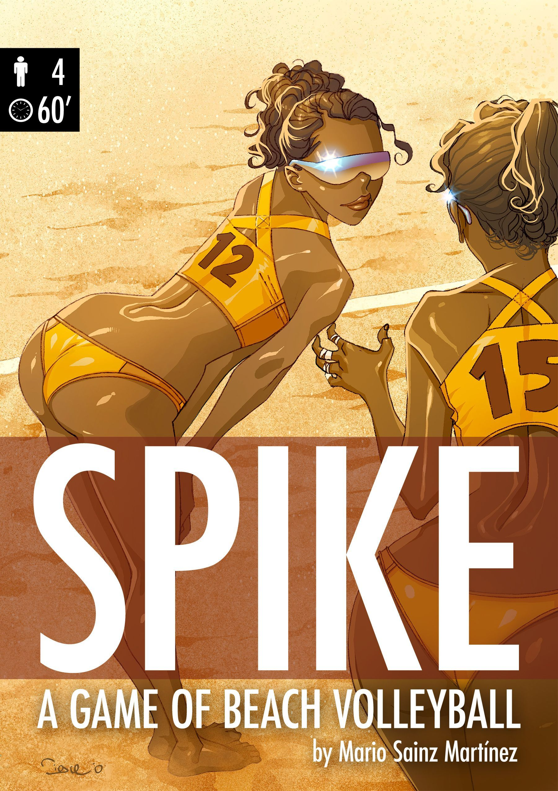
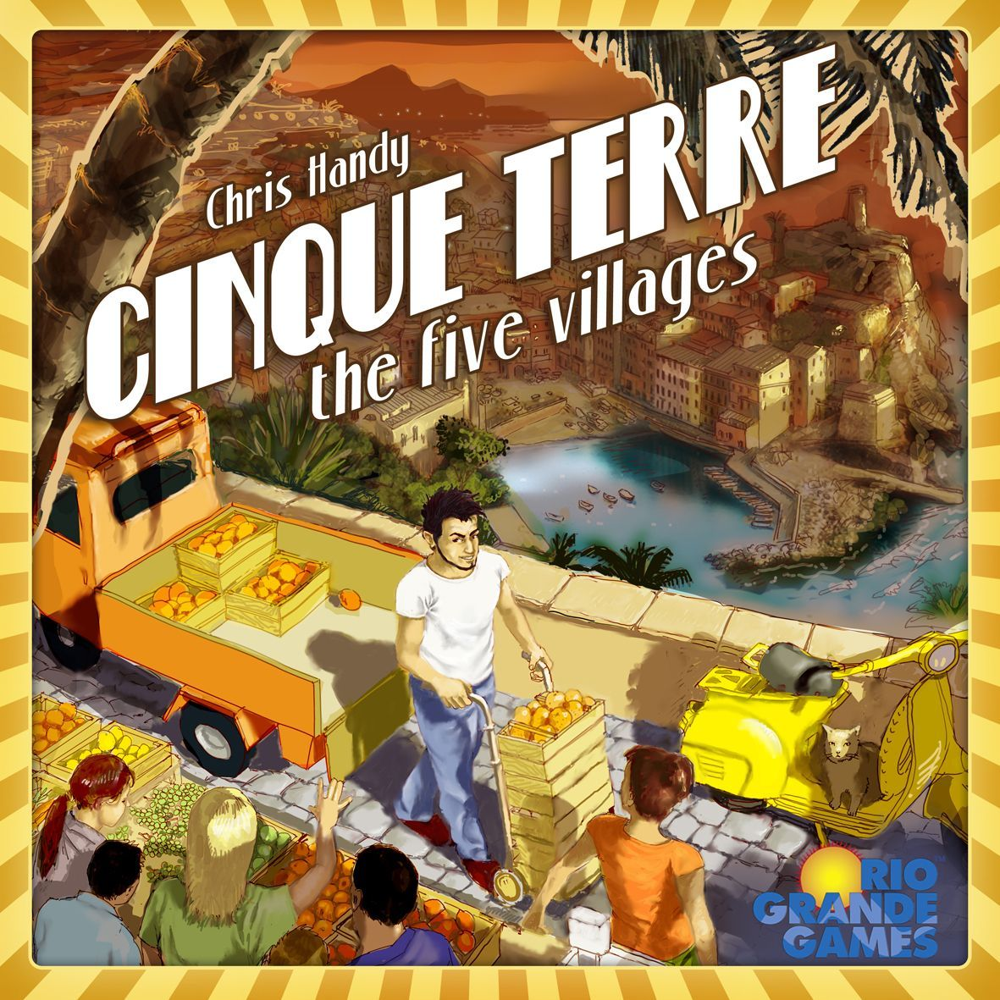

[Ticket to Ride](https://boardgamegeek.com/boardgame/9209) works because it understands restraint. It gives you just enough tension, just enough blocking, just enough hand management, and then gets out of the way. You draw cards, collect sets, claim routes, complete tickets, and spend the whole game doing that lovely little calculation of whether you can risk one more turn before someone nicks the line you need. That’s the magic.

It’s still absurdly good at what it does. [Ticket to Ride](https://boardgamegeek.com/boardgame/9209) sits at **7.39/10** on BGG from **97,873 ratings**, with a **1.82/5** weight, supports **2-5 players**, and plays in **30-60 minutes**. That combination matters. This is not a sprawling train sim. It’s a clean, welcoming route-builder with enough bite to keep hobby gamers interested and enough clarity to survive family game night.

So this list is aimed at players who want more of that specific mix: **set collection, route-building, contract completion, and light player interference**. Some of the picks stay very close to Ticket to Ride’s card-and-map rhythm, some push the same ideas into heavier territory, and one takes the underlying hand-management and fulfilment loop in a different thematic direction.

## Spike

**A lighter route-builder that keeps the card-set-to-build rhythm of Ticket to Ride, but gives you a more open map and more freedom.**

This is the closest match in pure feel. The heart of the game is gloriously familiar. You collect matching colour cards, then spend them to place rail segments and connect cities. If that’s the part of [Ticket to Ride](https://boardgamegeek.com/boardgame/9209) you love most, Spike gets it immediately. No awkward detour. No “well, it’s similar if you squint”. It’s right there on the table.

What makes Spike interesting is that it loosens the structure. You’re not chasing predefined destination tickets in the same way. Instead, the board feels more open, and the colour restrictions affect direction, which turns basic set collection into a small spatial puzzle. That changes the mood quite a bit. [Ticket to Ride](https://boardgamegeek.com/boardgame/9209) often asks, “Can I complete this route before someone blocks me?” Spike asks, “What route do I even want to create from this position?” That extra flexibility gives it a breezier, more exploratory feel.

I like this sort of design because it respects why people enjoy route-builders in the first place. Sometimes you want the contract pressure of tickets. Sometimes you want to draw cards, build a clever little network, and see where the board takes you. Spike leans into the second version.

It also sounds refreshingly low on faff. No piles of extra systems. No bloated turn structure. Just the core loop, tuned slightly differently.

**Who it’s for:** Players who want [Ticket to Ride](https://boardgamegeek.com/boardgame/9209)’s easiest pleasures, matching cards, laying track, and creating satisfying connections, but with more freedom and less script.

## THS & Taxis

**If your favourite part of Ticket to Ride is building efficient paths while quietly ruining someone else’s plan, this is the sharper, meaner version.**

From there, the next step is a game that keeps the shared-map route tension but makes it more tactical. THS & Taxis goes after the same brain space as [Ticket to Ride](https://boardgamegeek.com/boardgame/9209): collect the right cards, claim links on a shared map, build your route before the board tightens up. That’s the DNA. It’s route-building through set collection, with the same satisfying sense that every card in hand is potential geography.

The difference is that THS & Taxis sounds tighter and more tactical. The taxi theme is a bit less immediately charming than little plastic trains crossing North America. Fair enough. But theme aside, this is for the crowd who always thought [Ticket to Ride](https://boardgamegeek.com/boardgame/9209) could stand to be a touch less forgiving. There’s area-majority scoring layered on top, and the interaction is nastier in that old-school Euro way where nobody flips the table, but everyone notices exactly who stole the space they needed.

That’s the appeal. It takes the determ[inistic](/posts/games-like-inis/) path-building and blocking tension from [Ticket to Ride](https://boardgamegeek.com/boardgame/9209) and turns the screws. Less luck-driven drift, more tactical denial. More “I took that connection because I needed it” and also because you needed it. The BGG old guard would probably call that elegant. Reddit would call it rude. Both are right.

The obvious downside is availability. This is the sort of out-of-print title that sends people trawling secondary markets at 11:40 pm while muttering that they definitely do not need another OOP Euro. Dangerous behaviour. Understandable, though.

**Who it’s for:** [Ticket to Ride](https://boardgamegeek.com/boardgame/9209) fans who want the same route-claiming tension, but with more tactical blocking, tighter scoring pressure, and less reliance on fortunate draws.

## Trains

**A route-building train game where your hand of cards doesn’t just help you build, it evolves all game long.**

If Spike is the closest match and THS & Taxis is the sharper one, Trains is where the formula starts to deepen. It still lives in the same broad family as [Ticket to Ride](https://boardgamegeek.com/boardgame/9209): cards drive your actions, you expand across a shared map, and building connections is central to scoring. If what you enjoy is the card-play-to-network-growth loop, Trains absolutely belongs on the list.

The big twist is deck-building. Instead of drawing from a mostly static card ecosystem the way you do in [Ticket to Ride](https://boardgamegeek.com/boardgame/9209), you’re improving your deck over time. Buy better cards, trim inefficiencies, build an engine, then use that engine to expand faster and score more cleanly. That changes the texture of the decisions. In [Ticket to Ride](https://boardgamegeek.com/boardgame/9209), you often adapt to what the deck gives you. In Trains, you’re shaping what your future turns can even be.

That’s a lovely upgrade if you’ve played [Ticket to Ride](https://boardgamegeek.com/boardgame/9209) enough times to want more agency in the card economy. You still get the pleasure of claiming space on a map and racing for routes, but now you’re also building the machine that powers those moves. It’s one of those hybrids that sounds messy on paper and feels very natural once cards hit the table.

The key difference is pace. Trains is less immediate. It asks for a bit more planning and a bit more system awareness. But it keeps enough familiarity that it won’t feel like you’ve wandered into a three-hour spreadsheet.

**Who it’s for:** Players who love [Ticket to Ride](https://boardgamegeek.com/boardgame/9209)’s card-driven route building and want a deeper game where hand management grows into full-on engine building.

## Steam / Age of Steam

**A much heavier train network game for players who want Ticket to Ride’s map tension with real economic pressure.**

From there, the heaviest recommendation is the one that leans hardest into the rail-network side of the experience. The family resemblance is real. You’re still building rail networks on a shared map. You’re still connecting places efficiently. You’re still dealing with contested space and trying to turn those routes into points through deliveries and contracts. If someone loves the train-map element of [Ticket to Ride](https://boardgamegeek.com/boardgame/9209) more than the accessibility, this is the obvious heavier step.

But what a step. Steam and Age of Steam pile on auctions, loans, action selection, locomotive upgrades, and a much harsher economic structure. Suddenly route-building isn’t just satisfying, it’s stressful. In a good way, if you’re the right sort of sicko. Every expansion of your network has consequences. Every wrong read can cost you real momentum. This is train gaming with elbows.

I love that these games make the map feel alive. In [Ticket to Ride](https://boardgamegeek.com/boardgame/9209), blocking matters, but it’s usually one sharp moment. Here, the entire board state is a negotiation with risk, tempo, money, and opportunity. You’re not just trying to complete your plan. You’re trying to survive everyone else’s.

This is also where player count can matter more. These systems often get deliciously cruel with a crowded board. If your group mostly plays at two, I’d be a bit more selective. If you can reliably get the right crew together, though, this is one of the clearest “graduate from Ticket to Ride into something fiercer” paths in the hobby.

No verified BGG stats here, so I’m not going to make any up. The important bit is simpler anyway. This is the heavyweight recommendation.

**Who it’s for:** Players who love the train routes and shared-map tension of [Ticket to Ride](https://boardgamegeek.com/boardgame/9209), but want deeper planning, harsher interaction, and an economy that absolutely does not care about your feelings.

## Cinque Terre

**The wildcard pick: no trains, but the same satisfying flow of managing cards, planning deliveries, and completing contracts efficiently.**

After four train and network-building recommendations, this is the one deliberate sidestep. Cinque Terre earns the spot because the [mechanical](/posts/mechanic-deep-dive-tableau-building/) link is concrete. It uses **card drafting and contract fulfilment** in a way that echoes the hand management rhythm of [Ticket to Ride](https://boardgamegeek.com/boardgame/9209). You’re still looking at a set of available options, shaping a plan from the cards you can collect, and trying to turn that into efficient movement and scoring. That part feels very familiar.

The difference is the whole atmosphere. Instead of rail lines and map blocking, you’re in a lighter pick-up-and-deliver game with an Italian farming theme. It sounds gentler because it is gentler. The tension is less about “you stole my route” and more about timing your drafting and deliveries better than everyone else. That makes it a softer recommendation, but a good one for groups who love [Ticket to Ride](https://boardgamegeek.com/boardgame/9209) because it’s approachable rather than because it’s about trains specifically.

There’s also something nice about the shorter, breezier style here. Simultaneous drafting tends to keep people engaged, and that matters. One reason [Ticket to Ride](https://boardgamegeek.com/boardgame/9209) has lasted is that it respects the evening. Cinque Terre seems cut from similar cloth. It gives you enough to think about without making the table feel like a planning committee.

So no, it’s not a route-builder in the strict train-game sense. But if what you love is card management plus contract completion in a clean, accessible package, this is a fair and useful sidestep.

**Who it’s for:** [Ticket to Ride](https://boardgamegeek.com/boardgame/9209) players who care more about the hand-management and contract-completion loop than the train theme, and want something similarly breezy.

## How to choose

If you want the **closest mechanical cousin**, start with **Spike**. Matching card sets to claim routes is the beating heart of [Ticket to Ride](https://boardgamegeek.com/boardgame/9209), and Spike keeps that front and centre.

If your favourite moments are the ones where the board gets tight and someone quietly swears because their plan just collapsed, pick **THS & Taxis**. This is for players who enjoy the blocking more than they admit.

If you want the same card-driven structure but with more long-term planning, **Trains** is the sweet spot. It adds engine building without abandoning the map.

If the train theme and network growth are what really grab you, and you’re ready for a much heavier game, go straight to **Steam / Age of Steam**. This is the deep end. No armbands.

If your group likes [Ticket to Ride](https://boardgamegeek.com/boardgame/9209) because it’s smooth, friendly, and built around satisfying contract fulfilment, **Cinque Terre** is the best wildcard. Different theme, same useful instincts.

## Quick picks

- **Most similar:** Spike  
- **Lightest:** Spike  
- **Heaviest:** Steam / Age of Steam  
- **Most interactive:** THS & Taxis  
- **Best wildcard:** Cinque Terre  

[Ticket to Ride](https://boardgamegeek.com/boardgame/9209) remains one of the hobby’s great gateway triumphs because it makes route-building feel intuitive and exciting. The five games here all connect back to that appeal in specific ways: **Spike** keeps the closest card-set route claiming, **THS & Taxis** sharpens the blocking, **Trains** deepens the card play into deck-building, **Steam / Age of Steam** turns the rail map into a harsher economic contest, and **Cinque Terre** carries over the hand-management and contract-completion rhythm without the trains. If you know exactly what you love about [Ticket to Ride](https://boardgamegeek.com/boardgame/9209), there’s a very good chance one of these lands perfectly.