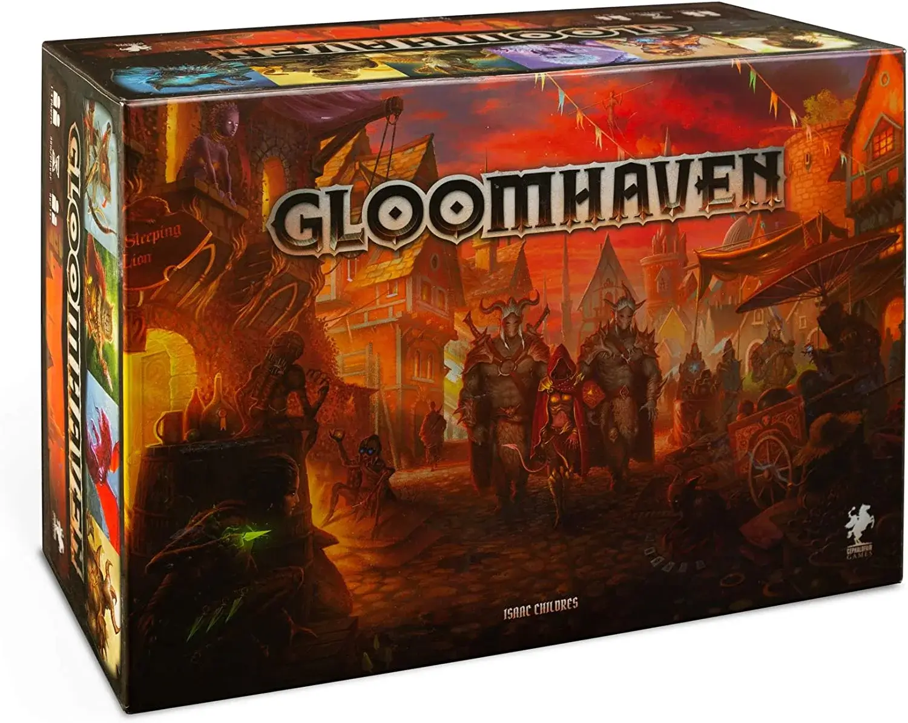
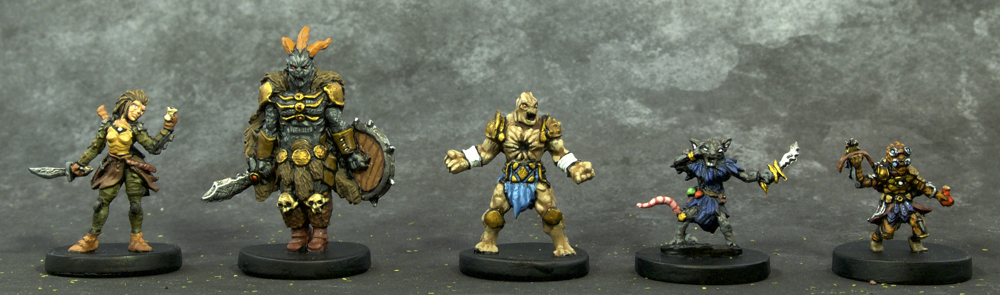

# Gloomhaven: The 100-Hour Dungeon Crawler. Worth the Commitment?

**Why Gloomhaven Matters Right Now**

Alright, let's talk about [Gloomhaven](https://boardgamegeek.com/boardgame/174430/gloomhaven). Yes, that game with the hefty box you need a forklift to move. It's a titan in the board gaming world for a reason. In a sea of quick-play fillers and party games, Gloomhaven stands as a monolith of serious gaming commitment. It’s a behemoth with a campaign that promises (or threatens) to swallow 100 hours of your life, plus expansions if you dare. But here's the thing: this isn't just about throwing dice and moving meeples. Gloomhaven is a living, breathing world where every decision echoes. You're not just playing a game; you're writing your saga.

**What You're Getting Into**

Gloomhaven is not for the faint-hearted. Let's be real. It's a campaign-driven dungeon crawler where players become mercenaries with the noble or not-so-noble task of navigating this fantasy world. Designed by Isaac Childres and published by Cephalofair Games, Gloomhaven hit the scene in 2017 and has been a phenomenon ever since. With a staggering BGG rating and a cult following, it's the game everyone loves to argue about on forums. The official player count sits at 1-4, but most will tell you the sweet spot is 3-4 to really harness the cooperative dynamics. You'll spend approximately 1-2 hours per scenario, but set aside a night. The game will suck you in.

Here's the setup: each player controls a character with their own unique deck of ability cards. The aim? To clear dungeons, complete quests, and advance the overarching storyline. Card play is the name of the game here. It's tactical and rewarding, but also brutal on your brain if you’re not careful. You'll choose two cards for each turn, executing the top action from one and the bottom from the other. What could go wrong? Oh, plenty. Balancing your hand management with the punishing stamina mechanic is where the real game lies.

**Core Mechanics Deep Dive**

Now, let’s get into the nitty-gritty. The dual-action card system is the heart of Gloomhaven. Each turn, you'll choose two cards from your hand. One for its top action, one for its bottom. The possibilities are endless. It’s a dance between maximizing your strategy and mitigating disaster. Do you blast your most powerful spell now or save it for later? Decisions, decisions.

The game also features a modifier deck for attacks, which means even the best-laid plans can go awry. Draw a negative modifier, and your epic swing of the sword is a flailing miss. Is it frustrating? Yes. Is it also what makes every decision pulse with tension? Absolutely.

Then there’s the monster AI. These bad boys aren’t just static obstacles. Driven by their own ability cards, they’re unpredictable and relentless. They’ll focus on the weakest, swarm the unprepared, and generally make your life a living hell. Just like every memorable boss battle should.

**What Makes It Special**

Gloomhaven isn't just a game. It’s a commitment. A lifestyle choice. The beauty lies in its legacy. As you play, the world evolves. Each decision you make, each path you choose, shapes the campaign. Characters will retire, new ones will emerge, and the map will forever change. It's a living world that remembers your story, with permanent stickers, crossed-out sections, and a custom campaign log that feels like an old war diary.

The narrative isn't spoon-fed. It's discovered, like a treasure map with missing pieces. Revealed through scenario outcomes and character development, the story is as much about the journey as it is the destination. You're not just part of the world; you're part of its history.

**The Competition**

How does Gloomhaven stack up against other dungeon crawlers? Let’s chat. There's [Descent: Journeys in the Dark](https://boardgamegeek.com/boardgame/104162/descent-journeys-dark-second-edition), a classic with simpler mechanics but a more direct narrative. If Gloomhaven is a novel, Descent is a blockbuster action movie. Quick, explosive, and fun, but lacking the same depth.

Then there's [Mage Knight](https://boardgamegeek.com/boardgame/96848/mage-knight-board-game). A solo gamer's paradise with sprawling mechanics and a reputation for crunching numbers until your brain melts. It's deeper in terms of personal strategy, but doesn't offer the cooperative storytelling Gloomhaven excels in.

Finally, consider [Sword & Sorcery](https://boardgamegeek.com/boardgame/170771/sword-sorcery). It’s a bit of a middle ground, offering deep character customization and a strong narrative. But let's be honest: it's not going to replace Gloomhaven's grandeur anytime soon. Gloomhaven is still king for those craving epic cooperative storytelling blended with top-tier tactical gameplay.

**Expansions and Ecosystem**

Let's talk about adding more to your Gloomhaven experience. The main contender here is Gloomhaven: Forgotten Circles, an expansion that adds new scenarios, a new character class, and more of those deliciously complex decisions.

If you're wondering whether to dive into the expansion, here's the skinny: if you've exhausted the original campaign and are thirsty for more, go for it. But if you’re still wrestling with the monstrous base game, maybe hold off. Forgotten Circles offers a fresh challenge but doesn’t reinvent the wheel.

For the digital crowd, Gloomhaven has made its mark here too. The digital edition captures the same tension and depth of the tabletop game with the added convenience of automated bookkeeping. It's a faithful adaptation that’s worth checking out if managing a physical game night feels like herding cats.

**Who Should Play / Who Shouldn't**

Here’s the truth: Gloomhaven isn't for everyone. If you love deep strategy, complex decision-making, and cooperative storytelling, welcome home. But if your game night is more about lighthearted fun and quick turns, tread carefully. This game is a beast that demands attention and rewards patience.

The sweet spot for player count is often 3-4. Solo play is possible, but you'll manage multiple characters, which can become a logistical nightmare. Two players can work, but having three to four gives the game a richer dynamic without overwhelming the board.

**The Verdict**

So, is [Gloomhaven](https://boardgamegeek.com/boardgame/174430/gloomhaven) worth the 100-hour commitment? Absolutely, but only if you're ready for it. It’s not a casual fling; it’s a serious relationship. It demands time, effort, and occasionally, a little bit of your sanity. But the rewards? A sprawling epic tale that you'll remember long after you've packed the box away.

Gloomhaven is the gold standard for those who want their games to be a grand adventure. It’s more than just a game; it's an experience. If that sounds like what you're looking for, then gear up. You’re in for one hell of a ride.