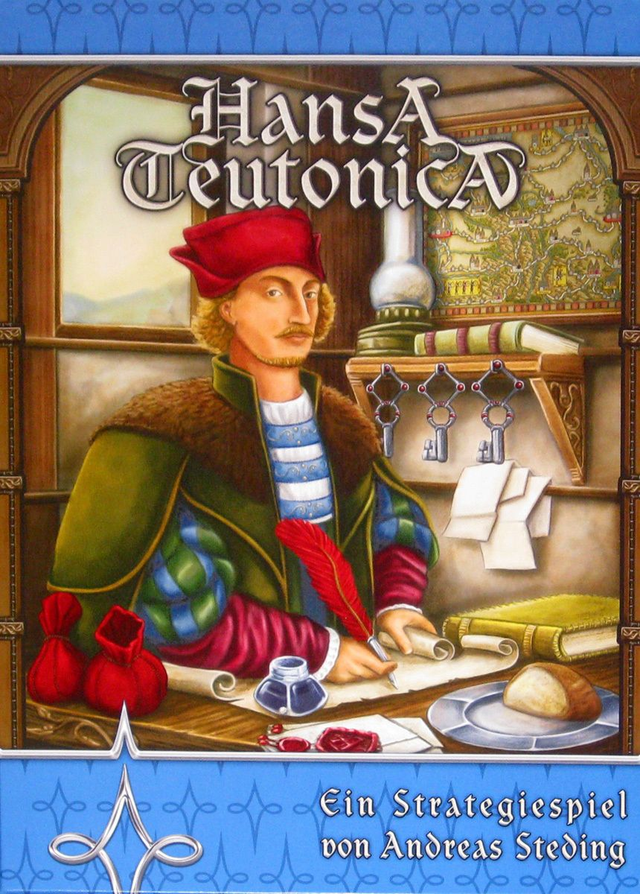

Let me describe a board game to you. It is set in medieval Germany. You are a trader. You place cubes on a map. The box art looks like something you might find in a business textbook from 1997. The colour palette peaks at "muted brown" and descends from there. The name is virtually unpronounceable. Every single thing about this game's exterior is designed, seemingly on purpose, to make you walk past it.

And underneath all of that is one of the best strategy games ever designed.

[Hansa Teutonica](https://boardgamegeek.com/boardgame/43015) has been hiding in plain sight since 2009, steadily climbing to **#147 on BGG's overall rankings** and **#108 among strategy games**, with a rating of **7.75** from over 17,000 voters. Those are excellent numbers for a game with zero miniatures, zero spectacle, and a theme that could politely be described as "functional." It sits at a weight of **3.09/5**  -  solidly medium-heavy, comparable to games like Concordia or Viticulture  -  and plays in **45 to 90 minutes** with **2 to 5 players**.

The real question is not whether Hansa Teutonica is good. It is. The question is why more people aren't playing it.

## The Pitch: A Sandbox Where Everyone's in Each Other's Way

The elevator pitch is deceptively simple. You are a Hanseatic trader building a network of offices across medieval northern Europe. On your turn, you take actions  -  typically two to start, eventually as many as five  -  to place traders on routes, complete those routes to establish offices or upgrade your abilities, and generally try to score more points than everyone else.

That is the skeleton. The flesh is something else entirely.

Hansa Teutonica is a game where the most important thing you do on your turn is often not what you planned to do. Because the board is shared. The routes are shared. And anyone can place a trader anywhere, including right in the middle of your carefully laid plans.

Here is the twist that makes the whole thing sing: **displacement is not destruction**. When someone shoves you off a route, your displaced piece multiplies. You get your trader back, plus a bonus piece from your supply. Getting bumped *helps* you. Which means deliberately getting in someone's way  -  placing a cube on a route you have no interest in, purely to force them to spend actions displacing you and accidentally fuelling your engine  -  is not just viable. It is one of the best things you can do.

This creates a game where passive aggression is elevated to high art. You are not attacking anyone. You are just... standing where they wanted to stand. And smiling about it.

## The Upgrade System: Simple Rules, Devastating Choices

Your player board is a small desk  -  literally, the game's components include tiny desk-shaped boards, which is both quaint and charming. On this desk sit five tracks representing your abilities:

- **Actions per turn** (2 → 5)
- **Traders in your supply** (3 → 7)
- **Move distance** (2 → 5 spaces in a single action)
- **Network scoring multiplier** (for your largest connected chain of offices)
- **Privilege level** (unlocking the ability to place merchants  -  your stronger pieces  -  in city offices)

Every upgrade makes you measurably more powerful. Going from two actions to three is a 50% increase in what you can do each turn. Going from three to five is absurd. The game gives you this incredibly transparent power curve where you can *see* how strong you will become, and then forces you to reckon with the fact that every turn spent upgrading is a turn not spent building your office network or grabbing bonus markers.

This is where Hansa Teutonica becomes genuinely brilliant. The upgrade cities are contested. Göttingen  -  the city that upgrades your action count  -  is typically a warzone. But if everyone is fighting over Göttingen, then the player quietly stringing offices from Stendal to Arnheim for the cross-map bonus is having the game of their life. And if everyone notices that, the Göttingen fighter suddenly has free rein.

The game is a constantly shifting negotiation conducted entirely through cube placement. No one talks about what they are doing. Everyone can see what everyone else is doing. And the correct response to every situation depends entirely on what you think everyone else will do next.

## Why It Gets Overlooked

Let us be honest about the elephant in the room: **this game is ugly**. Not "charming retro" ugly. Not "function over form" ugly. Just... beige. The original 2009 edition looked like it was designed by someone who had heard of colours but preferred not to use them. The map is a network of brown routes connecting brown cities on a brown background. The cubes are wooden. The theme  -  medieval German trading  -  does nothing to help.

The 2020 **Big Box** edition improved things slightly, with cleaner graphic design and the inclusion of all expansion maps, but no one is buying Hansa Teutonica because it caught their eye across a crowded game shop. It is, almost literally, a game that only spreads through word of mouth. Someone plays it at a friend's house, has their mind quietly blown, and then evangelises it to the next person.

The other barrier is the learning curve. The rules are short  -  perhaps four pages of actual content  -  but the strategy is opaque on first play. New players will often spend their first game upgrading everything because the upgrade track is the most visible system, then lose to someone who built a sprawling office network instead. The game does not hold your hand. It does not generate points for you automatically. You have to *find* the points, and the best sources shift from game to game depending on what your opponents are doing.

This is the opposite of modern "friendly" design, where everyone ends up with a satisfying pile of points regardless of what they did. In Hansa Teutonica, you can genuinely have a bad game. That scares some people. But it is also what makes the good games feel so earned.

## The Big Box: The Definitive Version

If you are going to play Hansa Teutonica  -  and you should  -  the **Big Box** edition is the one to get. For a remarkably low price (often around $35-40), you get:

- The **original base map** (two-sided: 2-3 players and 4-5 players)
- The **East Expansion** map, featuring ocean trade routes with permanent bonuses and the brutal Waren city (which controls two upgrades at once)
- The **Britannia** map, with Scotland and Wales requiring control of gateway cities before you can trade there
- **Emperor's Favour** tiles, offering powerful one-shot upgrades
- **Goal cards** for hidden objectives

The extra maps are not just "more of the same." They fundamentally alter the strategic landscape. Britannia in particular adds a layer of territorial control that the base game lacks, and the ocean routes introduce permanent asymmetric bonuses that can define your entire strategy.

For a game this deep, this replayable, and this interactive, the Big Box is one of the best value propositions in board gaming.

## Who This Is Actually For

Hansa Teutonica is best at **4 or 5 players**  -  and this is worth emphasising, because very few Euros are genuinely great at five. BGG's player count poll reflects this: 5 players gets 180 "Best" votes versus 22 "Not Recommended." At five, the board is crowded, displacement happens constantly, and the game develops a wonderful rhythm of plans being made, disrupted, and adapted in real time. Turns stay fast because the individual actions are simple, even as the cumulative strategy is deep.

At **3 players**, it is still very good  -  the board has a dedicated 2-3 player side that closes off routes to force more interaction. At **2 players**, it works but loses some of the beautiful chaos that makes the game special.

**You will love this if you enjoy:** Concordia, El Grande, Brass Birmingham, Tigris & Euphrates, or any game where reading your opponents matters more than optimising your own engine in isolation.

**You might bounce off this if:** you need strong theme, if the visual presentation matters a lot to you, or if you find passive-aggressive interaction stressful rather than delightful.

## The Verdict

Hansa Teutonica has been around for seventeen years and it has never been fashionable. It has no Kickstarter campaign, no miniatures upgrade, no deluxe edition with metal coins. What it has is a design so clean and so interactive that people who play it once tend to play it fifty times. It fits an extraordinary amount of strategic depth into a short playtime, rewards repeated play without becoming stale, and creates moments of social tension and read-your-opponent drama that most games need twice the complexity to achieve.

It is, quite simply, one of the best Euros ever made. It just happens to look like a spreadsheet. Do not let that stop you.

---

**Hansa Teutonica: Big Box**  -  designed by Andreas Steding, published by Pegasus Spiele. 2-5 players, 45-90 minutes, weight 3.09/5. [View on BoardGameGeek →](https://boardgamegeek.com/boardgame/43015)

*Box art courtesy of BoardGameGeek. All data verified via the BGG API.*
