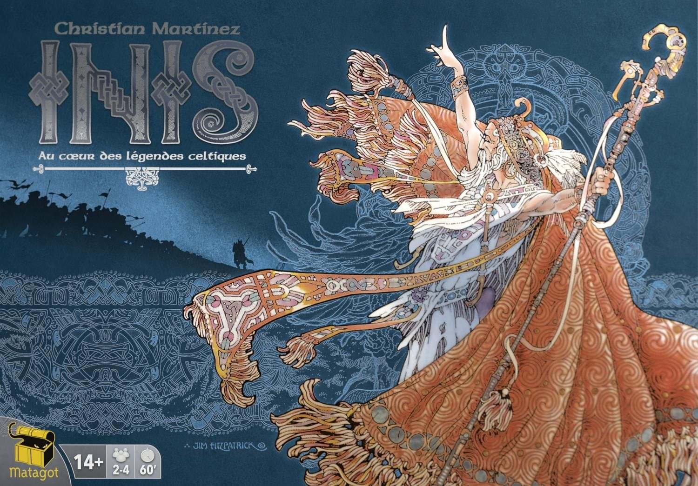

There is a whole genre of board games built around putting miniatures on a map and fighting over territory. [Blood Rage](https://boardgamegeek.com/boardgame/170216), [Rising Sun](https://boardgamegeek.com/boardgame/205896), [Kemet](https://boardgamegeek.com/boardgame/127023) — the usual suspects. They are all good games. They are also all games where aggression is the default setting and subtlety is an afterthought. Then there is [Inis](https://boardgamegeek.com/boardgame/155821), a game where the smartest move is often to do nothing at all, and where the player who wins is usually the one who spent the whole game looking like they were losing. It is brilliant, it is underappreciated, and it deserves better than its current place in the shadow of bigger, louder games.

## What Makes Inis Different

Most area control games are fundamentally about destruction. You build armies, you smash into opponents, you take their stuff. [Inis](https://boardgamegeek.com/boardgame/155821) turns that on its head. Combat exists — clans will clash — but elimination actively works against you. One of the three victory conditions, Leadership, requires you to be present in territories containing at least six *opponent* clans. Read that again. You need your enemies alive and well to win. Burning everything to the ground is a losing strategy.

The other two conditions are equally clever. Land asks you to spread across six different territories. Religion asks you to occupy territories containing six sanctuaries collectively. All three conditions reward presence and positioning over brute force. You can even win by fulfilling multiple partial conditions simultaneously, which creates a web of tension where nobody is ever truly safe and nobody is ever truly out of the running.

The card drafting at the start of each round — the Assembly — is where the real game happens. You are reading the table, watching what gets passed to you, inferring what your opponents are planning, and building a hand that lets you react to anything. The action cards are shared knowledge after a few rounds. Experienced players know exactly which cards exist and can deduce who holds what. This elevates the game from tactical skirmishing to something closer to poker.

## The Numbers

| | [Inis](https://boardgamegeek.com/boardgame/155821) | [Blood Rage](https://boardgamegeek.com/boardgame/170216) | [Rising Sun](https://boardgamegeek.com/boardgame/205896) | [Kemet](https://boardgamegeek.com/boardgame/127023) |
|---|---|---|---|---|
| **BGG Rating** | 7.81 | 7.90 | 7.75 | 7.63 |
| **BGG Rank** | #124 | #65 | #153 | #199 |
| **Weight** | 2.94 | 2.88 | 3.30 | 3.00 |
| **Players** | 2–4 | 2–4 | 3–5 | 2–5 |
| **Play Time** | 60–90 min | 60–90 min | 90–120 min | 90 min |

Look at that weight score — 2.94. [Inis](https://boardgamegeek.com/boardgame/155821) sits right in the middle of the pack, lighter than [Rising Sun](https://boardgamegeek.com/boardgame/205896) or [Kemet](https://boardgamegeek.com/boardgame/127023), roughly on par with [Blood Rage](https://boardgamegeek.com/boardgame/170216). The rules are genuinely elegant. The complexity comes from the decision space, not from exceptions or edge cases. You can teach it in fifteen minutes. Mastering it takes months.

## Why It Gets Overlooked

Three reasons, and they are all fixable.

**First, the art direction.** [Inis](https://boardgamegeek.com/boardgame/155821) is illustrated by Jim Fitzpatrick, famous for the iconic Che Guevara poster, in a style inspired by the Book of Kells and Celtic manuscript art. It is gorgeous — genuinely museum-quality illustration work — but it does not photograph well for social media thumbnails. Next to the hulking vikings of [Blood Rage](https://boardgamegeek.com/boardgame/170216) or the towering Kami of [Rising Sun](https://boardgamegeek.com/boardgame/205896), Inis looks… quiet. Understated. On a shelf or in person, the art is stunning. In a 200-pixel Instagram square, it disappears.

**Second, the first play problem.** New players approach [Inis](https://boardgamegeek.com/boardgame/155821) like it is Risk and spend the first game fighting everything that moves. They lose, the game drags, and they walk away thinking the game is broken. It is not broken. They played it wrong. Inis rewards restraint, timing, and negotiation. The first game is almost always a tutorial that does not represent what the game actually becomes once everyone understands the victory conditions.

**Third, the miniatures arms race.** [Blood Rage](https://boardgamegeek.com/boardgame/170216) and [Rising Sun](https://boardgamegeek.com/boardgame/205896) are CMON games with enormous plastic miniatures that look fantastic on a table. [Inis](https://boardgamegeek.com/boardgame/155821) has nice miniatures — four different sculpts per player — but they are modest in scale. In a hobby where shelf presence sells copies, Inis brings a knife to a mech fight.

## Who Inis Is Actually For

If you have ever played an area control game and thought "I wish there was more negotiation and less dice rolling," [Inis](https://boardgamegeek.com/boardgame/155821) is the answer. The game has no dice at all. Combat is resolved through card play — attacker and defender each simultaneously decide whether to attack (remove an opponent's clan) or defend (move a clan to an adjacent territory). This turns every battle into a reading-your-opponent mind game. Do they have the Epic Tale card that lets them cancel your move? Are they bluffing weakness to bait you into overcommitting?

It scales beautifully at every player count, though BGG voters give the nod to 4 players as the sweet spot (292 "Best" votes). At 2 players it becomes an intense cat-and-mouse duel. At 3 it is a knife-edge balance of alliances. At 4 it is the full Celtic saga, with enough chaos to keep the cleverest player honest.

The 60 to 90 minute play time is another quiet advantage. [Rising Sun](https://boardgamegeek.com/boardgame/205896) regularly pushes past two hours. [Kemet](https://boardgamegeek.com/boardgame/127023) with AP-prone players can drag similarly. [Inis](https://boardgamegeek.com/boardgame/155821) moves. Rounds are fast because you only play cards from a small hand, and the game ends the moment someone claims a victory condition during the Assembly phase — not at the end of a fixed number of rounds.

## The Expansion Question

The [Seasons of Inis](https://boardgamegeek.com/boardgameexpansion/255588) expansion adds a fifth player and a few modular additions. It is not essential, but the fifth player option is welcome for larger groups, and the new territories add variety without bloat. If you like the base game, pick it up. If you are on the fence about Inis itself, the base game is the complete experience.

## The Verdict

[Inis](https://boardgamegeek.com/boardgame/155821) is sitting at #124 on BGG with a 7.81 average rating. For a game with nearly 23,000 ratings, that is a seriously strong score that puts it comfortably in the top tier of strategy games. It should be in the conversation every single time someone asks for area control recommendations, and it usually is not — at least not with the same volume as its flashier competitors.

The best compliment I can give [Inis](https://boardgamegeek.com/boardgame/155821) is this: it is the rare area control game where the most memorable moments are not about what you destroyed, but about what you chose not to. The victory you saw coming three rounds early. The alliance you quietly broke at exactly the right moment. The territory you ceded that nobody understood until you claimed the crown.

If your shelf has [Blood Rage](https://boardgamegeek.com/boardgame/170216) but not [Inis](https://boardgamegeek.com/boardgame/155821), you are missing the other half of the conversation. Pick it up.
