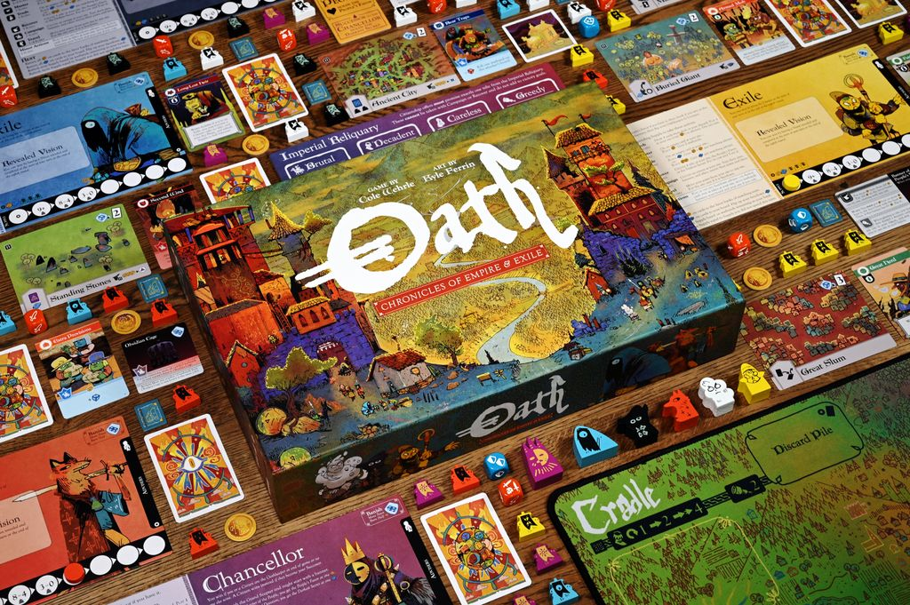

# [Oath: Chronicles of Empire and Exile](https://boardgamegeek.com/boardgame/291572/oath-chronicles-of-empire-and-exile) Is Still One of the Boldest Games You Can Buy

Some games are fun for a night. [Oath: Chronicles of Empire and Exile](https://boardgamegeek.com/boardgame/291572/oath-chronicles-of-empire-and-exile) is fun to *remember*. This is the rare design where the end of one session actually matters next time, not because you're trapped in a legacy campaign, but because the world itself keeps the scars. The usurper who stole power. The weird card that warped the economy for three sessions. The moment your friend swore loyalty as a Citizen and then absolutely did not mean it. I love games that create table stories. Oath turns those stories into infrastructure.

This article is really about why that works, why the game remains so distinctive, why it still goes under-discussed despite its reputation, and which groups should actually consider buying it. Oath is not an easy recommendation for everyone, but for the right table, it does something very few board games can do.

## The Pitch

Designed by Cole Wehrle, the same mind behind [Root](https://boardgamegeek.com/boardgame/237182/root), Oath is a 2021 area control and political struggle game for 1-6 players, rated 7.72/10 on BGG from 9,355 ratings, with a weight of 4.12/5 and an overall rank of #331. Those numbers tell you part of the story. The other part is that this game still feels weirdly under-discussed outside the exact corner of the hobby that likes asymmetry, betrayal, and rulebooks that ask a little from you. If your group wants clean efficiency puzzles, keep walking. If your group wants a living political mess that remembers who won last month, this thing is electric.

What keeps pulling people back is that Oath does not treat a single play as the full product. A lot of great strategy games reset so completely that your best memory is basically social, not [mechanical](/posts/mechanic-deep-dive-hidden-roles/). You remember who bluffed, who won, who got salty, then you rebuild from zero next time. Oath says no, that scar stays. If the Chancellor barely survives by building a regime around a particular cluster of sites and cards, the next table inherits that shape. If an Exile wins with a Vision and drags the world in a strange direction, the game state itself starts telling that story back to you. That changes the emotional texture of every decision. You are not just asking, "Does this score me a win tonight?" You are asking, "What kind of country do I want these idiots to inherit next week?"

That sounds lofty, but at the table it becomes deliciously petty. Maybe you cannot win this session, but you can absolutely make sure the next ruler inherits a brittle economy and a hostile hinterland. Maybe you swear citizenship because it is the cleanest route to relevance, then spend the next hour quietly building a board position that makes succession inevitable. Maybe you burn resources to stop a Vision victory, not because it helps you immediately, but because you refuse to let the campaign become "that relic combo world" for the next month. These are not edge-case moments. This is the game.

It also solves a problem that a lot of ambitious narrative board games never quite crack. Usually you get one of two things. Either the systems are sharp and the story is thin, or the story is rich and the systems are basically a delivery vehicle. Oath is one of the rare games where the story *is* the systems. The narrative comes from card access, map pressure, citizenship offers, battle risks, and timing windows around the Oathkeeper goal. No flavor paragraph is doing the heavy lifting. Your group is.

And that is why the people who love Oath really love Oath. Not in the "solid 8 out of 10, would play again" way. In the "remember when Dan became a Citizen, inherited the empire, then immediately got dogpiled by the same coalition he helped create?" way. The game creates continuity, but it also creates folklore. That is a much rarer trick than its BGG rank suggests.

## What Is It

At its core, Oath is an empire game. One player starts as the Chancellor, defending the current regime and the Oathkeeper goal. Everyone else begins as Exiles, trying to overthrow that order, fulfill a personal Vision, or maneuver into a better long-term position. Some Exiles can even become Citizens, joining the empire for a shot at becoming the Successor instead of tearing the whole thing down.

That role structure is the hook. The actual turn system is surprisingly formal. Every turn runs through Wake, Act, and Rest. In Act, you spend supply on major actions like Search, Muster, Trade, Recover, and Campaign, while minor actions let you move around the map and position for bigger plays. You build up your own warband army on your board, deploy it to sites, collect relics, bargain for favors and secrets, and eventually throw all of that into Campaigns.

Combat is not a tidy euro exchange. It's an all-or-nothing dice battle where you're attacking sites, pawns, and relics with real consequences. You can displace rivals, burn through their resources, kill warbands, and rip control of the map out from under them. It feels dangerous. Good. Area control should.

The real magic, though, is what happens after the winner is crowned. Oath changes. Cards enter or leave the world deck. The next game inherits the political shape of the previous one. The map remembers. The economy remembers. Your group remembers, too.

That is the whole point.

## Why It’s Great

Once you understand the basic structure, the appeal becomes much easier to see. Oath does something most campaign-style games only pretend to do. It creates continuity without homework.

You do not need an app. You do not need a scenario book. You do not need to schedule twelve sessions in a row and pray nobody moves away. You just play, pack it up correctly, and next time the world is a little different because of what happened before. That is such a smart piece of design. It gives you the emotional payoff of legacy gaming without the cling wrap guilt and expiration date.

And the stories are incredible because they emerge from systems, not scripted twists. One game might be about the Chancellor desperately holding together a decaying empire while two Exiles circle like sharks. Another becomes a weird economic cold war around key sites and relics. Another spirals into open betrayal after a Citizen decides the throne looks better from one seat over. Every [Root](https://boardgamegeek.com/boardgame/237182/root) teach starts the same way, with somebody trying to explain asymmetry while one player zones out. Oath has its own version of that chaos, but the payoff is bigger because the politics have memory.

It also dodges a problem that some big conflict games never solve. In a lot of sprawling epics, you spend hours building toward a finale that vanishes the second the box closes. Oath gives those sessions afterlife. If you like the grand negotiation and shifting alliances of [Twilight Imperium](https://boardgamegeek.com/boardgame/233078/twilight-imperium-fourth-edition) but do not have the stamina for an all-day event, Oath is a much sharper proposition. You still get asymmetric empire intrigue, but in a tighter 45-150 minute box.

And if you like the table tension of [Blood Rage](https://boardgamegeek.com/boardgame/170216/blood-rage), Oath offers a different kind of payoff. Blood Rage gives you dramatic clashes and tactical card play. Oath gives you betrayal with consequences that can echo into the next session. That is nastier. In the best way.

## Why Nobody Talks About It

That same ambition is also why Oath stays relatively niche. It asks for real commitment, and the hobby is not always honest about how much that scares people off.

The theme is part of it. Cute woodland war sells better than abstract imperial decline. Viking monsters sell better than a shifting constitutional crisis. Oath is not ugly, far from it, but it is esoteric. The pitch is harder. "You are all fighting over a political order that will reshape the next game" is a tougher sell than "be a raccoon with a crossbow."

The teach is another problem. This is a 4.12/5 weight game. Not fake-heavy. Actually heavy. The first turn can feel like you're piloting a state apparatus with one handwritten note and a prayer. The Wake-Act-Rest structure is clean once it clicks, but getting people from zero to "I understand why becoming a Citizen might be brilliant or suicidal" takes effort. A lot of groups bounce before the game reveals what makes it special.

Then there is the kingmaking discourse. The BGG threads and Reddit takes are exactly what you'd expect. Some players think the negotiation and leader-bashing are the soul of the design. Others see one late-game deal and declare the whole thing broken. I land firmly in the first camp. Oath is political. Political games involve leverage, timing, grudges, and occasionally handing someone else the crown because it sets up your future better. If that makes your eye twitch, this is not your game.

It is also not cheap experimentation. Oath is published by Leder Games, and current retail is usually around $90 to $120 depending on stock and region, with copies commonly showing up at stores like Boardlandia, Miniature Market, Game Nerdz, and local hobby shops when available. That price is fair for the production and ambition, but it absolutely raises the stakes. People do not casually impulse-buy a demanding chronicle game.

## Who Should Buy It

All of that leads to the real buying question: who is this actually for?

Buy Oath if your group loves asymmetry, negotiation, and games that get better once the table develops shared history.

Buy it if [Root](https://boardgamegeek.com/boardgame/237182/root) made you wish the fallout of each session mattered next week.

Buy it if you want a campaign feeling without campaign obligations.

Buy it if you have a regular 3-4 player group willing to watch a rules video first and embrace the fact that this game is not trying to be fair in a sterile tournament sense. My strong recommendation is 4 players if you can manage it. Three works. Four sings. That is where the alliance web gets properly dangerous without the table turning into total noise.

Skip it if you hate kingmaking. Skip it if swingy dice battles feel offensive to your personal philosophy. Skip it if your group prefers perfect-information efficiency and gets irritated when a game asks them to roleplay ambition, fear, and opportunism through mechanics.

This is not a "bring it to family game night" purchase. This is a "text the same three degenerates who still talk about that one coup from six months ago" purchase.

Let me get more specific, because "for experienced groups" is too vague to be useful. Oath is perfect for the table that already understands one crucial truth about conflict games: the best move is not always the most efficient move on paper. Sometimes the best move is the one that changes incentives. If your group enjoys reading the room, threatening future retaliation, offering temporary protection, or making a deal that is technically legal and morally disgusting, Oath has real juice for you.

The ideal buyer is a group of three or four players who can meet somewhat regularly, even if "regularly" just means once a month. You do not need a weekly campaign cadence. But you do need enough continuity that people remember what the last regime looked like. Four is my pick because the political geometry gets richer. With three, Oath can be excellent, sharper, and easier to parse, but alliances are more exposed and the table balance can feel a little binary. With four, you get plausible deniability. You get side bargains. You get one player pretending to help contain a leader while secretly preparing to benefit from the cleanup. That is where the game starts cackling.

There is also a specific kind of [Root](https://boardgamegeek.com/boardgame/237182/root) fan who should absolutely take a hard look. Not the player who just likes cute art and faction toys. The player who loves how Root makes the table state political. Oath gives that player a broader sandbox. The asymmetry is less about everyone having totally different action economies and more about everyone pursuing different relationships to power. Chancellor, Exile, Citizen, Vision seeker. Those identities generate table talk naturally. You are not just optimizing your own machine. You are declaring what kind of opportunist you want to be.

A practical tip for buyers: do not plan your first game as a cold teach from the rulebook unless your group enjoys pain as a bonding exercise. Send a rules video ahead of time. Set expectations that the first play is about understanding incentives, not mastering every card interaction. During the teach, focus on the win conditions and the meaning of citizenship before diving into edge cases. Oath opens up once players understand what they are fighting *for*. If you teach it as a pile of actions and exceptions, people drown.

And yes, there are groups who should run screaming. If your table hates negotiation, gets annoyed by tactical uncertainty, or demands that every winner emerge from a perfectly sealed meritocracy, Oath will feel like an attack. Same if your group rotates players constantly. This game can handle changing rosters, but it thrives when the same names keep showing up and carrying grudges forward. Oath is not a generalist recommendation. It is a bullseye recommendation. For the right group, that is better.

## Verdict

Yes, [Oath: Chronicles of Empire and Exile](https://boardgamegeek.com/boardgame/291572/oath-chronicles-of-empire-and-exile) is ranked #331 on BGG, so calling it a hidden gem will annoy somebody in the comments. Fine. They can cope. In practical hobby terms, Oath is still overlooked because so few groups actually take the plunge, learn it properly, and let the chronicle breathe across multiple sessions. That barrier keeps one of the most original games of the last decade sitting on the sidelines while safer hits get all the table time.

And that is the miss.

What people are missing is not just another heavy strategy game. They are missing a game that can turn your group into historians of its own nonsense. A game where one win changes the next setup. A game where betrayal is not a momentary spike of drama but part of the world's memory. A game willing to be difficult because it has something worth protecting on the other side of that difficulty.

I love Oath for that. It is messy, ambitious, occasionally infuriating, and utterly unlike the polished one-and-done designs that dominate so many shelves. If your group wants a board game that can become *its own legend*, this is the one.

What pushes Oath from "interesting design experiment" into "buy this if your group fits" is that its ambition actually survives contact with repeated play. A lot of big-concept games are intoxicating the first time and then flatten out once you see the machinery. Oath does the opposite. The first play is often bewildering. The second is revealing. By the third or fourth, your group starts playing the *campaign*, not just the current board. That is when the game becomes itself.

You start noticing long-tail decisions. Maybe the Chancellor's real mistake was not losing a battle, but allowing too many powerful cards to stay in circulation for the next session. Maybe an Exile's failed Vision run still mattered because it forced everyone to respect that path in future games, changing how they evaluate Search and site control. Maybe a player who lost badly still shaped the chronicle by deciding which regime would inherit the world. These are deeply satisfying consequences because they reward attention, memory, and personality, not just tactical execution.

There is also a strong case for Oath as a shelf anchor. Not a game you play every week forever, but a game that gives your collection a different dimension. Plenty of shelves already have a clean euro, a social deduction hit, a big war game, a card-driven engine builder. Oath occupies stranger territory. It is the game you bring out when your group wants a night to feel consequential. Not just competitive. Consequential. It creates the sense that the table is participating in a shared history, and very few boxed games can do that without scripts, sealed packets, or app-driven twists.

So yes, I still think it earns the hidden gem label despite the respectable BGG rank. Ranking is visibility among hobby diehards. A gem is about how often a game's real brilliance goes unrealized at actual tables. Oath is still underplayed relative to what it achieves. If your group has the appetite, buying it is not just buying a game. It is buying the possibility of a shared saga that no other group on earth will produce in quite the same way.