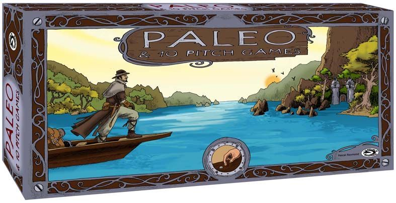
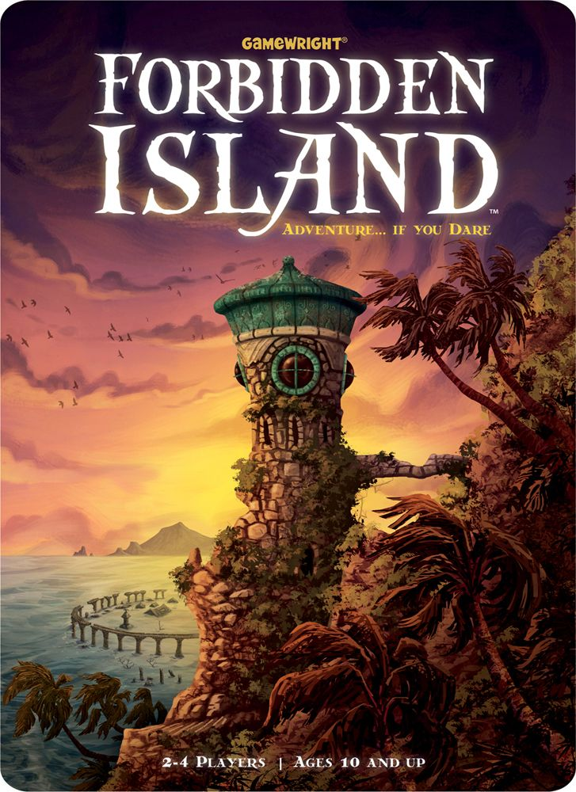
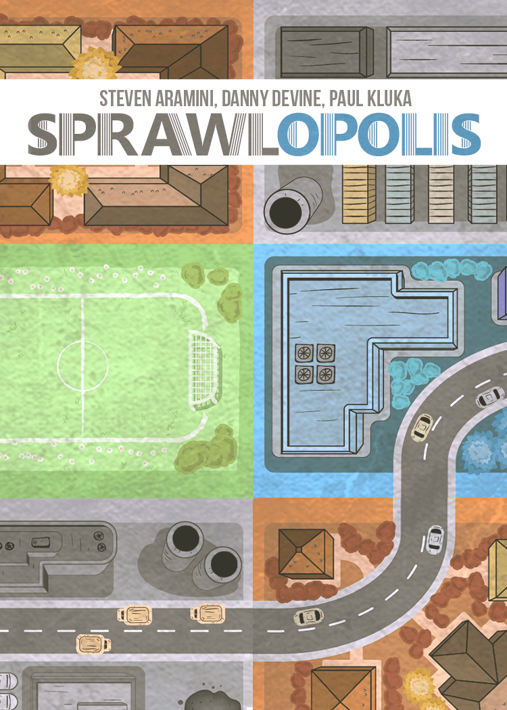

There are cooperative games that give you a puzzle. Then there are cooperative games that make you feel like your tiny tribe is one bad decision away from chewing bark and burying Steve behind the cave. [Paleo](https://boardgamegeek.com/boardgame/38865) is firmly in the second camp, and that is exactly why it deserves more love. This article is about what [Paleo](https://boardgamegeek.com/boardgame/38865) actually does at the table, why its survival tension works so well, why it gets overlooked, and who it suits best. If your group likes co-ops with actual tension instead of polite optimisation, this one has teeth.

## The Pitch

[Paleo](https://boardgamegeek.com/boardgame/38865) is the sort of game people should be talking about every time “best co-op for two or three players” comes up, and yet it keeps getting drowned out by shinier names. That’s a shame, because it does something a lot of co-ops struggle with. It creates shared survival drama without one loud player quarterbacking the whole table. You’ve got your own deck, your own problems, your own little disasters brewing, but the tribe lives or dies together. That balance is brilliant.

To see why that works, it helps to look at how the game is structured from turn to turn.

## What Is It?

At heart, [Paleo](https://boardgamegeek.com/boardgame/38865) is a cooperative survival game about scraping through the Stone Age. Players manage groups of humans, gather food, wood and stone, craft tools, hunt animals, pick up new people, and chase scenario objectives while trying not to get everyone killed by wounds, starvation, or a miserable run of bad luck.

The main hook is the day-night cycle.

During the day, everyone plays simultaneously. You peek at the backs of the top three cards in your personal deck, choose one to resolve, and put the other two back in whatever order you like. That sounds simple. It is not simple. Those card backs give you partial information, just enough to tempt you into trouble. Maybe that forest card gets you wood. Maybe it gives you wood and a wolf problem. Maybe it wants a torch you do not have and now Karen has been mauled by history.

The cards feed a lovely little symbol economy. Wood and stone become tools. Tools become safer hunts and better options. A torch, a stone axe, a spear. Very basic stuff. Very thematic stuff. You are not building an elegant medieval engine here. You are trying to survive with sticks.

Then night arrives, and the game twists the knife. You feed one food per person. Miss that, and skulls start piling up. Scenario demands kick in too. Fail those, more pain. Then you reshuffle for the next day, except the dead and lost cards are gone for good. So the deck changes over time. Your tribe gets tougher in some ways, more fragile in others. It’s a proper survival spiral, and I mean that as praise.

The research points to 1-4 players and a 45-90 minute experience, which feels right for the sort of session this game wants. The verified BGG entry attached here lists [Paleo](https://boardgamegeek.com/boardgame/38865) as a 2008 release with a 6.91 rating from 30 ratings, a 1.00 weight, a #20928 overall rank, 2-4 players, and a 30 minute play time. Those numbers do not remotely communicate what the game actually feels like at the table, which is tense, fiddly in places, and far more interesting than that rank suggests.

Once that structure clicks, the rest of the game’s appeal makes a lot more sense.

## Why It’s Great

The best thing about [Paleo](https://boardgamegeek.com/boardgame/38865) is that it turns uncertainty into stories.

Not “narrative” in the bloated campaign sense. I mean actual table stories. “We spent all day chasing food, crafted a spear at the last second, then gambled on one more dangerous card because we needed a cave painting piece and nearly wiped the tribe.” That sort of thing. The game keeps producing these tiny survival arcs because every choice has texture.

The modular deck system is doing loads of work here. You mix base sets with People, Dreams, Ideas, and scenario modules, and suddenly the game has far more range than its modest footprint suggests. One session might feel like a desperate scramble for food. Another leans into tools, events, or specific objectives. I’ve seen plenty of co-ops claim replayability and then just reshuffle the same problems. [Paleo](https://boardgamegeek.com/boardgame/38865) actually changes its flavour.

I also love how personal decks solve one of co-op gaming’s oldest problems. In [Forbidden Island](https://boardgamegeek.com/boardgame/65244), for all its gateway charm, it’s easy for one player to start directing traffic. In [Paleo](https://boardgamegeek.com/boardgame/38865), you have your own top-three dilemma to wrestle with. You can coordinate, of course. You should coordinate. But you’re still the one deciding whether to risk that card, sleep early, or hold back resources for the tribe. That ownership matters.

And compared with [The Crew: The Quest for Planet Nine](https://boardgamegeek.com/boardgame/284083), which is deservedly popular, [Paleo](https://boardgamegeek.com/boardgame/38865) has more personality. [The Crew: The Quest for Planet Nine](https://boardgamegeek.com/boardgame/284083) is razor-sharp, but its mission structure can feel rigid. [Paleo](https://boardgamegeek.com/boardgame/38865) is messier. Better messy. Your group’s survival feels earned, not merely solved.

Even the cave painting win condition is great. Collect five pieces and you win instantly. It gives the whole struggle a sense of purpose beyond “don’t lose yet”, and it creates those lovely co-op turns where one good combo can suddenly drag the tribe from misery into hope.

That same mix of tension and rough edges also helps explain why the game is easier to admire than to sell to everyone.

## Why Nobody Talks About It

Because the hobby is deeply susceptible to shiny nonsense.

A prehistoric survival game from a smaller publisher, with muted box art and no massive marketing push, was always going to struggle. Put zombies on the cover and half the internet starts posting unboxings. Put a sober tribal design on it and people scroll past.

There’s also a practical issue. [Paleo](https://boardgamegeek.com/boardgame/38865) is a bit component-dependent. You need to care about symbols, card types, module setup, and the rhythm of reshuffling and loss. Some players bounce off that immediately. Fair enough. If your ideal co-op is breezy and forgiving, this can feel prickly.

Then there’s the luck debate. Yes, bad draws can hurt. Yes, wounds can feel cruel. Yes, the night phase can snowball into disaster. The BGG comments section for games like this is always the same fight. One side says “too random”. The other says “adapt better”. The truth is simpler. [Paleo](https://boardgamegeek.com/boardgame/38865) is a survival game. Survival should occasionally feel unfair. That’s the point.

If those trade-offs sound appealing rather than annoying, the audience for this game becomes pretty clear.

## Who Should Buy It

Buy [Paleo](https://boardgamegeek.com/boardgame/38865) if you play mostly at two or three and want a co-op with proper tension, simultaneous turns, and enough modular variety to keep it alive well past the honeymoon phase.

It’s especially good for:

- Couples who are bored of fully open-information co-ops
- Players who enjoy symbol combos and gradual tool-building
- Groups who like emergent stories more than pristine balance
- People who want a survival theme that actually affects the [mechanics](/posts/mechanic-deep-dive-tableau-building/)

If you enjoy the compact cleverness of [Sprawlopolis](https://boardgamegeek.com/boardgame/251658/sprawlopolis) but want something with more narrative consequence, [Paleo](https://boardgamegeek.com/boardgame/38865) is a great step up. If you started with [Forbidden Island](https://boardgamegeek.com/boardgame/65244) and now want a co-op that punches back, this is waiting for you.

Who should skip it? Players who hate swingy outcomes, hate fiddly setup, or want every loss to feel mathematically tidy. This game can be rude. Sometimes gloriously rude.

For practical buying advice, this is the sort of title worth checking at specialist board game retailers first, then the usual second-hand spots if stock is patchy. Price and availability move around, so I’d shop around rather than impulse-buy the first listing you see. If you find it at a sensible mid-range co-op price, jump.

## Verdict

[Paleo](https://boardgamegeek.com/boardgame/38865) deserves better than obscurity. It’s tense, clever, and thematic in a way many survival games only pretend to be, with modular variety that keeps the experience fresh. More importantly, it delivers exactly what this article has been arguing for: a co-op built around shared survival drama, meaningful uncertainty, and strong fit for groups who want more bite than a polite optimisation puzzle.

Get it to the table with two or three people, learn its rhythm, and it starts generating the kind of desperate, triumphant stories that keep you talking after the box is closed. Not the prettiest. Not the loudest. Just really, really good.