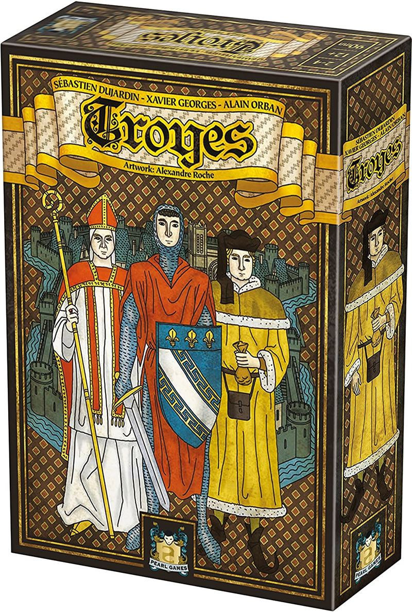

### The Pitch: Why Troyes Deserves Your Attention

Look, if you've been diving into the shimmering waters of board gaming for some time now, you know how easy it is for gems to slip through the cracks. [Troyes](https://boardgamegeek.com/boardgame/73439/troyes) is one such overlooked masterpiece. This medieval-themed dice placement game is not just another Euro to put on the shelf next to your copy of Agricola. It's an intricate dance of strategy, luck mitigation, and deep tactical decisions that rewards the brainiacs who dare to engage with it. It's a hidden gem that's remained under the radar, but I'm here to tell you why it deserves a spotlight.

### What Is It?

Troyes is a 2-4 player game that lasts about 90 minutes, though those minutes are packed with more strategic depth than many games twice that length. Designed by Daryl Andrews and Alan R. Moon, this is no ordinary dice chucker. It's a game where players draft dice from shared districts, spending resources to manipulate and maximize their effects. You'll place cubes on event cards, build cathedrals, and engage in dice-fueled combat against event cards that threaten your progress. And the dice drafting? Let's just say buying dice from your opponents at escalating costs (2/4/6 coins) is a brutal yet satisfying economic battle.

### Why It's Great

Here's the thing: Troyes offers an innovative spin on dice mechanics. The dice aren't just a tool; they're a currency you manage with precision and cunning. There's something deeply satisfying about sliding citizens around on buildings, knowing each move could propel you to victory-or disaster. The game minimizes luck through clever re-rolls and influence spending, rewarding those who think several moves ahead.

The interplay between cooperation and competition is where Troyes truly shines. The events, those collective black dice confrontations, force players to work together just enough to keep things tense. But don't get too comfortable-remember, it's still a knife fight to the very end, with secret character cards ensuring each game is uniquely yours.

### Why Nobody Talks About It

So why isn't Troyes on every Euro gamer's lips? The medieval theme, for one, is niche and can feel abstract compared to the thematic depth of something like Lords of Waterdeep. The initial marketing was lackluster, and frankly, the box art could use a facelift. These factors have kept Troyes in the shadows, overshadowed by flashier titles with vibrant components and larger publishers.

### Who Should Buy It

This game is perfect for analytical Euro fans who revel in dice mitigation, think Power Grid enthusiasts or Keyflower admirers. If you love engine-building with a side of strategy and secret roles, this is for you. Also, if you're a competitive duo looking for a meaty yet manageable 90-minute experience, Troyes is calling your name.

If your gaming group consists of the AP-prone or those who shy away from thinky, complex Euros, Troyes might not be the best fit. It demands attention and rewards players who dive deep into its mechanics.

### Verdict

Troyes isn't just a game-it's a challenge. It's an experience that asks you to engage, to plan, and to adapt in the face of ever-changing circumstances. Sure, it might not have the broad appeal of its peers, but for those who take the plunge, it offers a depth and richness that's hard to find elsewhere.

If you're ready to tackle a strategic masterpiece that demands as much as it gives, it's time to add [Troyes](https://boardgamegeek.com/boardgame/73439/troyes) to your collection. Go ahead, dive in. You won't regret it.

### Frequently Asked Questions About Troyes

Alright, so you're intrigued by [Troyes](https://boardgamegeek.com/boardgame/73439/troyes), but maybe you've got a few burning questions before you commit to this medieval adventure. No worries, I've got you covered. Let's dive into some of the most frequently asked questions about the game, so you can step into your first game night fully prepared.

#### What is the learning curve like in Troyes?

Here's the thing: Troyes is not a game you'll master in one sitting. The complexity, rated at 3.37/5 on BGG, suggests a moderate to heavy Euro game with a hefty cognitive load. Expect to spend your first game getting a handle on the mechanics-dice drafting, citizen placement, and event management can be a lot to juggle initially. But don't let this intimidate you. The depth is what makes it rewarding over multiple plays. Each session peels back another layer, revealing strategic nuances you couldn't see before.

**Pro Tip:** Approach your first play as a learning experience. Focus on understanding the flow of the game and how the different mechanics interlock. By your second or third game, you'll start to see the forest for the trees.

#### How does Troyes scale across different player counts?

Troyes supports 2-4 players, and the experience shifts subtly with each count. At two players, the game feels intimate and strategic, allowing for a closer focus on direct competition and tactical drafting. At three players, you get a balanced mix of interaction and tension without significant downtime. However, at four players, the game can slow down due to increased turns, and downtime may become noticeable.

**Recommendation:** If you're new to Troyes, try it with three players first. This count provides the best balance of interaction and speed, allowing you to fully appreciate the game's dynamics without excessive waiting.

#### What's the ideal game night setup for Troyes?

Troyes isn't your casual filler game-it demands focus and engagement from its players. The ideal setup for a session involves experienced gamers who appreciate thinky Euros. Pair Troyes with a medieval or strategic theme night, featuring games like Agricola or Caverna, to set the tone. Think of it as a main course in a multi-course game night.

**Pro Tip:** Set aside around 90 minutes for the game, with some buffer time for setup and breakdown. A cozy environment with medieval-themed snacks and drinks could add to the atmosphere, making the experience immersive and enjoyable.

#### How does Troyes compare to other similar games?

Troyes often draws comparisons to games like Keyflower, Lords of Waterdeep, and Alchemists. While each of these games has its own draw, Troyes excels in its unique dice economy and mitigation strategy.

- **Keyflower** is known for its vibrant auctions and broad appeal, but I'd argue Troyes' deeper dice mitigation and citizen expulsion mechanics provide a more engaging engine-building experience.
- **Lords of Waterdeep** might win over fans with its D&D theme and accessible quests, but Troyes' shared dice districts and combat mechanics offer more strategic depth and interaction.
- **Alchemists** is another favorite for its deduction buzz and app integration, but Troyes delivers pure Euro depth without relying on gimmicks, focusing instead on strategic influence and re-rolls.

#### Is the theme in Troyes engaging?

Here's the reality: the medieval theme in Troyes might not be as gripping as a dragon-slaying epic, but it serves the mechanics beautifully. The historical backdrop frames the strategies and decisions, offering enough thematic immersion to keep you engaged without overshadowing the gameplay. The interplay between building cathedrals and managing events adds a layer of depth that connects the mechanics to the theme.

**Final Thoughts:** If you're into Euros, the theme will likely complement what you love about these games: the strategic depth and economic management, not necessarily the story.

#### What are the common stumbling blocks for new players?

Expect initial confusion around the dice drafting and the multi-use mechanics. New players often stumble when deciding which actions to prioritize, especially under the pressure of looming event penalties and the need to maximize victory points.

**Advice for Newbies:** Take your time with the rulebook and don't hesitate to ask for clarifications during your first play. Focus on understanding how to leverage influence effectively and practice patience as you grow accustomed to the game's rhythm.

By addressing these common questions, I hope to have demystified some of the nuances and potential hurdles of [Troyes](https://boardgamegeek.com/boardgame/73439/troyes). It's a game that demands time and attention but rewards with a rich and satisfying strategic experience. So prepare your medieval mind, gather a few fellow strategists, and embark on this captivating journey.

### Expert Tips and Strategy Insights for Mastering Troyes

Alright, you've decided to give [Troyes](https://boardgamegeek.com/boardgame/73439/troyes) a shot. Good choice. But let's not kid ourselves-this game isn't just a walk in the park. It's more like a strategic marathon where each decision can swing the game in a different direction. To help you navigate this medieval landscape, here are some expert tips and strategy insights to ensure you're not just another citizen looking up at the cathedral but the one orchestrating its construction.

#### Embrace the Dice Economy

First things first: understand that dice are your lifeline in Troyes. They're more than just random number generators. Think of them as a valuable currency. Each color represents different sectors of influence-yellow for agriculture/resources, white for religion/cathedral, and red for military/events. Grasping the value and versatility of these dice is crucial.

**Strategy Tip:** When drafting dice, don't just pick what looks good now. Consider how those dice can be manipulated. Influence points allow you to reroll or even flip dice to their opposite sides, effectively transforming a bad roll into a golden opportunity. Always keep an eye on your influence pool, as it's your safety net for when the dice gods frown upon you.

#### Master Dice Drafting and Opponent Manipulation

Dice drafting in Troyes is unique in that you can buy dice from your opponents. This adds a delicious layer of tension and strategy. You'll find yourself constantly evaluating whether it's worth investing coins to draft an opponent's die, especially when it costs you 2, 4, or even 6 coins depending on your count in that color.

**Strategy Tip:** Don't be afraid to spend coins on opponent dice if it disrupts their plans or provides you with a pivotal advantage. Money is a tool, not a treasure to hoard. Balance is key-invest wisely but ensure you have enough coins for future flexibilities.

#### Leverage Citizen Placement for Maximum Impact

This is where Troyes breaks away from conventional worker-placement games. The citizen placement mechanism is a game within the game. You slide citizens on color-matched buildings using die values. This not only dictates the building's output but also plays into your long-term strategy.

**Strategy Insight:** Aim to expel your opponents' citizens tactically. Expelling citizens slides them rightward, potentially scoring you valuable victory points at the end of each round. This is a subtle yet powerful way to turn the game in your favor while building toward cathedral completion.

#### Navigate Events with Cooperation and Caution

Events in Troyes are a double-edged sword. These black dice events demand player cooperation, but they can also be a chance to outshine your opponents. The key is to balance your contribution to the collective effort without overexposing yourself to point penalties.

**Strategy Tip:** Gauge the table's mood and anticipate how much effort others will put into an event. It's often better to contribute just enough to avoid penalties while conserving resources for your personal strategy. Remember, you gain influence for each defeated black die, so there's a reward for strategic participation.

#### Adapt and Thrive with Activity Cards and Secret Characters

Each game of Troyes is freshly unpredictable thanks to randomized activity cards and secret character roles. These elements ensure no two games are the same, requiring you to adapt your strategies on the fly.

**Strategy Insight:** Pay close attention to activity cards as they guide your engine-building efforts. Synergize your dice and actions to maximize these cards' benefits. Meanwhile, your secret character cards offer hidden scoring paths at the end of the game. Use them as quiet motivators throughout the game, subtly steering your decisions toward secret objectives.

### Final Word: Practice Makes Perfect

If there's one ultimate takeaway, it's this-be prepared to learn. Troyes rewards players who invest time in understanding its nuances. The more you play, the more you'll appreciate the intricate dance of strategy and chance. So gather your group, roll those dice, and remember, every game of Troyes is a new challenge waiting to be conquered. Keep this guide in mind, and you'll find yourself not just playing a game, but mastering an art.