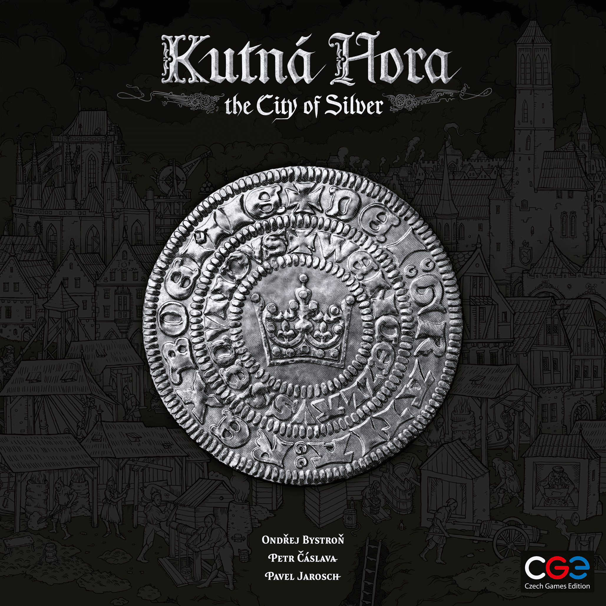
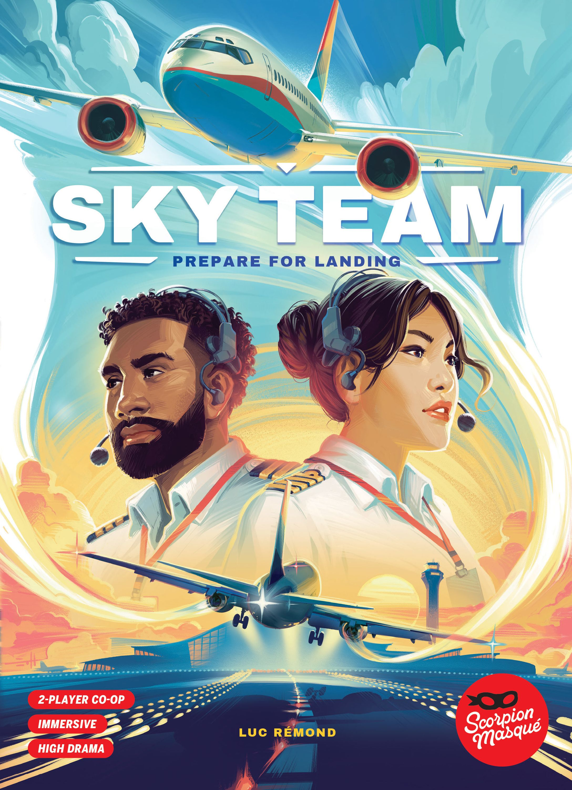

[Sky Team](https://boardgamegeek.com/boardgame/373106) deserves every bit of the praise. [Kutna Hora](https://boardgamegeek.com/boardgame/385610) does not. There, we’re awake now.

[Hype](/posts/hype-vs-reality-march-2026-edition-2026-03-29/) cycles in this hobby usually follow a familiar pattern: preview season hits, everyone latches onto one mechanism or one publisher name, and a month after release the BGG forum starts sounding like group therapy. This piece looks at five recent games through that lens: which ones genuinely earned the noise, which ones merely met it, and which ones were lifted more by pedigree and presentation than by what actually happens at the table.

## [Kutna Hora](https://boardgamegeek.com/boardgame/385610)

Czech Games Edition, medieval economy, Vlaada Chvátil’s name floating around the conversation, and a genuinely attractive production. Of course people got excited. European gamers especially were talking this one up before release, and the pitch is catnip if you like interactive economic systems instead of multiplayer solitaire spreadsheets.

The [reality](/posts/hype-vs-reality-march-2026-edition-2026-03-29/) is more muted.

At its best, [Kutna Hora](https://boardgamegeek.com/boardgame/385610) is a smart, tense blend of auction and worker placement with a market that feels alive. Prices shift, incentives move, and you can feel the town forming around player decisions. That part is brilliant. You’re not just converting cubes in a vacuum. You’re trying to read a shared economy that can punish sloppy timing. That gives the game some real bite.

But then you actually have to play the whole thing.

The fiddliness matters here. The track management is busy in a way that doesn’t always feel rewarding. This is a 2023 release with a 7.76 rating from 5,327 ratings, a 3.33 weight, and a rank of #478 on BGG. Those are solid numbers, not disaster numbers. But they also tell the story pretty clearly. This is not a breakout modern classic. It’s a respected, slightly awkward design that economic gamers admire more than they love.

At 2-4 players and 60-120 minutes, it should be a regular table candidate for medium-heavy groups. Instead, it often becomes “that interesting one we should revisit sometime”. You know the shelf slot. Too clever to sell immediately, too cumbersome to request often. The 4-player balance chatter and kingmaking complaints haven’t helped either. That discussion pops up for a reason.

Then there’s the secondhand market. Used copies sitting around $45-50 against a $65 MSRP is a pretty blunt signal. People aren’t treating this like buried treasure.

Verdict: **OVERHYPED**

## [Windmill Valley](https://boardgamegeek.com/boardgame/403441)

If [Kutna Hora](https://boardgamegeek.com/boardgame/385610) is the clearest example here of hype outrunning reality, [Windmill Valley](https://boardgamegeek.com/boardgame/403441) sits in a more interesting middle ground.

This one is trickier, because the hype was both real and oddly specific. Big crowdfunding success, more than €500k raised, strong preview coverage, and a theme that actually looked different in a sea of fantasy mush. Dutch windmills and polders. Nice. Also, engine builders will back almost anything if you tell them they can make numbers go up more efficiently.

And [Windmill Valley](https://boardgamegeek.com/boardgame/403441) mostly does what its fans wanted.

The core appeal is easy to see. The engine optimisation is satisfying, the wind-flow mechanisms give the game shape beyond generic efficiency play, and the polyomino angle gives you just enough spatial friction to stop the whole thing becoming a sterile puzzle. There’s a reason niche euro fans came away pleased. At 7.71 from 3,471 ratings, 3.07 weight, and rank #758, it’s landing in that respectable-but-not-dominant space where enthusiasts quietly keep championing it while everyone else moves on to the next hotness.

That broader cooling-off also makes sense. The player interaction can bog things down with analysis paralysis, and the setup and teardown sound exactly as annoying as people say. Some games earn a fussy table presence because the play experience is transcendent. This one is very good, but not “I forgive the faff” good for everyone. Variable powers being a bit wonky doesn’t help.

The most interesting tell is the resale value. Around $90-110 secondhand against an $80 retail price is classic limited-print-run heat. Splotter-adjacent efficiency obsessives and collectors are keeping demand healthy. That does not automatically mean broad acclaim. It means the right people really want it.

For me, this is a game where the hype was justified inside its lane. If you wanted a universally beloved euro staple, no. If you wanted a crunchy, thematic optimisation toy for people who enjoy staring at their board like it insulted their family, yes.

Verdict: **LIVED UP**

## [Scholars of the South Tigris](https://boardgamegeek.com/boardgame/367041)

From there, we move to another game that largely met expectations, though for a very different audience and with a very different kind of baggage.

Garphill fans were always going to show up for this. Strong anticipation, big campaign numbers, and the usual wave of “Shem Phillips has done it again” energy. The problem is that these games now arrive carrying the burden of the whole lineage. They’re not judged as games. They’re judged as entries in the ongoing Garphill cinematic universe.

[Scholars of the South Tigris](https://boardgamegeek.com/boardgame/367041) is very good. It is also exactly the kind of game that makes non-fans glaze over while series devotees start explaining icon chains with the fervour of conspiracy theorists.

The headline numbers are strong. An 8.02 rating from 3,609 ratings, a hefty 4.13 weight, and rank #503. That weight is the key. This is not a breezy follow-up. It’s the kind of game where your first turn takes ages and your second turn is mostly spent repairing your understanding of the first. If that sounds appealing, you’re in business.

What works is the bag-building and drafting evolution. It gives the game a proper sense of progression rather than just stacking mechanisms side by side and hoping for chemistry. The art is lovely, and the solo mode has earned the praise. Garphill solo support remains one of the publisher’s best habits.

Where I cool on it is the sense of novelty. A lot of players, especially outside the established fanbase, bounced off the feeling that this was refinement rather than revelation. Some turns can feel repetitive once your engine is humming, and it lacks a certain spatial punch compared with some of its relatives. If you were hoping for the next big leap, this wasn’t it.

Still, the used market holding around $60-70 against a $65 MSRP says people are keeping it or moving it without panic. No collapse. No frenzy. Just a healthy, steady audience.

Verdict: **LIVED UP**

## [Sky Team](https://boardgamegeek.com/boardgame/373106)

After two games that mostly landed where their likely audiences expected, [Sky Team](https://boardgamegeek.com/boardgame/373106) is where the article shifts from “fair enough” to “yes, the hype undersold it.”

Some games get overpraised because they’re fresh. [Sky Team](https://boardgamegeek.com/boardgame/373106) got overpraised because people played it once, had a great story, and then discovered the game was still excellent on play ten.

That’s rare.

A 2023 release sitting at 8.12 from 30,736 ratings, weight 2.04, and rank #33 is absurdly good. For a strictly 2-player co-op that plays in 20 minutes, those numbers are screaming. This is not a cult darling. This is a proper hit.

And it earns it. The hidden dice placement and communication restrictions create exactly the right sort of stress. You feel like a crew trying to land a plane, not two people solving abstract maths with an airport skin pasted on top. That thematic integration is where so many co-ops fall apart. This one nails it. Every decision has urgency. Every mistake creates a tiny domestic incident.

The best part is that it respects your evening. Setup is light. The rules are teachable. Scenarios escalate cleanly. You can play once and call it a night, or chain three plays because you narrowly clipped the runway and now need revenge. More games should understand that rhythm.

The criticisms are minor. Advanced scenarios can swing a bit on luck, and people wanting endless expansion content may find the box less sprawling than they’d like. Fine. None of that touches the central achievement.

The secondhand price creeping above retail, around $35-45 against a $30 MSRP, fits the awards buzz and availability bumps. But even if it were sitting in bargain bins, I’d say the same thing.

Verdict: **EXCEEDED EXPECTATIONS**

## [Heat: Pedal to the Metal](https://boardgamegeek.com/boardgame/366013)

If [Sky Team](https://boardgamegeek.com/boardgame/373106) is the standout two-player success story, [Heat: Pedal to the Metal](https://boardgamegeek.com/boardgame/366013) is the broader crowd-pleasing version of the same phenomenon.

The hobby has a graveyard full of racing games that people admire for one play and never request again. [Heat: Pedal to the Metal](https://boardgamegeek.com/boardgame/366013) escaped that trap. More than that, it became the one you can actually get to the table with normal humans.

The hype was massive. Big crowdfunding numbers, rave coverage, racing-game renaissance chatter, the whole thing. Usually that much noise leads to a correction. Instead, [Heat: Pedal to the Metal](https://boardgamegeek.com/boardgame/366013) planted itself at 8.00 from 39,998 ratings, weight 2.20, and rank #47. Those are monster numbers for a game this accessible.

Why did it work? Because the push-your-luck hand management is clean, tactile, and immediately legible. You’re not just moving a car. You’re choosing how stupid to be into the next corner. Perfect. The heat system creates drama without drowning the game in chrome, and the modular tracks plus upgrade options give it replay value that isn’t theoretical. People actually use it.

This is also one of those rare designs that scales across groups. Hobby gamers can enjoy the tactical margins. Families and mixed groups can just enjoy going too fast and regretting it. At 1-6 players and 30-60 minutes, it covers a lot of ground without feeling compromised.

The complaints are tiny. The cards could feel nicer. Advanced setup takes a bit longer than the breezy box might suggest. That’s about it. No major backlash. No “well actually it’s shallow” campaign from the usual corners. Even the secondhand market staying around retail, $50-60 against a $55 MSRP, suggests a game people buy and keep.

This one didn’t just survive the hype. It became the benchmark.

Verdict: **EXCEEDED EXPECTATIONS**

## The Bottom Line

These five games did not all follow the same post-release arc, and that is really the point. Some hype turns out to be mostly packaging and pedigree. Some turns out to be accurate, but only for a specific slice of the hobby. And once in a while, a game actually clears the bar and then keeps going.

- [Kutna Hora](https://boardgamegeek.com/boardgame/385610): **OVERHYPED**. Clever economy, lovely production, too fiddly to justify the early excitement.
- [Windmill Valley](https://boardgamegeek.com/boardgame/403441): **LIVED UP**. Niche euro fans got what they wanted, everyone else shrugged a bit.
- [Scholars of the South Tigris](https://boardgamegeek.com/boardgame/367041): **LIVED UP**. Strong Garphill design, but more refinement than revelation.
- [Sky Team](https://boardgamegeek.com/boardgame/373106): **EXCEEDED EXPECTATIONS**. One of the best 2-player co-ops of the last few years. Easy.
- [Heat: Pedal to the Metal](https://boardgamegeek.com/boardgame/366013): **EXCEEDED EXPECTATIONS**. The rare hype train that actually arrived on time.