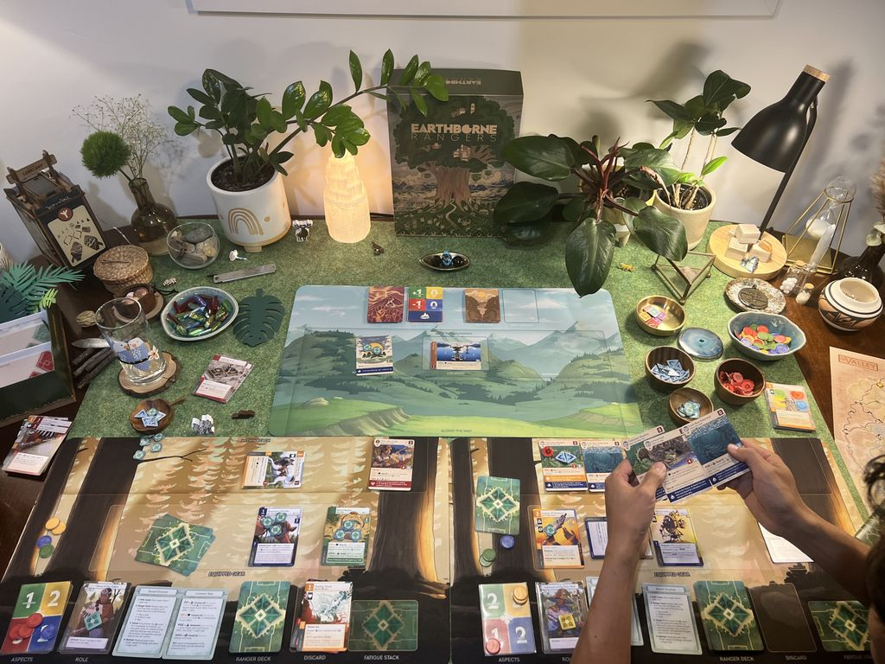
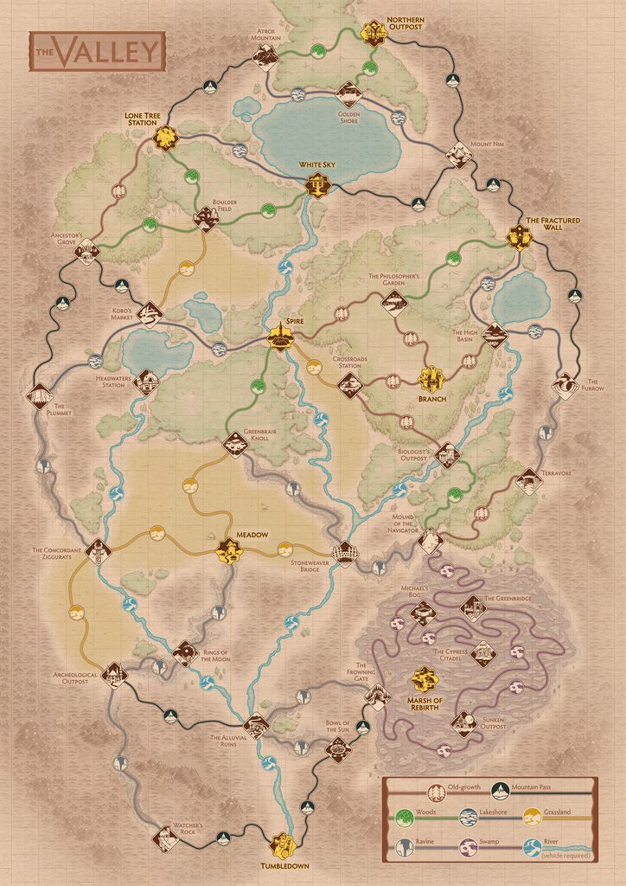
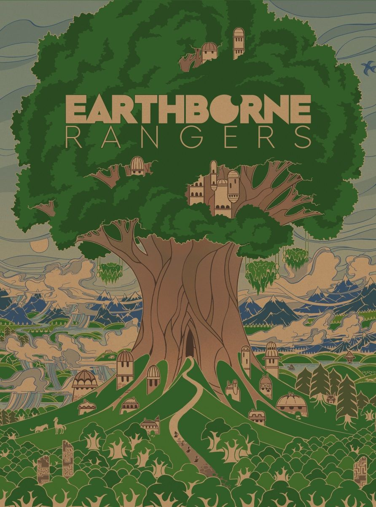
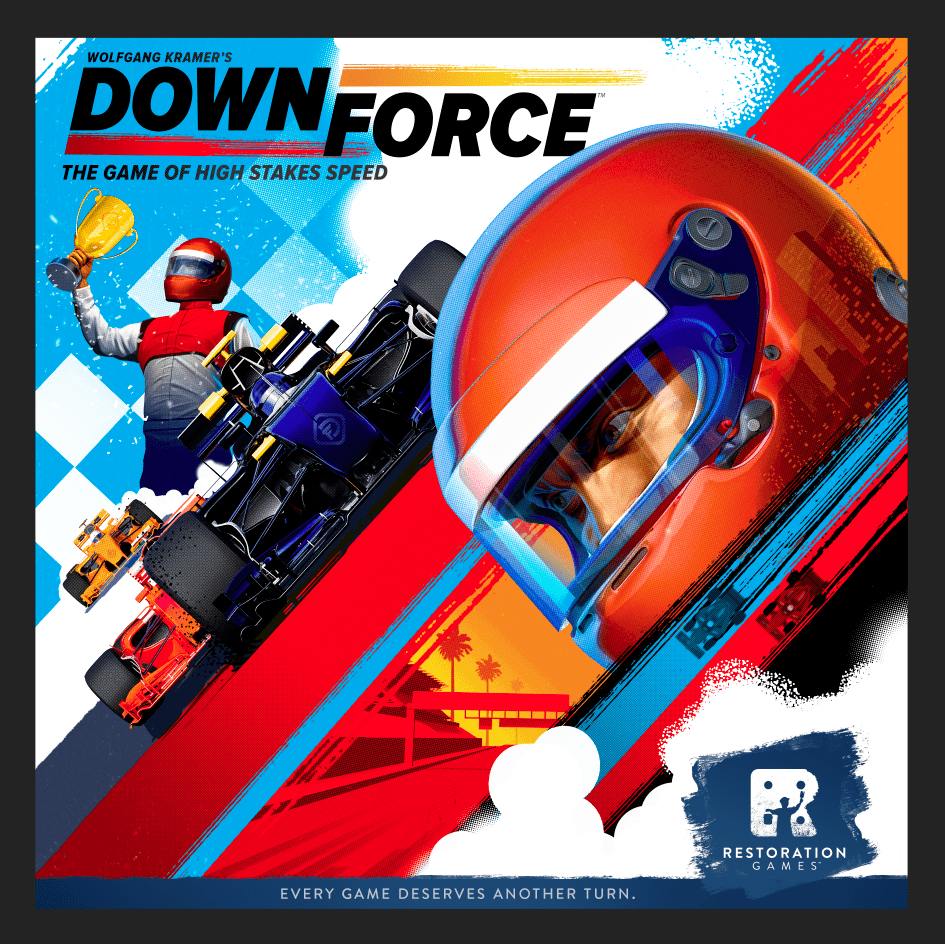
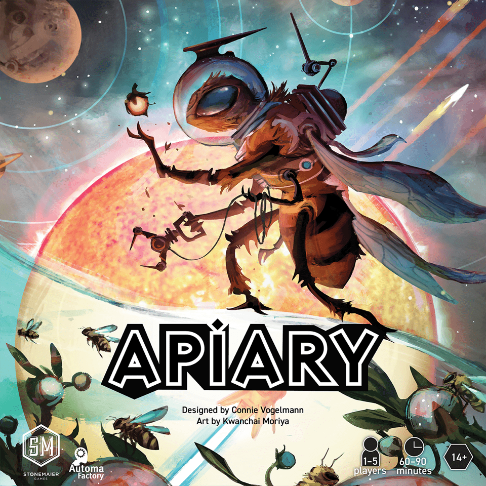

In board games, [hype](/posts/hype-vs-reality-march-2026-edition-2026-03-29/) rarely fails in just one direction. Sometimes it inflates a good game into an impossible promise. Sometimes it undersells something that turns out to be far more durable than the buzz suggested. And sometimes the most interesting cases are the ones that land somewhere in between.

This April 2026 edition looks at five recent hobby releases through that lens: which games actually justified the excitement, which ones exceeded it, and which ones looked better in the pitch than they do on the table. The results are not neat, but they are revealing.

## [Earthborne Rangers](https://boardgamegeek.com/boardgame/342900)

[Earthborne Rangers](https://boardgamegeek.com/boardgame/342900) is the one that proves hype can be both completely deserved and deeply misleading at the same time.

A game sitting on an 8.08 from 3,911 ratings and ranked #496 on BGG should feel like a clean win. Instead, this one has produced the exact sort of forum whiplash hobby people live for. One week it is the future of narrative co-op design. The next, Reddit is full of “am I missing something?” posts from players 12 hours into a campaign that feels like it’s wandering in the woods and refusing to come home.

The [reality](/posts/hype-vs-reality-march-2026-edition-2026-03-29/) is messy. And fascinating.

The hype was enormous. $3.5 million from 20,000 backers is not “promising indie darling” territory. That is full-blown event launch territory. People were sold on open-world exploration, survival, deck customisation, and a living ecosystem that would react to what you did. For solo and co-op players, that pitch is catnip.

Some of that buzz was absolutely earned. The immersion is real. The pixel art is gorgeous. The world has texture. You don’t just move through scenarios solving cardboard problems. You inhabit a place. That matters. There’s a reason some players talk about this game less like a campaign system and more like a place they visited for a few weeks.

But that same ambition is also where the friction starts to show. A 60-240 minute listed play time is doing a lot of work. This can become the kind of campaign where a single session feels rich and unusual, while the broader arc starts to sag. Punishing randomness can flatten clever plans. Earlier app issues did it no favours. And once a campaign starts dragging, all that atmosphere has to carry a lot of weight.

For solo players especially, I get why this landed hard. There’s space here. Space to poke around, experiment, and build a ranger that feels like yours. For groups, I’m less convinced. Four-player co-op already risks turning into committee gaming, and a sprawling campaign with uneven payoff can make that worse.

So was the hype justified? Partly. But the version of the game some people imagined in their heads was cleaner, tighter, and more consistently rewarding than the one that turned up.

**Verdict: OVERHYPED**

## [Heat: Pedal to the Metal](https://boardgamegeek.com/boardgame/366013)

If [Earthborne Rangers](https://boardgamegeek.com/boardgame/342900) is the messy case, [Heat: Pedal to the Metal](https://boardgamegeek.com/boardgame/366013) is the clean one.

[Heat: Pedal to the Metal](https://boardgamegeek.com/boardgame/366013) didn’t just live up to the hype. It blasted past it, left tyre marks on the table, and made a lot of racing game snobs quietly shut up.

An 8.00 rating from 40,077 ratings. Rank #47. Weight 2.20. That combination is absurd. Hobby games do not usually get to be this accessible and this beloved without some faction of the internet popping up to say “yes, but actually it’s shallow”. That argument never really stuck here, because the game keeps proving itself once the lights are on and people are pushing too hard into the final corner.

This is the key. [Heat: Pedal to the Metal](https://boardgamegeek.com/boardgame/366013) feels fast. So many racing games are technically about racing while emotionally being about hand management spreadsheets. This one understands the assignment. Cornering creates immediate tension. Heat management gives every greedy decision a nasty aftertaste. The modular tracks keep it fresh. The whole thing plays in 30-60 minutes and still gives you stories.

That last bit is why it stuck. People remember the moment they overcooked a corner, dumped stress into the engine, and somehow limped across the line in second. They remember who choked. They remember who got cheeky with slipstreaming. That’s the good stuff.

Yes, there are minor gripes. Some players still complain about leader-follower dynamics. Heavy play can chew up the cards a bit. Fine. None of that has slowed the game down on the secondary market, where it’s hitting 110-130% of its €45 retail. That tells you everything. People are not flipping this because they’re disappointed. They’re hunting copies because they’ve played someone else’s and now need one.

Also, the comparisons to [Downforce](https://boardgamegeek.com/boardgame/215311) are fair, but [Heat: Pedal to the Metal](https://boardgamegeek.com/boardgame/366013) has more bite. Not more rules. More bite. Big difference.

**Verdict: EXCEEDED EXPECTATIONS**

## [Apiary](https://boardgamegeek.com/boardgame/400314)

From there, the conversation gets murkier again. Not every game on this list is a breakout or a letdown; some simply land where they should.

The conversation around [Apiary](https://boardgamegeek.com/boardgame/400314) got weird because Stonemaier hype always gets weird. The company name alone creates two instant camps. One group arrives ready to crown the next evergreen classic. The other turns up pre-annoyed and starts sharpening knives before the rulebook is out of the shrink.

The truth is much less dramatic. [Apiary](https://boardgamegeek.com/boardgame/400314) is a very good eurogame.

It’s sitting on a 7.67 from 9,041 ratings, ranked #318, with a 3.01 weight. That feels right. This is not some transformational masterpiece. It is also nowhere near the “overproduced mid-weight beige puzzle with bees painted on it” dismissal you still see floating around.

What works is the worker scaling. Brilliant system. Your workers age, strengthen, and eventually retire, which creates a lovely push-pull between immediate tempo and long-term planning. The hive-morphing tech trees are satisfying in exactly the way euro players want them to be. You unlock something, spot a line, pivot, and suddenly your board starts humming. That’s good design.

Where it stumbles is theme. Not because the art is bad. The production is lovely. But the bee civilisation premise is doing much less heavy lifting than the box suggests. This is an abstract euro in a very handsome costume. If you wanted [Wingspan](https://boardgamegeek.com/boardgame/266192)-style thematic charm with constant table talk about bees in space, that is not what this is. Also, AP-prone players can absolutely gum up the works.

Still, the market has spoken pretty clearly. It’s holding 85-95% of its $60 retail, and that’s because people generally like owning it. Not worshipping it. Owning it. Bringing it out. Playing it again. There’s value in that.

**Verdict: LIVED UP**

## [Kutná Hora: City of Silver](https://boardgamegeek.com/boardgame/385610)

If [Apiary](https://boardgamegeek.com/boardgame/400314) represents the solid middle, [Kutná Hora: City of Silver](https://boardgamegeek.com/boardgame/385610) is the case where the design itself outperformed the noise around it.

This one may be the biggest success story on the list if you care about design more than noise.

High hype, yes. Vlaada Chvátil’s name carries weight. CGE fans showed up in force. Over $1.2 million from 10,000 backers will do that. But [Kutná Hora: City of Silver](https://boardgamegeek.com/boardgame/385610) had a trickier path than that suggests, because economic games are very easy to praise in preview coverage and much harder to get played repeatedly once the setup trays come out and everyone remembers they’re tired.

Yet here it is. BGG 7.76 from 5,336 ratings. Rank #480. Weight 3.33. Solid numbers, but more importantly, the people who click with this game really click with it.

The mining and bidding systems are the star. Prices shift based on player action in ways that feel interactive without becoming chaos. You can feel the market flexing under the table. That’s rare. A lot of economic games tell you they are dynamic and then just hand you a spreadsheet with nicer artwork. This one actually creates pressure.

I also love that the theme matters. Medieval city growth, guild influence, silver extraction, civic development. It all feels connected. Not in a theatrical sense. In a structural sense. Your decisions feel like they belong to the world.

It’s not flawless. The iconography can be fiddly. Setup is longer than it should be. Some auctions can produce proper groans, especially if one player gets out ahead and starts making everyone else’s life miserable. There’s also been some grumbling about patron power balance, and fair enough. That debate is not going away.

Still, this is one of those games where the people who wanted “grand CGE spectacle” maybe came away slightly underfed, while players who wanted a sharp interactive euro got exactly what they were after.

**Verdict: EXCEEDED EXPECTATIONS**

## [Windmill Valley](https://boardgamegeek.com/boardgame/403441)

That leaves one final category: the game that looks the part, plays fine, and still ends up feeling like less than the pitch.

I wanted this one to be better than it is. There, I said it.

The pitch is lovely. Dutch windmills. Tulip fields. Engine-building powered by wind flow. A 2024 release with a 7.71 rating from 3,480 ratings, rank #758, weight 3.07, and a clean 45-90 minute runtime. On paper, that sounds like the sort of medium euro that quietly becomes a favourite for people who are bored of generic trading in the Mediterranean.

And parts of it are delightful. The artwork is beautiful. The windmill components have presence. Sitting down with [Windmill Valley](https://boardgamegeek.com/boardgame/403441), you get that immediate table appeal hit. People lean in. They want it to be good.

The problem is that the decision space doesn’t keep pace with the production. Once you’ve seen the core rhythms, the game can start feeling samey. The community reaction has settled into that awkward middle ground where nobody thinks it’s bad, but very few people sound desperate to evangelise it either. “Charming but lightweight” is roughly where the consensus has landed, and that feels dead on.

The imbalance concerns around wind distribution are also worth taking seriously. In an engine-builder, if some players feel the system is nudging certain engines ahead too easily, that sticks in the memory. You can forgive a lot in a pretty game. Repetitive play is harder to forgive.

The resale market says the rest. Moving at 60-75% of its €50-60 retail is not disastrous, but it’s not a sign of a breakout hit either. It’s the market politely saying, “pleasant enough, probably not a keeper”.

**Verdict: OVERHYPED**

## The Bottom Line

Hype did not miss in one consistent direction here. Two games beat expectations, one more or less met them, and two suffered from players imagining a cleaner or deeper experience than they actually delivered.

- [Earthborne Rangers](https://boardgamegeek.com/boardgame/342900): **OVERHYPED**  
  Brilliant worldbuilding, real immersion, but too uneven to justify the towering expectations.

- [Heat: Pedal to the Metal](https://boardgamegeek.com/boardgame/366013): **EXCEEDED EXPECTATIONS**  
  One of the clearest hobby hits of the last few years. Fast, tense, memorable, and still climbing.

- [Apiary](https://boardgamegeek.com/boardgame/400314): **LIVED UP**  
  A strong euro with excellent systems, even if the bee theme is mostly decorative.

- [Kutná Hora: City of Silver](https://boardgamegeek.com/boardgame/385610): **EXCEEDED EXPECTATIONS**  
  Sharp, interactive, and smarter than its hype cycle suggested.

- [Windmill Valley](https://boardgamegeek.com/boardgame/403441): **OVERHYPED**  
  Gorgeous on the table, but not deep enough to become the enduring engine-builder some hoped for.