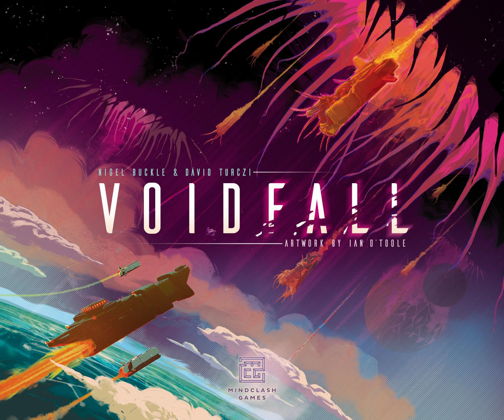
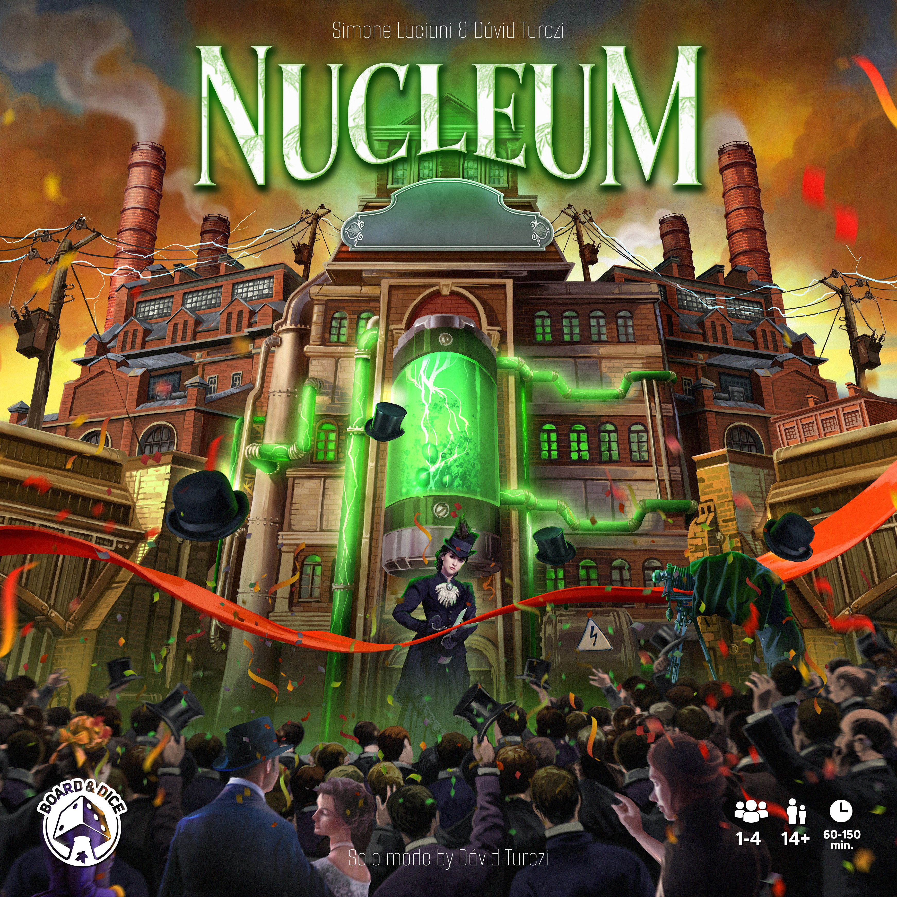
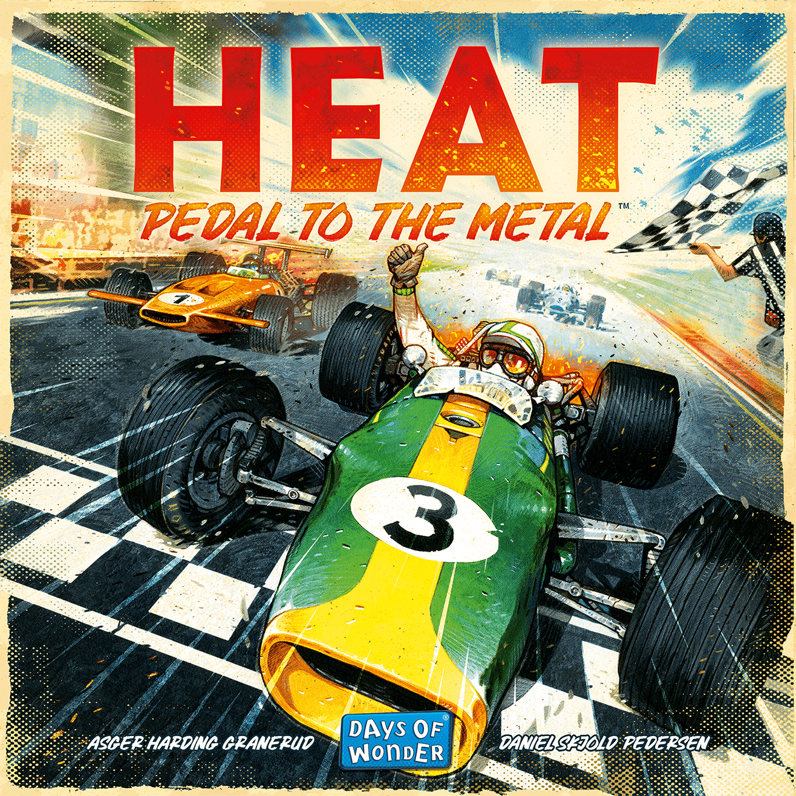

Big Kickstarter numbers, glowing previews, and instant forum canonisation can make every major release feel like a referendum on the future of the hobby. This article is a [reality](/posts/[hype](/posts/hype-vs-reality-march-2026-edition-2026-03-29/)-vs-reality-march-2026-edition-2026-03-29/) check on five heavily discussed games from the current cycle: which ones were over-sold, which ones simply delivered, and which ones actually managed to beat their own hype.

That’s the spicy framing out of the gate, and it matters, because hype around big-box strategy games has a way of flattening nuance. A campaign raises seven figures, preview coverage starts flying, Reddit declares a masterpiece before most people have even sorted the insert, and suddenly we’re all acting like every ambitious design is a generational event. Sometimes it is. Sometimes it’s just very good. Sometimes it’s a very expensive life choice.

Starting with the most divisive example makes the point clearly.

## [Voidfall](https://boardgamegeek.com/boardgame/337627)

[Voidfall](https://boardgamegeek.com/boardgame/337627) is not the future of 4X. It is a brilliant, exhausting brick of a game that a very specific slice of the hobby will treasure forever, and everyone else will quietly sell for £70 equivalent on the second-hand market after two plays and a headache.

The hype was absurd. Over $1.2 million on Kickstarter in 2021. Mindclash. Dávid Turczi. Space opera. Solo AI. A 4X-adjacent heavy euro for the people who think "too many systems" sounds like a recommendation. You can see why the forums lost their minds.

And then the game arrived, and the split was immediate.

On paper, [Voidfall](https://boardgamegeek.com/boardgame/337627) looks unstoppable: 8.51/10 from 6,737 ratings, weight 4.61/5, rank #86, 1-4 players, 90-240 minutes. Those are monster numbers. But they also tell you exactly what this is. This is not broad appeal. This is the kind of game where your first teach feels like onboarding for a new department at work.

The praise is real. The asymmetric AI admirals are superb. Solo and campaign-minded players got fed properly here, and that alone separates it from a lot of "epic" games that mysteriously become less interesting once your group chat goes silent. The design has scale. It has crunch. It gives heavy gamers the delicious feeling that every decision is expensive and maybe irreversible.

But the criticism is real too. The empire boards are fiddly. The rules load is massive. Analysis paralysis is not a side effect, it’s practically a feature. And for a game dripping with galactic collapse and imperial drama, it can feel weirdly spreadsheety at the table. You’re not always conquering the stars. Sometimes you’re doing admin in space.

That’s why the second-hand price tells a brutal truth. Original retail was $150+, and now it’s often $70-90. That’s a 40-60% haircut. The market has spoken in the universal language of "yes, but not for me".

**Verdict: OVERHYPED**

Not bad. Not remotely bad. But genre-defining? No. For hardcore solo and heavy euro players, it absolutely lands. For the wider hobby hype cycle, this was too much game for its own myth.

From there, it makes sense to move to the opposite end of the expectation spectrum: a game that arrived with far less noise and benefited from it.

## [Harmonies](https://boardgamegeek.com/boardgame/414317)

This one is fascinating because the hype was moderate, and that probably helped it. No impossible expectations. No "this changes everything" nonsense. Just a pretty pattern-builder with a nature theme and enough buzz to get people curious.

Then it landed at rank #57 with an 8.03/10 from 27,931 ratings. That is not a small result. For a 30-45 minute, 1-4 player game with a 2.01/5 weight, that’s properly impressive.

The pitch is simple: build landscapes, place coloured tokens, create habitats, score animals. The reason it works is even simpler. It feels good. Every turn gives you a little moment of construction joy, and the table presence does a lot of heavy lifting. People like touching nice bits and making lovely little ecosystems. Shocking, I know.

The common knock against [Harmonies](https://boardgamegeek.com/boardgame/414317) is that it gets repetitive. Fair. The interaction is light, the scoring can feel familiar after several plays, and if you showed up expecting some secret midweight brain-burner because the hobby can’t stop overselling pleasant games, you may leave a bit cold. Heavy gamers bounced off it for exactly that reason.

But judged for what it actually is? It works. More than that, it sticks. Used copies holding around $35-45 against a $40-50 retail price tells you people aren’t panic-dumping it. Families keep it. Couples keep it. Mixed groups actually play it.

I don’t think it’s a miracle design. I do think it’s the sort of game people underestimate because "gentle nature puzzle" sounds less glamorous than another 4-hour euro about industrial misery. Then it hits the table three times in a week because nobody minds learning it and nobody feels battered afterwards.

**Verdict: LIVED UP**

Not profound. Not revolutionary. Just good, clean design that knows exactly how much evening it deserves.

If [Harmonies](https://boardgamegeek.com/boardgame/414317) shows how modest expectations can help, the next game shows how rare it is for enormous expectations not to backfire.

## [Earthborne Rangers](https://boardgamegeek.com/boardgame/342900)

This one had dangerous levels of hype. Over $3.5 million on Kickstarter. Skyrim comparisons. Solo and co-op players circling it like gulls over chips. That sort of build-up usually ends with a backlash thread titled "Am I the only one who thinks..."

Not this time.

[Earthborne Rangers](https://boardgamegeek.com/boardgame/342900) has an 8.08/10 from 3,895 ratings, weight 3.48/5, rank #500, 1-4 players, 60-240 minutes. That rank looks modest next to the praise, but co-op campaign games often have a weird life on BGG. Their real reputation lives in session reports, recommendation threads, and those slightly evangelical comments from people who have clearly been thinking about their ranger deck at work.

The reason it beat the hype is that it found a voice. The narrative-driven expeditions feel different from the usual fantasy punch-up. The wilderness matters. Resource pressure matters. Ranger customisation matters. You’re not just clearing scenarios. You’re inhabiting a place.

That said, the caveats are not tiny. It scales best solo or duo. At higher counts, the pacing can drag. The cards are thinner than I’d like for a game asking for this much repeat handling. There are luck swings. And campaign length is one of those things the community will argue about forever because half of us want "an evolving world to live in" and the other half want to f[inish](/posts/games-like-inis/) a campaign before the next tax year.

Still, two years on, people are still talking about it with affection, not just relief that the box finally arrived. Used prices holding at $60-70 against a $70 retail point say demand stayed healthy.

**Verdict: EXCEEDED EXPECTATIONS**

That’s rare air for a hyped campaign co-op. It didn’t just survive release. It became a staple for the people it was built for.

To round out the heavy strategy side of the conversation, there’s another game that earned respect without quite becoming an obsession.

## [Nucleum](https://boardgamegeek.com/boardgame/396790)

This is the one I respect more than I love.

[Nucleum](https://boardgamegeek.com/boardgame/396790) came in with solid hype: over €850,000 on Kickstarter, strong Board&Dice interest, plenty of chatter around its network-building and tech tree. It now sits at 8.11/10 from 8,117 ratings, weight 4.18/5, rank #143, 1-4 players, 60-150 minutes. Those are excellent numbers for a game this unapologetically heavy.

And there is a lot to admire. The interconnected power networks are clever. The upgrades feel meaningful. The theme actually has some [mechanical](/posts/mechanic-deep-dive-tableau-building/) bite, which is more than you can say for a fair few euros wearing historical-industrial clothing as a fashion choice. When the system clicks, it’s deeply satisfying.

But I can also feel the room temperature drop when you explain it.

Dense iconography. Steep teach. More downtime at 4 than I want from a game that already asks plenty of players. And while I appreciate the nuclear energy theme, this is still a dry game. Not dry in the fun "I’m converting cubes into glory" way. Dry in the "someone at the table will compare it unfavourably to [Terraforming Mars](https://boardgamegeek.com/boardgame/167791) before dessert" way.

Its second-hand slide says a lot: $80-100 used versus $140 retail. That’s not disaster territory, but it does suggest a game admired more than adored.

**Verdict: LIVED UP**

It met the promise. A respected heavy euro with real ideas. It just never became the breakout obsession some people predicted.

And finally, there’s the cleanest success story in the bunch: a game with huge buzz that translated directly into repeat plays and broad appeal.

## [Heat: Pedal to the Metal](https://boardgamegeek.com/boardgame/366013)

Some hype trains crash. This one won pole position and kept going.

[Heat: Pedal to the Metal](https://boardgamegeek.com/boardgame/366013) had huge buzz, a $2+ million Kickstarter, viral coverage, and the kind of early reaction that usually triggers an immediate counter-reaction from the hobby’s "actually, it’s just fine" brigade. Instead it planted itself at rank #47 with an 8.00/10 from 39,922 ratings. Nearly 40,000 ratings. That is not a fad. That is the hobby collectively deciding, "Yes, this one."

The reason is obvious the moment you play. The card management is clean and tense. Corners create exactly the right amount of greed and fear. The game gives you speed without rules sludge, and that’s harder than it looks. Racing games die when they confuse friction for excitement. [Heat: Pedal to the Metal](https://boardgamegeek.com/boardgame/366013) understands that momentum is the whole point.

The campaign upgrades add texture without bloating the thing. New players get it quickly. Experienced players still find edge in hand timing and risk management. It works at 1-6, which is rare enough, and it respects your evening at 30-60 minutes.

Yes, large-group races can get chaotic. Yes, some people find repeated tracks a bit samey. Yes, the card wear from all that shuffling is mildly tragic. None of that changes the central fact. This game is pure table energy. It creates stories immediately. You can feel people leaning in on corners.

Used copies at $35-45 against a $50 retail point are perfectly healthy, and the expansions holding premium value says even more. People didn’t just buy into the launch. They stayed.

**Verdict: EXCEEDED EXPECTATIONS**

This is the rare crossover hit that hobby veterans and normal human beings both want to play again.

 box art")

## The Bottom Line

Across these five games, the pattern is pretty clear: hype is most dangerous when it tries to sell specificity as universality. The games that held up best either knew exactly what they were or delivered such immediate, repeatable fun that the buzz turned out to be justified.

- [Voidfall](https://boardgamegeek.com/boardgame/337627): **OVERHYPED**. Exceptional for a narrow audience, over-sold as a universal heavy masterpiece.
- [Harmonies](https://boardgamegeek.com/boardgame/414317): **LIVED UP**. A lovely, smart, approachable puzzle that knew its lane.
- [Earthborne Rangers](https://boardgamegeek.com/boardgame/342900): **EXCEEDED EXPECTATIONS**. One of the few huge campaign co-ops that earned the devotion.
- [Nucleum](https://boardgamegeek.com/boardgame/396790): **LIVED UP**. Strong heavy euro, more respected than beloved.
- [Heat: Pedal to the Metal](https://boardgamegeek.com/boardgame/366013): **EXCEEDED EXPECTATIONS**. The hype was loud. The game was better.