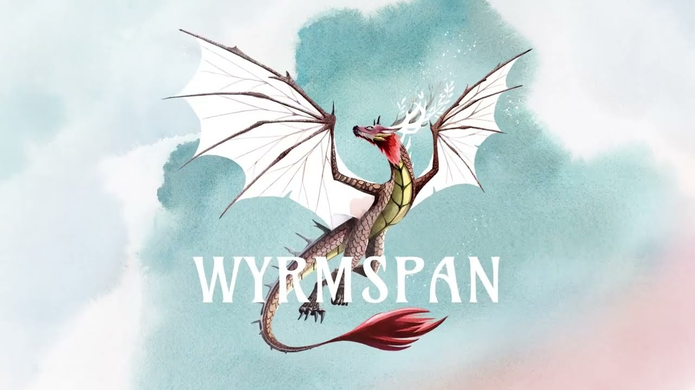
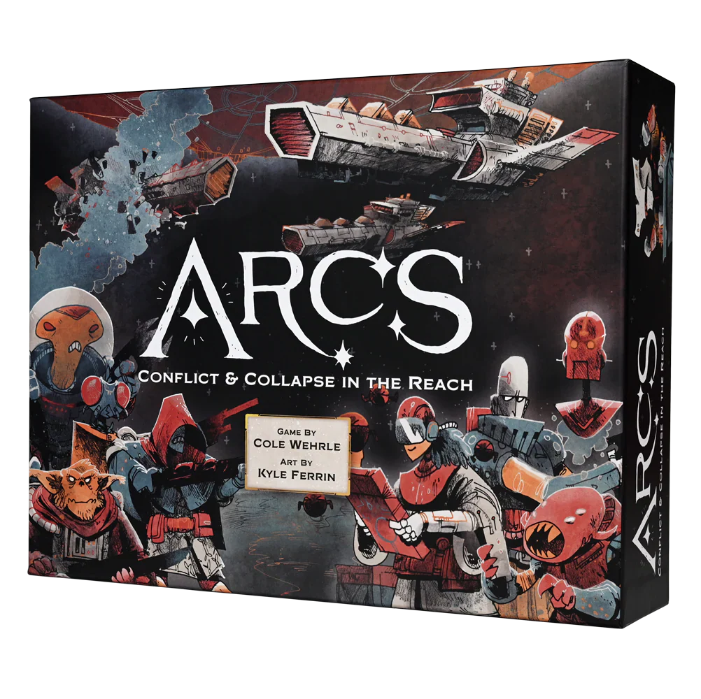

This month's "[hype](/posts/hype-vs-reality-march-2026-edition/) vs. [reality](/posts/hype-vs-reality-march-2026-edition/)" check is really about five very different kinds of board game expectations. Some of these games arrived under a cloud of backlash, some under intense anticipation, and some with quieter buzz that built over time. The question in each case is not just whether the game is good, but whether the conversation around it matched the experience of actually getting it to the table.

[Wyrmspan](https://boardgamegeek.com/boardgame/410201) is the clearest example of that dynamic.

The second people saw "Wingspan, but dragons," the discourse wrote itself. Reddit called it a cash grab. BGG threads did the usual thing where half the comments were from people angry at a game they had not played yet. And then the game landed with a **7.96/10 from 15,080 ratings**, climbed to **#124 overall**, and turned out to be... good. More than good, really. Not revolutionary. Not some dragon-shaped coup. But absolutely better than the laziest version of the joke.

That matters, because hype doesn't only inflate games. Sometimes backlash does the same thing in reverse.

## [Wyrmspan](https://boardgamegeek.com/boardgame/410201)

The hype was weird from the start. Commercial hype? Massive. Critical hype? Much shakier. People expected sales, not necessarily respect. The pitch was almost too easy to mock. Dragons instead of birds. Caves instead of habitats. Got it.

But at the table, [Wyrmspan](https://boardgamegeek.com/boardgame/410201) is not just a retheme with scales glued on. At **2.82 weight**, **1-5 players**, and **90 minutes**, it sits in a familiar comfort zone, but the feel is different. Less breezy tableau tourism, more engine timing and card curation. You spend more time shaping a build than just hoping the deck smiles at you.

I love that it leans into spectacle without becoming mush. Dragon powers feel appropriately splashy. The excavation angle gives the game a stronger arc than a lot of midweight engine builders manage. You can actually feel your board opening up. That's huge. People forgive a lot when their tableau tells a story.

Does it replace [Wingspan](https://boardgamegeek.com/boardgame/266192)? For some groups, yes. For others, not even close. [Wyrmspan](https://boardgamegeek.com/boardgame/410201) is a little more involved, a little less universally charming, and a little more willing to ask you to care about efficiency. If your table loved birds because they were soothing, dragons may not perform the same magic. If your table wanted [Wingspan](https://boardgamegeek.com/boardgame/266192) with sharper teeth, this is exactly that.

**Verdict: LIVED UP**

## [Arcs](https://boardgamegeek.com/boardgame/359871)

If [Wyrmspan](https://boardgamegeek.com/boardgame/410201) had to overcome backlash, [Arcs](https://boardgamegeek.com/boardgame/359871) had to survive the opposite problem: towering expectations.

Now for the game that turned every hobby space into a theology debate.

[Arcs](https://boardgamegeek.com/boardgame/359871) came in as one of 2024's most anticipated releases, and you could feel the expectations crushing the box before anyone punched the tokens. Cole Wehrle. Leder Games. Kyle Ferrin art. A **BGG 8.01/10 from 16,296 ratings**, already sitting at **#104 overall**. That's real heat.

And then people played it and discovered something hilarious. The hype was justified, but not in the way hype usually works.

This is not a crowd-pleasing blockbuster. It's a deeply **divisive** design. Some players called it a "flawless design." Others bounced off the meanness so hard you'd think the game insulted their family. Both reactions make sense.

The trick-taking core is brilliant. Flat-out brilliant. Taking that language of lead, follow, seize, and twisting it into a galactic conflict game gives [Arcs](https://boardgamegeek.com/boardgame/359871) a rhythm that feels unlike anything else in its lane. At **3.44 weight**, **2-4 players**, and **60-120 minutes**, it is surprisingly compact for how much drama it generates. Every hand matters. Every tempo shift matters. Every bad read hurts.

And yes, it is mean. Very mean. Stuff disappears. Plans collapse. Territory feels borrowed. Resources feel rented. If you like your strategy games as carefully tended gardens, [Arcs](https://boardgamegeek.com/boardgame/359871) will stomp through your flowers.

That's the point.

The best read I saw from the community was players saying their problems with the game were also the reasons they liked it. Exactly. The volatility is not a bug you politely excuse in a review. It's the design. Same with the table politics. Same with the moments where everyone has to decide what "fair" even means. BGG has been arguing about kingmaking, restraint, and table culture because [Arcs](https://boardgamegeek.com/boardgame/359871) puts all of that right on the table and refuses to tidy it up.

So, was the hype justified? Yes, if the hype was "this is one of the most interesting strategy games of the year." No, if the hype was "everyone will love this." They will not. Some people are going to hate this thing. I kind of love that.

**Verdict: LIVED UP**

## [Kutna Hora: The City of Silver](https://boardgamegeek.com/boardgame/385610)

Not every game on this list arrived with that kind of noise. Some built their reputation more quietly, which is exactly what happened with [Kutna Hora: The City of Silver](https://boardgamegeek.com/boardgame/385610).

This one got quieter hype, which is often where the best surprises live.

[Kutna Hora: The City of Silver](https://boardgamegeek.com/boardgame/385610) sits at a **7.76/10 from 5,306 ratings**, **3.33 weight**, and **#482 overall**. That ranking undersells how much affection this game has built among euro players who are tired of multiplayer solitaire with nicer box covers.

Because [Kutna Hora: The City of Silver](https://boardgamegeek.com/boardgame/385610) actually cares that other people are at the table.

The dynamic market is the hook, and it's a good one. Prices move because players are collectively building an economy, not because the game flipped a card and declared that wheat is sad now. That gives every decision a little static. Build here, and you change the incentives for everyone else. Chase one line too hard, and the whole table feels it. This is the kind of euro interaction people claim to want all the time, then act shocked by when it actually arrives.

I love how grounded it feels. Not dry. Grounded. You can see the city emerging through the systems. Production, development, pricing, expansion. It has that lovely euro quality where the theme is doing real work instead of just dressing the components.

The catch? It doesn't scream. [Kutna Hora: The City of Silver](https://boardgamegeek.com/boardgame/385610) is not flashy enough to dominate discourse for months. No giant toy factor. No meme faction. No instant "you have to try this" elevator pitch. You need a group willing to appreciate economic pressure and second-order consequences. Also, if your crew hates games where early market shifts echo through the rest of the session, this can feel punishing.

Still, I think the reality beat the hype. This is one of those games people keep discovering six months late, then wondering why everyone wasn't louder.

**Verdict: EXCEEDED EXPECTATIONS**

## [Scholars of the South Tigris](https://boardgamegeek.com/boardgame/367041)

From there, the list gets even more niche. [Scholars of the South Tigris](https://boardgamegeek.com/boardgame/367041) was never chasing broad appeal in the first place.

This is the most "your favorite [designer](/posts/designer-spotlight-vlaada-chvatil/)'s favorite design" game on the list.

A **BGG 8.02/10 from 3,592 ratings** should jump off the page. So should the **4.13 weight**. Same for the weirdly modest **#506 overall**. That combination tells a very specific story. The people playing [Scholars of the South Tigris](https://boardgamegeek.com/boardgame/367041) are into it. The audience is just narrower because this thing is dense.

And dense is putting it kindly.

This is the kind of game where your first turn takes ten minutes, your second turn takes eight, and by round three you either see the matrix or start staring at the ceiling. But for players who love puzzle-box euros, [Scholars of the South Tigris](https://boardgamegeek.com/boardgame/367041) is a feast. Dice manipulation, color relationships, manuscript acquisition, translation, influence tracks. So many moving pieces, and more importantly, they actually interlock.

That's why the game has such a strong rating despite a smaller footprint. It is doing big-brain euro stuff for people who want exactly that. No apology. No simplification layer. No fake accessibility.

But does the hype match the reality? Sort of. Within heavy euro circles, yes. Among the broader hobby, not really, because this was never going to be a breakout hit. The South Tigris line has admirers, but it does not generate the kind of all-caps frenzy that follows Stonemaier releases or Wehrle launches. It generates nodding respect. Sometimes terror.

My take: [Scholars of the South Tigris](https://boardgamegeek.com/boardgame/367041) is better than its visibility suggests. The main thing holding it back is not quality. It's that many players take one look at that rules overhead and decide they could instead play something that hurts less.

Fair enough.

**Verdict: SLEEPER HIT**

## [Oathsworn: Into the Deepwood](https://boardgamegeek.com/boardgame/251661/oathsworn-deepwood)

The last game on this list is the one that asks the most of your group - and the one that rewards that ask more than any other entry here.

This is where the hype was built in the trenches, not in the algorithm.

[Oathsworn: Into the Deepwood](https://boardgamegeek.com/boardgame/251661/oathsworn-deepwood) sits at a **8.77/10 from over 6,700 ratings**, with a **3.68 weight**, **1-4 players**, and sessions running **60-120 minutes** depending on how deep the encounter drags you. Jamie Jolly designed it. Shadowborne Games published it. It started as a Kickstarter, which should tell you everything about its DNA - sprawling, ambitious, stuffed to the lid with gorgeous miniatures that serve an actual mechanical purpose.

The pitch is "campaign boss-battler," and for once, that label does the work it promises.

Each session drops your group into a massive encounter against a named monster - and "massive" is not a marketing word here, it is a spatial fact. The bosses loom over the table. Combat runs on push-your-luck dice mechanics that keep you making live decisions under pressure, not just executing pre-planned combos. Narrative choices thread through the campaign, and the game actually remembers what you picked. Characters develop. Relationships shift. The story has memory.

That's the thing most big-box campaign games promise and fail to deliver. [Oathsworn: Into the Deepwood](https://boardgamegeek.com/boardgame/251661/oathsworn-deepwood) delivers it.

The hype was built on the promise of boss encounters that feel genuinely cinematic, not just cosmetically spectacular. And the community verdict, sitting at 8.40 on BGG, suggests the encounters back that promise up. The criticisms that survive - complexity overhead, table space requirements, the usual campaign scheduling tax - are honest, but they don't argue against the game's fundamental success at what it set out to do.

My read: this is the boss-battler genre doing exactly what it should. The box is massive. The commitment is real. The spectacle is earned.

**Verdict: LIVED UP**

## How to Choose Between These Five

Taken together, these five games do not point to one "best" choice. They point to five different kinds of table experience. So if you're stuck between them, the cleanest answer is not "which one is best?" It's "what kind of friction does your group enjoy?" Because every game here asks for a different flavor of patience, attention, and emotional tolerance.

That's the real buyer's guide.

### Buy [Arcs](https://boardgamegeek.com/boardgame/359871) if your group likes conflict that feels personal

At **60-120 minutes**, **2-4 players**, and **3.44 weight**, [Arcs](https://boardgamegeek.com/boardgame/359871) is the game here with the highest ratio of emotional damage per minute. I mean that as praise.

Pick it if your table enjoys:
- tactical play over long-term engine building
- reading people, not just systems
- accepting that your stuff is never really safe
- post-game discussion that sounds a little like therapy

Do not pick it if your group gets salty when plans collapse. This game collapses plans for sport. Every Root teach starts the same way: everyone ignores the Marquise. Every [Arcs](https://boardgamegeek.com/boardgame/359871) teach risks ending the same way too, with one player realizing the game is much meaner than the art made it look.

Best fit: the group that says they want "interaction" and actually means it.

### Buy [Wyrmspan](https://boardgamegeek.com/boardgame/410201) if you want the safest expensive recommendation

This is the easiest game on the list to recommend without a ten-minute disclaimer. At **1-5 players**, **90 minutes**, and **2.82 weight**, [Wyrmspan](https://boardgamegeek.com/boardgame/410201) has the broadest landing zone.

Pick it if your table enjoys:
- engine building with visible progress
- strong production and table presence
- a rules load that feels substantial but not punishing
- card combos that feel rewarding without requiring a spreadsheet

This is the one I'd hand to someone who wants a modern hobby game that still feels welcoming. Not simple. Welcoming. There is a difference. The dragons help, obviously. Put a dragon on a card and people start forgiving things they'd nitpick in a beige trading game.

Best fit: mixed groups, couples, solo-curious players, and anyone who wants a game that will actually get played more than once.

### Buy [Kutna Hora: The City of Silver](https://boardgamegeek.com/boardgame/385610) if your euro group keeps complaining that euros are too solitary

This is the sneaky killer in the lineup. At **2-4 players**, **60-120 minutes**, and **3.33 weight**, [Kutna Hora: The City of Silver](https://boardgamegeek.com/boardgame/385610) hits a very sweet spot. It's interactive without becoming chaotic, thoughtful without becoming a lifestyle commitment.

Pick it if your table enjoys:
- market systems that respond to player behavior
- economic pressure
- consequences that echo across the full game
- the feeling that other people's turns actually matter to you

Do not pick it if your favorite euro adjective is "relaxing." This is not stressful in the [Arcs](https://boardgamegeek.com/boardgame/359871) sense, but it absolutely asks you to care what everyone else is doing. That alone will scare off a chunk of the point-salad faithful.

Best fit: euro players who say they miss the old days when interaction meant more than racing for a public objective.

### Buy [Scholars of the South Tigris](https://boardgamegeek.com/boardgame/367041) if complexity is the point, not the obstacle

Some games are heavy because the rules are clumsy. [Scholars of the South Tigris](https://boardgamegeek.com/boardgame/367041) is heavy because it is ambitious. At **4.13 weight**, **1-4 players**, and **60-90 minutes**, it is the most demanding game here by a clear margin.

Pick it if your table enjoys:
- layered systems that feed into each other
- puzzle density over table drama
- learning curves that reward repeat plays
- the specific joy of slowly becoming competent at something intimidating

Do not pick it for a tired weeknight. Do not pick it for the friend who asks "so what can I do on my turn?" every round. And definitely do not pick it because the box looks nice next to your Garphill shelf. Shelf completionism has led many good people into bad evenings.

Best fit: players who see a rules overhead as an invitation to dig in.

### Buy [Oathsworn: Into the Deepwood](https://boardgamegeek.com/boardgame/251661/oathsworn-deepwood) if your group can commit to the campaign lifestyle

This is the least "drop it on the table and see what happens" game in the bunch. [Oathsworn: Into the Deepwood](https://boardgamegeek.com/boardgame/251661/oathsworn-deepwood) is a commitment game. Not just money. Time, storage, scheduling, emotional continuity. Campaign games always promise you'll live inside their world for weeks. The question is whether your group can actually do that.

Pick it if your table enjoys:
- boss battles as the main event
- ongoing narrative investment
- spectacle, progression, and character attachment
- planning game nights in advance like adults pretending they still have free time

Do not pick it if your group has a history of abandoning campaigns halfway through. Every hobbyist knows the graveyard shelf. The half-finished legacy box. The campaign that "we're definitely getting back to." Be serious with yourself before buying another one.

Best fit: a stable group that wants one game to dominate its calendar for a while.

### The fastest decision possible

If you want the shortest path to a smart choice, here it is:

- Pick [Wyrmspan](https://boardgamegeek.com/boardgame/410201) for accessibility and repeatable comfort.
- Pick [Arcs](https://boardgamegeek.com/boardgame/359871) for volatility, conflict, and unforgettable table stories.
- Pick [Kutna Hora: The City of Silver](https://boardgamegeek.com/boardgame/385610) for interactive euro design with real economic tension.
- Pick [Scholars of the South Tigris](https://boardgamegeek.com/boardgame/367041) for the heaviest, thinkiest puzzle of the group.
- Pick [Oathsworn: Into the Deepwood](https://boardgamegeek.com/boardgame/251661/oathsworn-deepwood) for campaign spectacle, assuming your group's scheduling app is not already a warzone.

If I had to reduce all five to one sentence each, that's the buyer's guide. Everything else is taste, tolerance, and whether your friends enjoy being gently challenged or aggressively punched in the soul by cardboard.

## The Bottom Line

- [Wyrmspan](https://boardgamegeek.com/boardgame/410201): **LIVED UP**
  Mocked on announcement, respected after release. Not just Wingspan in dragon cosplay.

- [Arcs](https://boardgamegeek.com/boardgame/359871): **LIVED UP**
  The hype was real. So is the backlash. That's what happens when a game this sharp actually cuts.

- [Kutna Hora: The City of Silver](https://boardgamegeek.com/boardgame/385610): **EXCEEDED EXPECTATIONS**
  One of the better recent euros, especially if you want an economy that bites back.

- [Scholars of the South Tigris](https://boardgamegeek.com/boardgame/367041): **SLEEPER HIT**
  Heavy, demanding, and catnip for people who want a euro to fight back.

- [Oathsworn: Into the Deepwood](https://boardgamegeek.com/boardgame/251661/oathsworn-deepwood): **LIVED UP**  
  The boss-battler that actually delivers on the boss-battler promise. High bar. Met.

One pattern jumps out across all five games. The hype was most justified when the game had a very clear idea of what kind of night it wanted to create. [Arcs](https://boardgamegeek.com/boardgame/359871) knows it wants tension, brinkmanship, and sudden reversals. [Wyrmspan](https://boardgamegeek.com/boardgame/410201) knows it wants satisfying engine growth wrapped in approachable spectacle. [Kutna Hora: The City of Silver](https://boardgamegeek.com/boardgame/385610) knows it wants players elbowing each other through a living economy instead of quietly knitting point salads in parallel. [Scholars of the South Tigris](https://boardgamegeek.com/boardgame/367041) knows it wants to melt your brain in a way heavy euro fans will call "rewarding" and everyone else will call "a lot." That clarity matters. Games usually disappoint when the pitch and the table feel do not match. These mostly do.

If you're choosing where to put your money or table time, the real split is not "best game" but "best fit." [Arcs](https://boardgamegeek.com/boardgame/359871) is the one I'd bring out for a group that enjoys conflict, table talk, and the possibility that someone's perfect plan gets wrecked by a single brutal pivot. [Wyrmspan](https://boardgamegeek.com/boardgame/410201) is the safest recommendation for mixed-experience groups who still want enough decision density to chew on. [Kutna Hora: The City of Silver](https://boardgamegeek.com/boardgame/385610) is for euro players who keep saying they miss interaction and should probably prove it. [Scholars of the South Tigris](https://boardgamegeek.com/boardgame/367041) is for the table that sees a **4.13 weight** and treats it as an invitation, not a warning label. [Oathsworn: Into the Deepwood](https://boardgamegeek.com/boardgame/251661/oathsworn-deepwood), meanwhile, is for the group that can actually sustain a campaign long enough to cash in on all that spectacle.

A practical ranking by table risk probably goes like this: [Wyrmspan](https://boardgamegeek.com/boardgame/410201) is the easiest hit, [Kutna Hora: The City of Silver](https://boardgamegeek.com/boardgame/385610) is the easiest pleasant surprise, [Arcs](https://boardgamegeek.com/boardgame/359871) has the highest ceiling and the highest chance of starting an argument in the parking lot, [Scholars of the South Tigris](https://boardgamegeek.com/boardgame/367041) is the most likely to become somebody's entire personality for three months, and [Oathsworn: Into the Deepwood](https://boardgamegeek.com/boardgame/251661/oathsworn-deepwood) carries the biggest logistical risk because campaign ambition only pays off if your group actually follows through.

The useful takeaway is simple. Hype is dangerous when it promises universal appeal. It is useful when it points you toward games with a strong identity. These five all have identity to spare. The trick is knowing whether that identity matches your group before you buy a giant box and spend your next two Thursdays regretting your life choices.