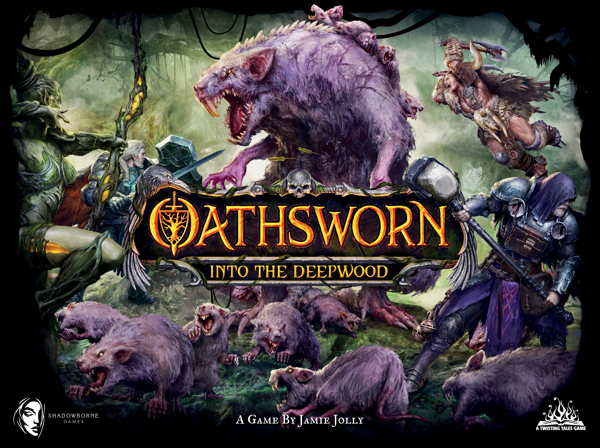
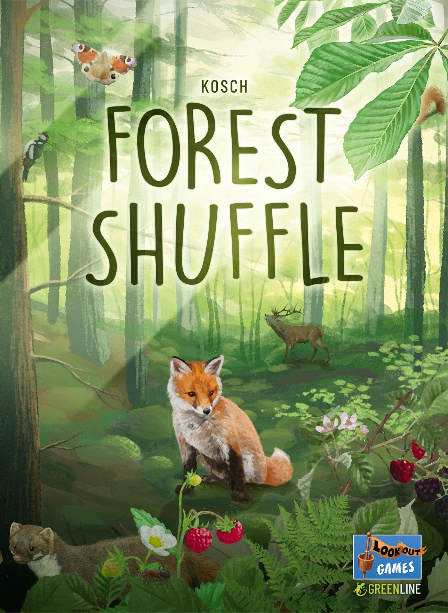
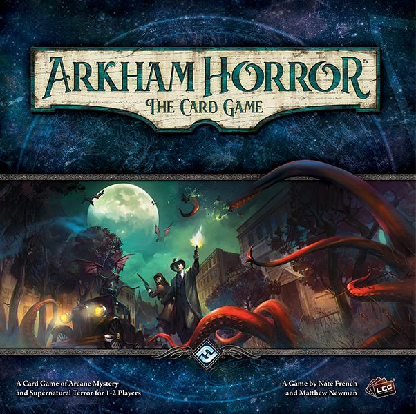

Look, the hottest take here is also the easiest one to dodge if you want everyone to like you: [Earthborne Rangers](https://boardgamegeek.com/boardgame/342900/earthborne-rangers) did not live up to the hype.

That does not mean it is bad. It means the conversation around it got way ahead of the actual table reality. There is a difference, and hobby discourse loves pretending there isn’t. We do this every year. A campaign lands, the art is gorgeous, the pitch sounds like it was engineered in a lab to target people who own all of [Arkham Horror: The Card Game](https://boardgamegeek.com/boardgame/205637/arkham-horror-the-card-game) content, and suddenly we’re all talking like the next evergreen co-op masterpiece has arrived. Then the boxes show up, the rulebook hits the table, and half the audience quietly backs away.

That split is the whole point of hype vs reality. Some games survive the noise. Some get crushed by it. Some pull off the rare trick of being even better once the dust settles.

This piece is about five games that have already gone through that cycle: one that came in overpraised, two that broadly justified the excitement, one that exceeded even strong early buzz, and one that turned from modest expectations into a genuine staple. So let’s do the five that have actually been through the arena.

## Earthborne Rangers is good. The hype said great.

[Earthborne Rangers](https://boardgamegeek.com/boardgame/342900/earthborne-rangers) came in hot. Its 2022 Kickstarter pulled **$1,120,000 from 6,500 backers**, hit **#5 on the BGG Hotness**, and got the exact kind of buzz that turns a release into a referendum. Adventure card game fans were all over it. The pitch was catnip. Open-world exploration. Modular campaign. Survival-ish systems. Big emotional ecosystem energy. Basically, “what if narrative campaign cards, but make it more organic and less scenario-boxed?”

I get it. I was excited too.

Here’s the thing: the reality is much more niche than the hype machine admitted. As of March 2026 it sits at an **8.1 average rating from 9,800 votes**, with a **7.92 Bayesian average**, **rank #185 overall**, and a **4.05 weight**. That weight number tells the story. This is not some breezy adventure box you toss in front of your weekly co-op group. This is the kind of game where the teach starts with optimism and ends with someone asking, “Wait, so what exactly happens if I test this against that terrain keyword while engaged with a creature?”

And that’s before setup. We’re talking **200+ cards**, a **15+ page rulebook**, and enough procedural friction to make some groups bounce right off. The early hype framed it as this lush, exploratory journey. Which it is. But it’s also fiddly in a way that absolutely matters. Especially in campaign games, where the dream is consistency. If setup feels like doing your taxes in a national park, people stop asking to play.

The praise is real. The worldbuilding is immersive. The modular campaign structure is smart. The art and assets are beautiful. For solo and dedicated co-op players, there’s a lot to love here. You can see why the people who click with it really click with it. The BGG threads have that familiar pattern. One camp calls it a revelation. The other says they spent three sessions trying to find the fun.

And the market tells on it a little. Retail for the **core plus first expansion is $140-180**. Secondhand? **$100-140**, with **20-30% discounts** common because eBay is flooded with unpunched Kickstarter returns. That is not what happens when a broad audience game truly lands. Complete collections still hold **$160+**, sure, but the overall signal is clear: this is admired more than it is embraced.

My verdict: **OVERHYPED**

Not because the design lacks ambition. It has ambition pouring out of every seam. But the pre-release conversation sold a wider appeal than the final product could actually support. For the right players, it’s rewarding. For the hobby at large, it never became the new standard some people promised.

## Oathsworn mostly survived impossible expectations

If Earthborne Rangers is the case where the conversation outran the audience, [Oathsworn: Into the Deepwood](https://boardgamegeek.com/boardgame/251661/oathsworn-into-the-deepwood) is the counterexample: a game that looked almost too marketable to trust and mostly delivered anyway.

[Oathsworn: Into the Deepwood](https://boardgamegeek.com/boardgame/251661/oathsworn-into-the-deepwood) is exactly the kind of game that usually collapses under its own marketing. Giant boss battler. Narrative campaign. Huge minis. Event books. Premium production. A Kickstarter in 2018 that raised **$1,846,580 from 8,747 backers**. **#1 on the BGG Hotness for several weeks**. Media buzz everywhere. “Revolutionary narrative boss-battler.” You know the script.

Usually, this is where I say the box is bigger than the design.

Not this time.

As of March 2026, [Oathsworn: Into the Deepwood](https://boardgamegeek.com/boardgame/251661/oathsworn-into-the-deepwood) sits on an **8.5 average from 13,200 votes**, **8.28 Bayesian**, **rank #45 overall**, with a **4.12 weight**. Those are monster numbers for a game this demanding. That rank is not carried by mini collectors alone. Plenty of expensive campaign games debut loud and then slide into the 100s once the honeymoon ends. Oathsworn didn’t.

Why? Because the core thing works.

The boss fights are the star, and they deserve to be. The modular encounter design gives each battle a specific identity instead of the usual campaign-crawl sludge where every enemy starts feeling like a bag of hit points with a keyword. There’s texture here. Positioning matters. Card play matters. Build choices matter. The fights feel authored without feeling solved, which is hard. Really hard.

And yes, the storytelling lands for a lot of people. The campaign structure gives the game a sense of scale that fans absolutely adore. This is why you see Reddit posts calling it the “best co-op minis game ever.” Big claim. Not ridiculous.

But let’s not pretend this thing is easy to love. Sessions run **3-5 hours**. Setup is a chore. Some rules are fiddly. The difficulty can spike in ways that feel rude rather than dramatic. Solo play is weaker than the hype suggested. Also, the “some expansions felt essential for balance” complaint is not nothing. That’s the kind of issue that starts BGG forum trench warfare real fast.

Still, the secondhand market is brutal evidence in its favor. Retail for the **core box plus expansions is $250-350**. Complete sets on the secondary market go **$300-450**, often with a **20-30% markup**, especially for painted minis and out-of-print content. People are not dumping this one. They’re hunting it.

I know, I know. Another giant campaign box with a fanbase that sounds like a cult. Hear me out. This one earned a lot of that devotion.

My verdict: **LIVED UP**

Not flawless. Not remotely accessible. But if the hype was “this is an event game for people who want huge narrative boss fights and don’t mind suffering for them,” then yes, reality backed it up.

## Sky Team is the rare hype train that undersold the hook

From there, it makes sense to move from giant, demanding campaign boxes to the opposite kind of success story: a small, focused design that sounded like a novelty and turned out to have real staying power.

I love when a game sounds like a novelty and then turns out to be a keeper. [Sky Team](https://boardgamegeek.com/boardgame/373106/sky-team) looked, from 10,000 feet, like one of those “cute design, nice buzz, probably gone in a year” releases. Two-player only. Airplane landing theme. Dice placement. Sticker gimmick. The sort of pitch that gets a lot of “neat” comments before the next Essen wave wipes it off the map.

Instead, it stuck.

The Kickstarter in 2022 pulled **€443,682, about $480K USD, from 10,200 backers**. It peaked at **#3 on the BGG Hotness**. Nice start. But the current numbers are what matter. By March 2026, [Sky Team](https://boardgamegeek.com/boardgame/373106/sky-team) is sitting at an **8.3 average from 18,500 votes**, **8.15 Bayesian**, **rank #112 overall**, and a **2.45 weight**. That’s a serious result for a strictly two-player co-op that plays in **15-20 minutes**.

And unlike a lot of heavily buzzed lighter games, the community sentiment stayed strong. Couples love it. Dedicated gamers love it. It became a “date night” staple without turning into a patronizing lifestyle game. That’s the sweet spot. Hard to hit.

Why does it work so well? Tension density. Every turn matters. The communication restrictions create just enough panic without becoming a performative gimmick. The autopilot sticker mechanism is the standout because it gives the game this constant feeling that the plane is sort of helping and sort of trying to kill you. Great design. Small touch, big effect.

Also, it respects your time. That matters more than hobby culture likes to admit. You can get a full arc of stress, planning, tiny disasters, recovery, and triumph in under 20 minutes. There are giant campaign games that don’t produce this much table emotion in three hours.

Now, the criticisms are fair. It is **strictly 2p**, which kills a lot of its reach. Some players find it repetitive after **20+ plays**. The board quality has drawn some grumbling, especially the “thin board” complaint. And yes, if you don’t regularly play at two, this becomes a shelf ornament with excellent reviews.

But the market says demand is still there. Retail sits at **$35-45**. Secondhand copies go for **$40-55**, a **10-20% premium** driven by scarcity and smaller print runs. That is very healthy for a non-collectible, non-deluxe production game in this price bracket.

My verdict: **EXCEEDED EXPECTATIONS**

The hype said “perfect 2-player co-op.” That sounded suspiciously like preview-copy language. Then people played it, and annoyingly, the hype was kind of right.

## Heat is what happens when mass appeal and hobby approval actually agree

If Sky Team is the compact co-op that proved it had more staying power than expected, [Heat: Pedal to the Metal](https://boardgamegeek.com/boardgame/366013/heat-pedal-to-the-metal) is the broader crowd-pleaser that somehow won over almost everybody at once.

The funniest thing about [Heat: Pedal to the Metal](https://boardgamegeek.com/boardgame/366013/heat-pedal-to-the-metal) is that every camp had a reason to distrust it.

Days of Wonder release? Could be too polished, too safe.  
Racing game? Half the hobby hears “chaotic family game with a catch-up rubber band.”  
Huge buzz out of nowhere? That usually means backlash is loading.

Then it hit **#1 on the BGG Hotness for four weeks in summer 2022** and just kept going. No Kickstarter. No FOMO circus. Just viral BGG threads, Rahdo coverage, racing game people yelling “finally,” and a lot of players discovering that this thing absolutely sings.

By March 2026, [Heat: Pedal to the Metal](https://boardgamegeek.com/boardgame/366013/heat-pedal-to-the-metal) holds an **8.4 average rating from 32,000 votes**, **8.22 Bayesian**, **rank #68 overall**, with a **2.78 weight**. That is absurdly strong for a racing game. Racing games are notoriously vulnerable to hype crashes because people love the idea of them more than the actual play. Heat dodged that trap.

The reason is simple. It creates stress in exactly the right places.

The cornering system is the whole game. You’re managing speed, hand quality, risk, and future positioning in a way that feels intuitive almost immediately. Push too hard and your engine starts coughing blood. Play too safe and you get swallowed. Every race has those turns where someone mutters “I can make this” and everyone else at the table goes very quiet. That’s the good stuff.

It also scales beautifully from **1-6 players** and does it in about **60 minutes**, which is one of its sneakiest achievements. Plenty of race games are decent at 3 or 4 and weird at the edges. Heat feels built to survive real-world group counts. That’s why it keeps getting played.

The community praise is dead on. Nail-biting card-driven racing. Gorgeous boards and art. Enduring popularity. Expansions boosting longevity. This is not one of those top-100 tourists camping on old buzz. People still bring it out.

There are complaints. If you’re a hardline tactician, the push-your-luck randomness can annoy you. Fair. Also, the line that the **base game lacks depth without the Road Race expansion** has become increasingly common in hobby circles. I think that’s a little overstated, but I get it. Once people see how much extra longevity the expansion content adds, the base box can feel more like a brilliant foundation than a complete forever package.

Still, look at the value retention. Retail for **base plus essentials is $50-70**. Secondhand is **$45-65**, mostly stable, with deluxe-ish full sets at parity. No speculative nonsense. No collapse. Just a healthy game staying healthy.

My verdict: **LIVED UP**

Maybe even flirted with exceeded expectations, but I’m keeping it at lived up because the launch hype was already nuclear. “Racing game of the decade” is a stupidly high bar. The annoying part is that Heat belongs in the conversation.

## Forest Shuffle is the sleeper that became a staple

The last case is different again. [Forest Shuffle](https://boardgamegeek.com/boardgame/391163/forest-shuffle) was not sold as a giant event and did not arrive with blockbuster expectations. Its story is what happens when a smaller release keeps proving it belongs long after the first wave of enthusiasm should have faded.

Every year the hobby picks a small-box card game and declares it the new hotness. Most fade. A few hang around as respected fillers. Very, very few kick the door down and become real staples.

[Forest Shuffle](https://boardgamegeek.com/boardgame/391163/forest-shuffle) did.

This was not a giant campaign launch. No Kickstarter. No giant marketing machine. It released in 2021 through Kosmos and Flatout Games, then climbed on word of mouth, card game communities, and reviews like No Pun Included’s. It hit **#2 on the BGG Hotness in early 2022** and picked up that “best small-box ever” meme status, which usually sets off my alarm bells. The hobby loves crowning tiny games way too early.

Then the numbers kept climbing.

As of March 2026, [Forest Shuffle](https://boardgamegeek.com/boardgame/391163/forest-shuffle) sits at an **8.2 average from 22,400 votes**, **8.05 Bayesian**, **rank #98 overall**, and a **2.32 weight**. For a portable card game in the **$20-25** range, that’s outrageous. That’s not “pleasant surprise” territory. That’s “this has become part of the furniture” territory.

And I get why. The tableau-building is sharp. The critter-and-tree card structure creates these satisfying little spatial and timing puzzles without drowning the table in icon soup. Plays are **20-30 minutes**, but they do not feel disposable. You can finish a game and immediately want another because you saw three lines too late and now need redemption. That’s a strong sign.

It also hits a sweet spot hobby gamers are always chasing and rarely admit they’re chasing: a small game that still lets them feel clever. Not fake-clever. Actually clever. Sequencing matters. Drafting instincts matter. Reading the ecosystem matters. There’s enough depth here to reward repeated play, which is why the hype didn’t evaporate after the first month.

The solo mode being excellent helped too. That matters in 2026, full stop.

Now, yes, there are real annoyances. This game can get AP-prone fast in competitive groups. If your table already turns every medium-weight card game into a hostage situation, [Forest Shuffle](https://boardgamegeek.com/boardgame/391163/forest-shuffle) can absolutely become math class with squirrels. Card counting can also start to feel a little too central for some players, especially once the group gets experienced. The BGG comments around this are exactly what you’d expect. Half “incredible depth.” Half “my friend spent six minutes deciding where to put a bat.”

But the market is a huge win. Retail is **$20-25**. Secondhand goes **$25-35**, a **25-40% premium**, because it keeps selling out and people keep wanting copies. That is sleeper-to-staple behavior.

My verdict: **SLEEPER HIT**

This is the game on the list that most dramatically outperformed the original expectations. The hype showed up after the quality did. That’s the best kind.

## The Bottom Line

Across these five games, the pattern is pretty clear: hype was not the problem by itself. The real question was whether the table experience could support the story people were telling about each release. In four cases, it mostly could. In one case, the conversation promised a broader, smoother hit than the actual game was ever likely to be.

Here’s the clean version.

- [Oathsworn: Into the Deepwood](https://boardgamegeek.com/boardgame/251661/oathsworn-into-the-deepwood): **LIVED UP**  
  Massive hype, massive box, massive commitment. Still sitting at **#45** with an **8.5 average**. For the audience that wants epic narrative boss fights, it earned the noise.

- [Sky Team](https://boardgamegeek.com/boardgame/373106/sky-team): **EXCEEDED EXPECTATIONS**  
  Started as a clever two-player curiosity. Became a legit staple. **8.3 average**, **#112**, and one of the cleanest “just one more round” co-ops in years.

- [Heat: Pedal to the Metal](https://boardgamegeek.com/boardgame/366013/heat-pedal-to-the-metal): **LIVED UP**  
  The buzz was absurd. The game is good enough that the buzz now feels reasonable. **8.4 average**, **#68**, still one of the easiest recommendations in racing games.

- [Forest Shuffle](https://boardgamegeek.com/boardgame/391163/forest-shuffle): **SLEEPER HIT**  
  The surprise smash that actually stuck. **8.2 average**, **#98**, and proof that a small box can still carry serious strategy.

- [Earthborne Rangers](https://boardgamegeek.com/boardgame/342900/earthborne-rangers): **OVERHYPED**  
  Beautiful, ambitious, and too often sold as broader and smoother than it really is. **8.1 average**, **#185**, secondhand discounts everywhere. Loved by a niche. Not the sweeping triumph the pre-release chatter promised.

If you want the shortest possible version, here it is. The hobby got three of these very right, one hilariously right, and one a little drunk on its own anticipation. Which, to be fair, is also a pretty accurate summary of BGG every week.