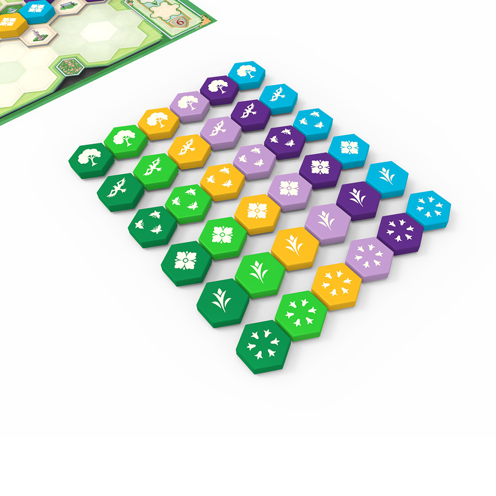
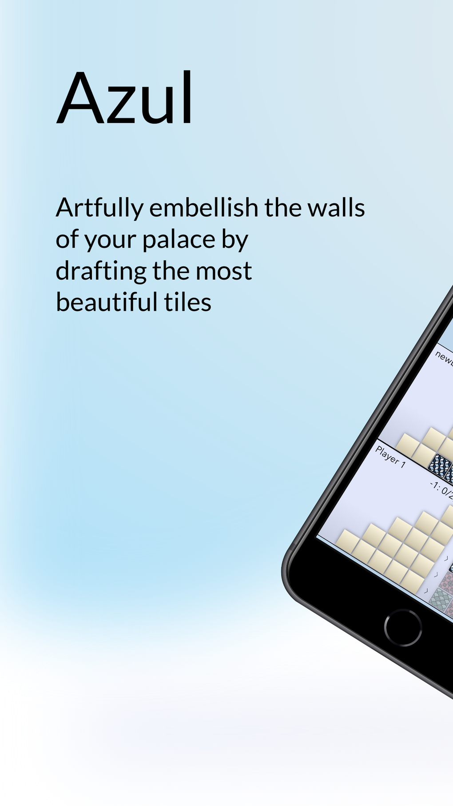
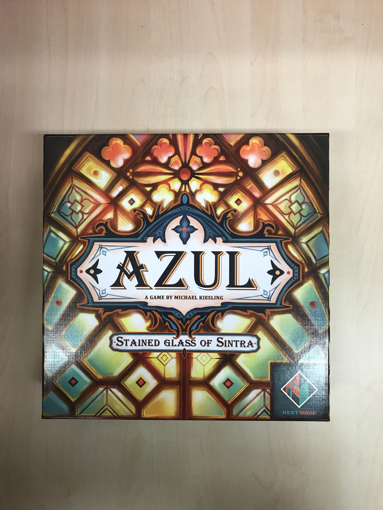
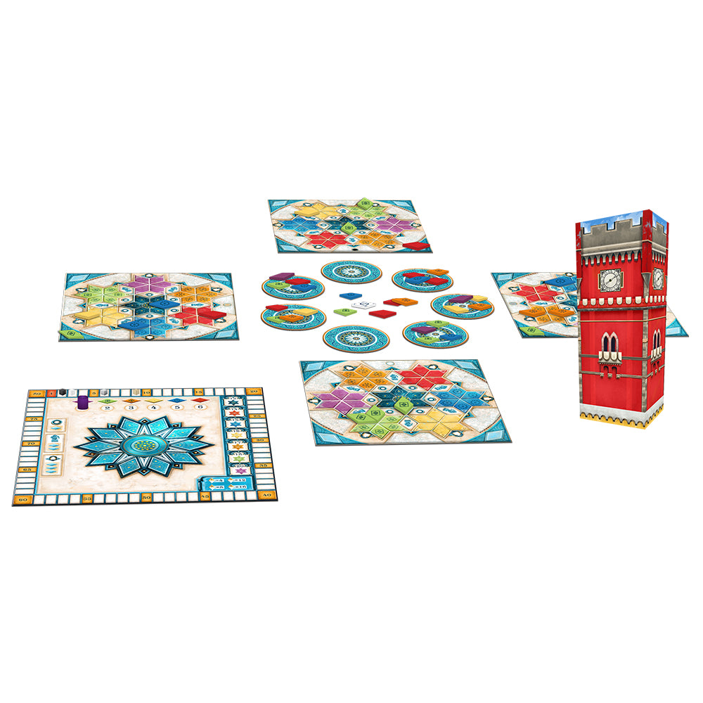

# Are the Azul Sequels Better Than the Original?

Look, calling these "expansions" is already a little bit of a cheat. [Azul](https://boardgamegeek.com/boardgame/230802/azul), [Azul: Stained Glass of Sintra](https://boardgamegeek.com/boardgame/256226/azul-stained-glass-of-sintra), [Azul: Summer Pavilion](https://boardgamegeek.com/boardgame/287954/azul-summer-pavilion), and [Azul: Queen's Garden](https://boardgamegeek.com/boardgame/346965/azul-queens-garden) are standalone sequels, not bolt-on modules. You do not shuffle them together. You do not create some cursed mega-Azul. Each one is its own box, its own ruleset, its own answer to the question: what if Azul, but different?

That said, this is still the exact conversation people have. You own [Azul](https://boardgamegeek.com/boardgame/230802/azul). You love [Azul](https://boardgamegeek.com/boardgame/230802/azul). Then you stare at the shelf and wonder if one of these follow-ups actually improves the formula, or if you're just about to buy a prettier remix.

This article is really about that buying decision. First, why the original still sets the standard. Then, how each sequel changes the experience, who those changes are for, and whether each one earns shelf space. After that, I'll rank the sequels against each other and come back to the bigger question: are any of them actually better than the original?

Here's the thing: the original is still the benchmark.

It remains "perfectly simple" with straightforward rules, nasty interaction, and that beautiful little arc where every draft feels obvious until it absolutely isn't. One bad pick can dump a pile of tiles in your lap, and suddenly you're eating negative points while the person across the table pretends this was all part of their master plan. I love that tension. A lot of people do. That's why [Azul](https://boardgamegeek.com/boardgame/230802/azul) is still the one that gets recommended first.

So are the sequels better? Sometimes. For some groups. But not across the board.

## Base Game Recap: Why the Original Still Rules

[Azul](https://boardgamegeek.com/boardgame/230802/azul) works because it knows exactly what it is. Draft tiles. Fill rows. Transfer one tile to your wall. Score adjacency. Try not to drown in leftovers. That's it.

But does that actually matter at game night? Yes, because elegance matters. The original gets to the table fast, teaches fast, and starts producing deliciously mean decisions almost immediately. BGG and Reddit arguments about "best Azul" usually split on this exact line: do you want interaction and tension, or do you want more puzzle?

If you want the sharpest version of the drafting fight, the original is still king.

What the original does better than any sequel is force every pick to do three jobs at once. You are improving your board, protecting yourself from overflow, and quietly wrecking somebody else's plan. That's the magic trick. A blue draft is never just a blue draft. It's "I need this for my fourth row, but if I leave those two reds on the factory, Sarah completes her column, and if I take too many, I eat three negatives." You can explain the rules in five minutes and still spend the whole game making ugly, delicious compromises.

That tension gets nastier as players improve. Early plays of [Azul](https://boardgamegeek.com/boardgame/230802/azul) feel like a pleasant drafting puzzle. Later plays get mean. Every experienced table develops that moment where everyone stares at one overloaded factory and realizes somebody is getting punished. The best move is often not the most efficient move for your own board. It's the move that leaves your opponent one impossible color set and a floor line full of regret. That's why the game has lasted. It scales from family-friendly to quietly vicious without changing a single rule.

I also love how visible the scoring incentives are. Rows, columns, color sets. Nothing is hidden. You can look at another player's wall and know what they want. That clarity creates interaction without negotiation or take-that cards. You're not attacking with a special power. You're attacking by understanding the board state better. Big difference.

A practical tip for players who only know the game casually: stop treating the floor line as a total disaster. Taking one or two negatives to secure a key color can be absolutely correct, especially if it denies a huge scoring turn or finishes an important column. New players overprotect against penalties and miss the bigger swing. Veteran [Azul](https://boardgamegeek.com/boardgame/230802/azul) players know a controlled loss can be the winning move. That's such a good design lesson. The game punishes greed, but it rewards nerve.

With that baseline in place, the sequels are easier to judge. Each one tweaks a different part of the formula, and the real question is whether those tweaks create a better experience for your table or just a different one.

## [Azul: Stained Glass of Sintra](https://boardgamegeek.com/boardgame/256226/azul-stained-glass-of-sintra)

This is the sequel for people who looked at [Azul](https://boardgamegeek.com/boardgame/230802/azul) and thought, "Great. Now make me plan further ahead."

The big twist is the modular board. Layout changes from game to game, which gives [Azul: Stained Glass of Sintra](https://boardgamegeek.com/boardgame/256226/azul-stained-glass-of-sintra) more variability than the original right out of the box. On top of that, it adds bonus points for tiles placed in specific rounds across the six-round structure. So now you're not just asking, "What helps me this turn?" You're asking, "What do I need to set up for round four, and can I afford to wait?"

That changes the feel a lot.

The original [Azul](https://boardgamegeek.com/boardgame/230802/azul) is immediate. Sintra is more scheduled. More deliberate. More thinky. If your group likes planning windows and timing bonuses, that's a real upgrade. If your group likes the original because it's clean and punchy, Sintra can feel like the game put on a tie and asked everyone to be serious for a minute.

I get the appeal. I also get why this one tends to inspire less table passion than [Azul](https://boardgamegeek.com/boardgame/230802/azul) or [Azul: Summer Pavilion](https://boardgamegeek.com/boardgame/287954/azul-summer-pavilion). It's not bad. Not even close. It's an enjoyable challenge with more strategic depth than the original. But the cost of that depth is some of the breezy snap that made the first game such a hit.

**Verdict: Worth It**

Buy this if you already know your group wants more planning and more variability. Skip it if what you love about [Azul](https://boardgamegeek.com/boardgame/230802/azul) is the simplicity. This is not an essential upgrade. It's a side-grade for a more analytical crowd.

If Sintra pushes Azul toward longer-term planning, the next sequel goes in almost the opposite direction. Instead of tightening the schedule, it opens up the puzzle and gives players more room to build momentum.

## [Azul: Summer Pavilion](https://boardgamegeek.com/boardgame/287954/azul-summer-pavilion)

I know, I know. "The third one is the good one" sounds like hobby nonsense. Hear me out.

[Azul: Summer Pavilion](https://boardgamegeek.com/boardgame/287954/azul-summer-pavilion) is the sequel with the strongest case for replacing the original for some groups. It makes the biggest changes, and most of them are smart.

First, the tiles are diamond-shaped instead of square. Purely on table presence, this thing is gorgeous. It's also widely described as the most beautiful of the three games, and I get it. It looks fantastic spread across the table.

[Mechanic](/posts/mechanic-deep-dive-hidden-roles/)ally, this is where things get interesting. You get section completion bonuses that unlock extra tiles each round, so turns can chain together in a way the original never allows. One good placement leads to another. Then another. Suddenly you're cooking. It also adds a wild tile color each round, which gives you flexibility without making the drafting mushy.

And then there's the big quality-of-life change. Negative scoring gets hammered down hard. Reviews flat-out say that negative points are essentially obliterated compared to the other Azuls. No more constant dread that a pile of junk is about to land in front of you and kick your score in the teeth. The Start Player penalty still exists, but it's modified. Claiming it moves you backward based on tiles taken, which feels more controlled and less spitefully random.

Also, you can carry tiles between rounds instead of discarding them.

That one matters. A lot.

Look, the original [Azul](https://boardgamegeek.com/boardgame/230802/azul) is brilliant because it weaponizes inefficiency. [Azul: Summer Pavilion](https://boardgamegeek.com/boardgame/287954/azul-summer-pavilion) is brilliant because it lets you build momentum. Those are very different pleasures. Summer Pavilion has more combo planning, more sequencing, more "if I finish this section now, I can grab that bonus and set up next round." Its weight only nudges up from 1.78 to 1.99 on BGG, which tells you the added complexity is real but still very manageable.

The tradeoff? Interaction and tension take a hit.

This is the common community take, and I think it's dead on: [Azul: Summer Pavilion](https://boardgamegeek.com/boardgame/287954/azul-summer-pavilion) is the most gamer-friendly version, but the original [Azul](https://boardgamegeek.com/boardgame/230802/azul) remains the true champion for direct competition and table pressure. Summer Pavilion gives you a friendlier, richer puzzle. The original gives you sharper elbows.

So which is better? If your group hates negative scoring and loves combo turns, Summer Pavilion might actually be your best Azul. Full stop.

**Verdict: Essential**

Yes, essential. Not because everyone needs it, but because it's the one sequel that genuinely earns shelf space next to the original instead of behind it. If you love [Azul](https://boardgamegeek.com/boardgame/230802/azul) and want a deeper alternative rather than a replacement, this is the one to buy first.

The last sequel is harder to place, not because it lacks interest, but because the available support here is thinner. That makes the buying advice more cautious by necessity.

## [Azul: Queen's Garden](https://boardgamegeek.com/boardgame/346965/azul-queens-garden)

Here's where I have to be careful.

What can we say? It's a standalone sequel in the Azul line, not a required expansion to the base game. And because the original [Azul](https://boardgamegeek.com/boardgame/230802/azul) is already complete, [Azul: Queen's Garden](https://boardgamegeek.com/boardgame/346965/azul-queens-garden) starts from the same position as the others: it has to justify itself as an alternate version, not patch a broken system.

Without stronger source support on mechanics and reception, I can't rank it on the same footing with confidence.

**Verdict: Incomplete Data, Lean Skip**

Not a condemnation. Just a practical buying recommendation. If you're choosing today based on the evidence here, [Azul: Summer Pavilion](https://boardgamegeek.com/boardgame/287954/azul-summer-pavilion) and [Azul: Stained Glass of Sintra](https://boardgamegeek.com/boardgame/256226/azul-stained-glass-of-sintra) are the informed picks. Queen's Garden can wait.

The useful thing to say here is not "I don't know enough, shrug." The useful thing is to frame the buying decision the way an actual shelf-space argument happens. If you already own [Azul](https://boardgamegeek.com/boardgame/230802/azul), and you're choosing one sequel blind, what are you trying to improve? If the answer is more strategic depth with a clear community case behind it, [Azul: Summer Pavilion](https://boardgamegeek.com/boardgame/287954/azul-summer-pavilion) has that lane covered. If the answer is more planning and board variability, [Azul: Stained Glass of Sintra](https://boardgamegeek.com/boardgame/256226/azul-stained-glass-of-sintra) at least gives you a documented reason to exist. [Azul: Queen's Garden](https://boardgamegeek.com/boardgame/346965/azul-queens-garden), based on the research in hand, does not yet clear that bar.

And that matters because Azul boxes are not cheap enough to buy on vibes alone unless you're a full-series collector. This is not a tiny card-game impulse purchase. A sequel has to answer a very simple question: what problem is it solving? The original already handles accessibility and interaction. Summer Pavilion handles the "I want more combos and less punishment" crowd. Sintra handles the "I want more planning texture" crowd. Without concrete mechanical or reception data, Queen's Garden lands in the dangerous hobby zone of "probably interesting, but why this one first?"

Look, BGG users and Reddit threads love ranking whole series as if every box needs a medal. Real tables are less dramatic. Most people need one Azul, maybe two. So the practical advice is to treat [Azul: Queen's Garden](https://boardgamegeek.com/boardgame/346965/azul-queens-garden) as a later exploration, not a core purchase. If you have already exhausted the original and Summer Pavilion, then sure, start poking around. But if you're standing in a store or filling an online cart today, missing information is information. It means there isn't a strong enough case, from this evidence set, to bump it ahead of the known quantities.

With all three sequels covered, the ranking itself is pretty straightforward.

## Ranking the Azul Sequels

### 1. [Azul: Summer Pavilion](https://boardgamegeek.com/boardgame/287954/azul-summer-pavilion)  
**Verdict: Essential**

The best sequel for most hobby gamers. More combo play, less punishment, still approachable. If your table wants "Azul, but meatier," this is the answer.

### 2. [Azul: Stained Glass of Sintra](https://boardgamegeek.com/boardgame/256226/azul-stained-glass-of-sintra)  
**Verdict: Worth It**

Good, clever, more strategic. But narrower in appeal. It asks more from players without creating the same broad "one more game" energy as the original or Summer Pavilion.

### 3. [Azul: Queen's Garden](https://boardgamegeek.com/boardgame/346965/azul-queens-garden)  
**Verdict: Skip It, for now**

This is purely a confidence ranking based on missing data. If you don't have enough information to know why you'd buy it over the other two, you probably shouldn't.

The ranking gets easier if you stop asking "which game is smartest?" and start asking "which box earns its place next to the original?" That's the real test. Shelf space is finite. Attention spans are finite. The sequel has to do more than be competent. It has to create a distinct reason to come off the shelf.

That is why [Azul: Summer Pavilion](https://boardgamegeek.com/boardgame/287954/azul-summer-pavilion) lands at number one so comfortably. It changes enough to feel fresh, but not so much that it loses the identity of Azul. You still draft from shared displays. You still watch other players' needs. You still feel that delicious pressure of timing. But the section-completion bonuses, wild tiles, and carryover between rounds create turns that feel more expressive. You can build toward something. You can recover from a clumsy round. You can have those satisfying chain turns where one placement unlocks the next. That's a meaningful expansion of the formula, not just a remix.

[Azul: Stained Glass of Sintra](https://boardgamegeek.com/boardgame/256226/azul-stained-glass-of-sintra) ranks second because its strengths are real but narrower. The modular board and round-specific bonus planning are interesting. They reward foresight and make each game less static. But that appeal is more conditional. You need a group that wants to think a little further ahead and doesn't mind losing some of the original's immediacy. I've seen players bounce off that sort of design shift before. Not because it's bad, but because "more planning" is not automatically "more fun" for every table.

And ranking [Azul: Queen's Garden](https://boardgamegeek.com/boardgame/346965/azul-queens-garden) last is not a cheap shot. It's just disciplined criticism. If the evidence isn't strong enough to explain its hook, value, or place in the lineup, it cannot beat games whose strengths are clear. That's not me ducking the question. That's me refusing to turn uncertainty into fake authority. In hobby media, that should happen more often.

## So, Are the Sequels Better Than the Original?

Mostly no.

But one of them might be better for *you*.

The original [Azul](https://boardgamegeek.com/boardgame/230802/azul) is still the best all-around design because it maximizes interaction, accessibility, and tension. It's the cleanest expression of the idea. That's why it keeps winning these arguments years later.

[Azul: Summer Pavilion](https://boardgamegeek.com/boardgame/287954/azul-summer-pavilion) is the best sequel because it expands the decision space in ways that feel rewarding rather than bloated. It gives you more to do and more ways to recover. For groups that hate punishment and love building toward satisfying combo turns, it may genuinely surpass the original.

[Azul: Stained Glass of Sintra](https://boardgamegeek.com/boardgame/256226/azul-stained-glass-of-sintra) is a respectable alternate route, but not the one I'd push most people toward first.

A lot of sequel discourse in board games gets weirdly obsessed with "more." More mechanisms. More scoring hooks. More flexibility. More things to think about. But more is not automatically better. Sometimes more just means your first turn takes longer and your clean little knife-edge puzzle turns into a broader, softer optimization exercise. People on BGG love to call that "depth." Sometimes it is. Sometimes it's just extra steps.

The original [Azul](https://boardgamegeek.com/boardgame/230802/azul) avoids that trap. It has almost no fat. Every rule creates friction. Every scoring decision feeds the central tension. If I teach it to mixed company, I know exactly what will happen. Someone will say, "Oh, this seems relaxing." Twenty minutes later, they're staring at a factory display like it personally insulted them. That's great design. The game reveals its teeth gradually.

So when is a sequel better? When it gives your group a better emotional arc. That's the test I care about. [Azul: Summer Pavilion](https://boardgamegeek.com/boardgame/287954/azul-summer-pavilion) can beat the original for players who want momentum instead of punishment. They want to feel clever for building combos, not stressed about floor-line damage. They want flexibility. They want the chance to store resources and set up a bigger turn later. For that crowd, Summer Pavilion is not just "good for a sequel." It might genuinely create more fun over repeated plays.

But if your group loves the snap of denial drafting, the constant threat of overflow, and the way every visible board state becomes a tactical puzzle for everyone at the table, the original still wins. That is why this series is interesting. The sequels do not obsolete [Azul](https://boardgamegeek.com/boardgame/230802/azul). They reveal what you value in it. Do you love the tension, or do you love the pattern building? Do you want confrontation, or do you want flow? Once you answer that, the "best Azul" debate gets a lot less mystical and a lot more useful.

## The Definitive Setup

If you want the definitive way to play Azul, here's my answer:

**Own the original [Azul](https://boardgamegeek.com/boardgame/230802/azul) and add [Azul: Summer Pavilion](https://boardgamegeek.com/boardgame/287954/azul-summer-pavilion).**

That's the pairing.

Use the original when you want the sharpest, meanest, most elegant drafting duel. Pull out Summer Pavilion when your group wants a more generous puzzle with combo planning and less punishment. Between those two boxes, you've got the full Azul spectrum covered.

If you're only buying one? Start with the original.

If you already own the original and want one sequel? Buy [Azul: Summer Pavilion](https://boardgamegeek.com/boardgame/287954/azul-summer-pavilion).

Everything else is taste. That one is the easy call.