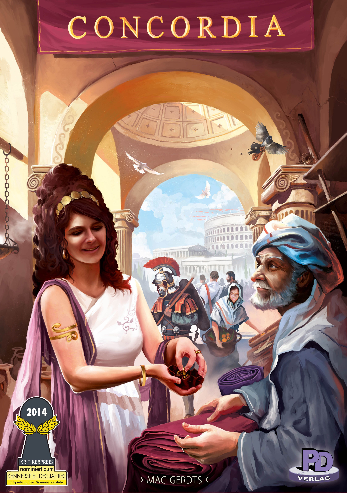
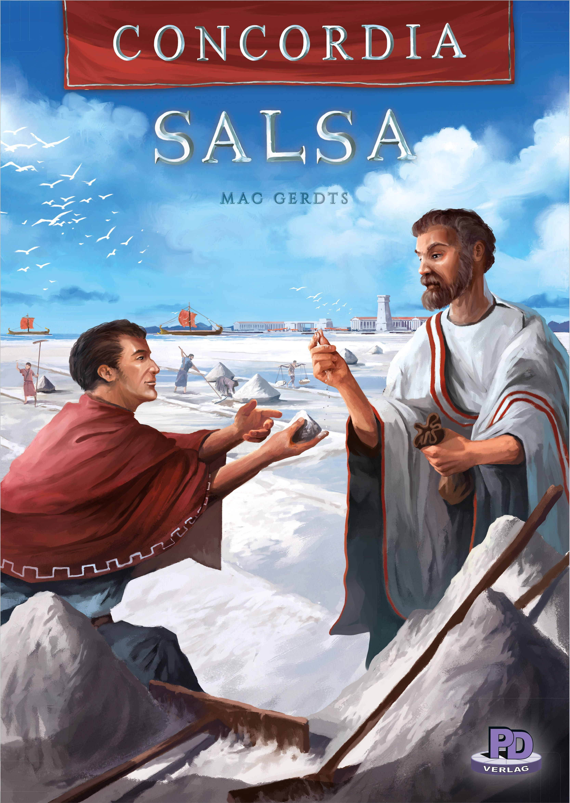
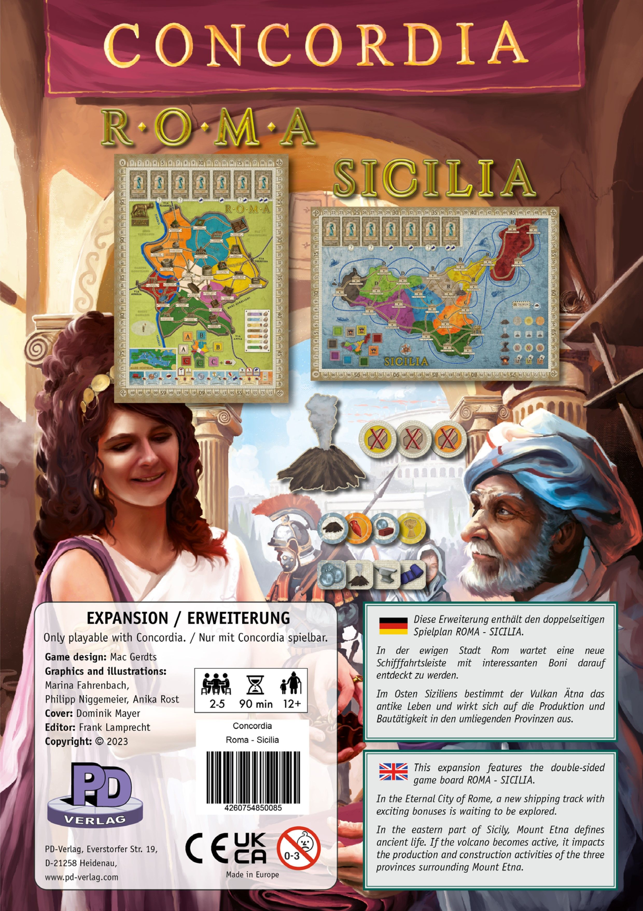
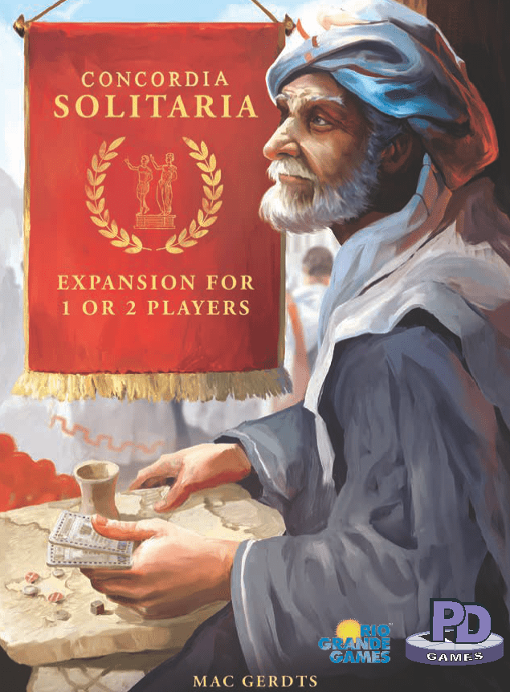
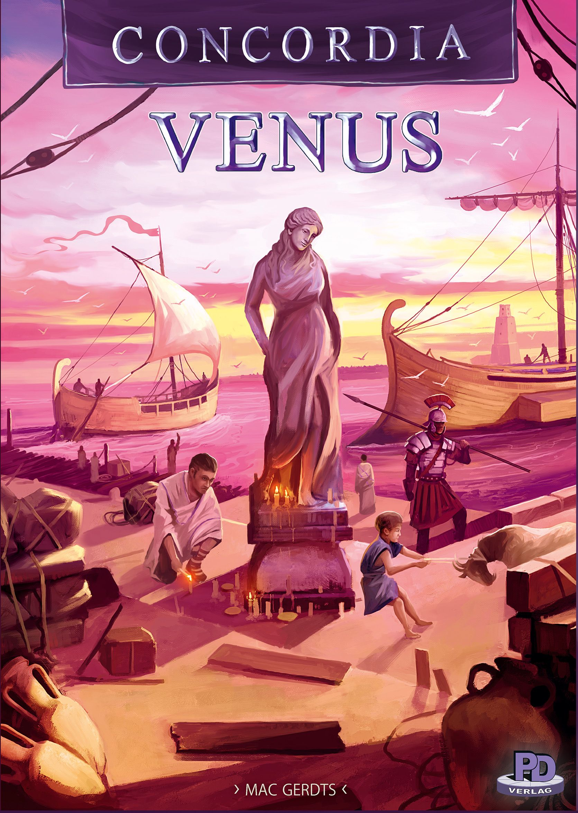

# Is [Concordia](https://boardgamegeek.com/boardgame/124361) Worth Expanding? Salsa, Venus, Solitaria, and the Map Packs Ranked

[Concordia](https://boardgamegeek.com/boardgame/124361) is one of those games that keeps aging like it has a private cellar in Rome. It sits at **8.08/10 on BGG from 45,172 ratings**, carries a **2.99/5 weight**, and holds **BGG rank #29**. Published in **2013**, it plays **2-5 players** in about **100 minutes**. All of that tracks. Sit down with it and you get a razor-clean economic game where every card matters, every colonist movement hurts a little, and the final scoring still makes new players blink twice.

The key question is simple. Does it need expansions?

No. The base game is fully complete and very good on its own. That matters. A lot of expansions are basically apology notes in a bigger box. [Concordia](https://boardgamegeek.com/boardgame/124361) is not that. It already works.

But some expansions make it better. Significantly.

This article is about which [Concordia](https://boardgamegeek.com/boardgame/124361) expansions are actually worth buying, what each one adds, and how they rank against each other in practical terms. The short version: **[Concordia Salsa](https://boardgamegeek.com/boardgame/181084)** and the map packs are the best upgrades for most players, while **[Concordia Solitaria](https://boardgamegeek.com/boardgame/325490)** and **[Concordia Venus](https://boardgamegeek.com/boardgame/256916)** are more situational.

## Base game recap

What makes [Concordia](https://boardgamegeek.com/boardgame/124361) sing is its restraint. You play cards, expand across the map, build houses, generate goods, and buy more cards that also determine your endgame scoring. No combat. No random event deck swooping in to ruin your plans. Just pressure. Timing. Money. Positioning.

And that famous Mac Gerdts elegance is real. Your turn is quick. Your mistakes are permanent. The game quietly punishes sloppy play, then smiles while doing it.

The base game’s sweet spot is still **3-5 players**. That’s where the map feels alive and the market pressure starts to matter. At lower counts, especially if you play it a lot, you may start wanting more texture. That’s where expansions earn their keep.

One reason the base game feels so complete is that the tension comes from systems colliding, not from chrome. Your hand of cards is your action menu, your engine, and your scoring blueprint all at once. That means every purchase is doing three jobs. Buy a card for the ability now, and you may be warping your final scoring in ways you do not fully appreciate until the Tribune cycle starts tightening. New players usually clock the action efficiency first. Veterans obsess over card timing and score architecture.

A typical early game in [Concordia](https://boardgamegeek.com/boardgame/124361) looks deceptively peaceful. Somebody grabs wheat production. Somebody else sends a colonist toward cloth. Another player buys an early specialist card and feels clever. Then, around the midpoint, the board starts hardening. Routes get blocked. Prime city spots disappear. The market row gets weirdly hostile. Suddenly that casual opening where you “just wanted flexibility” turns into a game where you are overpaying for movement and begging for one more brick.

That’s the beauty of it. [Concordia](https://boardgamegeek.com/boardgame/124361) rarely punches you in the face. It slowly closes doors.

The other thing the base game nails is readable interaction. This is not a game of direct attacks, but pretending it is multiplayer solitaire is hobby nonsense. If someone Prefects at the right moment, they can strip value from an entire region before you cash in. If someone races to saturate a province, your expansion plan gets expensive fast. If a player buys a key card from the market just before your turn, that hurts. A lot. You feel other players constantly, just through pressure rather than destruction.

There is also a reason experienced groups often say the game sings once everyone understands the scoring gods. Minerva cards reward specialization. Jupiter and Saturn nudge map presence. Mercury loves diversity. Vesta and Mars ask different questions. In your first play, this can feel abstract. By your fifth, you start building with intent. By your tenth, you are counting opponents’ card mixes and realizing the person who looked “behind” is about to win by 18 points.

That learning curve is exactly why the expansions work. They are building on a base system that already has teeth.

## 1. [Concordia Salsa](https://boardgamegeek.com/boardgame/181084)  
**Verdict: Essential**

If you only buy one [Concordia](https://boardgamegeek.com/boardgame/124361) expansion, make it [Concordia Salsa](https://boardgamegeek.com/boardgame/181084).

This is the expansion that feels like it should have always been there, which is usually the highest compliment and the mildest insult. It adds new cards, sestertii tokens, enhanced houses, trader and diplomat-style options, and some victory point adjustments that deepen the economy and make the endgame scoring less predictable.

That last part matters. A lot.

Base [Concordia](https://boardgamegeek.com/boardgame/124361) is already elegant, but if you’ve played it enough, you start seeing familiar scoring patterns and familiar economic ceilings. [Concordia Salsa](https://boardgamegeek.com/boardgame/181084) loosens that up without turning the game into homework. It also helps with warehouse pressure and income flexibility, which are small friction points in the base game.

Price-wise, it usually lands around **$20-30**, and that’s great value. No giant plastic monument to excess. Just better decisions.

The best thing about [Concordia Salsa](https://boardgamegeek.com/boardgame/181084) is that it does not mess with the soul of the game. It adds spice, yes, but not noise.

What pushes [Concordia Salsa](https://boardgamegeek.com/boardgame/181084) over the line from “good expansion” to “default way to play” is how it changes tactical texture without making turns slower. That sounds easy. It is not. Most euro expansions add decision space by just piling more stuff on the table until everyone spends five minutes staring at cardboard. [Concordia Salsa](https://boardgamegeek.com/boardgame/181084) adds options that feel legible the moment they appear.

The sestertii tokens are a great example. In the base game, warehouse pressure can be brutal in a way that is elegant but occasionally a little too rigid. You produce, you cap out, you discard, you sigh. With [Concordia Salsa](https://boardgamegeek.com/boardgame/181084), those flexible income tools give you ways to smooth awkward turns and convert opportunities you otherwise could not hold. That means fewer dead-feeling production spikes and more moments where a smart player can set up a two-turn sequence that actually pays off. It rewards planning without making the game forgiving.

The extra cards also do quiet balancing work. In the base game, some card rows can feel a touch scripted after repeated play. Certain purchases become table habits. You can almost hear the group thinking, “Yep, someone takes that one, then we all pivot.” [Concordia Salsa](https://boardgamegeek.com/boardgame/181084) breaks that rhythm. Not by chaos. By opening alternate lines. A trader-heavy approach might become viable earlier. A scoring plan you would normally abandon can stay alive because the card mix supports it.

A practical tip. The players who get the most from [Concordia Salsa](https://boardgamegeek.com/boardgame/181084) are usually the ones who stop treating it like “base game plus bonuses” and start using it to create timing windows. If a token lets you hold a good you could not normally keep, that is not a minor convenience. That can be the difference between building in a premium city now versus spending an entire extra round repositioning. Same with the adjusted scoring incentives. They are subtle, but they reward players who stay flexible instead of locking into one visible plan too early.

This is also why [Concordia Salsa](https://boardgamegeek.com/boardgame/181084) pairs so well with map packs. New geography asks new questions. Salsa gives you better tools to answer them. That combination is where [Concordia](https://boardgamegeek.com/boardgame/124361) starts feeling inexhaustible.

## 2. Map packs, especially [Concordia: Roma / Sicilia](https://boardgamegeek.com/boardgame/380917)  
**Verdict: Essential**

If Salsa is the best system upgrade, the map packs are the best replayability upgrade.

New [Concordia](https://boardgamegeek.com/boardgame/124361) maps do not arrive with fireworks. They arrive with subtle rule tweaks, altered geography, and a completely different feel once you’re three turns in and realize your usual opening is now bad.

That’s the good stuff.

The standout first pick is [Concordia: Roma / Sicilia](https://boardgamegeek.com/boardgame/380917). **Sicilia is the preferred first map over Roma**, and the pack as a whole is one of the best value adds in the system. It usually costs **$15-25**, which is absurdly good for how much replayability it injects.

The tweaks are small but sharp. Free ship moves on Prefect replenishment. Production incentives. Board layouts that reward early resource grabs and faster colonist deployment. Suddenly the game asks different questions. Do you spread early or lock key routes? Do you chase tempo or economy? The answer changes by map.

That’s why map packs punch above their weight. They don’t add complexity in the annoying way. They add context. They make you read the board again.

They also improve **1-2 player** games more than people expect. If you’ve ever seen the take that “[Concordia](https://boardgamegeek.com/boardgame/124361) is great but really wakes up with the right map,” this is what that means.

For replayability alone, these are essential.

## 3. [Concordia Solitaria](https://boardgamegeek.com/boardgame/325490)  
**Verdict: Worth It, Essential for solo players**

After the broad upgrades, the ranking gets more situational. [Concordia Solitaria](https://boardgamegeek.com/boardgame/325490) is the clearest example.

[Concordia](https://boardgamegeek.com/boardgame/124361) was never famous as a solo game out of the box. Because, well, it doesn’t have a solo mode. [Concordia Solitaria](https://boardgamegeek.com/boardgame/325490) fixes that cleanly.

This adds an automated opponent and variable setups, and by all accounts it stays faithful to the base rules rather than replacing them with a weird mini-game nobody asked for. That’s exactly what you want from a euro solo mode.

Price is typically **$15-25**, which is very fair. For solo fans, it’s a no-brainer. For multiplayer-only groups, it’s easy to skip.

There is one catch. [Concordia Solitaria](https://boardgamegeek.com/boardgame/325490) gets better with maps, especially [Concordia: Roma / Sicilia](https://boardgamegeek.com/boardgame/380917). Solo lacked depth before those map options really elevated it. So if your main goal is solo [Concordia](https://boardgamegeek.com/boardgame/124361), don’t buy this in isolation and call it a day. Pair it with a map pack.

For **1-2 players**, this expansion does real work. For everyone else, it’s a side door, not the front entrance.

The real test for a solo mode in a euro like [Concordia](https://boardgamegeek.com/boardgame/124361) is simple. Does it preserve the game’s central stress, or does it turn the whole thing into a beat-your-own-score spreadsheet? Too many solo add-ons miss this completely. They keep the mechanisms, but lose the pressure. [Concordia Solitaria](https://boardgamegeek.com/boardgame/325490) works because the automated opponent creates friction in the spaces that matter. Card tempo. Positioning. Opportunity denial.

That matters most because base [Concordia](https://boardgamegeek.com/boardgame/124361) at low counts can sometimes feel a little too open. At three to five, the board naturally tightens. At one or two, you need something to make the map push back. [Concordia Solitaria](https://boardgamegeek.com/boardgame/325490) gives you that. You are no longer just solving an efficiency puzzle in a vacuum. You are reacting to an opponent framework that can force uncomfortable choices, especially around timing your Tribune and committing to expansion lanes.

A useful way to approach it is to stop asking whether the automa feels “human.” That debate always eats forum threads alive and usually misses the point. The better question is whether it creates meaningful constraints that make your decisions sharper. Here, yes. If the bot pressures a province before you are ready, or changes the value of a card timing window, that is enough. You still get the core [Concordia](https://boardgamegeek.com/boardgame/124361) experience of sequencing actions under pressure.

The map interaction is huge too. [Concordia Solitaria](https://boardgamegeek.com/boardgame/325490) gets much better alongside [Concordia: Roma / Sicilia](https://boardgamegeek.com/boardgame/380917). On those tighter, more dynamic boards, the solo mode has more bite. Sicilia in particular creates a game where transport tempo and production incentives matter immediately, which gives the bot more opportunities to be annoying in the best possible way.

One tactical tip for solo players. Do not overbuild early just because the board looks spacious. That is the classic trap. In solo [Concordia](https://boardgamegeek.com/boardgame/124361), tempo is everything. Expanding without a card and income plan behind it can leave you rich in presence and poor in actual points. The automa is often most effective when it nudges you into inefficient urgency. Resist that. Build where your scoring deck says you should build, not where your ego wants a bigger footprint.

## 4. [Concordia Venus](https://boardgamegeek.com/boardgame/256916)  
**Verdict: Worth It**

The last major expansion is also the most group-dependent.

[Concordia Venus](https://boardgamegeek.com/boardgame/256916) is the trickiest one to recommend because what it adds is either exactly what you want or something you will ignore forever.

Its big hook is partnership play. Team-based [Concordia](https://boardgamegeek.com/boardgame/124361). That sentence alone will either make your group lean in or check out immediately. It also adds new maps like Hellas and Ionium, 6-player support, and can come as either a standalone edition or an expansion depending on which version you buy. The expansion route is the better value if you already own the base game.

Typical price is **$40-60**, with the standalone version running higher. That’s decent value if you want team play, more maps, or **6-player** capability. If you don’t, it’s a much tougher sell.

The good news is that the partnership system doesn’t bloat the game. It’s a light teamwork layer, not a rules avalanche. Community reaction has generally been positive, especially from groups that wanted more interaction or a fresh way to use the system. Design notes also point to **4-player teams** as a best-case setup, and the solo variant reportedly works well at **2 players** too.

Still, this is not [Concordia Salsa](https://boardgamegeek.com/boardgame/181084). It doesn’t feel universally necessary. It feels situational.

If your group loves team games or regularly hits player counts the base game can’t support, grab it. Otherwise, there are better first purchases.

## Expansion ranking: best to worst

Now that each expansion is on the table, the ranking itself is pretty straightforward.

### 1. [Concordia Salsa](https://boardgamegeek.com/boardgame/181084)
The best all-around expansion. Smart fixes, better scoring texture, more economic flexibility. **Essential.**

### 2. [Concordia: Roma / Sicilia](https://boardgamegeek.com/boardgame/380917) and other map packs
The value champion. Cheap, elegant, and transformative in that quiet [Concordia](https://boardgamegeek.com/boardgame/124361) way. **Essential.**

### 3. [Concordia Solitaria](https://boardgamegeek.com/boardgame/325490)
A great add-on if solo or 2-player matters to you. Less urgent otherwise. **Worth It, Essential for solo players.**

### 4. [Concordia Venus](https://boardgamegeek.com/boardgame/256916)
Good expansion. Not universal. Buy it for teams, 6 players, and map variety. **Worth It.**

The ranking gets clearer once you ask one question. Which expansion improves the highest percentage of [Concordia](https://boardgamegeek.com/boardgame/124361) sessions for the highest percentage of players? That is why [Concordia Salsa](https://boardgamegeek.com/boardgame/181084) and the map packs sit at the top. They are not niche tools. They are broad upgrades.

You could argue for swapping those top two, and I would not call that wrong. There is a real case for maps at number one because they are cheaper, simpler, and immediately transformative. A new board can completely alter opening priorities. On one map, getting early ship mobility might be huge. On another, production clusters make a different expansion pattern correct. If you are the kind of player who loves re-learning a system through geography, maps are your number one. Full stop.

So why keep [Concordia Salsa](https://boardgamegeek.com/boardgame/181084) at the top? Because it improves the internal economy of the game itself. It is not just variety. It is refinement. Better flexibility, better scoring texture, better card ecosystem. Maps change the questions. Salsa gives you richer answers. If I had to play one board forever, I would still want Salsa in the box.

The middle of the ranking is also worth unpacking. [Concordia Solitaria](https://boardgamegeek.com/boardgame/325490) beats [Concordia Venus](https://boardgamegeek.com/boardgame/256916) for me because solo and two-player functionality solve a more common need than team mode. Plenty of [Concordia](https://boardgamegeek.com/boardgame/124361) owners want the game to work on a quiet weeknight. Fewer need six-player support or partnership play. That does not make Venus weak. It just makes it more specialized.

And specialization is the key word. [Concordia Venus](https://boardgamegeek.com/boardgame/256916) can absolutely jump higher in the ranking for the right group. If you have a regular four-player team-game crew, it may leapfrog Solitaria instantly. If your group never plays solo and loves paired planning, that is your expansion. Rankings are not commandments. They are purchase advice.

## So, which ones are skippable?

That ranking naturally leads to the next question: which expansions can you safely ignore?

None of these are outright cash grabs. That’s the nice surprise. [Concordia](https://boardgamegeek.com/boardgame/124361) has a remarkably sensible expansion line.

But “not a cash grab” does not mean “buy all of them.”

If you only play at **3-5 players** and don’t care about team play, [Concordia Venus](https://boardgamegeek.com/boardgame/256916) is skippable. If you never play solo, [Concordia Solitaria](https://boardgamegeek.com/boardgame/325490) is skippable too. The map packs and [Concordia Salsa](https://boardgamegeek.com/boardgame/181084) are the ones that most consistently improve the game for the widest audience.

## The Definitive Setup

So if the goal is not “own everything,” what is the best version of [Concordia](https://boardgamegeek.com/boardgame/124361) to actually keep on your shelf?

The best way to own [Concordia](https://boardgamegeek.com/boardgame/124361) is:

- Base [Concordia](https://boardgamegeek.com/boardgame/124361)
- [Concordia Salsa](https://boardgamegeek.com/boardgame/181084)
- One map pack, ideally [Concordia: Roma / Sicilia](https://boardgamegeek.com/boardgame/380917)
- [Concordia Solitaria](https://boardgamegeek.com/boardgame/325490) if you care about solo play
- [Concordia Venus](https://boardgamegeek.com/boardgame/256916) only if you want team play or 6-player support

If you want the cleanest “best version” for most hobby gamers, it’s **base + Salsa + Roma/Sicilia**. That combo keeps the brilliance of [Concordia](https://boardgamegeek.com/boardgame/124361) intact while giving you more strategic texture and far better replayability.

That’s the sweet spot. No bloat. No nonsense. Just more of one of the best economic games ever made, with better maps and a little more spice.