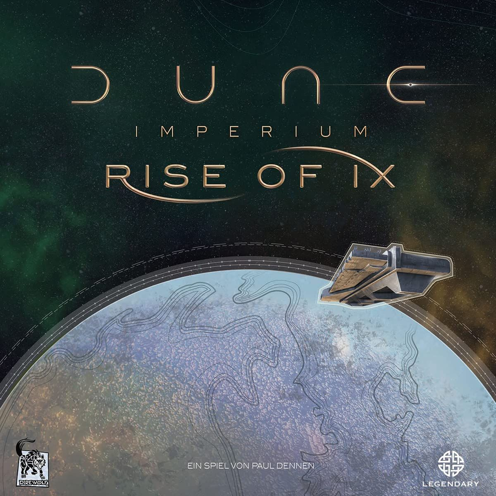

# Spice must flow: which [Dune: Imperium](https://boardgamegeek.com/boardgame/316554) add-ons are essential?

[Dune: Imperium](https://boardgamegeek.com/boardgame/316554) is already one of the hobby’s heavy hitters for a reason. It sits at **8.41/10 from 57,859 ratings**, carries a **3.08/5 weight**, supports **1-4 players**, and wraps its worker placement and deckbuilding into a game that usually lands in **60-120 minutes**. That alone tells you plenty. This thing is not some niche curiosity for people who alphabetise their wooden cubes. It’s a modern staple.

And yet, base [Dune: Imperium](https://boardgamegeek.com/boardgame/316554) has always felt a touch restrained to me. Good. Very good, even. But slightly boxed in. The card market can feel a bit samey over repeated plays, and once your group knows the board, you start seeing where the seams are. Not broken seams. Just visible ones.

 box art")

So this article is really about three things: which add-ons are actually worth buying, how they compare to each other, and what combination makes the most sense once you know what kind of [Dune: Imperium](https://boardgamegeek.com/boardgame/316554) experience you want.

## A quick base game recap

At its core, [Dune: Imperium](https://boardgamegeek.com/boardgame/316554) works because every turn feels tight. Your cards determine where your agents can go, your workers determine what plans are even possible, and combat constantly dares you to overcommit. There’s tension baked into every round. Buy the juicy card? Fight for the conflict? Chase faction influence? Snag spice and pray you can convert it later?

That pressure is brilliant.

But if you’ve played it a fair bit, you’ve probably also had the same thought half the internet has had: “This is excellent. Could use a bit more texture, though.”

That’s where the add-ons come in.

## 1. [Dune: Imperium - Rise of Ix](https://boardgamegeek.com/boardgame/342031)  
**Verdict: Essential**

If you own [Dune: Imperium](https://boardgamegeek.com/boardgame/316554) and plan to keep playing it, [Rise of Ix](https://boardgamegeek.com/boardgame/342031) is the one. No hesitation.

 - Rise of Ix expansion")

It adds six new leaders, a separate Ix board, new Imperium cards with fresh symbols, new combat cards, a shipping track, and Dreadnaughts. That sounds like a lot, because it is a lot. But this is the rare expansion that broadens the game without making it feel bloated.

The shipping track is terrific. It gives you another strategic lane that feels properly Dune, not like some random mini-game stapled on in development because expansions need bullet points on the back of the box. Dreadnaughts are even better. They make combat more dynamic, more threatening, and more persistent. You stop seeing battles as temporary bursts of cubes and start reading the board more carefully.

That matters.

The biggest win, though, is the card pool. [Rise of Ix](https://boardgamegeek.com/boardgame/342031) makes the deckbuilding side of [Dune: Imperium](https://boardgamegeek.com/boardgame/316554) more interesting and more flexible. It doesn’t just dump extra cards into the market and call it content. It actually gives you more lines to explore. More decisions that feel like decisions, not admin.

Community consensus on this one is about as close to unified as board gamers ever get without starting a 14-page BGG thread about solo balance. This expansion is widely treated as transformative. It makes the base game stronger, more interesting, and offers more choice. That’s exactly what an expansion should do.

Price context is awkward because the exact current cost shifts about depending on printings and retailers, but the value proposition is easy to read. If you play [Dune: Imperium](https://boardgamegeek.com/boardgame/316554) regularly, this earns its shelf space immediately.

This is not optional. This is the version of the game many people actually mean when they say they love [Dune: Imperium](https://boardgamegeek.com/boardgame/316554).

## 2. [Dune: Imperium - Immortality](https://boardgamegeek.com/boardgame/397598)  
**Verdict: Worth It**

If [Rise of Ix](https://boardgamegeek.com/boardgame/342031) is the obvious upgrade, [Immortality](https://boardgamegeek.com/boardgame/397598) is the more specialised follow-up.

[Immortality](https://boardgamegeek.com/boardgame/397598) is much weirder. Appropriately so, given the Tleilaxu are involved.

This expansion adds the Tleilaxu faction, genetic specimen harvesting, a scientific research system, and card grafting that can empower your agents. If [Rise of Ix](https://boardgamegeek.com/boardgame/342031) feels like a clean structural improvement, [Immortality](https://boardgamegeek.com/boardgame/397598) feels like a toy box for people who already know the game well and want more engine-building wrinkles.

And I do like it. Quite a bit, actually.

Card grafting is the headline here because it creates some genuinely satisfying turns. You start assembling odd little synergies and suddenly your deck feels less like a pile of access symbols with occasional persuasion, and more like something you built on purpose. That’s fun. Very fun.

The Tleilaxu track and research layer add another strategic consideration, but this is also where [Immortality](https://boardgamegeek.com/boardgame/397598) becomes easier to leave in the box. It doesn’t fix a core issue. It doesn’t tighten the game the way [Rise of Ix](https://boardgamegeek.com/boardgame/342031) does. It expands sideways.

That’s not a criticism by itself. Sideways expansion can be great. But it means this one depends more on your group’s appetite for extra systems. If your table already loves [Dune: Imperium](https://boardgamegeek.com/boardgame/316554) and wants another layer to chew on, [Immortality](https://boardgamegeek.com/boardgame/397598) is absolutely worth having. If your group still occasionally forgets what half the board does once round six hits, maybe don’t pile on the gene science.

The community read on this is about right. Nice to have. Sometimes excellent. Not mandatory.

I wouldn’t call it a skip. I would call it a luxury. A good one.

## 3. [Dune: Imperium - Uprising](https://boardgamegeek.com/boardgame/397598)  
**Verdict: Worth It for some players, Skip It for others**

The third option is trickier, because [Uprising](https://boardgamegeek.com/boardgame/397598) is not really an expansion in the usual sense. It’s a standalone reworking of the system. New cards, new leaders, revised board flow, a more combat-driven identity, and a price of about **$60**.

And yes, it does some smart things. The revised card mix improves deckbuilding flow. There are more opportunities to trash weak cards and reshape your deck into something sharper. Combat is punchier, swingier, more explosive. If the original [Dune: Imperium](https://boardgamegeek.com/boardgame/316554) is a tense strategic squeeze, [Uprising](https://boardgamegeek.com/boardgame/397598) is that same game after two espressos and a questionable political decision.

Some people will adore that.

But there’s a cost. More board options. More faction actions. More information to parse. More moments where a player stares at the table for three minutes trying to remember what every icon does and whether they’ve accidentally ignored the best space again. Reddit loves to call this “more depth”. Sometimes it is. Sometimes it’s just more stuff.

That’s my issue with [Uprising](https://boardgamegeek.com/boardgame/397598). It’s compelling, but it’s not a clean upgrade over the original. It’s a fork in the road.

If you’re new to the system and want the bolder, more combat-focused version right away, [Uprising](https://boardgamegeek.com/boardgame/397598) makes a lot of sense. If you already own [Dune: Imperium](https://boardgamegeek.com/boardgame/316554) and especially if you already own [Rise of Ix](https://boardgamegeek.com/boardgame/342031), this starts looking much less essential. The compatibility is impressive, sure, but the guidance for mixing content sounds half-baked, and that matters in a game already flirting with overload.

So yes, this is good. But no, I don’t think it replaces the original for everyone. Not remotely.

## Ranking the add-ons

With that in mind, the ranking is fairly straightforward:

### 1. [Dune: Imperium - Rise of Ix](https://boardgamegeek.com/boardgame/342031)  
**Essential**

The best expansion by a clear margin. It improves the base game without muddying it.

### 2. [Dune: Imperium - Immortality](https://boardgamegeek.com/boardgame/397598)  
**Worth It**

A strong second step once you already love the system and want more engine-building texture.

### 3. [Dune: Imperium - Uprising](https://boardgamegeek.com/boardgame/397598)  
**Worth It, but only for the right group**

Great for players who want a more explosive, combat-heavy version. Easy to skip if you already have the original and [Rise of Ix](https://boardgamegeek.com/boardgame/342031).

## The best overall setup

Once the individual verdicts are out of the way, the final question is what setup actually makes the most sense at the table.

For most players, the definitive way to play is:

**[Dune: Imperium](https://boardgamegeek.com/boardgame/316554) + [Rise of Ix](https://boardgamegeek.com/boardgame/342031) + [Immortality](https://boardgamegeek.com/boardgame/397598)**

That’s the sweet spot. You get the stronger card pool, the superb shipping and Dreadnaught additions, and the extra weirdness from the Tleilaxu systems without tipping fully into chaos. This is the “apex” version people keep circling back to, and I get why. It feels rich, varied, and alive.

If your group loves nastier fights and doesn’t mind a busier board, the alternative setup is **[Uprising](https://boardgamegeek.com/boardgame/397598) + [Rise of Ix](https://boardgamegeek.com/boardgame/342031) + [Immortality](https://boardgamegeek.com/boardgame/397598)**. That’s for players who want fireworks.

But if you want the cleanest recommendation, here it is.

Buy [Rise of Ix](https://boardgamegeek.com/boardgame/342031) first. Add [Immortality](https://boardgamegeek.com/boardgame/397598) if you want more. Treat [Uprising](https://boardgamegeek.com/boardgame/397598) as an alternate route, not a compulsory upgrade.

That’s the throughline of all three verdicts: [Rise of Ix](https://boardgamegeek.com/boardgame/342031) is the essential buy, [Immortality](https://boardgamegeek.com/boardgame/397598) is a worthwhile extra for groups that want more systems to explore, and [Uprising](https://boardgamegeek.com/boardgame/397598) is best understood as a different direction rather than a universal replacement.

The spice must flow, yes. But your rules overhead doesn’t have to.