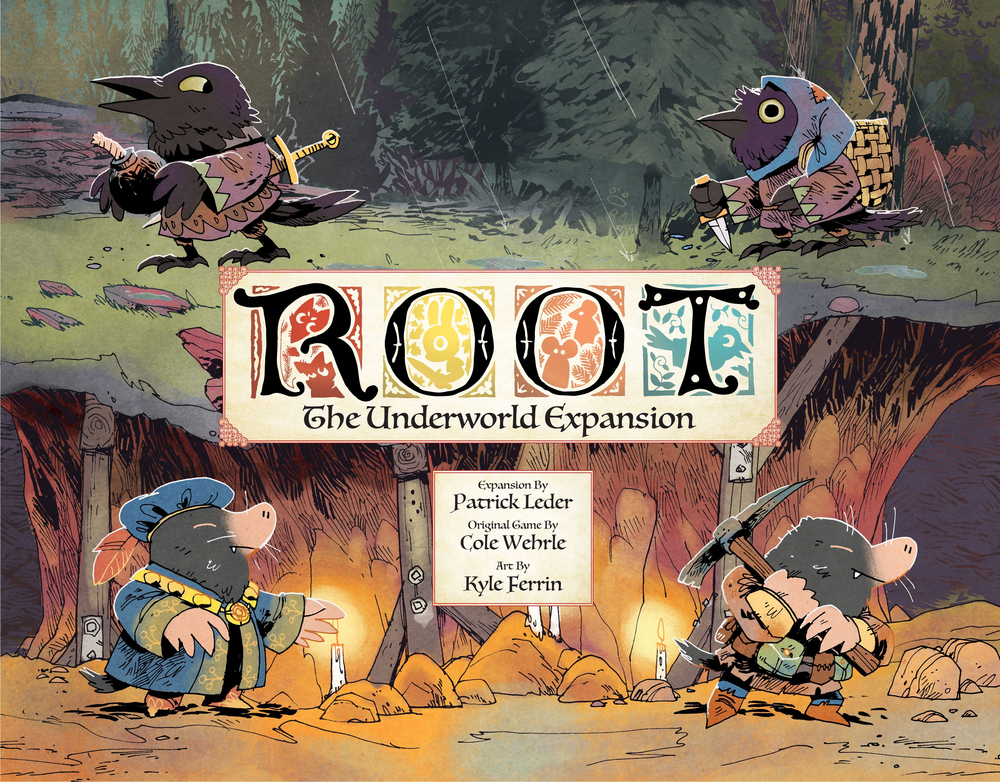
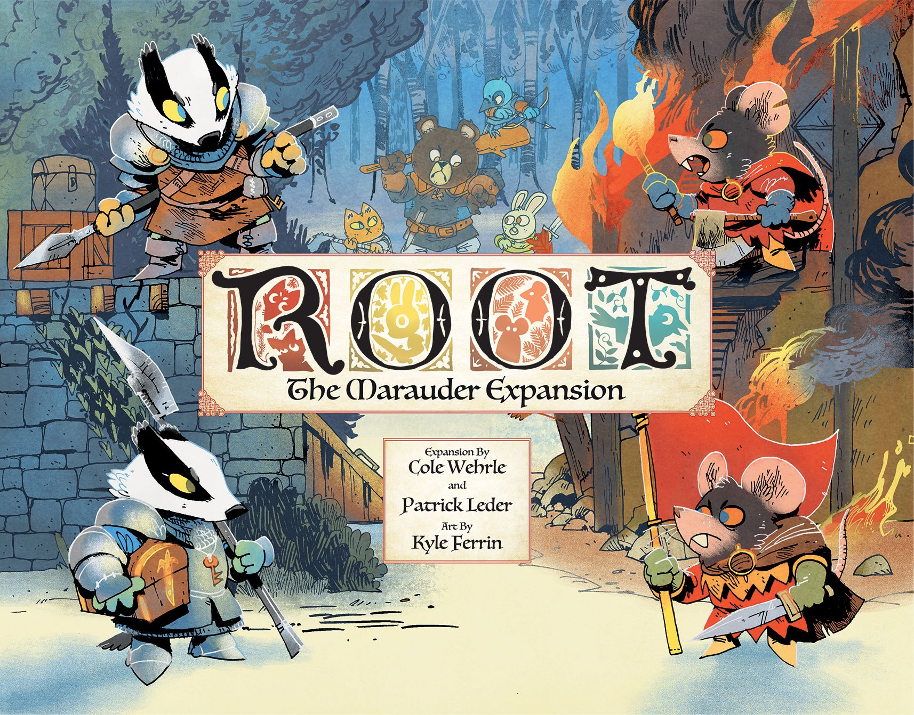
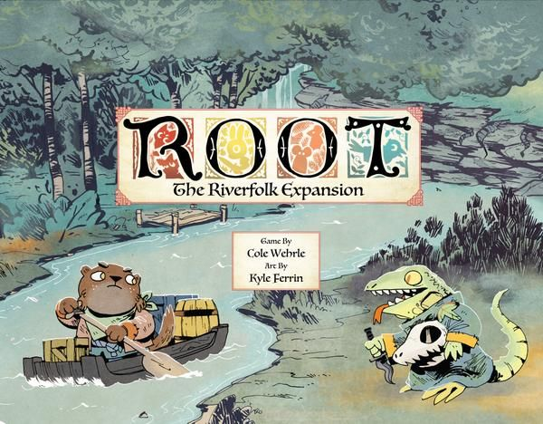
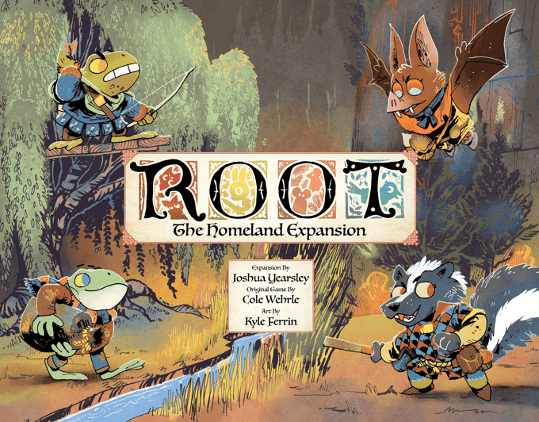
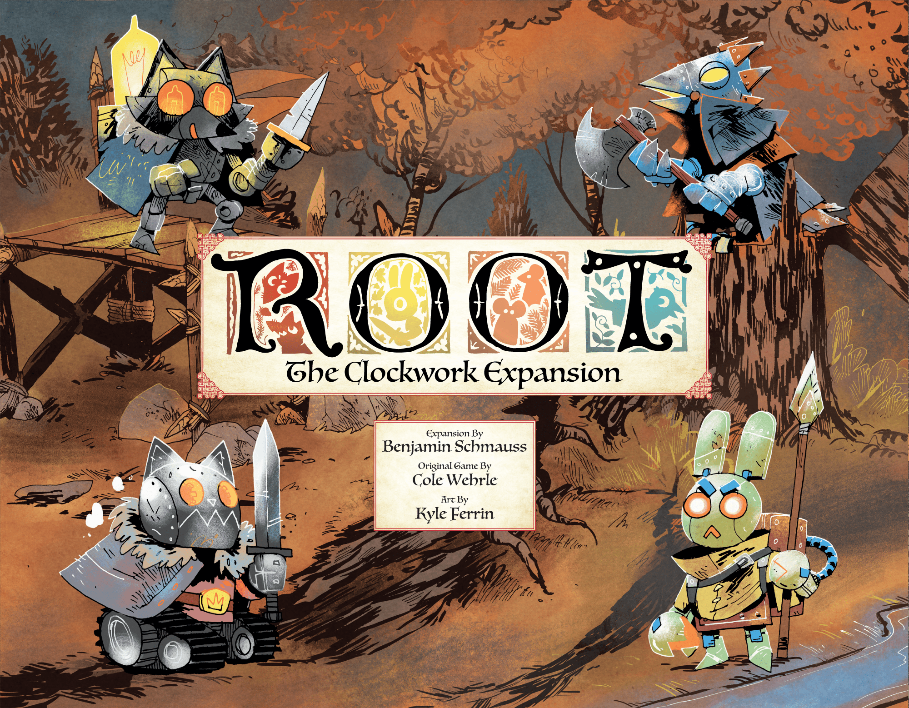
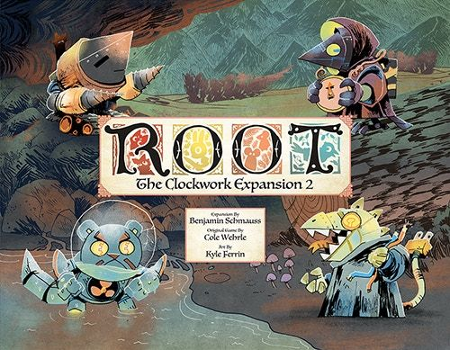
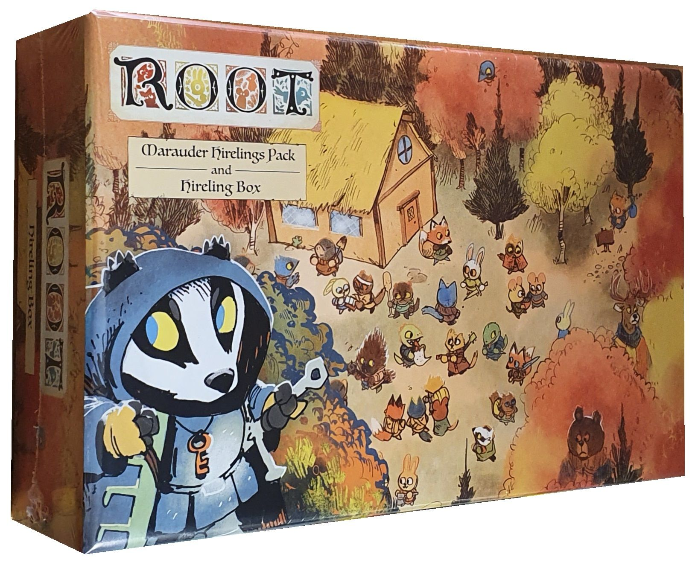

# Down the rabbit hole: which [Root](https://boardgamegeek.com/boardgame/237182/root) expansions actually deserve a place in the Woodland?

[Root](https://boardgamegeek.com/boardgame/237182/root) has become one of the defining designs of the modern hobby. An **8.07/10 average from over 54,000 ratings**, ranked **#34 overall** on BGG, with a **3.84/5 weight** that sits firmly in "you need to pay attention" territory. It plays **2–4** in the base box across **60–90 minutes**, and at four players it's one of the most tightly contested, gloriously chaotic experiences in board gaming.

But Root has also become one of the most expanded games on the market. Five faction expansions, two Clockwork boxes for solo and co-op, hirelings, landmarks, and a brand-new Homeland expansion that just landed in 2026. The full collection costs serious money and takes up serious shelf space. So which boxes actually matter?

This is your guide. Every Root expansion, ranked, with honest assessments of what each one adds — and whether your table actually needs it.

## The base game: where it all starts

The base box gives you four factions: **Marquise de Cat** (area control empire-builder), **Eyrie Dynasties** (programmed action engine that's always on the edge of collapse), **Woodland Alliance** (insurgent guerrillas who grow from nothing), and the **Vagabond** (a lone adventurer navigating relationships with everyone else).

At four players, this is extraordinary. The asymmetry is genuine — each faction plays like a completely different game, and the interaction between them creates emergent stories that no designer could script. The Cats spread thin while the birds spiral toward inevitable decree crises. The Alliance smoulders in the undergrowth. The Vagabond plays everyone against each other.

At three it's still very good. At two, the base game struggles — the ecosystem needs more factions bumping into each other to really sing.

**Player count poll (BGG, 1,385 votes):** Best with 4 (1,156 votes). Recommended with 3. Not recommended at 2 or solo.

That two-player weakness and the desire for more faction variety are exactly why the expansions exist.

---

## The rankings

### 🥇 1. The Underworld Expansion

**BGG Rating:** 8.71/10 · **Weight:** 3.65/5 · **Year:** 2020 · [BGG Link](https://boardgamegeek.com/boardgameexpansion/272637/root-the-underworld-expansion)

**What you get:** Two new factions (Underground Duchy and Corvid Conspiracy) plus a new double-sided map (Mountain/Lake).

**Why it's #1:** The Duchy is arguably the best-designed faction in Root. Moles tunnel between clearings, recruit ministers to gain permanent abilities, and build an engine that feels genuinely distinct from anything in the base box. The Corvids, meanwhile, play a bluffing game — planting face-down plot tokens that opponents must spend actions to expose. When a bomb plot goes off at the worst possible moment, the table erupts.

The new maps alone would make this expansion worthwhile. The Mountain map funnels conflict through tight chokepoints. The Lake map creates a central water feature that splits the board and changes movement calculations entirely. After a dozen plays on the autumn map, these feel like a revelation.

**Who needs it:** Everyone who plays Root more than twice. This is the essential expansion. The factions are excellent, the maps are transformative, and the box includes the updated card deck with better balancing.

**Verdict:** ✅ **Must-own.** If you buy one Root expansion, this is it.

---

### 🥈 2. The Marauder Expansion

**BGG Rating:** 8.83/10 · **Weight:** 3.98/5 · **Year:** 2022 · [BGG Link](https://boardgamegeek.com/boardgameexpansion/330149/root-the-marauder-expansion)

**What you get:** Two new factions (Lord of the Hundreds and Keepers in Iron), the Hireling system, and new landmark tokens.

**Why it's #2:** The highest-rated Root expansion on BGG, and for good reason. The Lord of the Hundreds is a swarm faction — a warlord who raids and pillages, growing stronger as their mob spreads but vulnerable to having their leader assassinated. The Keepers in Iron are a relic-hunting faction that moves in a tight warband, digging up relics and recovering ancient power.

But the real revolution here is **Hirelings**. These are minor factions controlled by the table rather than a single player. When someone is eliminated from a clearing, hirelings might step in. They fill dead spots on the board, smooth out games at lower player counts, and make 2-player Root genuinely viable. This one system retroactively improves every other expansion.

**Who needs it:** Anyone who plays Root at 2–3 players regularly. Hirelings are the single biggest quality-of-life improvement Root has ever received. The factions are also excellent, though slightly harder to teach than Underworld's.

**Verdict:** ✅ **Must-own for regular players.** Hirelings alone justify the price.

---

### 🥉 3. The Riverfolk Expansion

**BGG Rating:** 8.43/10 · **Weight:** 3.87/5 · **Year:** 2018 · [BGG Link](https://boardgamegeek.com/boardgameexpansion/241386/root-the-riverfolk-expansion)

**What you get:** Two new factions (Riverfolk Company and Lizard Cult) plus a second Vagabond character, enabling 5–6 player games.

**Why it's #3:** The Riverfolk Company is one of the most unusual factions in any board game. They're merchants who sell services — mercenaries, riverboats, card draws — to other players. Their economy is entirely dependent on other factions wanting to buy from them. It's negotiation-as-gameplay in a way that makes every turn a miniature marketplace drama.

The Lizard Cult is the more divisive faction. They convert clearings to their gardens through ritual, and their engine runs on discarding cards that match the current outcast suit. When the Cult is humming, it's a beautiful thing. When it stalls, you spend the game watching everyone else have fun. Recent errata and the updated rules have improved the Cult significantly, but it remains the faction most likely to bounce off new players.

The second Vagabond is clever but situational — two Vagabonds create a fascinating rivalry subplot, but it requires exactly the right group to appreciate.

**Who needs it:** Groups of 5+ who want more faction variety. The Riverfolk Company is a genuinely special experience for the right table. Skip if your group doesn't enjoy negotiation.

**Verdict:** ✅ **Worth it for the Riverfolk Company alone.** The Lizard Cult is an acquired taste.

---

### 4. The Homeland Expansion

**BGG Rating:** 9.29/10 (early ratings, small sample) · **Weight:** 3.78/5 · **Year:** 2026 · [BGG Link](https://boardgamegeek.com/boardgameexpansion/428335/root-the-homeland-expansion)

**What you get:** Two new factions plus a new double-sided map.

**Why this placement:** The early BGG ratings are extremely high, but with a small sample size typical of new releases. The Homeland expansion represents Leder Games continuing to push Root's asymmetry into new territory. The new map introduces homeland clearings that give factions starting advantages tied to geography, creating a different kind of strategic puzzle.

**The caveat:** This is brand new in 2026. The ratings will settle, the meta will develop, and the community will figure out where these factions fit in the pecking order. Early impressions are very positive, but it's too soon to call it essential.

**Who needs it:** Root completionists and anyone who's played through every existing faction combination. If you're still exploring Underworld and Marauder, there's no rush.

**Verdict:** ⏳ **Promising but too early to call.** Wait for the meta to settle unless you're a Root superfan.

---

### 5. The Clockwork Expansion

**BGG Rating:** 7.76/10 · **Weight:** 3.98/5 · **Year:** 2020 · [BGG Link](https://boardgamegeek.com/boardgameexpansion/287220/root-the-clockwork-expansion)

**What you get:** Automated opponents (bots) for the four base game factions, enabling solo play and filling empty seats at lower player counts.

**Why this placement:** The Clockwork bots are well-designed as far as board game AI goes. Each one follows a decision flowchart that roughly approximates how a human would play the faction. They make Root playable solo and fill out a 2-player game to feel like 3–4.

But — and this is the honest truth — Root's magic is in the interaction between human players. The negotiation, the grudges, the desperate pleas for someone to stop the runaway leader. Bots can't replicate that. What you get is a puzzle — a good puzzle, but a different experience from what makes Root special.

**Who needs it:** Solo gamers who love Root's systems and want to engage with them outside of game night. Also useful for couples who want to play Root together with bot opponents.

**Verdict:** 👍 **Good for solo, but not the real Root experience.** Hirelings from Marauder solve the low-player-count problem more elegantly.

---

### 6. The Clockwork Expansion 2

**BGG Rating:** 8.04/10 · **Weight:** 3.75/5 · **Year:** 2022 · [BGG Link](https://boardgamegeek.com/boardgameexpansion/334483/root-the-clockwork-expansion-2)

**What you get:** Automated opponents for the Riverfolk, Lizard Cult, Underground Duchy, and Corvid Conspiracy.

**Why this placement:** If you bought Clockwork 1 and enjoyed it, this is more of the same — now covering the expansion factions. The Duchy bot in particular is well-regarded. But if you didn't need Clockwork 1, you definitely don't need this.

**Who needs it:** Only people who already own and enjoy Clockwork 1 and want bot versions of the expansion factions.

**Verdict:** 🤷 **Deep-cut purchase.** For committed solo Root players only.

---

### 7. Marauder Hirelings Pack & Hireling Box

**BGG Rating:** 8.48/10 · **Weight:** 3.91/5 · **Year:** 2022 · [BGG Link](https://boardgamegeek.com/boardgameexpansion/336276/root-marauder-hirelings-pack-hireling-box)

**What you get:** Additional hireling factions and a storage box for hireling components.

**Why it's last:** This is a component pack, not a gameplay expansion. The hirelings it contains are nice to have for variety, but the core hireling system and three starting hirelings come with the Marauder expansion. You need Marauder first, and even then this is strictly for people who want more hireling variety.

**Who needs it:** Root completionists who use hirelings every game and want to rotate through more options.

**Verdict:** 🤷 **Completionist-only.** Get Marauder first and see if you want more hirelings.

---

## The buying guide: what to get and when

**Just bought Root and love it?**
→ Get **Underworld** next. No question.

**Playing mostly at 2 players?**
→ Get **Marauder** for hirelings. This fixes Root's biggest weakness.

**Want the complete 4-player experience?**
→ **Base + Underworld + Marauder** is the ultimate Root setup. Six faction options, hirelings, three maps.

**Group of 5–6?**
→ Add **Riverfolk** to the above. The Company is a blast with a full table.

**Solo player?**
→ Get **Clockwork**, but honestly consider whether [Spirit Island](https://boardgamegeek.com/boardgame/162886/spirit-island) or [Mage Knight](https://boardgamegeek.com/boardgame/96848/mage-knight-board-game) might scratch the itch better. Root solo is fine, but it's not where the game shines.

**Already own everything?**
→ **Homeland** is your next adventure. Early signs are very encouraging.

## The total damage

If you buy everything, you're looking at roughly **£250–300** depending on retailer. That's a lot. But the beauty of Root's expansion model is that each box is genuinely modular — you can stop at any point and have a complete, satisfying experience. Base + Underworld is a phenomenal game. Add Marauder and you've got something that'll sustain a game group for years.

The Woodland is deep. You don't need to explore all of it at once.

---

*All stats verified against BGG XML API on 23 April 2026. Box art images courtesy of BoardGameGeek and their respective publishers.*
