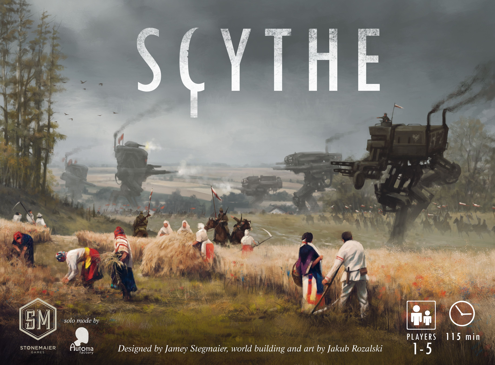
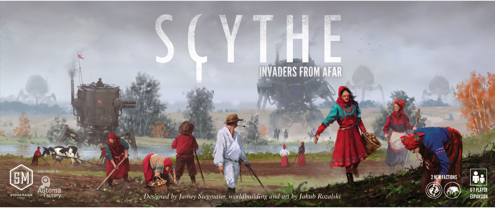
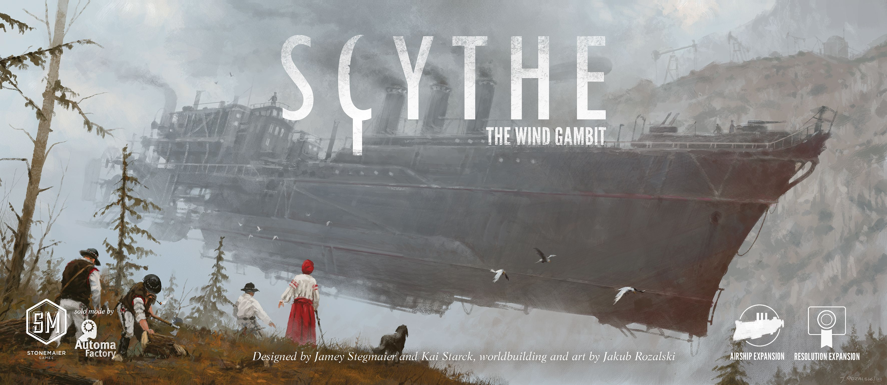
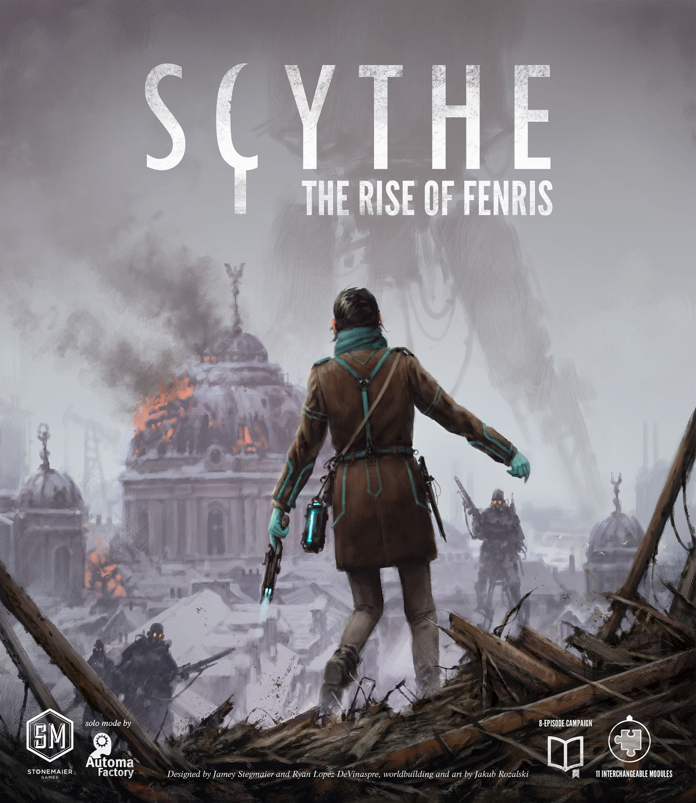

# Does [Scythe](https://boardgamegeek.com/boardgame/169786) Actually Need More Content?

[Scythe](https://boardgamegeek.com/boardgame/169786) is already a complete game. Full stop.

This is a 2016 design sitting at **8.10/10 from 92,731 ratings**, with a **3.45/5 weight**, ranked **#26** on BGG for a reason. At **1-5 players** and roughly **115 minutes**, it gives you that very specific Scythe feeling straight out of the box: tense positioning, engine-building with actual tempo pressure, and the constant threat of violence that often matters more than violence itself. The mechs look like they should be smashing everything in sight. Then you play and realise this is really a game about efficiency, timing, and making your neighbours deeply uncomfortable.

That disconnect still causes forum arguments years later. “It’s not a war game.” “Yes, but the threat of combat is the point.” The BGG comments section has done this dance for ages.

The good news is that the base box works. You do not need expansions to “fix” [Scythe](https://boardgamegeek.com/boardgame/169786). But some expansions absolutely make it richer.

That’s what this ranking is actually about: not whether [Scythe](https://boardgamegeek.com/boardgame/169786) is incomplete, but which expansions add the most value once you already know you want more of it.

## [Invaders from Afar](https://boardgamegeek.com/boardgame/199727)

If you want more factions and not much more rules overhead, this is the cleanest add-on.

[Invaders from Afar](https://boardgamegeek.com/boardgame/199727) brings in **Clan Albion** and **Togawa Shogunate**, plus two new player mats, and pushes the game up to **6-7 players**. The headline here is variety. These factions play differently, with abilities built around exploration efficiency, token-based returns to home base, and starting positions without the usual river-block headache.

That sounds small. It kind of is. But faction variety matters a lot in [Scythe](https://boardgamegeek.com/boardgame/169786), because repeated plays live or die on whether the opening puzzle still feels fresh.

What I like is how restrained this expansion is. No extra subsystem trying to prove its worth. No bloated rules appendix. You just shuffle in more asymmetry and get on with it. That’s valuable in a game where the core rhythm is already doing plenty of work.

What it does **not** do is solve any of the standard complaints. If you think base [Scythe](https://boardgamegeek.com/boardgame/169786) needs more interaction, or better balance, or a sharper endgame, this box is not coming to the rescue. It adds replayability, not renovation. There’s also a reason community opinion tends to land on “nice, not necessary”. One of these factions has a bit of a reputation for balance wonkiness, and the whole package feels more additive than transformative.

The 6-7 player support is also one of those features that sounds bigger than it is. In theory, great. In practice, getting seven adults to a table for a medium-heavy euro-ish conflict game is a fantasy campaign of its own. Most of my gaming is at two or three, because scheduling is the true final boss.

**Verdict: Worth It**

Buy it if you love [Scythe](https://boardgamegeek.com/boardgame/169786) and want more faction matchups, or if your group genuinely plays at higher counts. Skip it if you’re hoping for the expansion that changes the game.

## [The Wind Gambit](https://boardgamegeek.com/boardgame/223555)

If [Invaders from Afar](https://boardgamegeek.com/boardgame/199727) is the restrained option, [The Wind Gambit](https://boardgamegeek.com/boardgame/223555) goes in the opposite direction. This one is weirder. Also better than its reputation in some circles.

[The Wind Gambit](https://boardgamegeek.com/boardgame/223555) adds **airships**, **resolution tiles** that change how the game ends, and a **modular board** with variable faction positions, setup drafting, and tighter maps for lower player counts. That is a lot of modularity in one box, and crucially, you don’t have to use all of it at once.

Let’s deal with the airships first, because they’re the bit everybody talks about. They’re fun. They’re swingy. They make the table look fantastic. They are also not the best thing in the expansion. The best thing is the resolution tiles.

Changing the endgame condition does wonders for [Scythe](https://boardgamegeek.com/boardgame/169786). Suddenly the pacing shifts. Priorities shift. That familiar “race to six stars, manage the threat, squeeze every coin from the board” structure gets bent just enough to feel alive again. If you’ve played the base game a lot, this matters more than one more faction ever could.

The modular board is also a sneaky winner, especially at lower counts. Tighter maps give the game a bit more bite. At two or three, that’s gold. [Scythe](https://boardgamegeek.com/boardgame/169786) can sometimes feel a touch roomy with cautious players. This helps.

The downside is that [The Wind Gambit](https://boardgamegeek.com/boardgame/223555) feels less focused than the best expansions in the hobby. Some groups will use the resolution tiles constantly and leave the airships in the box. Others will do the opposite because giant floating machines are cool and self-control is overrated. It’s modular in the good sense, but also in the “some of this will become your loft’s problem” sense.

Still, for price versus fresh decision space, this is strong.

**Verdict: Worth It**

Not essential for everyone, but very close if your group has already wrung the base game dry. The resolution tiles alone pull serious weight.

## [Rise of Fenris](https://boardgamegeek.com/boardgame/242277)

If the first two expansions either add more variety or more modularity, [Rise of Fenris](https://boardgamegeek.com/boardgame/242277) is the one that most fully expands what [Scythe](https://boardgamegeek.com/boardgame/169786) can do. This is the big one. The one people keep recommending. For once, the crowd is right.

[Rise of Fenris](https://boardgamegeek.com/boardgame/242277) adds **two new factions**, an **8-episode campaign** with persistent elements and carryover effects, and **11 modules** that can be used outside the campaign. You’re getting a lot in the box: **100+ tokens, 62 wooden pieces, 25 tiles, 13 miniatures**, and a guidebook that turns [Scythe](https://boardgamegeek.com/boardgame/169786) into something far more flexible than the base game suggests.

And that flexibility is the whole point.

If [Invaders from Afar](https://boardgamegeek.com/boardgame/199727) gives you more [Scythe](https://boardgamegeek.com/boardgame/169786), [Rise of Fenris](https://boardgamegeek.com/boardgame/242277) gives you more ways for [Scythe](https://boardgamegeek.com/boardgame/169786) to be good. That’s a much bigger deal.

The campaign gets the attention, and deservedly so. Eight episodes, persistent changes, alternative routes, little surprises. It gives the game momentum across sessions without burying it under nonsense. This is not some sprawling legacy monster that holds your collection hostage for months. It’s structured, purposeful, and actually respects your time. Quite refreshing.

But even if you never touch the campaign again after one run, the modules are where the value lives. Aggression tweaks. Variable setups. Co-op Desolation mode. Other systems that let you tune the experience to your group rather than forcing everyone into one official “best” version. That solves a real problem. Not a broken-game problem, but a longevity problem.

There is more complexity here, obviously. Some modules are simple. Some are a proper shift. But it’s the good kind of complexity, where each addition opens a new style of play instead of adding admin. That distinction matters. A lot.

This is also the expansion that makes the others better. Add [Invaders from Afar](https://boardgamegeek.com/boardgame/199727), and Fenris has more factions to play with. Add [The Wind Gambit](https://boardgamegeek.com/boardgame/223555), and you have even more ways to shape a non-campaign session. If you’re only buying one expansion, though, this is the one.

**Verdict: Essential**

Not because [Scythe](https://boardgamegeek.com/boardgame/169786) is incomplete without it. It isn’t. This is essential because it adds the most value, the most variety, and the best long-term reason to keep coming back.

## Ranking the Expansions

Now that the individual boxes are out of the way, the ranking itself is pretty straightforward.

### 1. [Rise of Fenris](https://boardgamegeek.com/boardgame/242277)  
**Essential**

The best expansion by a mile. Campaign if you want it, modules if you don’t, and a huge boost to replayability either way.

### 2. [The Wind Gambit](https://boardgamegeek.com/boardgame/223555)  
**Worth It**

Excellent for groups who want variability without committing to a campaign. Resolution tiles are the real star.

### 3. [Invaders from Afar](https://boardgamegeek.com/boardgame/199727)  
**Worth It, borderline Skip**

Good value if you want more factions or actually need 6-7 players. Otherwise, this is the easiest one to leave on the shelf.

## So, does [Scythe](https://boardgamegeek.com/boardgame/169786) actually need more content?

No.

That’s the key point. The base game is already complete, already excellent, and already distinct. If you’ve only played it a handful of times, buying expansions is probably just retail therapy with extra cardboard.

But if your group has hit the stage where faction combinations feel familiar, opening routes feel solved, and the endgame rhythm has become a bit too readable, then yes, expansion content starts to make sense. Not all of it equally. But some of it.

That’s also where the ranking lands: [Rise of Fenris](https://boardgamegeek.com/boardgame/242277) adds the most, [The Wind Gambit](https://boardgamegeek.com/boardgame/223555) adds meaningful variety, and [Invaders from Afar](https://boardgamegeek.com/boardgame/199727) is the most optional unless you specifically want more factions or higher player counts.

## The Definitive Setup

If you do decide you want more content, the cleanest long-term setup follows directly from that ranking.

If I’m building the best long-term version of [Scythe](https://boardgamegeek.com/boardgame/169786), it’s:

**Base game + [Rise of Fenris](https://boardgamegeek.com/boardgame/242277) + [The Wind Gambit](https://boardgamegeek.com/boardgame/223555)**

That combo gives you the strongest campaign content, the best modular tools, variable endings, and better map flexibility. It turns a great game into a game with range.

Add [Invaders from Afar](https://boardgamegeek.com/boardgame/199727) if your table wants more factions or you actually play at 6-7. Otherwise, it’s optional.

If you want the short version: buy [Rise of Fenris](https://boardgamegeek.com/boardgame/242277) first. Consider [The Wind Gambit](https://boardgamegeek.com/boardgame/223555) second. Buy [Invaders from Afar](https://boardgamegeek.com/boardgame/199727) only if you know why you want it.

That’s the clean answer. No collector brain required.