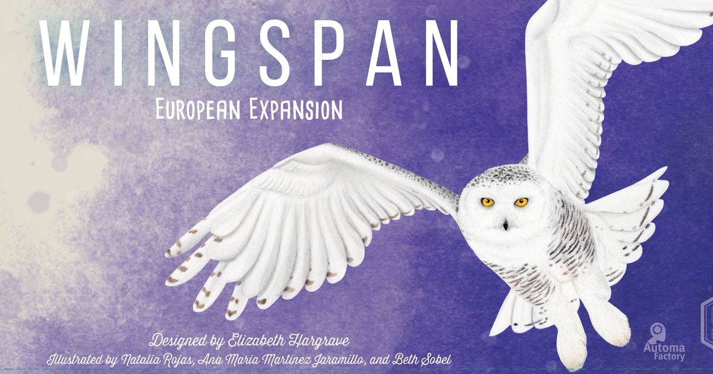
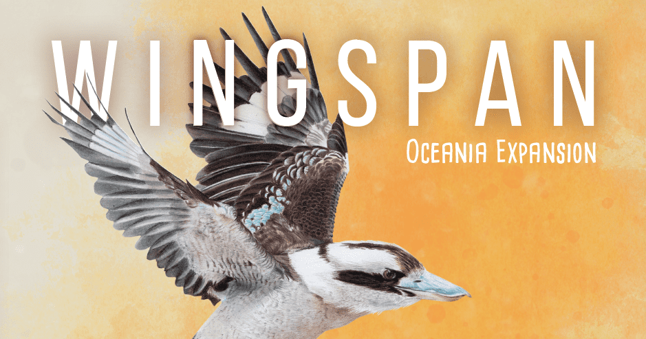
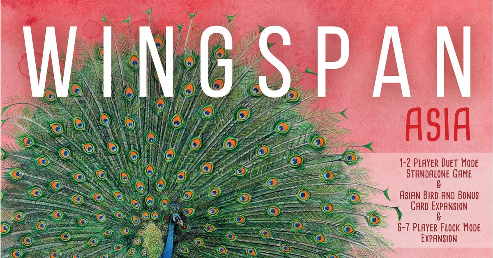

# Feeding the engine: which [Wingspan](https://boardgamegeek.com/boardgame/266192/wingspan) expansions actually earn their shelf space?

[Wingspan](https://boardgamegeek.com/boardgame/266192/wingspan) is one of those rare games that kicked the door off the hobby and then kept kicking. It sits at **8.03/10 from roughly 98,700 ratings**, a **2.47/5 weight**, supports **1-5 players**, and generally wraps in **40-70 minutes**. That's the kind of stat line that stops arguments. This game isn't a passing curiosity. It's a genuine modern classic, the sort of thing your sister-in-law now owns for reasons even she can't quite explain.

And yet. Once you've run the engine a few dozen times, the seams start to show. The card pool is big, but not infinite. The habitat powers, charming as they are, settle into familiar rhythms. You start recognising which birds you always draft and which ones never come out of the box.

So this piece is about three things. Which expansions are actually worth the money. How they compare to each other. And what the best overall setup looks like once you know what kind of [Wingspan](https://boardgamegeek.com/boardgame/266192/wingspan) experience your table wants.

## A quick base game recap

At its core, [Wingspan](https://boardgamegeek.com/boardgame/266192/wingspan) works because the tableau reads like a machine you designed on purpose. Birds slot into habitats. Habitats power actions. Actions feed more birds. Turn by turn, your little reserve becomes an honest-to-goodness engine, which is probably the most satisfying structure in modern board gaming.

The tension, such as it is, comes from scarcity. Too few eggs. Not enough food. A bonus card that only rewards one specific habitat just as the other two start singing. [Wingspan](https://boardgamegeek.com/boardgame/266192/wingspan) is kind, not soft.

But kind has a ceiling. Which is where the expansions come in.

## 1. [Wingspan: European Expansion](https://boardgamegeek.com/boardgame/290448/wingspan-european-expansion)
**Verdict: Essential**

If you own [Wingspan](https://boardgamegeek.com/boardgame/266192/wingspan) and you're still playing it, the [European Expansion](https://boardgamegeek.com/boardgame/290448/wingspan-european-expansion) is the one. No hesitation, no caveats, no "but only if your group..."

It adds 81 new European birds, bonus cards that actually reward different strategies, extended player mats with purple food tokens, and a new class of bird powers that trigger at the end of each round. That end-of-round power type is the quiet star. It gives you a reason to build patience into your tableau, which [Wingspan](https://boardgamegeek.com/boardgame/266192/wingspan) never quite had before.

The stats agree. **Weight 2.43/5**, **rating 8.34/10**, released in 2019. It's functionally lighter than the base game, which tells you everything about its design intent. This isn't an expansion that adds rules. It's an expansion that adds texture.

And the texture matters. The new birds diversify your drafting decisions. The new bonus cards smooth the occasional "my bonus card didn't work out" feel-bad moment. You get variety without overhead.

This is the expansion that makes [Wingspan](https://boardgamegeek.com/boardgame/266192/wingspan) feel like a bigger game without ever feeling like a busier one. If you only buy one expansion, buy this. If you bought [Wingspan](https://boardgamegeek.com/boardgame/266192/wingspan) for Christmas and are still liking it by spring, this should already be on your shelf.

I cannot stress enough how much of a no-brainer this one is.

## 2. [Wingspan: Oceania Expansion](https://boardgamegeek.com/boardgame/300580/wingspan-oceania-expansion)
**Verdict: Worth It**

[Oceania](https://boardgamegeek.com/boardgame/300580/wingspan-oceania-expansion) is the bold one. If the [European Expansion](https://boardgamegeek.com/boardgame/290448/wingspan-european-expansion) is a polished-up version of what you already love, [Oceania](https://boardgamegeek.com/boardgame/300580/wingspan-oceania-expansion) is a genuine remix.

It adds 95 new birds from Australia and New Zealand, and a redesigned player mat that reworks how the habitat rows gather food. Most importantly, it introduces **nectar** as a brand new wild food type that expires at the end of each round. That's the big idea here. Not new birds. New economy.

The stats tell the story. **Weight 2.66/5**, **rating 8.45/10** from roughly 12,400 ratings. Oceania is both the highest-rated Wingspan expansion and the heaviest one. That's not a coincidence.

Nectar is clever. It pushes you to spend food rather than hoard it, which sharpens the mid-game considerably. The redesigned player mat also makes the forest and grasslands feel genuinely different, and the top-row tweaks mean the old "just draft birds and eggs, maybe?" shuffle has to be reconsidered every turn.

That's fun. Very fun, in the right group.

But this is also the expansion where some tables start to feel it. New rules for the nectar, new costs, new timing. If your group still occasionally forgets to activate a brown power, [Oceania](https://boardgamegeek.com/boardgame/300580/wingspan-oceania-expansion) may be one step past comfortable.

For anyone else, though, it's the most ambitious expansion of the three, and it earns its keep. It deepens the design rather than widening it.

Buy it second. Enjoy it immensely.

## 3. [Wingspan Asia](https://boardgamegeek.com/boardgame/366161/wingspan-asia)
**Verdict: Worth It for some, Skip It for others**

[Wingspan Asia](https://boardgamegeek.com/boardgame/366161/wingspan-asia) is the trickiest one to rank. It's good. Sometimes genuinely great. But it's also the most situational expansion of the lot.

On paper it's extremely generous. Over 90 new birds from across Asia, a new flocking mechanic, and two completely new ways to play: **Flock Mode** for 6 and 7 players, and **Duet Mode**, a two-player competitive variant played on a dedicated map that turns [Wingspan](https://boardgamegeek.com/boardgame/266192/wingspan) into something rather more tactical.

The numbers are solid. **Weight 2.65/5**, **rating 8.22/10** from around 9,300 ratings, released in 2022. Interestingly, BGG lists it with a player count of **1-2**, because that's its showcase mode. Flock Mode expands it upward if you need it, but the marquee experience is the two-player duel.

And here's the thing: Duet Mode is excellent. If you primarily play [Wingspan](https://boardgamegeek.com/boardgame/266192/wingspan) as a couple, this expansion is arguably more important than anything else in the range. It gives two-player [Wingspan](https://boardgamegeek.com/boardgame/266192/wingspan) a shape of its own. Less solitaire, more actual fencing match.

Flock Mode is the more specialised piece. It works. It's enjoyable. It also asks six to seven people to sit through a [Wingspan](https://boardgamegeek.com/boardgame/266192/wingspan) game, which is a sentence I'm not sure I've ever typed with confidence. Fun at a games weekend, niche the rest of the time.

So this is where the ranking gets personal. If you're a couple or a dedicated two-player household, [Asia](https://boardgamegeek.com/boardgame/366161/wingspan-asia) is probably a Worth It bordering on Essential. If you're a three-to-five-player group that already has [European](https://boardgamegeek.com/boardgame/290448/wingspan-european-expansion) and [Oceania](https://boardgamegeek.com/boardgame/300580/wingspan-oceania-expansion), it's the easiest of the three to skip.

No single answer works here. That's not a flaw of the expansion. It's just the truth of it.

## A brief word on everything else

Worth mentioning quickly: the **Fan Art promo pack** and the **Nesting Box**. Neither is an expansion in the usual sense.

The Fan Art pack is a small set of bonus bird cards with artwork from the community. It's a charming top-up if you love the base game, but it doesn't change anything mechanically worth writing about. Skip unless you're a completionist.

The Nesting Box is an organiser. A good one, but it is an organiser. If your [Wingspan](https://boardgamegeek.com/boardgame/266192/wingspan) collection has swelled to three expansions, it becomes genuinely useful for speed of setup and sanity of storage. If you only have the base game, you do not need it. Full stop.

## Ranking the add-ons

With all of that in mind, the ranking is refreshingly clean.

### 1. [Wingspan: European Expansion](https://boardgamegeek.com/boardgame/290448/wingspan-european-expansion)
**Essential**

The best expansion in the line and the only one I'd genuinely call mandatory. Lighter than the base, better balanced, more interesting birds, smoother end-of-round texture.

### 2. [Wingspan: Oceania Expansion](https://boardgamegeek.com/boardgame/300580/wingspan-oceania-expansion)
**Worth It**

The most ambitious mechanical shakeup. Nectar genuinely changes how you play, the new player mat is thoughtful, and the community agrees: this is the highest-rated [Wingspan](https://boardgamegeek.com/boardgame/266192/wingspan) expansion for a reason.

### 3. [Wingspan Asia](https://boardgamegeek.com/boardgame/366161/wingspan-asia)
**Worth It, situational**

A must-buy for two-player households thanks to Duet Mode. Less important if your table plays at three-to-five and already owns the other two.

## The best overall setup

So what do you actually put on the table?

For most groups, the sweet spot is:

**[Wingspan](https://boardgamegeek.com/boardgame/266192/wingspan) + [European](https://boardgamegeek.com/boardgame/290448/wingspan-european-expansion) + [Oceania](https://boardgamegeek.com/boardgame/300580/wingspan-oceania-expansion)**

That's the version most players mean when they talk about a "complete" [Wingspan](https://boardgamegeek.com/boardgame/266192/wingspan). Richer card pool, better bonuses, nectar to sharpen the economy. Not overwhelming, not bloated, just genuinely better in every dimension.

Add [Asia](https://boardgamegeek.com/boardgame/366161/wingspan-asia) on top if you play two-player regularly or if large-group sessions are a real thing in your life. Skip the Fan Art pack unless you're a completionist. Buy the Nesting Box only when the cardboard is starting to defeat your game shelf.

The short version, because that's usually what people want:

Buy [European](https://boardgamegeek.com/boardgame/290448/wingspan-european-expansion) first. Add [Oceania](https://boardgamegeek.com/boardgame/300580/wingspan-oceania-expansion) when you want more bite. Add [Asia](https://boardgamegeek.com/boardgame/366161/wingspan-asia) when the two-player or big-group use case shows up.

It's one of the cleaner expansion ladders in the hobby. No traps, no throwaways, no "this one broke the balance" cautionary tales. Just three thoughtful additions that each know what job they're doing.

Wings up. Go feed the machine.
